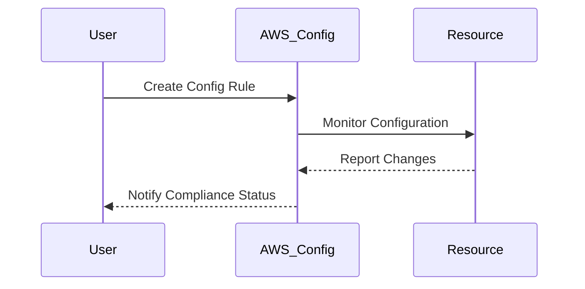
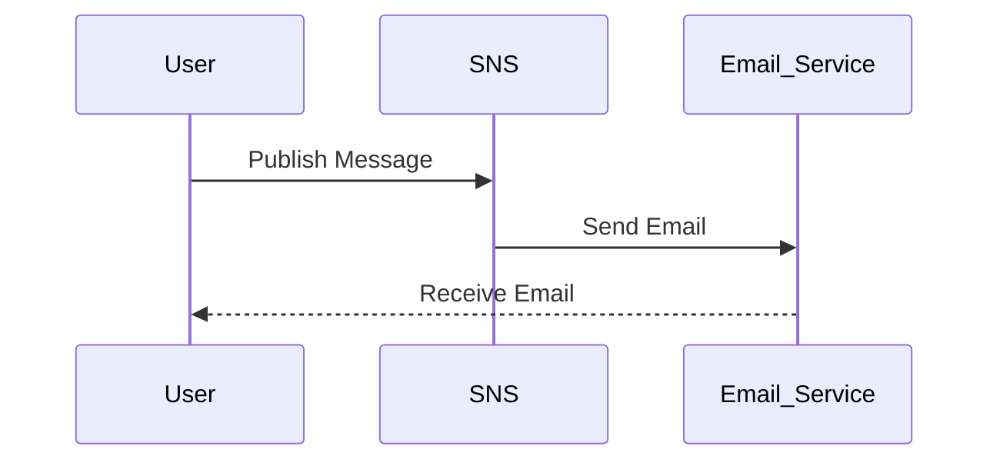
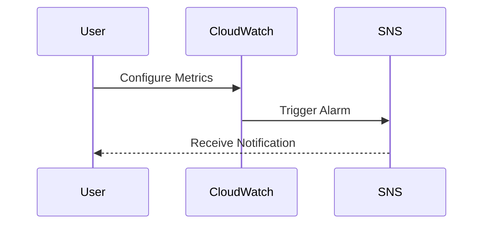
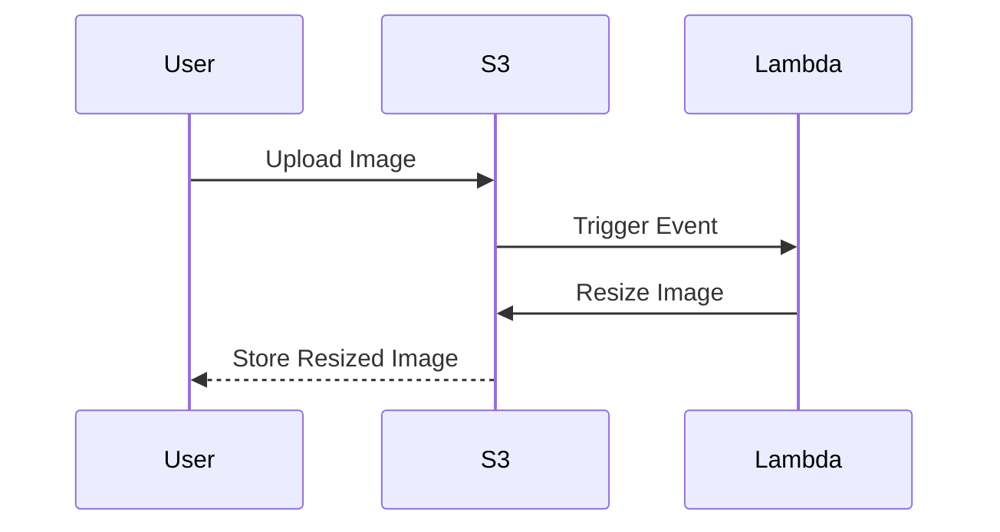

## Introduction to DevSecOps Tools

In the realm of DevSecOps, the integration of security practices into the development lifecycle is paramount. While the choice of tools is important, it is equally crucial to understand how these tools can be effectively utilized to enhance security and streamline operations. This chapter delves into the various tools available, their functionalities, and how they can be integrated into a DevSecOps workflow. We will focus primarily on AWS tools, as mentioned in the lecture, but also explore other relevant tools and resources.

### Importance of Tools in DevSecOps

Tools play a critical role in automating repetitive tasks, ensuring consistency, and providing insights into the security posture of applications and infrastructure. However, the true value lies in how these tools are used. A well-chosen toolset can significantly improve the efficiency and effectiveness of a DevSecOps team, but it is the application of these tools that ultimately drives success.

#### Key Considerations

- **Cost**: Many powerful tools are available at little or no cost, especially those provided by cloud service providers like AWS.
- **Ease of Evaluation**: Free trials and sandbox environments allow teams to test tools without committing significant resources.
- **Integration**: Tools should seamlessly integrate with existing workflows and systems to minimize disruption.

### AWS Config

AWS Config is a service that provides a detailed view of the resources within an AWS account, including their configurations and changes over time. This tool is invaluable for maintaining compliance and ensuring that resources are configured securely.

#### Functionality

- **Resource Explorer**: Provides a comprehensive list of all resources in an AWS account, including EC2 instances, S3 buckets, RDS databases, etc.
- **Configuration Tracking**: Tracks changes to resource configurations, allowing teams to monitor and audit modifications.
- **Compliance Rules**: Enables the definition of custom rules to ensure resources comply with organizational policies.

#### Example Usage

Consider a scenario where an organization needs to ensure that all EC2 instances are tagged with specific metadata (e.g., `Environment`, `Owner`). AWS Config can be configured to enforce this tagging requirement.

```yaml
# Example AWS Config Rule
{
  "ConfigRuleName": "ec2-instance-tagging",
  "Description": "Ensure all EC2 instances are tagged with Environment and Owner.",
  "Scope": {
    "ComplianceResourceTypes": ["AWS::EC2::Instance"]
  },
  "Source": {
    "Owner": "AWS",
    "SourceIdentifier": "EC2_INSTANCE_TAGGING"
  }
}
```

#### Diagram: AWS Config Workflow



#### How to Prevent / Defend

- **Regular Audits**: Use AWS Config to regularly audit resource configurations and ensure compliance.
- **Automated Remediation**: Implement automated remediation actions to correct non-compliant resources.
- **Secure Configuration**: Ensure that all resources are configured securely by default.

### Simple Notification Service (SNS)

SNS is a fully managed pub/sub messaging service that enables decoupled communication between distributed systems. It is often used for sending notifications, such as email alerts, in response to specific events.

#### Functionality

- **Publish/Subscribe Model**: Allows publishers to send messages to subscribers without knowing their identities.
- **Multiple Protocols**: Supports various protocols, including email, SMS, and HTTP endpoints.
- **Fanout Capability**: Enables a single message to be delivered to multiple subscribers.

#### Example Usage

Suppose an organization wants to receive email alerts whenever a new instance is launched in an AWS account. SNS can be configured to trigger these alerts.

```json
// Example SNS Topic Configuration
{
  "TopicArn": "arn:aws:sns:us-west-2:123456789012:instance-launch-notifications",
  "Subscriptions": [
    {
      "Endpoint": "example@example.com",
      "Protocol": "email"
    }
  ]
}
```

#### Diagram: SNS Workflow



#### How to Prevent / Defend

- **Access Control**: Use IAM roles and policies to restrict access to SNS topics.
- **Encryption**: Enable encryption for messages to protect sensitive data.
- **Monitoring**: Regularly monitor SNS activity to detect unauthorized usage.

### Amazon CloudWatch

CloudWatch is a monitoring and observability service that provides visibility into the performance and health of applications and infrastructure. It supports metrics, logs, and alarms, enabling teams to proactively manage their systems.

#### Functionality

- **Metrics**: Collects and tracks metrics from AWS services, custom applications, and third-party sources.
- **Logs**: Collects and analyzes log data from various sources.
- **Alarms**: Triggers actions based on metric thresholds and log patterns.

#### Example Usage

An organization might want to set up an alarm to notify them when CPU utilization exceeds 80% for more than five minutes.

```json
// Example CloudWatch Alarm Configuration
{
  "AlarmName": "HighCPUUtilization",
  "MetricName": "CPUUtilization",
  "Namespace": "AWS/EC2",
  "Statistic": "Average",
  "ComparisonOperator": "GreaterThanThreshold",
  "Threshold": 80,
  "Period": 300,
  "EvaluationPeriods": 2,
  "Dimensions": [
    {
      "Name": "InstanceId",
      "Value": "i-1234567890abcdef0"
    }
  ],
  "ActionsEnabled": true,
 
  "AlarmActions": [
    "arn:aws:sns:us-west-2:123456789012:high-cpu-utilization"
  ]
}
```

#### Diagram: CloudWatch Workflow



#### How to Prevent / Defend

- **Proactive Monitoring**: Set up alarms to proactively monitor critical metrics.
- **Log Analysis**: Use CloudWatch Logs to analyze log data for security events.
- **Secure Access**: Restrict access to CloudWatch resources using IAM policies.

### AWS Lambda

AWS Lambda is a serverless compute service that allows teams to run code without provisioning or managing servers. It is highly scalable and cost-effective, making it ideal for a variety of use cases.

#### Functionality

- **Event-Driven**: Executes code in response to events, such as changes to data in an S3 bucket or updates to a DynamoDB table.
- **Scalable**: Automatically scales to handle varying levels of traffic.
- **Cost-Effective**: Charges only for the compute time consumed.

#### Example Usage

Suppose an organization wants to automatically resize images uploaded to an S3 bucket. An AWS Lambda function can be triggered by S3 events to perform this task.

```python
# Example AWS Lambda Function
import boto3
from PIL import Image

def lambda_handler(event, context):
    s3 = boto3.client('s3')
    bucket = event['Records'][0]['s3']['bucket']['name']
    key = event['Records'][0]['s3']['object']['key']

    # Download image from S3
    local_path = '/tmp/' + key
    s3.download_file(bucket, key, local_path)

    # Resize image
    img = Image.open(local_path)
    resized_img = img.resize((100, 100))
    resized_img.save(local_path)

    # Upload resized image back to S3
    s3.upload_file(local_path, bucket, 'resized-' + key)
```

#### Diagram: AWS Lambda Workflow



#### How to Prevent / Defend

- **Secure Execution**: Use IAM roles to restrict permissions for Lambda functions.
- **Input Validation**: Validate input data to prevent injection attacks.
- **Logging and Monitoring**: Enable logging and monitoring to detect and respond to issues.

### AWS GuardDuty

GuardDuty is a threat detection service that continuously monitors for malicious activity and unauthorized behavior in AWS accounts and workloads. It uses machine learning to identify unusual patterns and potential threats.

#### Functionality

- **Continuous Monitoring**: Monitors AWS accounts and workloads for suspicious activities.
- **Machine Learning**: Uses machine learning to detect anomalies and potential threats.
- **Threat Intelligence**: Integrates with AWS threat intelligence feeds to provide additional context.

#### Example Usage

An organization might want to detect and respond to potential DDoS attacks. GuardDuty can be configured to alert on such events.

```json
// Example GuardDuty Detector Configuration
{
  "detectorId": "abcd1234-abcd-1234-abcd-1234abcd1234",
  "findingCriteria": {
    "criterion": {
      "service": {
        "action": {
          "actionType": {
            "eq": ["DDoS"]
          }
        }
      }
    }
  }
}
```

#### Diagram: GuardDuty Workflow


#### How to Prevent / Defend

- **Enable Detection**: Ensure that GuardDuty is enabled and properly configured.
- **Response Playbook**: Develop a response playbook to address detected threats.
- **Regular Reviews**: Regularly review GuardDuty findings to stay informed about potential threats.

### Conclusion

The effective use of DevSecOps tools is essential for maintaining a secure and efficient development environment. By leveraging tools like AWS Config, SNS, CloudWatch, Lambda, and GuardDuty, organizations can automate repetitive tasks, ensure compliance, and proactively manage their systems. The key is not just in choosing the right tools, but in understanding how to use them effectively to drive security and operational excellence.

### Practice Labs

For hands-on experience with these tools, consider the following labs:

- **PortSwigger Web Security Academy**: Focuses on web application security and includes modules on AWS security.
- **OWASP Juice Shop**: A deliberately insecure web application for practicing web security skills.
- **DVWA (Damn Vulnerable Web Application)**: Another web application for practicing security skills.
- **WebGoat**: An interactive training application for learning about web application security.

These labs provide practical experience in applying the concepts learned in this chapter.

---
<!-- nav -->
[[DevSecOps/DevSecOps Bootcamp/01-DevSecOps Introduction/04-Discover Tools and Resources to Help You on Your Journey/02-Tools/00-Overview|Overview]] | [[02-Introduction to SOAR Tools and Their Role in Incident Response|Introduction to SOAR Tools and Their Role in Incident Response]]
