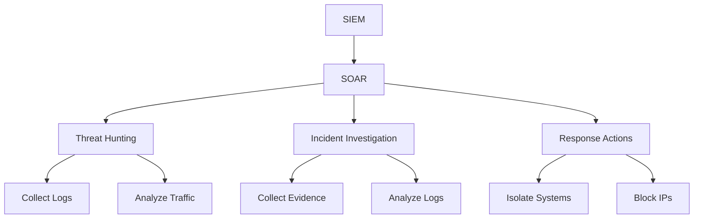
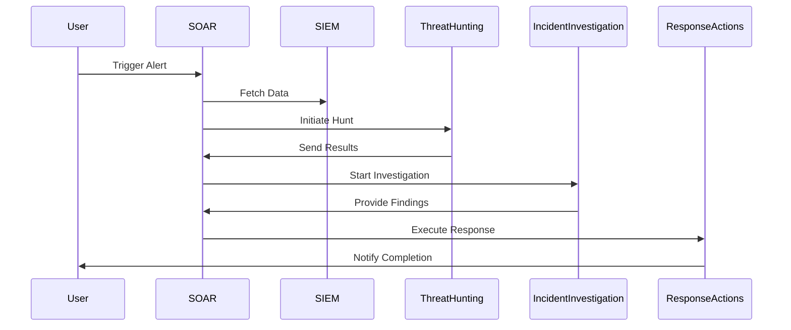

## Introduction to SOAR Tools and Their Role in Incident Response

### What is SOAR?

SOAR stands for Security Orchestration, Automation, and Response. This category of tools aims to streamline and automate the processes involved in detecting, investigating, and responding to security incidents. The primary goal of SOAR tools is to reduce the burden on security teams by automating repetitive tasks and providing a centralized platform for managing security operations.

#### Why SOAR Matters

In today’s complex cybersecurity landscape, organizations face an overwhelming number of security alerts and incidents. Traditional methods of handling these alerts often involve manual intervention, which can be time-consuming and error-prone. SOAR tools help address these challenges by:

1. **Consolidating Alerts**: Aggregating alerts from multiple sources into a single interface.
2. **Automating Tasks**: Automating routine tasks such as threat hunting, incident investigation, and response actions.
3. **Enhancing Visibility**: Providing a unified view of security operations across different tools and systems.
4. **Improving Efficiency**: Reducing the time and effort required to manage security incidents.

### Key Components of SOAR

#### Security Orchestration

Security orchestration involves integrating various security tools and services into a cohesive system. This allows for seamless communication and data exchange between different components of the security infrastructure. For example, an SIEM (Security Information and Event Management) system might send alerts to a SOAR platform, which then triggers automated responses.

#### Automation

Automation in SOAR refers to the ability to execute predefined workflows and playbooks automatically. These playbooks can include steps such as:

- **Threat Hunting**: Automatically searching for indicators of compromise (IoCs) within network traffic.
- **Incident Investigation**: Collecting evidence and analyzing logs to understand the nature of an incident.
- **Response Actions**: Taking remedial actions such as isolating infected hosts or blocking malicious IP addresses.

#### Response

The response component of SOAR focuses on the actual actions taken during an incident. This includes both automated and manual steps to mitigate the threat and restore normal operations. SOAR tools provide a framework for defining and executing these response actions efficiently.

### Real-World Examples of SOAR in Action

#### Example: SolarWinds Supply Chain Attack (CVE-2020-1014)

In December 2020, the SolarWinds supply chain attack was one of the most significant cyber incidents in recent history. The attackers compromised SolarWinds’ software update mechanism, allowing them to inject malicious code into legitimate updates. This code, known as SUNBURST, was then distributed to thousands of SolarWinds customers.

**How SOAR Could Have Helped**

1. **Threat Hunting**: A SOAR tool could have been configured to monitor for unusual activity related to SolarWinds updates. Automated threat hunting playbooks could have detected the presence of SUNBURST.
2. **Incident Investigation**: Once an alert was triggered, the SOAR platform could have automatically collected relevant logs and network traffic data for analysis.
3. **Response Actions**: The SOAR tool could have initiated automated response actions such as isolating affected systems and blocking malicious IP addresses.

#### Example: Colonial Pipeline Ransomware Attack (May 2021)

In May 2021, the Colonial Pipeline Company suffered a ransomware attack that disrupted fuel supplies across the eastern United States. The attackers used a stolen password to gain access to the company’s network and deploy ransomware.

**How SOAR Could Have Helped**

1. **Threat Detection**: SOAR tools could have been used to monitor for signs of unauthorized access and suspicious login attempts.
2. **Incident Response**: Upon detection of the attack, the SOAR platform could have automatically isolated affected systems and initiated a recovery plan.
3. **Post-Incident Analysis**: SOAR tools could have facilitated a thorough post-incident analysis to identify the root cause and improve future defenses.

### Designing Your Incident Response Workflow with SOAR

When designing your incident response workflow, it is essential to consider the following aspects:

#### Understanding Your Needs

Before implementing a SOAR solution, it is crucial to understand your organization’s specific needs and requirements. This includes:

- **Alert Volume**: How many security alerts does your organization receive daily?
- **Tool Integration**: Which security tools are currently in use, and how can they be integrated into a SOAR platform?
- **Skill Set**: What are the skills and expertise available within your security team?

#### Initial Setup

When starting with SOAR, it is important to begin with a small-scale implementation. This allows you to:

- **Understand the Platform**: Get familiar with the features and capabilities of the SOAR tool.
- **Integrate Key Tools**: Start by integrating the most critical security tools into the SOAR platform.
- **Develop Playbooks**: Create initial playbooks for common incident scenarios.

#### Mature Process Evaluation

Once your organization has a mature incident response process, it may be beneficial to evaluate more advanced SOAR offerings. This could include:

- **Advanced Automation**: Implementing more sophisticated automation workflows.
- **Unified Dashboard**: Utilizing a centralized dashboard for monitoring and managing security operations.
- **Continuous Improvement**: Regularly reviewing and updating playbooks based on new threats and lessons learned.

### Common Pitfalls and Best Practices

#### Common Pitfalls

1. **Over-Reliance on Automation**: While automation is a key benefit of SOAR, it should not replace human judgment entirely. Over-reliance on automation can lead to missed detections and false positives.
2. **Integration Challenges**: Integrating multiple security tools into a SOAR platform can be complex. Ensure that all necessary APIs and connectors are available and properly configured.
3. **Playbook Maintenance**: Playbooks need to be regularly updated to reflect the latest threats and organizational changes. Neglecting playbook maintenance can render the SOAR solution ineffective.

#### Best Practices

1. **Start Small**: Begin with a limited scope and gradually expand the SOAR implementation as your team becomes more comfortable with the tool.
2. **Regular Training**: Provide regular training sessions for security team members to ensure they are up-to-date with the latest features and best practices.
3. **Continuous Monitoring**: Continuously monitor the performance of the SOAR platform and make adjustments as needed. Regularly review and update playbooks to stay ahead of emerging threats.

### How to Prevent / Defend Against SOAR Misconfigurations

#### Vulnerable Configuration Example

Consider a scenario where a SOAR tool is configured to automatically isolate any host that generates an alert. However, due to a misconfiguration, the isolation script is not properly validated, leading to potential abuse.

```yaml
# Vulnerable SOAR Configuration
playbook:
  name: "Isolate Host"
  steps:
    - name: "Check Alert"
      action: "check_alert"
    - name: "Isolate Host"
      action: "isolate_host"
```

#### Secure Configuration Example

To prevent such vulnerabilities, ensure that the isolation script is properly validated and restricted to authorized users.

```yaml
# Secure SOAR Configuration
playbook:
  name: "Isolate Host"
  steps:
    - name: "Check Alert"
      action: "check_alert"
    - name: "Validate Isolation"
      action: "validate_isolation"
    - name: "Isolate Host"
      action: "isolate_host"
```

### Mermaid Diagrams for SOAR Architecture

#### SOAR Architecture Diagram



#### SOAR Workflow Diagram



### Hands-On Labs for SOAR Practice

For hands-on practice with SOAR tools, consider the following well-known labs:

- **PortSwigger Web Security Academy**: Offers modules on incident response and SOAR integration.
- **OWASP Juice Shop**: Provides a simulated environment for practicing security operations and incident response.
- **CloudGoat**: Focuses on cloud security and can be used to practice SOAR in a cloud environment.
- **Pacu**: A penetration testing framework that can be used to simulate attacks and test SOAR responses.

By leveraging these resources, you can gain practical experience in designing and implementing effective SOAR solutions for your organization.

### Conclusion

SOAR tools play a crucial role in modern security operations by streamlining the management of security alerts and incidents. By understanding the key components of SOAR, designing effective incident response workflows, and avoiding common pitfalls, organizations can significantly enhance their security posture. Regular training, continuous monitoring, and secure configurations are essential to ensuring the effectiveness of SOAR solutions.

---
<!-- nav -->
[[01-Introduction to DevSecOps Tools|Introduction to DevSecOps Tools]] | [[DevSecOps/DevSecOps Bootcamp/01-DevSecOps Introduction/04-Discover Tools and Resources to Help You on Your Journey/02-Tools/00-Overview|Overview]] | [[03-Security Monitoring Tools|Security Monitoring Tools]]
