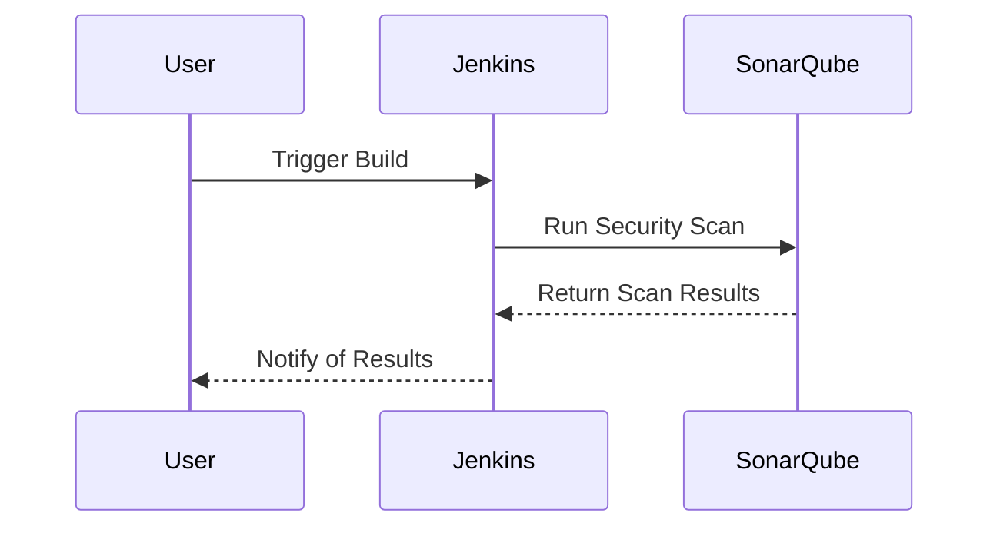

## Introduction to DevSecOps Bootcamp Materials and Support

Enrolling in a DevSecOps bootcamp provides a comprehensive set of resources designed to facilitate a deep and practical understanding of DevSecOps principles and practices. This chapter delves into the various materials and support mechanisms available to students, ensuring a seamless and enriching learning experience.

### Educational Videos and Demos

One of the primary components of the bootcamp is the educational video content. These videos are meticulously crafted to provide both theoretical knowledge and practical demonstrations. Each video includes detailed walkthroughs of real-world scenarios, allowing students to follow along and apply the concepts immediately.

#### Structure of Educational Videos

The videos are organized into chapters, each focusing on a specific aspect of DevSecOps. For instance, a chapter might cover the integration of security into the CI/CD pipeline. Here’s a breakdown of what a typical video might include:

- **Introduction**: Overview of the topic and its relevance in the DevSecOps context.
- **Theory**: Explanation of key concepts, such as continuous integration, continuous delivery, and security testing.
- **Practical Demonstration**: Step-by-step guide on how to implement the concepts using tools like Jenkins, Docker, and SonarQube.
- **Summary**: Recap of the key takeaways and next steps.

#### Example Video Content

Consider a video on integrating security into a CI/CD pipeline using Jenkins and SonarQube. The video would start with an introduction to Jenkins and SonarQube, followed by a demonstration of setting up a Jenkins pipeline that includes security scans using SonarQube.



### Git Repositories

All the projects and code used in the bootcamp are stored in Git repositories. These repositories are structured to ensure ease of use and understanding. Each repository contains the necessary files and configurations to replicate the demonstrations shown in the videos.

#### Repository Structure

A typical repository structure might look like this:

```
/project-name/
├── README.md
├── .gitignore
├── Jenkinsfile
├── Dockerfile
└── src/
    └── main/
        └── java/
            └── com/
                └── example/
                    └── App.java
```

- **README.md**: Contains instructions on how to set up and run the project.
- **.gitignore**: Specifies files and directories to be ignored by Git.
- **Jenkinsfile**: Configuration file for Jenkins CI/CD pipeline.
- **Dockerfile**: Instructions for building Docker images.
- **src/**: Source code directory.

#### Example Repository

Here’s an example of a `Jenkinsfile` used in a repository:

```groovy
pipeline {
    agent any
    stages {
        stage('Build') {
            steps {
                sh 'mvn clean package'
            }
        }
        stage('Test') {
            steps {
                sh 'mvn test'
            }
        }
        stage('Security Scan') {
            steps {
                sh 'sonar-scanner'
            }
        }
    }
}
```

### Accompanying Handouts

To complement the video content, handouts are provided. These handouts summarize the key takeaways from each chapter, making it easier for students to review and retain the information.

#### Structure of Handouts

Handouts typically include:

- **Key Concepts**: Summary of the main ideas covered in the chapter.
- **Practical Tips**: Advice on implementing the concepts in real-world scenarios.
- **Further Reading**: References to additional resources for deeper understanding.

#### Example Handout

For a chapter on integrating security into a CI/CD pipeline, the handout might include:

- **Key Concepts**:
  - Continuous Integration (CI)
  - Continuous Delivery (CD)
  - Security Testing
- **Practical Tips**:
  - Use Jenkins for CI/CD pipelines.
  - Integrate SonarQube for security scans.
  - Automate security tests as part of the build process.
- **Further Reading**:
  - Jenkins documentation: <https://www.jenkins.io/doc/>
  - SonarQube documentation: <https://docs.sonarqube.org/>

### Support Mechanisms

Understanding the importance of support during the learning journey, the bootcamp provides dedicated DevSecOps engineers and a support team. This support is available through an exclusive group where students can ask questions and receive guidance.

#### Support Team Structure

The support team consists of:

- **DevSecOps Engineers**: Experts with real-world experience in DevSecOps.
- **Support Team**: Generalists who can assist with administrative tasks and basic queries.

#### Time Zone Coverage

To ensure that every student receives timely support, the team covers multiple time zones. This means that regardless of where a student is located, they can expect prompt assistance.

### Real-World Examples and Case Studies

To illustrate the practical application of DevSecOps principles, recent real-world examples and case studies are included. These examples highlight the importance of integrating security into the development lifecycle and the consequences of failing to do so.

#### Example: Equifax Data Breach (CVE-2017-5638)

In 2017, Equifax suffered a massive data breach that exposed sensitive personal information of millions of individuals. The breach was caused by a vulnerability in Apache Struts, a popular web framework.

- **Vulnerability**: CVE-2017-5638
- **Impact**: Exposure of sensitive data including Social Security numbers, birth dates, and addresses.
- **Root Cause**: Failure to patch a known vulnerability in a timely manner.

#### How to Prevent / Defend

To prevent similar incidents, organizations should:

- **Regularly Update and Patch Systems**: Ensure that all systems are up-to-date with the latest security patches.
- **Implement Security Scans**: Use tools like SonarQube to perform regular security scans.
- **Automate Security Tests**: Integrate security tests into the CI/CD pipeline to catch vulnerabilities early.

#### Secure Coding Practices

Secure coding practices are essential to preventing vulnerabilities. Here’s an example of a vulnerable code snippet and its secure counterpart:

**Vulnerable Code**:

```java
public class User {
    private String password;

    public void setPassword(String password) {
        this.password = password;
    }

    public String getPassword() {
        return password;
    }
}
```

**Secure Code**:

```java
import javax.crypto.Cipher;
import javax.crypto.spec.SecretKeySpec;

public class User {
    private String encryptedPassword;

    public void setPassword(String password) throws Exception {
        SecretKeySpec keySpec = new SecretKeySpec("mysecretkey".getBytes(), "AES");
        Cipher cipher = Cipher.getInstance("AES");
        cipher.init(Cipher.ENCRYPT_MODE, keySpec);
        byte[] encrypted = cipher.doFinal(password.getBytes());
        this.encryptedPassword = new String(encrypted);
    }

    public String getPassword() throws Exception {
        SecretKeySpec keySpec = new SecretKeySpec("mysecretkey".getBytes(), "AES");
        Cipher cipher = Cipher.getInstance("AES");
        cipher.init(Cipher.DECRYPT_MODE, keySpec);
        byte[] decrypted = cipher.doFinal(encryptedPassword.getBytes());
        return new String(decrypted);
    }
}
```

### Hands-On Labs

To reinforce the theoretical knowledge gained from the videos and handouts, hands-on labs are recommended. These labs provide practical experience in applying DevSecOps principles.

#### Recommended Labs

- **PortSwigger Web Security Academy**: Offers interactive labs for web application security.
- **OWASP Juice Shop**: A deliberately insecure web application for practicing security testing.
- **DVWA (Damn Vulnerable Web Application)**: Another web application for security testing.
- **WebGoat**: An interactive training application for learning about web application security.

### Conclusion

Enrolling in a DevSecOps bootcamp provides a wealth of resources designed to facilitate a deep and practical understanding of DevSecOps principles and practices. From educational videos and demos to Git repositories, handouts, and dedicated support, every aspect is carefully curated to ensure a seamless and enriching learning experience. By leveraging these resources and engaging in hands-on labs, students can gain the skills needed to effectively integrate security into the development lifecycle.

---
<!-- nav -->
[[DevSecOps/DevSecOps Bootcamp/01-DevSecOps Introduction/05-Getting Started with the DevSecOps Bootcamp/03-Support and Other Bootcamp Materials/00-Overview|Overview]] | [[02-Support and Other Bootcamp Materials|Support and Other Bootcamp Materials]]
