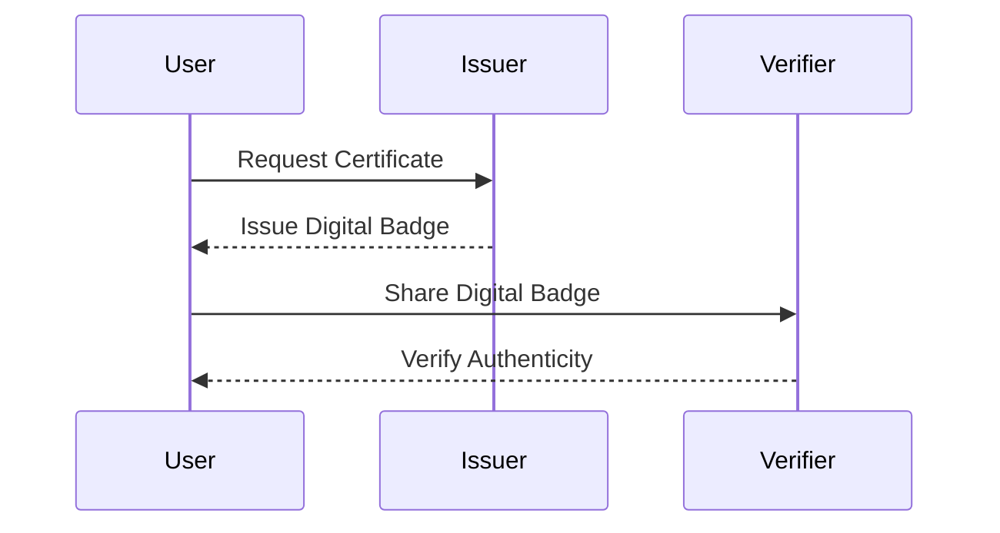

## Introduction to DevSecOps Certification

### What is DevSecOps?

DevSecOps is a set of practices that integrates security into the entire DevOps lifecycle. Traditionally, security was often treated as an afterthought, added late in the development process. However, with the increasing complexity and interconnectedness of modern systems, security must be considered from the very beginning of the development cycle. This approach ensures that security is not only a concern during the development phase but also throughout the continuous integration and deployment processes.

### Importance of Certification

Certification serves as a formal recognition of one’s knowledge and skills in a specific domain. In the context of DevSecOps, obtaining a certification can validate your expertise and demonstrate to potential employers that you have a deep understanding of integrating security into the DevOps pipeline. This is particularly important in today’s cybersecurity landscape, where the threat landscape is constantly evolving.

### Why Certifications Matter

Certifications are not just pieces of paper; they represent a significant investment of time and effort. They provide a structured path for learning and mastering complex topics. Moreover, certifications can help you stand out in a competitive job market. Employers often look for candidates who have demonstrated their commitment to continuous learning and improvement through certifications.

### DevSecOps Bootcamp Overview

The DevSecOps bootcamp is designed to provide comprehensive training in integrating security into the DevOps workflow. This includes hands-on experience with tools and techniques used in modern DevSecOps practices. The bootcamp covers a wide range of topics, from basic principles to advanced strategies, ensuring that participants leave with a solid foundation in DevSecOps.

### Certification Included in the Bootcamp

One of the key benefits of the DevSecOps bootcamp is the inclusion of a certified document upon completion. This certification is not just a piece of paper; it is a verifiable digital badge that can be easily shared and embedded in various formats. This makes it easier for you to showcase your new skills to potential employers and peers in your professional network.

### Verifiable Digital Badges

Verifiable digital badges are a modern alternative to traditional certificates. They offer several advantages:

- **Ease of Sharing:** Digital badges can be easily shared via social media, email, and professional networking sites like LinkedIn.
- **Validation:** Unlike traditional PDF certificates, digital badges can be validated to ensure their authenticity.
- **Professional Credibility:** A verifiable digital badge adds credibility to your resume and professional profile.

### How Digital Badges Work

Digital badges are typically issued using blockchain technology or other secure verification methods. These methods ensure that the badge cannot be tampered with or forged. When someone clicks on a digital badge, they can verify its authenticity by checking the issuer’s credentials and the badge’s unique identifier.

#### Example of a Verifiable Digital Badge



### Benefits of Digital Badges

- **Ease of Integration:** Digital badges can be easily integrated into resumes, email signatures, and professional profiles.
- **Professional Networking:** Potential employers and peers can quickly verify your credentials, enhancing your professional reputation.
- **Continuous Learning:** Digital badges encourage continuous learning and skill development, as they can be updated and refreshed as you acquire new knowledge.

### How to Apply for a Verifiable Digital Badge

At the end of the training program, you can apply for a verifiable digital badge. This process typically involves:

1. **Completion of Training:** Ensure you have completed all the required modules and assessments.
2. **Application Submission:** Submit your application for the digital badge.
3. **Verification Process:** Your application will be verified to ensure you meet the necessary criteria.
4. **Badge Issuance:** Once verified, the digital badge will be issued to you.

### Real-World Examples of Digital Badges

Several organizations have successfully implemented digital badge programs. For instance, the Certified DevSecOps Practitioner program offers a verifiable digital badge upon completion. This badge can be easily shared and verified, making it a valuable addition to your professional portfolio.

### How to Prevent and Defend Against Misuse of Digital Badges

While digital badges offer numerous benefits, they are not immune to misuse. Here are some ways to prevent and defend against potential issues:

#### Vulnerable Scenario: Fake Digital Badges

**Vulnerable Code:**
```json
{
  "badge": {
    "name": "Certified DevSecOps Practitioner",
    "issuer": "FakeCertificationOrg",
    "recipient": "JohnDoe@example.com",
    "date": "2023-10-01"
  }
}
```

**Secure Code:**
```json
{
  "badge": {
    "name": "Certified DevSecOps Practitioner",
    "issuer": "OfficialCertificationOrg",
    "recipient": "JohnDoe@example.com",
    "date": "2023-10-01",
    "signature": "signed_hash_value"
  }
}
```

**Explanation:**
In the vulnerable scenario, the badge lacks a cryptographic signature, making it easy to forge. In the secure scenario, the badge includes a cryptographic signature, which ensures its authenticity and prevents tampering.

#### Prevention Strategies

- **Use Blockchain Technology:** Implement blockchain-based verification to ensure the integrity and authenticity of digital badges.
- **Cryptographic Signatures:** Include cryptographic signatures in digital badges to prevent forgery.
- **Regular Audits:** Conduct regular audits to ensure the integrity of the digital badge system.

### Conclusion

Obtaining a certification in DevSecOps is a significant achievement that validates your expertise and commitment to integrating security into the DevOps pipeline. The inclusion of a verifiable digital badge in the DevSecOps bootcamp provides a modern and secure way to showcase your skills. By following best practices and implementing robust security measures, you can ensure that your digital badge remains authentic and credible.

### Practice Labs

For hands-on experience with DevSecOps concepts, consider the following practice labs:

- **PortSwigger Web Security Academy:** Offers interactive labs to practice web security concepts.
- **OWASP Juice Shop:** A deliberately insecure web application for practicing security testing.
- **DVWA (Damn Vulnerable Web Application):** A PHP/MySQL web application that is riddled with vulnerabilities for educational purposes.
- **WebGoat:** An interactive, gamified training application for learning about web application security.

These labs provide a practical environment to apply the concepts learned in the DevSecOps bootcamp, ensuring that you gain hands-on experience with real-world scenarios.

---
<!-- nav -->
[[DevSecOps/DevSecOps Bootcamp/01-DevSecOps Introduction/05-Getting Started with the DevSecOps Bootcamp/04-Certified DevSecOps Practitioner Applying for Digital Badge/00-Overview|Overview]] | [[DevSecOps/DevSecOps Bootcamp/01-DevSecOps Introduction/05-Getting Started with the DevSecOps Bootcamp/04-Certified DevSecOps Practitioner Applying for Digital Badge/02-Practice Questions & Answers|Practice Questions & Answers]]
