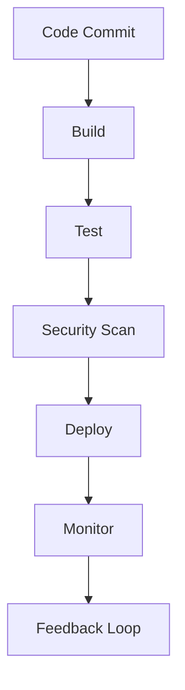

## Introduction to DevSecOps

Welcome to the DevSecOps boot camp. This course aims to equip you with the necessary skills to integrate security into the DevOps pipeline, ensuring that security is no longer an afterthought but a core component of the development process. Let's delve into why this is crucial and how it can benefit both individuals and organizations.

### The Importance of DevSecOps

According to several data trend analyses, DevSecOps is one of the most demanded skill sets in the job market. This demand is driven by the increasing frequency and severity of security breaches. Security breaches are expected to cost companies trillions annually. While DevOps has revolutionized the automated release of applications, it often left security as an afterthought. To address this gap, the DevSecOps concept emerged, integrating security into every step of the DevOps process.

#### Security Breaches and Their Impact

Security breaches have significant financial and reputational impacts on companies. Recent high-profile breaches include:

- **Equifax Data Breach (2017)**: This breach exposed sensitive information of over 143 million people. The cost was estimated to be around $4 billion.
- **Capital One Data Breach (2019)**: Over 100 million customers were affected, leading to a settlement of $80 million.

These breaches highlight the critical need for robust security measures integrated into the development lifecycle.

### The Evolution of DevOps

Before diving into DevSecOps, let's understand the evolution of DevOps and its limitations.

#### What is DevOps?

DevOps is a set of practices that combines software development (Dev) and IT operations (Ops) to shorten the system development life cycle while delivering features, bug fixes, and updates frequently in close alignment with business objectives.

**Key Components of DevOps:**
- **Continuous Integration (CI)**: Automating the integration of code changes from multiple contributors.
- **Continuous Delivery (CD)**: Automating the delivery of applications to a chosen environment.
- **Infrastructure as Code (IaC)**: Managing and provisioning infrastructure through machine-readable definition files.

#### Limitations of DevOps

While DevOps has significantly improved the speed and efficiency of software delivery, it often overlooked security. Security was typically addressed at the end of the development cycle, leading to vulnerabilities being discovered too late. This approach is no longer sustainable given the increasing complexity and interconnectedness of modern systems.

### Emergence of DevSecOps

To address these limitations, the DevSecOps concept emerged. DevSecOps integrates security into the entire DevOps lifecycle, ensuring that security is a shared responsibility among developers, operations teams, and security professionals.

#### Key Principles of DevSecOps

- **Shift Left**: Integrate security practices early in the development cycle.
- **Automate Security Testing**: Use tools and automation to continuously test for vulnerabilities.
- **Collaboration**: Foster collaboration between development, operations, and security teams.
- **Security as a Service**: Provide security services and tools as part of the DevOps pipeline.

### Benefits of DevSecOps

Implementing DevSecOps offers numerous benefits:

- **Reduced Vulnerabilities**: Early identification and mitigation of security issues.
- **Improved Compliance**: Ensuring adherence to regulatory requirements.
- **Enhanced Trust**: Building trust with customers and stakeholders by demonstrating a commitment to security.
- **Competitive Advantage**: Differentiating in the job market and attracting top talent.

### Real-World Examples

Let's look at some real-world examples where DevSecOps has made a significant impact:

- **Netflix**: Netflix uses a combination of automated testing and manual reviews to ensure security throughout the development process. They have implemented a tool called "Simian Army" to simulate failures and test the resilience of their systems.
- **GitHub**: GitHub has integrated security checks into their CI/CD pipelines using tools like Dependabot to automatically identify and patch vulnerabilities in dependencies.

### How to Implement DevSecOps

Implementing DevSecOps requires a strategic approach, including cultural shifts, tooling, and process improvements.

#### Cultural Shifts

- **Security Mindset**: Encourage a mindset where everyone is responsible for security.
- **Cross-Functional Teams**: Foster collaboration between development, operations, and security teams.

#### Tooling

- **Static Application Security Testing (SAST)**: Tools like SonarQube and Fortify analyze code for vulnerabilities.
- **Dynamic Application Security Testing (DAST)**: Tools like Burp Suite and OWASP ZAP test applications in a runtime environment.
- **Dependency Scanning**: Tools like Snyk and WhiteSource scan for vulnerabilities in third-party dependencies.

#### Process Improvements

- **Security Policies and Guidelines**: Establish clear guidelines for secure coding practices.
- **Regular Security Training**: Conduct regular training sessions to keep the team updated on the latest security threats and best practices.

### Mermaid Diagrams

Let's visualize the DevSecOps pipeline using a mermaid diagram:

This diagram illustrates the continuous integration and deployment process with security scans integrated at each stage.

### Hands-On Labs

To gain practical experience with DevSecOps, consider the following labs:

- **PortSwigger Web Security Academy**: Offers interactive labs to practice web application security.
- **OWASP Juice Shop**: A deliberately insecure web application for practicing security testing.
- **DVWA (Damn Vulnerable Web Application)**: Another intentionally vulnerable web application for security training.

### Conclusion

In conclusion, DevSecOps is a critical skill set for the modern software development landscape. By integrating security into the DevOps pipeline, organizations can reduce vulnerabilities, improve compliance, and build trust with their customers. This course aims to provide you with the knowledge and tools needed to implement DevSecOps effectively.

### Further Reading

For deeper insights into DevSecOps, consider the following resources:

- **Books**: "DevSecOps: Building Security into the DevOps Lifecycle" by Gary Gruver and Tommy Mouser.
- **Online Courses**: Coursera and Udemy offer comprehensive courses on DevSecOps.
- **Conferences**: Attend conferences like DevOps Days and Black Hat to stay updated on the latest trends and best practices.

By mastering DevSecOps, you position yourself as a valuable asset in today's rapidly evolving technology landscape.

---
<!-- nav -->
[[DevSecOps/DevSecOps Bootcamp/01-DevSecOps Introduction/05-Getting Started with the DevSecOps Bootcamp/05-Why learn DevSecOps/00-Overview|Overview]] | [[DevSecOps/DevSecOps Bootcamp/01-DevSecOps Introduction/05-Getting Started with the DevSecOps Bootcamp/05-Why learn DevSecOps/02-Practice Questions & Answers|Practice Questions & Answers]]
