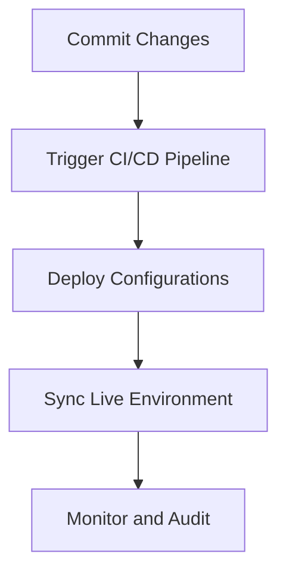
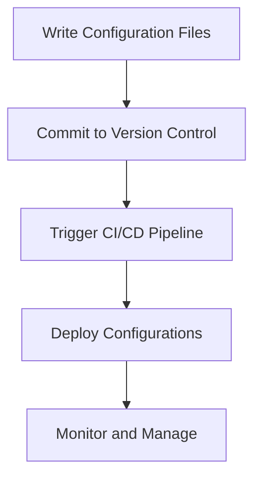
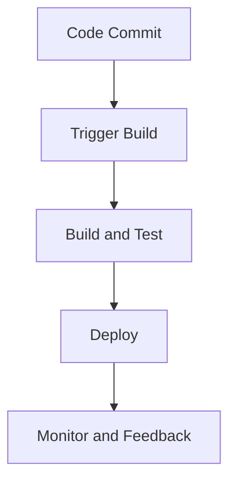
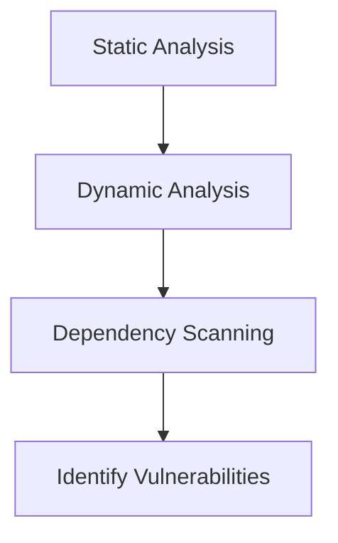
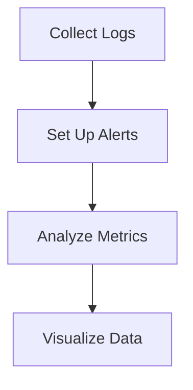
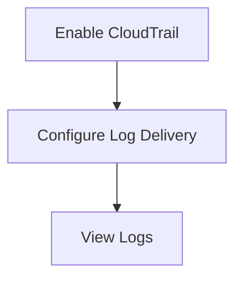
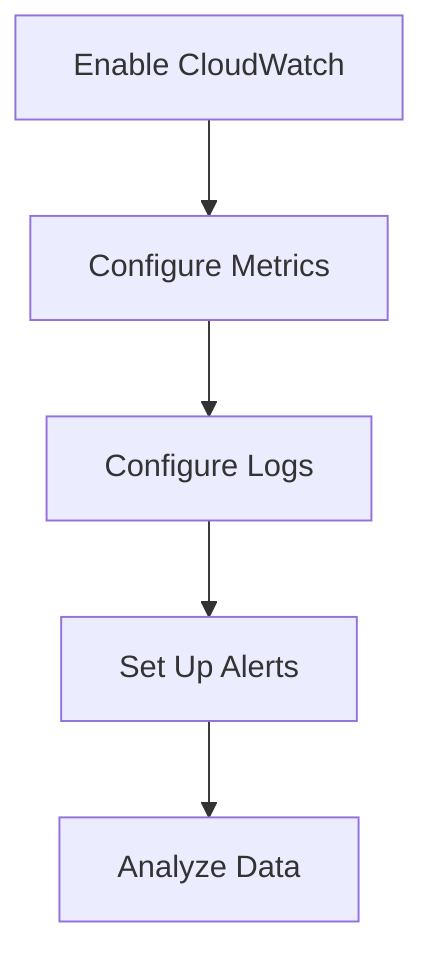

## Introduction to DevSecOps Bootcamp Curriculum

In this section, we will delve into the core concepts of DevSecOps, focusing on GitOps, Infrastructure as Code (IaC), Continuous Integration and Continuous Deployment (CI/CD), security scanning, and logging and monitoring. Each concept will be explained thoroughly, including its purpose, implementation, and security implications. We will also cover recent real-world examples, complete code snippets, and detailed diagrams to provide a comprehensive understanding.

### GitOps

GitOps is a methodology that uses Git as a single source of truth for declarative infrastructure and applications. This approach ensures that all changes to the system are tracked, reviewed, and deployed through a consistent process, similar to how application code is managed.

#### What is GitOps?

GitOps leverages Git for version control and collaboration, treating infrastructure and application configurations as code. This means that all changes to the infrastructure and application are stored in a Git repository, allowing for version control, branching, merging, and pull requests.

#### Why Use GitOps?

- **Version Control**: All changes are tracked, making it easy to revert to previous states if necessary.
- **Collaboration**: Multiple team members can work on the same infrastructure and application configurations simultaneously.
- **Auditability**: Every change is recorded, providing a clear audit trail.
- **Consistency**: The same process is used for both application and infrastructure changes, ensuring consistency and reducing errors.

#### How Does GitOps Work?

1. **Define Infrastructure as Code**: Write the infrastructure and application configurations in a declarative format using tools like Terraform, Ansible, or Kubernetes manifests.
2. **Store in Git Repository**: Commit the configurations to a Git repository.
3. **Automate Deployment**: Use CI/CD pipelines to automatically deploy the configurations based on changes in the Git repository.
4. **Monitor and Sync**: Continuously monitor the live environment and sync it with the desired state defined in the Git repository.

#### Real-World Example

Consider a recent breach where an attacker gained unauthorized access to a company's infrastructure due to misconfigured permissions. By using GitOps, the company could have ensured that all infrastructure configurations were version-controlled and auditable, making it easier to identify and rectify misconfigurations.

### Infrastructure as Code (IaC)

Infrastructure as Code (IaC) is the practice of managing and provisioning computer data centers through machine-readable definition files, rather than physical hardware configuration or interactive configuration tools.

#### What is IaC?

IaC involves writing infrastructure configurations in code, typically using tools like Terraform, Ansible, or Kubernetes manifests. This allows for the automation of infrastructure deployment and management.

#### Why Use IaC?

- **Reproducibility**: Infrastructure can be consistently reproduced across environments.
- **Version Control**: Infrastructure configurations can be version-controlled, allowing for tracking and reverting changes.
- **Automation**: Automated deployment and management reduce human error and increase efficiency.
- **Collaboration**: Multiple team members can work on the same infrastructure configurations simultaneously.

#### How Does IaC Work?

1. **Write Configuration Files**: Define the infrastructure configurations in code using tools like Terraform or Ansible.
2. **Commit to Version Control**: Store the configuration files in a version control system like Git.
3. **Automate Deployment**: Use CI/CD pipelines to automatically deploy the configurations based on changes in the version control system.
4. **Monitor and Manage**: Continuously monitor and manage the infrastructure based on the defined configurations.

#### Real-World Example

A company experienced downtime due to manual misconfiguration of their infrastructure. By adopting IaC, the company was able to automate the deployment and management of their infrastructure, reducing the likelihood of human error and improving reliability.

### Continuous Integration and Continuous Deployment (CI/CD)

Continuous Integration (CI) and Continuous Deployment (CD) are practices that enable teams to deliver code changes more frequently and reliably. CI involves automating the integration of code changes from multiple contributors, while CD extends this to automate the deployment of those changes.

#### What is CI/CD?

CI/CD involves automating the integration and deployment of code changes. This includes building, testing, and deploying code changes in a continuous and automated manner.

#### Why Use CI/CD?

- **Faster Delivery**: Teams can deliver code changes more frequently and reliably.
- **Reduced Errors**: Automation reduces the likelihood of human error.
- **Improved Collaboration**: Multiple team members can work on the same codebase simultaneously.
- **Enhanced Quality**: Automated testing ensures that code changes meet quality standards.

#### How Does CI/CD Work?

1. **Code Commit**: Developers commit code changes to a version control system like Git.
2. **Trigger Build**: The CI/CD pipeline is triggered based on the code commit.
3. **Build and Test**: The pipeline builds the code and runs automated tests.
4. **Deploy**: The pipeline deploys the code changes to the target environment.
5. **Monitor and Feedback**: The pipeline monitors the deployed code and provides feedback to developers.

#### Real-World Example

A company experienced frequent outages due to manual deployments. By adopting CI/CD, the company was able to automate the deployment of code changes, reducing the likelihood of human error and improving reliability.

### Security Scanning

Security scanning involves using automated tools to identify vulnerabilities and security issues in code and infrastructure configurations.

#### What is Security Scanning?

Security scanning involves using automated tools to identify vulnerabilities and security issues in code and infrastructure configurations. This includes static analysis, dynamic analysis, and dependency scanning.

#### Why Use Security Scanning?

- **Identify Vulnerabilities**: Security scanning helps identify vulnerabilities and security issues in code and infrastructure configurations.
- **Reduce Risk**: By identifying and addressing vulnerabilities, security scanning reduces the risk of security breaches.
- **Compliance**: Security scanning helps ensure compliance with security standards and regulations.

#### How Does Security Scanning Work?

1. **Static Analysis**: Analyze code and infrastructure configurations for potential vulnerabilities.
2. **Dynamic Analysis**: Test code and infrastructure configurations in a runtime environment to identify vulnerabilities.
3. **Dependency Scanning**: Analyze dependencies for known vulnerabilities.

#### Real-World Example

A company experienced a security breach due to a known vulnerability in one of their dependencies. By adopting security scanning, the company was able to identify and address the vulnerability, reducing the risk of future breaches.

### Logging and Monitoring

Logging and monitoring involve collecting and analyzing logs and metrics to gain insights into the behavior and performance of systems.

#### What is Logging and Monitoring?

Logging and monitoring involve collecting and analyzing logs and metrics to gain insights into the behavior and performance of systems. This includes collecting logs, setting up alerts, and analyzing metrics.

#### Why Use Logging and Monitoring?

- **Gain Insights**: Logging and monitoring provide insights into the behavior and performance of systems.
- **Detect Issues**: Logging and monitoring help detect issues and anomalies in real-time.
- **Troubleshoot Problems**: Logging and monitoring provide data for troubleshooting problems and diagnosing issues.
- **Ensure Compliance**: Logging and monitoring help ensure compliance with security standards and regulations.

#### How Does Logging and Monitoring Work?

1. **Collect Logs**: Collect logs from various sources, including applications, infrastructure, and security systems.
2. **Set Up Alerts**: Set up alerts based on specific conditions, such as threshold violations or anomaly detection.
3. **Analyze Metrics**: Analyze metrics to gain insights into the behavior and performance of systems.
4. **Visualize Data**: Visualize data using dashboards and reports to gain a better understanding of system behavior.

#### Real-World Example

A company experienced a security breach due to a lack of visibility into their systems. By adopting logging and monitoring, the company was able to gain insights into the behavior and performance of their systems, detect issues in real-time, and troubleshoot problems effectively.

### AWS Services for Logging and Monitoring

AWS provides several services for logging and monitoring, including CloudTrail and CloudWatch.

#### CloudTrail

CloudTrail is a service that enables governance, compliance, operational auditing, and risk auditing of your AWS account. It records AWS API calls and delivers log files to an Amazon S3 bucket.

##### What is CloudTrail?

CloudTrail is a service that records AWS API calls made by users, roles, or AWS services and delivers log files to an Amazon S3 bucket. These log files can be used to determine what actions were taken on your AWS resources and when.

##### Why Use CloudTrail?

- **Governance**: CloudTrail helps you govern your AWS account by recording all API calls made by users, roles, or AWS services.
- **Compliance**: CloudTrail helps you comply with regulatory requirements by providing a record of all API calls made on your AWS resources.
- **Auditing**: CloudTrail helps you audit your AWS account by providing a record of all API calls made on your AWS resources.

##### How Does CloudTrail Work?

1. **Enable CloudTrail**: Enable CloudTrail in your AWS account.
2. **Configure Log Delivery**: Configure CloudTrail to deliver log files to an Amazon S3 bucket.
3. **View Logs**: View logs in the Amazon S3 bucket to determine what actions were taken on your AWS resources.

##### Real-World Example

A company experienced a security breach due to unauthorized access to their AWS resources. By enabling CloudTrail, the company was able to determine what actions were taken on their AWS resources and when, helping them to identify and address the issue.

#### CloudWatch

CloudWatch is a monitoring service for AWS cloud resources and applications. It collects and tracks metrics, collects and monitors log files, and responds to system-wide performance changes.

##### What is CloudWatch?

CloudWatch is a monitoring service for AWS cloud resources and applications. It collects and tracks metrics, collects and monitors log files, and responds to system-wide performance changes.

##### Why Use CloudWatch?

- **Monitoring**: CloudWatch helps you monitor your AWS cloud resources and applications.
- **Alerting**: CloudWatch helps you set up alerts based on specific conditions, such as threshold violations or anomaly detection.
- **Troubleshooting**: CloudWatch helps you troubleshoot problems and diagnose issues by providing data for analysis.

##### How Does CloudWatch Work?

1. **Enable CloudWatch**: Enable CloudWatch in your AWS account.
2. **Configure Metrics**: Configure CloudWatch to collect and track metrics for your AWS cloud resources and applications.
3. **Configure Logs**: Configure CloudWatch to collect and monitor log files for your AWS cloud resources and applications.
4. **Set Up Alerts**: Set up alerts based on specific conditions, such as threshold violations or anomaly detection.
5. **Analyze Data**: Analyze data using CloudWatch dashboards and reports to gain a better understanding of system behavior.

##### Real-World Example

A company experienced a performance issue due to a lack of visibility into their AWS cloud resources and applications. By enabling CloudWatch, the company was able to monitor their AWS cloud resources and applications, set up alerts based on specific conditions, and troubleshoot problems effectively.

### Hands-On Practice

To gain hands-on experience with the concepts covered in this section, we recommend the following labs:

- **PortSwigger Web Security Academy**: Provides hands-on labs for web application security.
- **OWASP Juice Shop**: Provides hands-on labs for web application security.
- **DVWA**: Provides hands-on labs for web application security.
- **WebGoat**: Provides hands-on labs for web application security.
- **CloudGoat**: Provides hands-on labs for cloud security.
- **flaws.cloud**: Provides hands-on labs for cloud security.
- **flaws2.cloud**: Provides hands-on labs for cloud security.
- **AWS Official Workshops**: Provides hands-on labs for AWS services.
- **Pacu**: Provides hands-on labs for AWS services.
- **Kubernetes Goat**: Provides hands-on labs for Kubernetes security.
- **OWASP WrongSecrets**: Provides hands-on labs for Kubernetes security.
- **kube-hunter**: Provides hands-on labs for Kubernetes security.
- **Terraform/Trivy/tfsec Demos**: Provides hands-on labs for IaC security.

By completing these labs, you will gain practical experience with the concepts covered in this section and be better prepared to apply them in real-world scenarios.

### Conclusion

In this section, we have covered the core concepts of DevSecOps, including GitOps, Infrastructure as Code (IaC), Continuous Integration and Continuous Deployment (CI/CD), security scanning, and logging and monitoring. We have provided detailed explanations, real-world examples, complete code snippets, and detailed diagrams to provide a comprehensive understanding. We have also included hands-on practice recommendations to help you gain practical experience with these concepts. By mastering these concepts, you will be better prepared to apply them in real-world scenarios and improve the security and reliability of your systems.

---
<!-- nav -->
[[03-Introduction to DevSecOps Bootcamp Curriculum Overview|Introduction to DevSecOps Bootcamp Curriculum Overview]] | [[DevSecOps/DevSecOps Bootcamp/01-DevSecOps Introduction/05-Getting Started with the DevSecOps Bootcamp/DevSecOps Bootcamp Curriculum Overview/00-Overview|Overview]] | [[05-Introduction to DevSecOps Bootcamp Curriculum Part 2|Introduction to DevSecOps Bootcamp Curriculum Part 2]]
