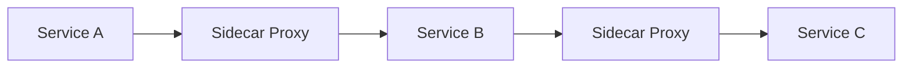
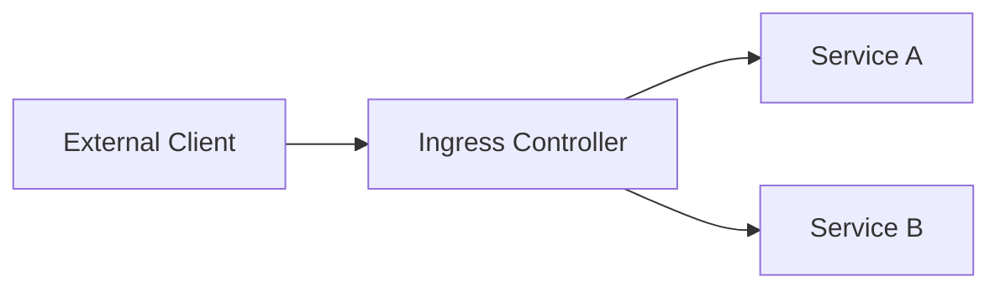
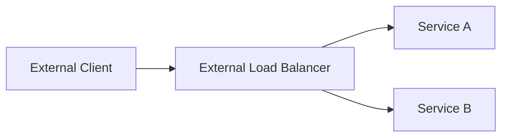

## Introduction to DevSecOps Bootcamp Curriculum

Welcome to the DevSecOps Bootcamp curriculum overview. This comprehensive guide will delve deep into the core concepts and practical applications of DevSecOps, focusing particularly on securing microservices applications within Kubernetes clusters. We will explore third-party implementations, service mesh, Ingress controllers, load balancers, sensitive data management, and automation in security processes. Each topic will be covered with detailed explanations, real-world examples, and practical demonstrations.

### Service Mesh and Its Role in Securing Microservices Applications

Service mesh is a dedicated infrastructure layer for handling service-to-service communication. It provides a way to manage and secure the interactions between microservices in a distributed system. A service mesh typically consists of a control plane and a data plane:

- **Control Plane**: Manages the configuration and policies for the service mesh.
- **Data Plane**: Consists of lightweight proxies (sidecars) that sit alongside each service instance to handle traffic management and security.

#### How Service Mesh Helps Secure Microservices

Service mesh enhances security by providing several features such as mutual TLS, rate limiting, circuit breaking, and observability. These features ensure that services communicate securely and efficiently.



**Mutual TLS**: Ensures that both client and server authenticate each other using digital certificates. This prevents man-in-the-middle attacks and ensures encrypted communication.

**Rate Limiting**: Controls the number of requests a service can receive within a specified time frame, preventing abuse and ensuring fair usage.

**Circuit Breaking**: Temporarily stops sending requests to a failing service to avoid cascading failures.

**Observability**: Provides insights into the health and performance of services through metrics, logs, and traces.

#### Real-World Example: Mutual TLS in Service Mesh

Consider a scenario where a microservices application is deployed in a Kubernetes cluster. To secure the communication between services, mutual TLS can be implemented using a service mesh like Istio.

```yaml
apiVersion: networking.istio.io/v1alpha3
kind: DestinationRule
metadata:
  name: productpage
spec:
  host: productpage
  trafficPolicy:
    tls:
      mode: ISTIO_MUTUAL
```

This configuration ensures that all traffic to the `productpage` service uses mutual TLS.

### Cluster Entry Points: Ingress Controllers and Load Balancers

Ingress controllers and load balancers are critical components in Kubernetes clusters that manage external access to the services running inside the cluster.

#### Ingress Controllers

An Ingress controller manages external access to the services in a cluster, typically HTTP. It acts as a reverse proxy and load balancer for HTTP traffic.



#### Load Balancers

Load balancers distribute incoming network traffic across multiple backend servers. They can be internal (within the cluster) or external (outside the cluster).



#### Real-World Example: Configuring an Ingress Controller

To configure an Ingress controller in Kubernetes, you can use the following YAML:

```yaml
apiVersion: networking.k8s.io/v1
kind: Ingress
metadata:
  name: example-ingress
spec:
  rules:
  - host: example.com
    http:
      paths:
      - path: /
        pathType: Prefix
        backend:
          service:
            name: example-service
            port:
              number: 80
```

This configuration routes traffic to the `example-service` based on the host and path.

### Sensitive Data Management in Kubernetes

Sensitive data management is crucial in Kubernetes environments, especially when dealing with credentials, access keys, and other sensitive information. Storing and managing these secrets securely is essential to prevent unauthorized access and data breaches.

#### Popular Open Source Tool: Vault by HashiCorp

Vault is a widely used tool for managing secrets and sensitive data. It provides a centralized way to store, manage, and distribute secrets securely.

#### How to Store and Use Secrets with Vault

Vault can be integrated with Kubernetes to manage secrets. Here’s a step-by-step guide to setting up Vault and using it to manage secrets:

1. **Install Vault**: Deploy Vault in your Kubernetes cluster.
2. **Configure Vault**: Set up Vault to integrate with Kubernetes.
3. **Store Secrets**: Store secrets in Vault.
4. **Retrieve Secrets**: Retrieve secrets from Vault and use them in your applications.

```yaml
apiVersion: v1
kind: Secret
metadata:
  name: vault-token
type: Opaque
data:
  token: <base64-encoded-vault-token>
```

#### Real-World Example: Using Vault for Secret Management

Consider a scenario where you need to store and use database credentials securely. You can use Vault to manage these credentials.

```yaml
apiVersion: v1
kind: Secret
metadata:
  name: db-credentials
type: Opaque
data:
  username: <base64-encoded-username>
  password: <base64-encoded-password>
```

#### How to Prevent / Defend Against Sensitive Data Exposure

1. **Use Strong Encryption**: Ensure that all sensitive data is encrypted both at rest and in transit.
2. **Limit Access**: Restrict access to sensitive data to only authorized personnel and services.
3. **Audit Logs**: Regularly review audit logs to detect any unauthorized access attempts.
4. **Secure Configuration**: Harden the configuration of your Kubernetes cluster and Vault to prevent unauthorized access.

### Automation in Security Processes

Automation is a key aspect of DevSecOps. Automating security processes ensures that security measures are consistently applied and reduces the risk of human error.

#### Real-World Example: Automated Security Testing

Automated security testing can be performed using tools like Trivy, which scans container images for vulnerabilities.

```yaml
apiVersion: batch/v1
kind: Job
metadata:
  name: trivy-scan
spec:
  template:
    spec:
      containers:
      - name: trivy
        image: aquasecurity/trivy:latest
        args: ["image", "--severity", "CRITICAL,HIGH", "<container-image>"]
      restartPolicy: Never
```

This job runs Trivy to scan the specified container image for vulnerabilities.

### Conclusion

In conclusion, the DevSecOps Bootcamp curriculum covers a wide range of topics related to securing microservices applications in Kubernetes clusters. From service mesh and Ingress controllers to sensitive data management and automation, each topic is explored in depth with real-world examples and practical demonstrations. By mastering these concepts, you will be well-equipped to implement robust security measures in your DevSecOps workflows.

### Practice Labs

For hands-on practice, consider the following labs:

- **PortSwigger Web Security Academy**: Focuses on web application security.
- **OWASP Juice Shop**: A deliberately insecure web application for practicing security skills.
- **Kubernetes Goat**: A Kubernetes-based security training platform.
- **CloudGoat**: A cloud security training platform for AWS.

These labs provide practical experience in applying the concepts learned in the DevSecOps Bootcamp curriculum.

---
<!-- nav -->
[[04-Introduction to DevSecOps Bootcamp Curriculum Part 1|Introduction to DevSecOps Bootcamp Curriculum Part 1]] | [[DevSecOps/DevSecOps Bootcamp/01-DevSecOps Introduction/05-Getting Started with the DevSecOps Bootcamp/DevSecOps Bootcamp Curriculum Overview/00-Overview|Overview]] | [[06-Introduction to DevSecOps Bootcamp Curriculum Part 3|Introduction to DevSecOps Bootcamp Curriculum Part 3]]
