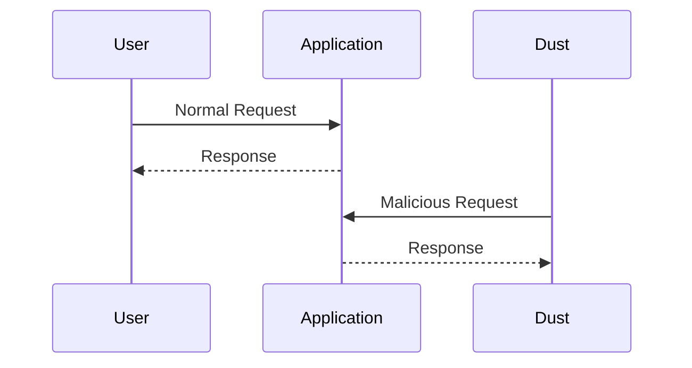

## Introduction to DevSecOps Bootcamp Curriculum

### Understanding Security Issues in Running Applications

In the realm of DevSecOps, one of the most critical aspects is identifying and addressing security issues that arise during the runtime of applications. These issues often manifest due to the dynamic nature of interactions between users, services, and external entities. Dust, a tool used in this context, simulates an attacker attempting to exploit vulnerabilities in your running systems. This simulation is crucial for understanding the real-world threats your application faces and for developing effective countermeasures.

#### What is Dust?

Dust is a tool designed to simulate attacks on running applications. It automates the process of identifying security weaknesses by mimicking the behavior of malicious actors. By using Dust, you can uncover vulnerabilities that might not be apparent through static analysis alone.

#### Why Use Dust?

The primary reason for using Dust is to ensure that your application remains secure even when it is actively being used. Traditional security testing methods often fall short in detecting runtime vulnerabilities. Dust bridges this gap by providing a dynamic testing environment that closely mirrors real-world conditions.

#### How Does Dust Work?

Dust operates by sending crafted requests to your application, similar to those an attacker might use. These requests are designed to exploit common vulnerabilities such as SQL injection, cross-site scripting (XSS), and buffer overflows. By analyzing the responses to these requests, Dust can identify potential security issues.



### Learning the Concepts of Dust

Understanding the concepts behind Dust is essential for effectively using it in your security testing process. Here are some key points to consider:

- **Dynamic Analysis**: Dust performs dynamic analysis, which means it tests the application while it is running. This approach is particularly useful for identifying vulnerabilities that are only exposed during runtime.
- **Automated Testing**: Dust automates the process of sending malicious requests, making it easier to test large applications with minimal effort.
- **Customizable Attacks**: Dust allows you to customize the types of attacks it simulates, enabling you to focus on specific areas of concern.

#### Tools Used with Dust

While Dust is a powerful tool, it is often used in conjunction with other security testing tools. Some commonly used tools include:

- **OWASP ZAP**: An open-source web application security scanner that can be integrated with Dust to perform comprehensive security testing.
- **Burp Suite**: A suite of tools for web application security testing that includes features for intercepting and manipulating HTTP traffic.

### Securing Your Application After Finding Issues

Once you have identified security issues using Dust, the next step is to secure your application. This involves fixing the vulnerabilities and implementing additional security measures to prevent future attacks.

#### Fixing Vulnerabilities

To fix vulnerabilities identified by Dust, you need to understand the root cause of each issue. Common vulnerabilities include:

- **SQL Injection**: Occurs when an attacker injects malicious SQL queries into input fields.
- **Cross-Site Scripting (XSS)**: Happens when an attacker injects malicious scripts into web pages viewed by other users.
- **Buffer Overflows**: Occur when an attacker sends more data than a buffer can handle, leading to memory corruption.

Here is an example of how to fix a SQL injection vulnerability:

```sql
-- Vulnerable Code
SELECT * FROM users WHERE username = '$username';

-- Secure Code
SELECT * FROM users WHERE username = ?;
```

In the secure code, the `?` placeholder is used to bind the user input securely, preventing SQL injection.

#### Implementing Additional Security Measures

After fixing the identified vulnerabilities, it is important to implement additional security measures to enhance the overall security posture of your application. Some common measures include:

- **Input Validation**: Ensure that all user inputs are validated to prevent malicious data from being processed.
- **Output Encoding**: Encode output data to prevent XSS attacks.
- **Secure Configuration**: Configure your application and server settings securely to minimize attack surfaces.

### Infrastructure Security and Automation

Infrastructure security is another critical aspect of DevSecOps. Ensuring that your infrastructure is secure is essential for protecting your applications and data. Automation plays a key role in achieving this goal.

#### What is Infrastructure as Code (IaC)?

Infrastructure as Code (IaC) is the practice of managing and provisioning computer data centers through machine-readable definition files, rather than physical hardware configuration or interactive configuration tools. IaC allows you to define your infrastructure in code, making it easier to manage, version control, and automate.

#### Why is IaC Important in DevSecOps?

IaC is crucial in DevSecOps for several reasons:

- **Consistency**: IaC ensures that your infrastructure is consistently deployed across different environments.
- **Reproducibility**: You can easily reproduce your infrastructure, making it easier to test and debug.
- **Automation**: IaC enables automation, reducing the risk of human error and improving efficiency.

#### Using Terraform for IaC

Terraform is a popular tool for implementing IaC. It allows you to define your infrastructure in a declarative language called HCL (HashiCorp Configuration Language). Here is an example of how to use Terraform to create a secure AWS infrastructure:

```hcl
provider "aws" {
  region = "us-west-2"
}

resource "aws_vpc" "example" {
  cidr_block = "10.0.0.0/16"

  tags = {
    Name = "example-vpc"
  }
}

resource "aws_subnet" "example" {
  vpc_id     = aws_vpc.example.id
  cidr_block = "10.0.1.0/24"

  tags = {
    Name = "example-subnet"
  }
}

resource "aws_security_group" "example" {
  name        = "example-sg"
  description = "Allow HTTP traffic"
  vpc_id      = aws_vpc.example.id

  ingress {
    from_port   = 80
    to_port     = 80
    protocol    = "tcp"
    cidr_blocks = ["0.0.0.0/0"]
  }

  egress {
    from_port   = 0
    to_port     = 0
    protocol    = "-1"
    cidr_blocks = ["0.0.0.0/0"]
  }
}
```

This Terraform configuration creates a VPC, subnet, and security group in AWS. The security group allows HTTP traffic from any IP address.

### Automating Security Checks with IaC

Automating security checks is another important aspect of DevSecOps. By integrating security checks into your IaC pipeline, you can ensure that your infrastructure remains secure throughout its lifecycle.

#### Using Trivy for Security Scanning

Trivy is a tool that can be used to scan container images for vulnerabilities. Here is an example of how to integrate Trivy into your Terraform pipeline:

```bash
# Install Trivy
curl -sfL https://raw.githubusercontent.com/aquasecurity/trivy/main/install.sh | sh -s -- -b /usr/local/bin v0.23.1

# Scan a container image
trivy image my-container-image:latest
```

By running Trivy as part of your CI/CD pipeline, you can automatically detect and address vulnerabilities in your container images.

### Deploying Secure Infrastructure

Deploying secure infrastructure involves not only creating the infrastructure but also ensuring that it is configured securely. This includes proper access management, network security, and other security measures.

#### Access Management

Access management is crucial for securing your infrastructure. This involves controlling who has access to your resources and what actions they can perform. Here is an example of how to configure access management in AWS using IAM policies:

```json
{
  "Version": "2012-10-17",
  "Statement": [
    {
      "Effect": "Allow",
      "Action": [
        "ec2:DescribeInstances",
        "ec2:StartInstances",
        "ec2:StopInstances"
      ],
      "Resource": "*"
    }
  ]
}
```

This IAM policy allows the specified actions on EC2 instances.

#### Network Security

Network security is another important aspect of securing your infrastructure. This involves configuring firewalls, security groups, and other network components to restrict access to your resources. Here is an example of how to configure a security group in AWS:

```hcl
resource "aws_security_group" "example" {
  name        = "example-sg"
  description = "Allow HTTP traffic"
  vpc_id      = aws_vpc.example.id

  ingress {
    from_port   = 80
    to_port     = 80
    protocol    = "tcp"
    cidr_blocks = ["0.0.0.0/0"]
  }

  egress {
    from_port   = 0
    to_port     = 0
    protocol    = "-1"
    cidr_blocks = ["0.0.0.0/0"]
  }
}
```

This security group allows HTTP traffic from any IP address.

### Hands-On Labs

To gain practical experience with DevSecOps, it is recommended to participate in hands-on labs. Here are some well-known labs that fit this topic's domain:

- **PortSwigger Web Security Academy**: Offers a comprehensive set of labs for learning web security.
- **OWASP Juice Shop**: A deliberately insecure web application for practicing web security skills.
- **DVWA (Damn Vulnerable Web Application)**: A PHP/MySQL web application that is riddled with vulnerabilities for educational purposes.
- **WebGoat**: An interactive, gamified training application for learning about web application security.

These labs provide a safe environment to practice and improve your DevSecOps skills.

### Conclusion

In conclusion, DevSecOps is a holistic approach to software development that integrates security practices throughout the entire lifecycle. By using tools like Dust for dynamic security testing and Terraform for infrastructure as code, you can ensure that your applications and infrastructure remain secure. Additionally, automating security checks and implementing proper access management and network security measures are crucial for maintaining a strong security posture. Participating in hands-on labs can help you gain practical experience and deepen your understanding of DevSecOps principles.

---

This expanded chapter provides a comprehensive overview of the DevSecOps bootcamp curriculum, covering the key concepts, tools, and practices involved in securing applications and infrastructure. It includes detailed explanations, real-world examples, code snippets, and diagrams to help readers fully understand and apply these principles in their own work.

---
<!-- nav -->
[[06-Introduction to DevSecOps Bootcamp Curriculum Part 3|Introduction to DevSecOps Bootcamp Curriculum Part 3]] | [[DevSecOps/DevSecOps Bootcamp/01-DevSecOps Introduction/05-Getting Started with the DevSecOps Bootcamp/DevSecOps Bootcamp Curriculum Overview/00-Overview|Overview]] | [[08-Introduction to DevSecOps Part 1|Introduction to DevSecOps Part 1]]
