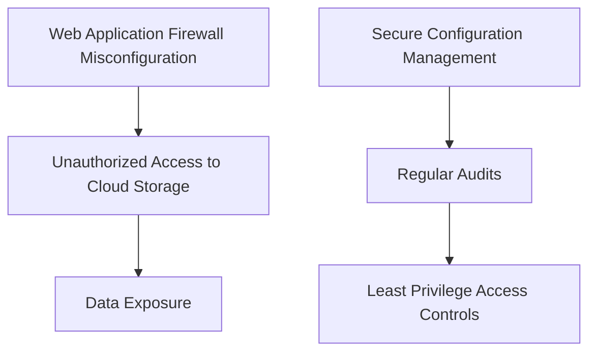
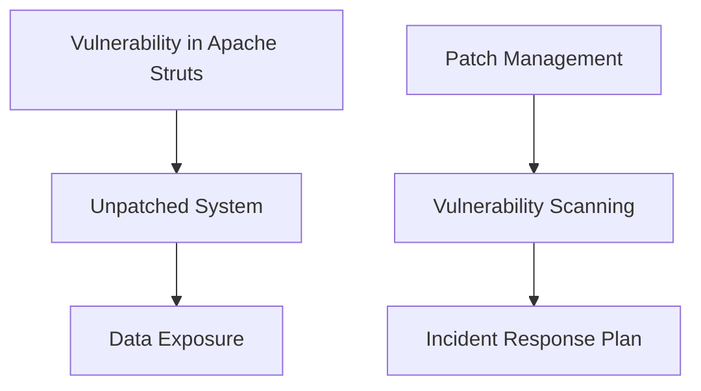

## Introduction to DevSecOps

### What is DevSecOps?

DevSecOps, short for Development, Security, and Operations, is a set of practices that integrates security throughout the entire software development lifecycle (SDLC). Traditionally, security was considered a separate phase, often added at the end of the development process. However, DevSecOps emphasizes embedding security into every stage of the development process, from planning and coding to testing and deployment.

#### Why is DevSecOps Important?

In today’s fast-paced software development environment, where continuous integration and delivery (CI/CD) pipelines are the norm, traditional security practices are often too slow and cumbersome. DevSecOps aims to address these issues by making security an integral part of the development process, ensuring that security considerations are not an afterthought but are woven into the fabric of the development workflow.

#### How Does DevSecOps Work?

DevSecOps operates on the principle of shifting left—incorporating security early in the development cycle. This approach ensures that security is not only a concern during the testing phase but is also considered during the planning, design, and coding phases. By doing so, potential vulnerabilities can be identified and addressed earlier, reducing the overall risk and cost associated with fixing security issues.

### Challenges in Adopting DevSecOps

One of the primary challenges in adopting DevSecOps is changing the mindset of developers and operations teams. Many engineers and developers may not be aware of the importance of integrating security into their workflows. They might view security as an additional burden that slows down the development process. Additionally, lack of time and resources to research and understand the importance of DevSecOps can hinder its adoption.

### Strategies for Driving DevSecOps Adoption

To drive DevSecOps adoption within an organization, it is essential to demonstrate the value of security through incremental wins. Here are some practical strategies:

#### Incremental Wins

Incremental wins involve demonstrating small, tangible benefits of incorporating security into the development process. These wins can help build momentum and convince stakeholders of the value of DevSecOps.

**Example:**
- **Incremental Win:** Implementing a static code analysis tool that identifies common security vulnerabilities such as SQL injection or cross-site scripting (XSS). This tool can be integrated into the CI/CD pipeline, providing immediate feedback to developers about potential security issues.
  
  ```mermaid
graph TD;
      A[Developer Writes Code] --> B[Code Pushed to Repository];
      B --> C[Static Code Analysis Tool Scans Code];
      C --> D[Security Issues Identified];
      D --> E[Developer Fixes Issues];
      E --> F[Code Merged into Main Branch];
```

#### Practical Steps for DevSecOps Adoption

1. **Educate the Team:**
   - Conduct regular training sessions to educate developers and operations teams about the importance of security.
   - Provide resources such as books, articles, and online courses to help team members understand DevSecOps principles.

2. **Integrate Security Tools:**
   - Integrate security tools into the CI/CD pipeline to automate security checks.
   - Use tools like SonarQube, Fortify, or Checkmarx for static code analysis.
   - Implement dynamic analysis tools like OWASP ZAP or Burp Suite for runtime security testing.

3. **Implement Security Policies:**
   - Define and enforce security policies across the organization.
   - Use Infrastructure as Code (IaC) tools like Terraform or Ansible to ensure consistent and secure infrastructure configurations.
   - Implement least privilege access controls to minimize the attack surface.

4. **Continuous Monitoring:**
   - Set up continuous monitoring to detect and respond to security incidents in real-time.
   - Use tools like Splunk, ELK Stack, or Graylog for log management and analysis.
   - Implement intrusion detection systems (IDS) and intrusion prevention systems (IPS) to identify and mitigate threats.

### Real-World Examples of DevSecOps Success

#### Example 1: Capital One Data Breach (CVE-2019-11510)

In 2019, Capital One suffered a significant data breach that exposed sensitive information of over 100 million customers. The breach occurred due to a misconfigured web application firewall (WAF) that allowed unauthorized access to the company’s cloud storage.

**How to Prevent:**
- **Secure Configuration Management:** Ensure that all security configurations are managed securely using IaC tools.
- **Regular Audits:** Conduct regular audits to verify that security configurations are correctly implemented.
- **Least Privilege Access:** Implement least privilege access controls to minimize the risk of unauthorized access.



#### Example 2: Equifax Data Breach (CVE-2017-5638)

In 2017, Equifax experienced a major data breach that exposed personal information of over 143 million consumers. The breach occurred due to a vulnerability in Apache Struts, which was not patched in a timely manner.

**How to Prevent:**
- **Patch Management:** Implement a robust patch management system to ensure that all software vulnerabilities are promptly addressed.
- **Vulnerability Scanning:** Regularly scan the environment for known vulnerabilities using tools like Nessus or OpenVAS.
- **Incident Response Plan:** Develop and maintain an incident response plan to quickly respond to security incidents.



### Hands-On Labs for DevSecOps

To gain practical experience with DevSecOps, consider participating in the following hands-on labs:

- **PortSwigger Web Security Academy:** Offers interactive labs to practice web application security techniques.
- **OWASP Juice Shop:** A deliberately insecure web application for practicing web security skills.
- **DVWA (Damn Vulnerable Web Application):** A PHP/MySQL web application that demonstrates common web application vulnerabilities.
- **WebGoat:** An interactive, gamified training application for learning about web application security.

### Conclusion

Adopting DevSecOps requires a shift in mindset and a commitment to integrating security throughout the entire software development lifecycle. By implementing practical strategies such as educating the team, integrating security tools, and continuously monitoring the environment, organizations can significantly enhance their security posture. Real-world examples and hands-on labs provide valuable insights and practical experience to help drive DevSecOps adoption effectively.

By mastering DevSecOps, you can provide immense strategic value to your organization, ensuring that security is not an afterthought but an integral part of the development process.

---
<!-- nav -->
[[07-Introduction to DevSecOps Bootcamp Curriculum|Introduction to DevSecOps Bootcamp Curriculum]] | [[DevSecOps/DevSecOps Bootcamp/01-DevSecOps Introduction/05-Getting Started with the DevSecOps Bootcamp/DevSecOps Bootcamp Curriculum Overview/00-Overview|Overview]] | [[09-Introduction to DevSecOps|Introduction to DevSecOps]]
