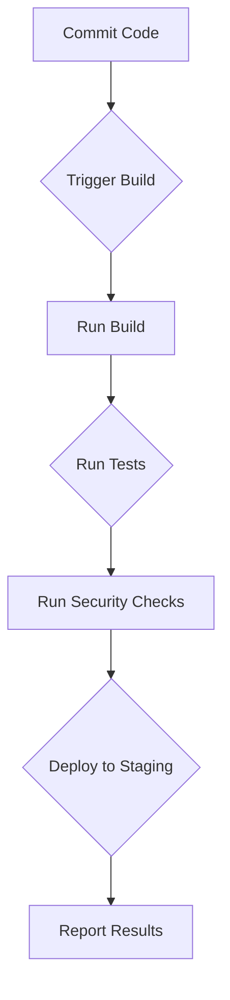

## Understanding Fundamental Concepts in DevSecOps

In the realm of DevSecOps, one of the key principles is to understand the fundamental concepts behind the tools and processes used in continuous integration and continuous delivery (CI/CD) pipelines. This understanding allows you to adapt and integrate various tools seamlessly, ensuring that your CI/CD pipeline remains flexible and robust regardless of the specific tools you choose to use.

### What Are Fundamental Concepts?

Fundamental concepts in DevSecOps encompass the core principles and practices that underpin the entire process of integrating security into the development lifecycle. These include:

- **Continuous Integration (CI)**: Automating the build and test process to ensure that code changes are integrated frequently and reliably.
- **Continuous Delivery (CD)**: Extending CI to automatically deploy code changes to production or staging environments.
- **Security Practices**: Integrating security checks and controls throughout the CI/CD pipeline to identify and mitigate vulnerabilities early.

### Why Understand Fundamental Concepts?

Understanding these fundamental concepts is crucial because it enables you to:

- **Adapt to Different Tools**: You can easily switch between different CI/CD tools like Jenkins, GitHub Actions, Bitbucket Pipelines, etc., without being tied to a specific toolset.
- **Achieve Flexibility**: You can tailor your CI/CD pipeline to meet the unique requirements of your project, ensuring that you are not constrained by the limitations of a particular tool.
- **Focus on Goals**: By seeing tools as means to an end, you can focus on achieving the actual goals of your project, such as delivering high-quality software quickly and securely.

### How to Understand Fundamental Concepts

To truly understand these fundamental concepts, you need to delve into the mechanics of CI/CD pipelines and security practices. Let’s break down each component:

#### Continuous Integration (CI)

**What is CI?**
Continuous Integration is the practice of merging all developers' working copies to a shared mainline several times a day. Each merge should trigger an automated build and test process to ensure that the codebase remains stable and functional.

**Why is CI Important?**
CI helps catch integration issues early, reducing the time and effort required to resolve conflicts. It also ensures that the codebase is always in a deployable state.

**How Does CI Work?**
CI typically involves the following steps:

1. **Commit Code**: Developers commit their changes to the version control system.
2. **Trigger Build**: The CI server detects the commit and triggers a build.
3. **Run Tests**: Automated tests are run to verify the correctness of the code.
4. **Report Results**: The results of the build and tests are reported back to the team.

**Example: Jenkins Pipeline**

```yaml
pipeline {
    agent any
    stages {
        stage('Build') {
            steps {
                sh 'make'
            }
        }
        stage('Test') {
            steps {
                sh 'make test'
            }
        }
        stage('Deploy') {
            steps {
                sh 'make deploy'
            }
        }
    }
}
```

#### Continuous Delivery (CD)

**What is CD?**
Continuous Delivery extends CI by automating the deployment of code changes to production or staging environments. This ensures that the application can be released to production at any time.

**Why is CD Important?**
CD enables rapid and reliable releases, reducing the time-to-market for new features and bug fixes. It also minimizes the risk associated with large, infrequent deployments.

**How Does CD Work?**
CD typically involves the following steps:

1. **Automate Deployment**: Automate the deployment process to ensure consistency and reliability.
2. **Environment Management**: Manage different environments (development, staging, production) to ensure that the application behaves consistently across all environments.
3. **Rollback Mechanism**: Implement a rollback mechanism to quickly revert to a previous version if issues arise.

**Example: GitHub Actions**

```yaml
name: CI/CD Pipeline

on:
  push:
    branches:
      - main

jobs:
  build:
    runs-on: ubuntu-latest
    steps:
      - name: Checkout code
        uses: actions/checkout@v2
      - name: Set up Node.js
        uses: actions/setup-node@v2
        with:
          node-version: '14.x'
      - name: Install dependencies
        run: npm install
      - name: Run tests
        run: npm test
      - name: Deploy to staging
        run: npm run deploy-staging
```

#### Security Practices

**What are Security Practices?**
Security practices in DevSecOps involve integrating security checks and controls throughout the CI/CD pipeline to identify and mitigate vulnerabilities early.

**Why are Security Practices Important?**
Security practices help ensure that the software is secure from the outset, reducing the risk of vulnerabilities being exploited in production.

**How Do Security Practices Work?**
Security practices typically involve the following steps:

1. **Static Analysis**: Perform static analysis of the code to identify potential security vulnerabilities.
2. **Dynamic Analysis**: Perform dynamic analysis during runtime to detect security issues.
3. **Dependency Scanning**: Scan dependencies for known vulnerabilities.
4. **Security Testing**: Integrate security testing into the CI/CD pipeline to ensure that security issues are caught early.

**Example: Dependency Scanning with Snyk**

```yaml
name: Dependency Scanning

on:
  push:
    branches:
      - main

jobs:
  scan:
    runs-on: ubuntu-latest
    steps:
      - name: Checkout code
        uses: actions/checkout@v2
      - name: Set up Node.js
        uses: actions/setup-node@v2
        with:
          node-version: '14.x'
      - name: Install Snyk
        run: npm install -g snyk
      - name: Scan dependencies
        run: snyk test
```

### Real-World Examples

Let’s look at some real-world examples to illustrate the importance of understanding fundamental concepts in DevSecOps.

#### Example 1: Equifax Data Breach (CVE-2017-5638)

The Equifax data breach in 2017 exposed sensitive information of millions of customers due to a vulnerability in Apache Struts. This breach could have been prevented if Equifax had implemented proper dependency scanning and security testing in their CI/CD pipeline.

**Vulnerable Code:**

```java
public class UserController {
    @RequestMapping(value = "/user/{id}", method = RequestMethod.GET)
    public String getUser(@PathVariable("id") int id, Model model) {
        User user = userService.getUserById(id);
        model.addAttribute("user", user);
        return "user";
    }
}
```

**Secure Code:**

```java
public class UserController {
    @RequestMapping(value = "/user/{id}", method = RequestMethod.GET)
    public String getUser(@PathVariable("id") int id, Model model) {
        User user = userService.getUserById(id);
        if (user == null) {
            throw new ResourceNotFoundException("User not found");
        }
        model.addAttribute("user", user);
        return "user";
    }
}
```

#### Example 2: Capital One Data Breach (CVE-2019-11510)

The Capital One data breach in 2019 exposed sensitive information of over 100 million customers due to a misconfiguration in their web application firewall. This breach could have been prevented if Capital One had implemented proper environment management and security testing in their CI/CD pipeline.

**Vulnerable Configuration:**

```json
{
  "webapp": {
    "security": {
      "enabled": false
    }
  }
}
```

**Secure Configuration:**

```json
{
  "webapp": {
    "security": {
      "enabled": true,
      "rules": [
        {
          "type": "ip",
          "action": "deny",
          "value": "192.168.1.1"
        }
      ]
    }
  }
}
```

### How to Prevent / Defend

To prevent and defend against vulnerabilities in your CI/CD pipeline, you need to implement the following measures:

#### Detection

- **Dependency Scanning**: Use tools like Snyk to scan dependencies for known vulnerabilities.
- **Static Analysis**: Use tools like SonarQube to perform static analysis of the code.
- **Dynamic Analysis**: Use tools like OWASP ZAP to perform dynamic analysis during runtime.

#### Prevention

- **Secure Coding Practices**: Follow secure coding practices to prevent common vulnerabilities.
- **Environment Management**: Manage different environments to ensure consistency and reliability.
- **Rollback Mechanism**: Implement a rollback mechanism to quickly revert to a previous version if issues arise.

#### Secure-Coding Fixes

- **Vulnerable Code**: Identify and fix vulnerabilities in the code.
- **Secure Code**: Implement secure coding practices to prevent vulnerabilities.

#### Configuration Hardening

- **Secure Configurations**: Ensure that configurations are secure and follow best practices.
- **Environment Management**: Manage different environments to ensure consistency and reliability.

### Complete Examples

Let’s look at some complete examples to illustrate how to implement these measures in your CI/CD pipeline.

#### Example 1: Jenkins Pipeline with Security Checks

```yaml
pipeline {
    agent any
    stages {
        stage('Build') {
            steps {
                sh 'make'
            }
        }
        stage('Test') {
            steps {
                sh 'make test'
            }
        }
        stage('Security Check') {
            steps {
                sh 'sonar-scanner'
            }
        }
        stage('Deploy') {
            steps {
                sh 'make deploy'
            }
        }
    }
}
```

#### Example 2: GitHub Actions with Security Checks

```yaml
name: CI/CD Pipeline

on:
  push:
    branches:
      - main

jobs:
  build:
    runs-on: ubuntu-latest
    steps:
      - name: Checkout code
        uses: actions/checkout@v2
      - name: Set up Node.js
        uses: actions/setup-node@v2
        with:
          node-version: '14.x'
      - name: Install dependencies
        run: npm install
      - name: Run tests
        run: npm test
      - name: Security check
        run: sonar-scanner
      - name: Deploy to staging
        run: npm run deploy-staging
```

### Mermaid Diagrams

Let’s use mermaid diagrams to illustrate the flow of a CI/CD pipeline with security checks.

#### CI/CD Pipeline with Security Checks



### Common Pitfalls

Here are some common pitfalls to avoid when implementing a CI/CD pipeline with security checks:

- **Ignoring Security Checks**: Failing to integrate security checks into the CI/CD pipeline can lead to vulnerabilities being exploited in production.
- **Manual Processes**: Relying on manual processes for security checks can lead to inconsistencies and errors.
- **Inconsistent Environments**: Failing to manage different environments consistently can lead to issues in production.

### Hands-On Labs

To gain practical experience with implementing a CI/CD pipeline with security checks, you can use the following hands-on labs:

- **PortSwigger Web Security Academy**: Learn about web application security and how to integrate security checks into your CI/CD pipeline.
- **OWASP Juice Shop**: Practice securing a web application and integrating security checks into your CI/CD pipeline.
- **DVWA**: Practice securing a vulnerable web application and integrating security checks into your CI/CD pipeline.
- **WebGoat**: Practice securing a web application and integrating security checks into your CI/CD pipeline.

By understanding the fundamental concepts behind CI/CD pipelines and security practices, you can adapt and integrate various tools seamlessly, ensuring that your CI/CD pipeline remains flexible and robust regardless of the specific tools you choose to use.

---
<!-- nav -->
[[11-Security Essentials for DevSecOps|Security Essentials for DevSecOps]] | [[DevSecOps/DevSecOps Bootcamp/01-DevSecOps Introduction/05-Getting Started with the DevSecOps Bootcamp/DevSecOps Bootcamp Curriculum Overview/00-Overview|Overview]] | [[13-Access Management in Kubernetes and AWS IAM Integration|Access Management in Kubernetes and AWS IAM Integration]]
