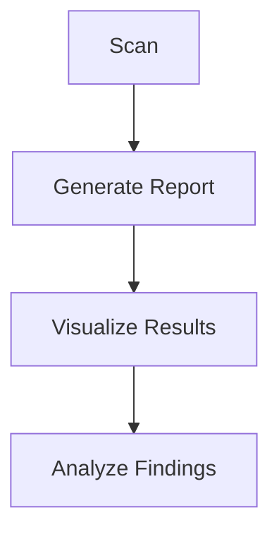
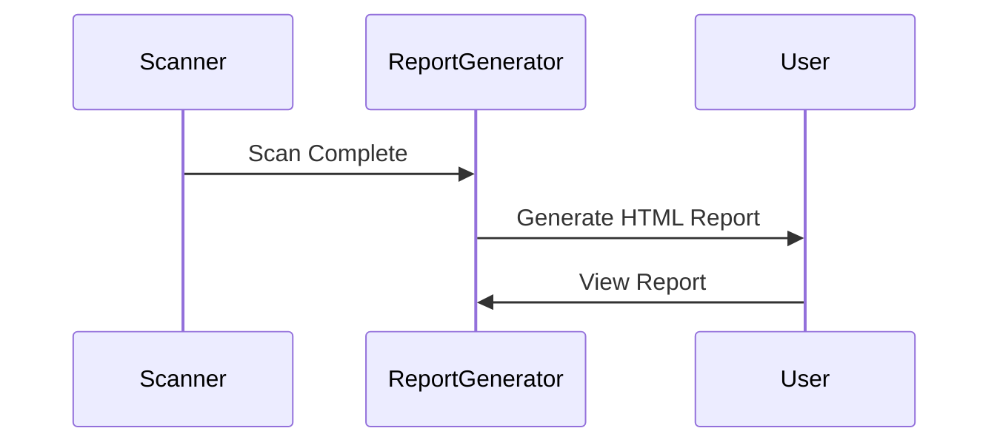
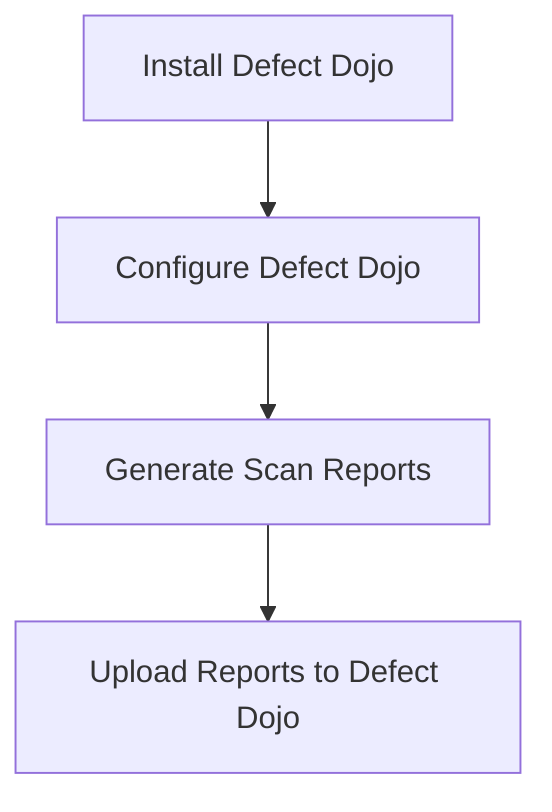

## Automated Security Scanning and Reporting

### Introduction to Automated Security Scanning

Automated security scanning is a critical component of modern DevSecOps practices. It involves using tools and scripts to automatically check codebases, configurations, and environments for potential security vulnerabilities. This process helps identify issues early in the development lifecycle, reducing the likelihood of security breaches and ensuring that applications are more secure.

### Visualization of Scan Results

One of the key aspects of automated security scanning is the visualization of scan results. Visualizing these results makes it easier to understand the severity and scope of identified vulnerabilities. Tools like SonarQube, Fortify, and Checkmarx provide detailed visual reports that can be easily interpreted by both developers and security teams.

#### Example: SonarQube Report



### Generating Reports

Generating reports from automated security scans is essential for tracking and managing vulnerabilities. These reports can be generated in various formats such as HTML, PDF, or JSON. They typically include details such as the type of vulnerability, its severity, the affected files, and recommendations for remediation.

#### Example: HTML Report Generation



### Using Defect Dojo for Vulnerability Management

Defect Dojo is an open-source vulnerability management platform that helps organizations manage their security vulnerabilities effectively. It allows users to upload scan results, track remediation efforts, and maintain a comprehensive view of their security posture.

#### Uploading Reports to Defect Dojo

To upload reports to Defect Dojo, you need to follow these steps:

1. **Install and Configure Defect Dojo**: Set up Defect Dojo on your server or use a hosted instance.
2. **Generate Scan Reports**: Use your preferred security scanner to generate reports.
3. **Upload Reports**: Use the Defect Dojo interface to upload the generated reports.



#### Example: Uploading a Report

```bash
# Example command to upload a report to Defect Dojo
curl -X POST -F "file=@path/to/report.json" -F "engagement=1" -F "test_type=1" http://defectdojo.example.com/api/v2/import-scan/
```

### False Positive Analysis

False positives are a significant challenge in automated security scanning. They occur when the scanning tool incorrectly identifies a non-vulnerable piece of code as a security issue. False positives can lead to wasted time and resources, as developers may spend unnecessary effort fixing non-existent issues.

#### Importance of False Positive Analysis

False positive analysis is crucial because it helps in refining the scanning process and improving the accuracy of the tool. By identifying and addressing false positives, you can ensure that the scanning tool provides more reliable results.

#### Configuring Tools to Minimize False Positives

To minimize false positives, you can configure the scanning tool to exclude certain types of code or to apply specific rules. This can be done through configuration files or user interfaces provided by the tool.

#### Example: Configuring SonarQube to Exclude False Positives

```yaml
# sonar-project.properties
sonar.exclusions=**/generated/**/*
sonar.issue.ignore.multicriteria=e1,e2
sonar.issue.ignore.multicriteria.e1.ruleKey=S1118
sonar.issue.ignore.multicriteria.e1.resourceKey=src/main/java/com/example/MyClass.java
sonar.issue.ignore.multicriteria.e2.ruleKey=S1119
sonar.issue.ignore.multicriteria.e2.resourceKey=src/main/java/com/example/AnotherClass.java
```

### Automating the Process with Python

Python is a popular language for automating tasks due to its simplicity and extensive libraries. In the context of DevSecOps, Python can be used to automate the generation of reports and the uploading of these reports to vulnerability management tools like Defect Dojo.

#### Example: Python Script for Automating Report Generation and Upload

```python
import os
import subprocess
import requests

# Step 1: Run the security scanner
subprocess.run(["scanner", "--output", "report.json"])

# Step 2: Upload the report to Defect Dojo
url = "http://defectdojo.example.com/api/v2/import-scan/"
files = {'file': ('report.json', open('report.json', 'rb'))}
data = {
    'engagement': '1',
    'test_type': '1'
}
response = requests.post(url, files=files, data=data)

print(response.text)
```

### Fixing Security Issues in Example Applications

Fixing security issues in example applications is a practical way to understand how vulnerabilities are addressed in real-world scenarios. Common issues include SQL injection, third-party library vulnerabilities, and other security weaknesses.

#### Example: Fixing SQL Injection

SQL injection occurs when an attacker manipulates input to execute arbitrary SQL commands. To fix this, you should use parameterized queries or prepared statements.

##### Vulnerable Code

```sql
# Vulnerable code
query = f"SELECT * FROM users WHERE username = '{username}'"
cursor.execute(query)
```

##### Secure Code

```sql
# Secure code
query = "SELECT * FROM users WHERE username = %s"
cursor.execute(query, (username,))
```

#### Example: Fixing Third-Party Library Vulnerabilities

Third-party library vulnerabilities can be mitigated by keeping dependencies up-to-date and using tools like `npm audit` or `pip-audit` to identify and fix vulnerabilities.

##### Vulnerable Code

```json
{
  "dependencies": {
    "vulnerable-library": "^1.0.0"
  }
}
```

##### Secure Code

```json
{
  "dependencies": {
    "vulnerable-library": "^2.0.0"
  }
}
```

### How to Prevent / Defend

#### Detection

Detection of security vulnerabilities can be achieved through continuous monitoring and regular security assessments. Tools like static application security testing (SAST) and dynamic application security testing (DAST) can help identify vulnerabilities.

#### Prevention

Prevention involves implementing secure coding practices, conducting regular security training, and using automated tools to enforce security policies. Regularly updating dependencies and applying security patches is also crucial.

#### Secure Coding Fixes

Secure coding fixes involve rewriting vulnerable code to eliminate security weaknesses. This can be done by following best practices and using secure coding guidelines.

#### Configuration Hardening

Configuration hardening involves securing the environment and tools used in the development process. This includes configuring security settings in tools like Defect Dojo and ensuring that development environments are secure.

### Real-World Examples

#### Recent CVEs and Breaches

Recent CVEs and breaches highlight the importance of automated security scanning and reporting. For example, the Log4j vulnerability (CVE-2021-44228) demonstrated the need for continuous monitoring and patch management.

#### Example: Log4j Vulnerability

The Log4j vulnerability was a critical security flaw that allowed attackers to execute arbitrary code on affected systems. Organizations that had implemented automated security scanning and reporting were able to quickly identify and mitigate the vulnerability.

### Practice Labs

For hands-on practice, consider the following labs:

- **PortSwigger Web Security Academy**: Offers interactive labs for learning web security concepts.
- **OWASP Juice Shop**: A deliberately insecure web application for practicing web security skills.
- **DVWA (Damn Vulnerable Web Application)**: A PHP/MySQL web application that is riddled with vulnerabilities for educational purposes.
- **WebGoat**: An interactive lab for learning about web application security.

By following these steps and using the provided tools and techniques, you can effectively implement automated security scanning and reporting in your DevSecOps workflow.

---
<!-- nav -->
[[13-Access Management in Kubernetes and AWS IAM Integration|Access Management in Kubernetes and AWS IAM Integration]] | [[DevSecOps/DevSecOps Bootcamp/01-DevSecOps Introduction/05-Getting Started with the DevSecOps Bootcamp/DevSecOps Bootcamp Curriculum Overview/00-Overview|Overview]] | [[15-Compliance as Code|Compliance as Code]]
