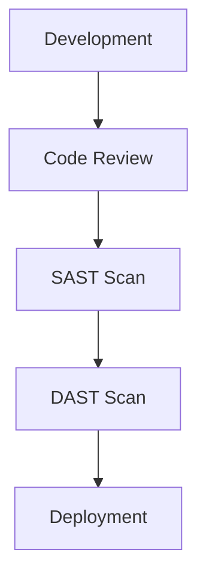

## Understanding DevSecOps as an Engineering Role

### Introduction to DevSecOps

DevSecOps is a methodology that integrates security practices into the entire DevOps lifecycle. This approach ensures that security is not an afterthought but is embedded throughout the development, testing, and deployment processes. The goal is to create a culture where everyone is responsible for security, rather than leaving it solely to the security team.

### Clear Division of Responsibilities

One of the most critical aspects of implementing DevSecOps is establishing clear divisions of responsibilities among different engineering roles. This clarity helps ensure that security is addressed at every stage of the software development lifecycle (SDLC).

#### Roles and Responsibilities

- **Developers**: Responsible for writing secure code, conducting code reviews, and ensuring that security best practices are followed during development.
- **Operations Engineers**: Focus on securing the infrastructure, including servers, networks, and cloud environments. They manage security configurations, monitor systems for vulnerabilities, and respond to incidents.
- **Security Engineers**: Specialize in identifying and mitigating security risks. They work closely with developers and operations teams to ensure that security controls are in place and effective.

### Real-World Implementation vs. Theory

The distinction between theoretical knowledge and practical implementation is crucial. While understanding the principles of DevSecOps is essential, applying these principles in real-world scenarios requires a deep dive into specific tools, techniques, and best practices.

#### Example: Real-World Implementation

Consider a scenario where a company is transitioning to a DevSecOps model. Initially, they might focus on integrating security scans into their continuous integration/continuous deployment (CI/CD) pipeline. This involves setting up automated tools like static application security testing (SAST) and dynamic application security testing (DAST) to identify vulnerabilities early in the development process.



### Importance of Early Knowledge

Even with just the foundational knowledge provided in the initial chapters of a DevSecOps bootcamp, participants can gain a significant advantage over many engineers who lack formal security training. This early exposure to key concepts and practices can make a substantial difference in how effectively security is integrated into the development process.

### Depth of Coverage

To ensure comprehensive coverage, the curriculum should delve into the essential topics with the right level of detail. This includes:

- **Application Security**: Techniques for securing applications, such as input validation, authentication, and authorization.
- **Infrastructure and Cloud Security**: Best practices for securing cloud environments, including identity and access management (IAM), network security, and compliance.
- **Platform Security for Kubernetes**: Specific security considerations for container orchestration platforms like Kubernetes.

### Hands-On Practice

Hands-on practice is crucial for reinforcing theoretical knowledge and developing practical skills. The bootcamp should provide ample opportunities for participants to apply what they have learned through various projects and exercises.

### Demo Projects

The demo projects in the bootcamp are divided into three main categories:

1. **Application Security**
2. **Infrastructure and Cloud Security**
3. **Platform Security for Kubernetes**

Each category is a vast topic in itself, requiring extensive exploration and practical application.

### Application Security

#### Background Theory

Application security focuses on protecting applications from various types of attacks, such as SQL injection, cross-site scripting (XSS), and cross-site request forgery (CSRF). These vulnerabilities can lead to data breaches, unauthorized access, and other security issues.

#### Recent Real-World Examples

- **CVE-2021-44228 (Log4Shell)**: This vulnerability in the Apache Log4j library allowed attackers to execute arbitrary code on affected systems. It highlights the importance of keeping dependencies up-to-date and conducting regular security audits.
- **SolarWinds Supply Chain Attack**: This attack involved the compromise of SolarWinds Orion software, leading to widespread breaches across multiple organizations. It underscores the need for supply chain security and the importance of verifying the integrity of third-party components.

#### Complete Code Example

Let's consider a simple example of securing an application against SQL injection. Suppose we have a login form that takes a username and password.

**Vulnerable Code:**

```python
import sqlite3

def authenticate(username, password):
    conn = sqlite3.connect('database.db')
    cursor = conn.cursor()
    query = f"SELECT * FROM users WHERE username='{username}' AND password='{password}'"
    cursor.execute(query)
    result = cursor.fetchone()
    conn.close()
    return result is not None
```

**Secure Code:**

```python
import sqlite3

def authenticate(username, password):
    conn = sqlite3.connect('database.db')
    cursor = conn.cursor()
    query = "SELECT * FROM users WHERE username=? AND password=?"
    cursor.execute(query, (username, password))
    result = cursor.fetchone()
    conn.close()
    return result is not None
```

#### How to Prevent / Defend

- **Use Parameterized Queries**: Instead of concatenating user inputs into SQL queries, use parameterized queries to prevent SQL injection.
- **Input Validation**: Validate user inputs to ensure they meet expected formats and constraints.
- **Error Handling**: Avoid exposing detailed error messages that could reveal sensitive information about the system.

### Infrastructure and Cloud Security

#### Background Theory

Infrastructure and cloud security involve securing the underlying hardware, software, and network components that support applications. This includes managing access controls, monitoring for suspicious activity, and ensuring compliance with regulatory requirements.

#### Recent Real-World Examples

- **AWS S3 Bucket Exposure**: In 2019, several high-profile incidents occurred where misconfigured S3 buckets led to the exposure of sensitive data. This highlights the importance of proper access control and regular audits.
- **Capital One Data Breach**: In 2019, a misconfigured firewall rule allowed an attacker to access sensitive customer data stored in an S3 bucket. This incident underscores the need for robust security measures and regular security assessments.

#### Complete Code Example

Let's consider an example of configuring an S3 bucket with proper access controls using AWS CLI.

**Vulnerable Configuration:**

```bash
aws s3api put-bucket-acl --bucket my-bucket --acl public-read
```

**Secure Configuration:**

```bash
aws s3api put-bucket-acl --bucket my-bucket --grant-read uri=http://acs.amazonaws.com/groups/global/AllUsers --grant-write uri=http://acs.amazonaws.com/groups/global/AllUsers
aws s3api put-bucket-policy --bucket my-bucket --policy '{"Version":"2012-10-17","Statement":[{"Sid":"PublicRead","Effect":"Allow","Principal":"*","Action":["s3:GetObject"],"Resource":["arn:aws:s3:::my-bucket/*"]}]}'
```

#### How to Prevent / Defend

- **Use IAM Policies**: Implement least privilege access control using IAM policies to restrict access to resources.
- **Regular Audits**: Conduct regular security audits to identify and mitigate potential vulnerabilities.
- **Monitoring and Logging**: Enable monitoring and logging to detect and respond to suspicious activities promptly.

### Platform Security for Kubernetes

#### Background Theory

Kubernetes is a popular container orchestration platform used to manage and scale containerized applications. Securing Kubernetes involves protecting the cluster, nodes, and pods from various threats, such as unauthorized access, malicious containers, and configuration errors.

#### Recent Real-World Examples

- **Kubernetes API Server Vulnerability**: In 2020, a vulnerability in the Kubernetes API server allowed attackers to bypass authentication and gain unauthorized access to the cluster. This highlights the importance of keeping Kubernetes components up-to-date and applying security patches.
- **Container Escape**: In 2019, a vulnerability in the Docker daemon allowed attackers to escape from a container and gain root access to the host system. This underscores the need for proper container isolation and security configurations.

#### Complete Code Example

Let's consider an example of securing a Kubernetes cluster by enabling RBAC (Role-Based Access Control).

**Vulnerable Configuration:**

```yaml
apiVersion: v1
kind: Pod
metadata:
  name: my-pod
spec:
  containers:
  - name: my-container
    image: my-image
```

**Secure Configuration:**

```yaml
apiVersion: rbac.authorization.k8s.io/v1
kind: ClusterRole
metadata:
  name: my-cluster-role
rules:
- apiGroups: ["*"]
  resources: ["pods"]
  verbs: ["get", "list", "watch"]
---
apiVersion: rbac.authorization.k8s.io/v1
kind: ClusterRoleBinding
metadata:
  name: my-cluster-role-binding
subjects:
- kind: ServiceAccount
  name: my-service-account
  namespace: default
roleRef:
  kind: ClusterRole
  name: my-cluster-role
  apiGroup: rbac.authorization.k8s.io
---
apiVersion: v1
kind: Pod
metadata:
  name: my-pod
  labels:
    app: my-app
spec:
  serviceAccountName: my-service-account
  containers:
  - name: my-container
    image: my-image
```

#### How to Prevent / Defend

- **Enable RBAC**: Use RBAC to enforce least privilege access control within the Kubernetes cluster.
- **Pod Security Policies**: Implement pod security policies to restrict the capabilities and permissions of pods.
- **Network Policies**: Use network policies to control traffic flow within the cluster and isolate sensitive components.

### Hands-On Practice Labs

To reinforce the theoretical knowledge and practical skills, participants should engage in hands-on practice through well-known labs:

- **PortSwigger Web Security Academy**: Provides interactive labs for web application security.
- **OWASP Juice Shop**: An intentionally insecure web application for practicing web security.
- **DVWA (Damn Vulnerable Web Application)**: Another web application for learning web security.
- **WebGoat**: An interactive web application for learning about web security vulnerabilities.
- **CloudGoat**: A cloud security training platform for AWS.
- **flaws.cloud**: A cloud security training platform for various cloud providers.
- **Pacu**: A cloud security training platform for AWS.
- **Kubernetes Goat**: A security training platform for Kubernetes.
- **OWASP WrongSecrets**: A series of challenges for learning about secrets management.
- **kube-hunter**: A tool for hunting down security misconfigurations in Kubernetes clusters.

By engaging in these hands-on labs, participants can apply the concepts learned in the bootcamp and gain practical experience in securing applications, infrastructure, and platforms.

### Conclusion

Understanding DevSecOps as an engineering role and establishing clear divisions of responsibilities is crucial for effective security integration. By covering essential topics in depth and providing hands-on practice, participants can gain a significant advantage in securing applications, infrastructure, and platforms. Through real-world examples, complete code, and practical labs, the bootcamp aims to equip participants with the knowledge and skills needed to implement DevSecOps successfully.

---
<!-- nav -->
[[15-Compliance as Code|Compliance as Code]] | [[DevSecOps/DevSecOps Bootcamp/01-DevSecOps Introduction/05-Getting Started with the DevSecOps Bootcamp/DevSecOps Bootcamp Curriculum Overview/00-Overview|Overview]] | [[17-Understanding Tasks and Responsibilities in a DevOps Process|Understanding Tasks and Responsibilities in a DevOps Process]]
