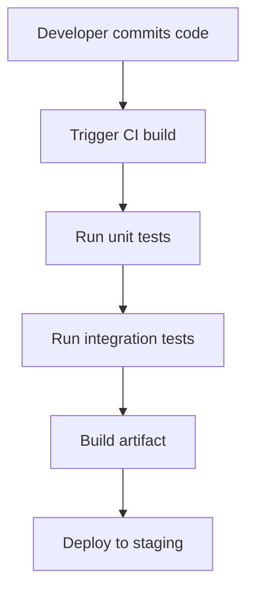

## Understanding Tasks and Responsibilities in a DevOps Process

### Background Theory

DevOps is a set of practices that emphasizes collaboration between development and operations teams to improve the speed and quality of software releases. In a DevOps environment, developers and operations engineers work closely together to automate the software delivery and infrastructure changes. This collaboration leads to faster deployment cycles, improved reliability, and better alignment with business objectives.

### Key Responsibilities

- **Development Team**: Focuses on writing high-quality, secure code and ensuring that it integrates seamlessly with existing systems.
- **Operations Team**: Ensures that the infrastructure is reliable, scalable, and secure. They manage the deployment processes and monitor system performance.
- **Security Team**: Integrates security practices throughout the development lifecycle to ensure that the final product is secure against potential threats.

### Real-World Application

In a real-world scenario, consider a company like Uber, which uses DevOps principles to deploy new features and updates to their mobile app multiple times a day. The development team writes the code, the operations team ensures that the deployment process is smooth and secure, and the security team continuously monitors the application for vulnerabilities.

### CI Pipeline

Continuous Integration (CI) is a practice where developers frequently merge their code changes into a central repository, after which automated builds and tests are run. This helps catch integration issues early and reduces the time and effort required to resolve them.

#### Example of a CI Pipeline



### Transition to CICD

Continuous Deployment (CD) extends CI by automatically deploying code changes to production after passing through the CI pipeline. This ensures that the latest code is always deployed to production, reducing the time to market and improving customer satisfaction.

#### Security Concerns in CD

Adding a deployment part to the CI pipeline introduces several security concerns:

- **Configuration Drift**: Over time, configurations can drift from the intended state, leading to security vulnerabilities.
- **Privilege Escalation**: Automated deployments may have elevated privileges, making them a target for attackers.
- **Supply Chain Attacks**: Malicious actors can compromise dependencies used during the build process.

### Building an Insecure Continuous Deployment Pipeline

To understand the importance of DevSecOps, we will first build an insecure continuous deployment pipeline to AWS using bad security practices. This will serve as a baseline to compare against a secure pipeline.

#### Example of an Insecure Pipeline

```yaml
# .github/workflows/ci.yml
name: CI/CD Pipeline

on:
  push:
    branches:
      - main

jobs:
  build:
    runs-on: ubuntu-latest
    steps:
      - name: Checkout code
        uses: actions/checkout@v2
      - name: Build Docker image
        run: docker build -t myapp .
      - name: Push Docker image
        run: docker push myapp
```

### Securing the Pipeline Step-by-Step

We will now secure the pipeline step-by-step and compare the before and after implementations.

#### Image Scanning

Image scanning is crucial because Docker has become the standard for deploying applications as containers. Containers are runtimes for applications, and securing the runtime environment is as important as securing the application code itself.

##### Example of Image Scanning

```yaml
# .github/workflows/ci.yml
name: CI/CD Pipeline

on:
  push:
    branches:
      - main

jobs:
  build:
    runs-on: ubuntu-latest
    steps:
      - name: Checkout code
        uses: actions/checkout@v2
      - name: Build Docker image
        run: docker build -t myapp .
      - name: Scan Docker image
        run: trivy image myapp
      - name: Push Docker image
        run: docker push myapp
```

### Container Scanning Tools

Several tools are available for container scanning, including Trivy, Clair, and Aqua Security. These tools help identify vulnerabilities in the container images and provide recommendations for fixing them.

#### Example Using Trivy

```sh
trivy image myapp
```

### Configuring Automated Scans on Docker Repository

Automated scans can be configured on Docker repositories such as AWS Elastic Container Registry (ECR).

#### Example of Configuring Automated Scans on ECR

```yaml
# .github/workflows/ci.yml
name: CI/CD Pipeline

on:
  push:
    branches:
      - main

jobs:
  build:
    runs-on: ubuntu-latest
    steps:
      - name: Checkout code
        uses: actions/checkout@v2
      - name: Build Docker image
        run: docker build -t myapp .
      - name: Scan Docker image
        run: trivy image myapp
      - name: Push Docker image
        run: docker push myapp
      - name: Configure ECR scan
        run: aws ecr put-image-scanning-configuration --repository-name myapp --image-scanning-configuration scanOnPush=true
```

### Fixing Security Issues Found in Docker Images

Once vulnerabilities are identified, they need to be fixed. This involves updating dependencies, applying patches, and ensuring that the image is built securely.

#### Example of Fixing Security Issues

```diff
# Dockerfile
FROM python:3.9-slim

RUN apt-get update && apt-get install -y \
    curl \
    wget

+ RUN pip install --upgrade pip
+ RUN pip install --no-cache-dir <dependency>

COPY . /app
WORKDIR /app

CMD ["python", "app.py"]
```

### How to Prevent / Defend

#### Detection

- **Regular Scans**: Use tools like Trivy to regularly scan Docker images for vulnerabilities.
- **Monitoring**: Monitor the deployment pipeline for any unusual activity or failed builds.

#### Prevention

- **Secure Builds**: Ensure that the build process is secure by using trusted base images and avoiding unnecessary dependencies.
- **Least Privilege**: Run the deployment process with the least privilege necessary to reduce the attack surface.

#### Secure Coding Fixes

Compare the vulnerable and secure versions of the Dockerfile:

**Vulnerable Version**

```dockerfile
FROM python:3.9-slim

RUN apt-get update && apt-get install -y \
    curl \
    wget

COPY . /app
WORKDIR /app

CMD ["python", "app.py"]
```

**Secure Version**

```dockerfile
FROM python:3.9-slim

RUN apt-get update && apt-get install -y \
    curl \
    wget

RUN pip install --upgrade pip
RUN pip install --no-cache-dir <dependency>

COPY . /app
WORKDIR /app

CMD ["python", "app.py"]
```

### Conclusion

By following these steps and using the appropriate tools and techniques, you can ensure that your continuous deployment pipeline is secure and reliable. This not only improves the security of your applications but also enhances the overall efficiency and effectiveness of your DevOps process.

### Practice Labs

For hands-on experience with DevSecOps, consider the following labs:

- **PortSwigger Web Security Academy**: Offers comprehensive training on web security.
- **OWASP Juice Shop**: A deliberately insecure web application for practicing security skills.
- **DVWA (Damn Vulnerable Web Application)**: Another popular web application for learning web security.
- **WebGoat**: An interactive web application that teaches web application security lessons.

These labs provide practical experience in identifying and fixing security vulnerabilities in real-world scenarios.

---
<!-- nav -->
[[16-Understanding DevSecOps as an Engineering Role|Understanding DevSecOps as an Engineering Role]] | [[DevSecOps/DevSecOps Bootcamp/01-DevSecOps Introduction/05-Getting Started with the DevSecOps Bootcamp/DevSecOps Bootcamp Curriculum Overview/00-Overview|Overview]] | [[DevSecOps/DevSecOps Bootcamp/01-DevSecOps Introduction/05-Getting Started with the DevSecOps Bootcamp/DevSecOps Bootcamp Curriculum Overview/18-Practice Questions & Answers|Practice Questions & Answers]]
