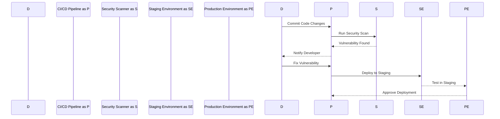
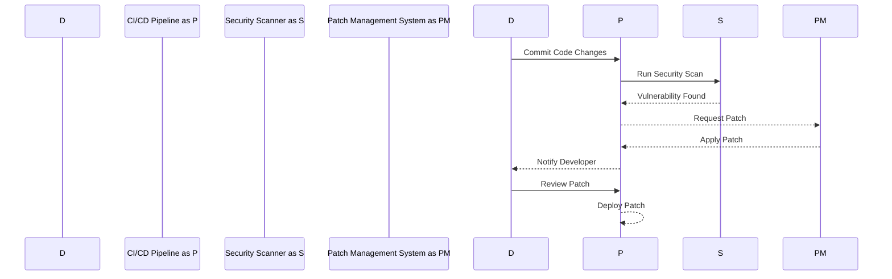
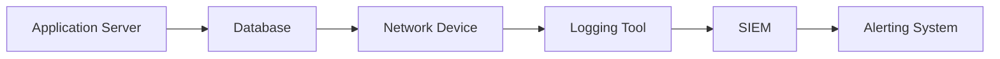

## Introduction to DevSecOps

### What is DevSecOps?

DevSecOps is an approach to software development that integrates security practices throughout the entire software development lifecycle (SDLC). Traditionally, security was often treated as an afterthought, added late in the development process. However, with DevSecOps, security is embedded into every stage of the development pipeline, from planning and coding to testing and deployment. This ensures that security is not just a concern at the end but is continuously monitored and improved upon.

### Why is DevSecOps Important?

The primary goal of DevSecOps is to reduce the cost and time associated with fixing security vulnerabilities. By integrating security early and often, teams can identify and address issues before they become major problems. This proactive approach helps in avoiding the expensive deferral of security, vulnerability, and remediation costs.

#### Business Case for DevSecOps

One of the most compelling reasons to adopt DevSecOps is the significant reduction in security-related expenses. According to a report by the Ponemon Institute, the average cost of a data breach in 2021 was $4.24 million. These costs can be attributed to various factors such as lost business, legal fees, and regulatory fines. By implementing DevSecOps, organizations can mitigate these risks and save substantial amounts of money.

### How Does DevSecOps Work?

To understand how DevSecOps works, let’s break down the key components:

1. **Continuous Integration (CI)**: This involves automatically building and testing code changes as they are committed to the repository. This ensures that any new code is thoroughly tested before being merged into the main branch.
   
2. **Continuous Delivery (CD)**: This extends CI by automatically deploying the tested code to a staging environment. This allows developers to see how their changes will perform in a production-like setting.
   
3. **Security Scanning**: Integrating security scanning tools into the CI/CD pipeline enables automatic detection of vulnerabilities and compliance issues. Tools like SonarQube, OWASP ZAP, and Burp Suite can be used for static and dynamic analysis.

4. **Automated Testing**: Implementing automated security tests ensures that security is not overlooked during the development process. This includes unit tests, integration tests, and penetration testing.

5. **Monitoring and Logging**: Continuous monitoring of applications and infrastructure helps in detecting and responding to security incidents in real-time. Tools like Splunk, ELK Stack, and Prometheus can be used for logging and monitoring.

### Real-World Examples

Let’s look at some recent real-world examples where DevSecOps could have prevented costly breaches:

#### Example 1: Capital One Data Breach (CVE-2019-11510)

In 2019, Capital One suffered a massive data breach affecting over 100 million customers. The breach occurred due to a misconfigured firewall rule, which allowed unauthorized access to sensitive customer data. If DevSecOps principles had been implemented, regular security scans and automated testing would have identified the misconfiguration early, preventing the breach.



#### Example 2: Equifax Data Breach (CVE-2017-5638)

In 2017, Equifax experienced a significant data breach that exposed personal information of over 143 million consumers. The breach was caused by a vulnerability in Apache Struts, which was not patched in a timely manner. If Equifax had adopted DevSecOps, continuous monitoring and automated patch management would have ensured that critical vulnerabilities were addressed promptly.



### Common Pitfalls and How to Avoid Them

While DevSecOps offers numerous benefits, there are several common pitfalls that organizations should be aware of:

1. **Resistance to Change**: Developers may resist adopting new security practices if they perceive them as slowing down the development process. To overcome this, it’s essential to educate the team about the long-term benefits of DevSecOps and involve them in the decision-making process.

2. **Tool Overload**: With numerous security tools available, it can be challenging to choose the right ones. Organizations should evaluate their specific needs and select tools that integrate seamlessly with their existing CI/CD pipeline.

3. **False Positives**: Automated security scans can generate false positives, leading to unnecessary work for developers. To minimize this, organizations should configure their security tools to focus on high-risk areas and regularly review and refine their settings.

### How to Prevent / Defend

#### Detection

Implementing continuous monitoring and logging is crucial for detecting security incidents in real-time. Tools like Splunk and ELK Stack can be used to collect and analyze logs from various sources, including application servers, databases, and network devices.



#### Prevention

To prevent security vulnerabilities, organizations should implement the following practices:

1. **Code Reviews**: Regular code reviews help identify potential security issues before they are deployed. Tools like GitHub and GitLab provide built-in code review features.

2. **Automated Testing**: Implementing automated security tests ensures that security is not overlooked during the development process. Tools like OWASP ZAP and Burp Suite can be used for static and dynamic analysis.

3. **Patch Management**: Regularly updating and patching systems helps ensure that known vulnerabilities are addressed promptly. Tools like Ansible and Puppet can be used for automated patch management.

#### Secure Coding Fixes

Here’s an example of a vulnerable code snippet and its secure counterpart:

**Vulnerable Code:**
```python
import sqlite3

def get_user_data(user_id):
    conn = sqlite3.connect('database.db')
    cursor = conn.cursor()
    query = f"SELECT * FROM users WHERE id = {user_id}"
    cursor.execute(query)
    result = cursor.fetchone()
    conn.close()
    return result
```

**Secure Code:**
```python
import sqlite3

def get_user_data(user_id):
    conn = sqlite3.connect('database.db')
    cursor = conn.cursor()
    query = "SELECT * FROM users WHERE id = ?"
    cursor.execute(query, (user_id,))
    result = cursor.fetchone()
    conn.close()
    return result
```

In the secure version, parameterized queries are used to prevent SQL injection attacks.

### Complete Example: Full HTTP Request and Response

Let’s consider a scenario where a web application is vulnerable to Cross-Site Scripting (XSS). Here’s a complete example of the HTTP request and response:

**HTTP Request:**
```http
POST /search HTTP/1.1
Host: example.com
Content-Type: application/x-www-form-urlencoded
Content-Length: 19

query=<script>alert(1)</script>
```

**HTTP Response:**
```http
HTTP/1.1 200 OK
Date: Mon, 23 Jan 2023 12:00:00 GMT
Server: Apache/2.4.41 (Ubuntu)
Content-Type: text/html; charset=UTF-8
Content-Length: 123

<!DOCTYPE html>
<html>
<head>
    <title>Search Results</title>
</head>
<body>
    <h1>Search Results</h1>
    <div><script>alert(1)</script></div>
</body>
</html>
```

In this example, the server reflects the user input without proper sanitization, leading to an XSS attack. To prevent this, the server should sanitize the input before reflecting it back to the client.

### Hands-On Labs

To gain practical experience with DevSecOps, consider the following labs:

- **PortSwigger Web Security Academy**: Offers interactive labs to learn about various web security concepts, including SQL injection, XSS, and CSRF.
- **OWASP Juice Shop**: A deliberately insecure web application designed to teach web security concepts.
- **DVWA (Damn Vulnerable Web Application)**: Another intentionally vulnerable web application for learning web security.
- **WebGoat**: An interactive training application designed to teach web security concepts.

These labs provide a safe environment to practice and reinforce the concepts learned in this chapter.

### Conclusion

Adopting DevSecOps is not just about implementing new tools and processes; it’s about fundamentally changing the way security is perceived and integrated into the software development lifecycle. By doing so, organizations can significantly reduce the cost and time associated with fixing security vulnerabilities, ultimately leading to more secure and reliable software products.

---
<!-- nav -->
[[01-Introduction to DevSecOps and Its Benefits|Introduction to DevSecOps and Its Benefits]] | [[DevSecOps/DevSecOps Bootcamp/01-DevSecOps Introduction/06-Identifying the Benefits of DevSecOps/03-Quantifying Benefits An Example/00-Overview|Overview]] | [[03-Quantifying the Benefits of DevSecOps|Quantifying the Benefits of DevSecOps]]
