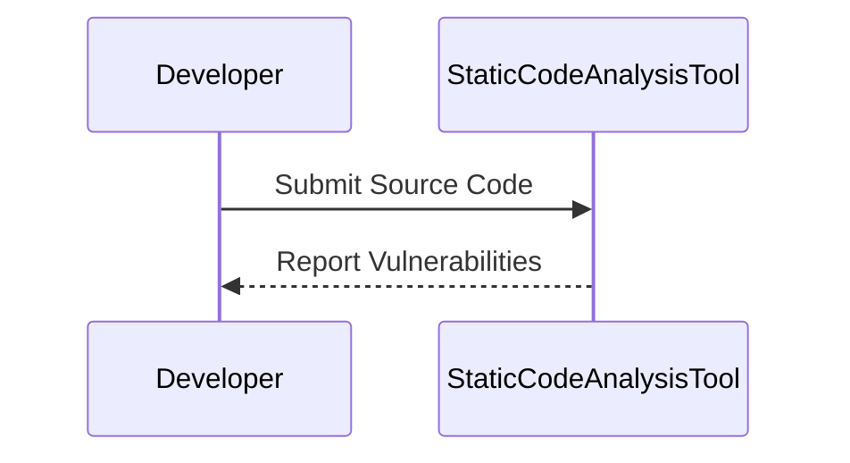
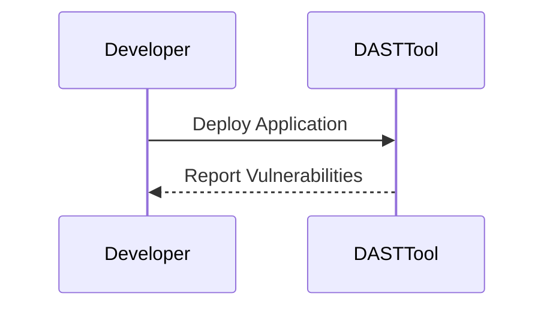
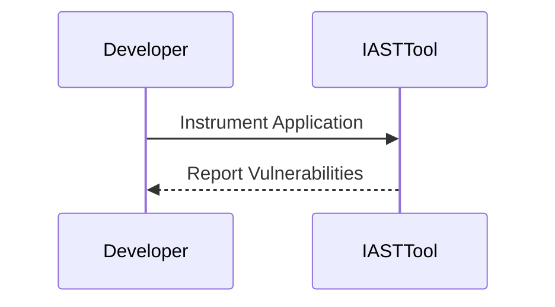
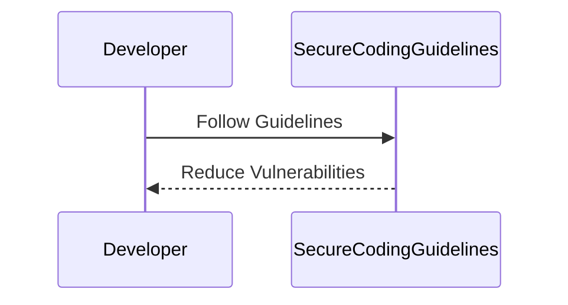
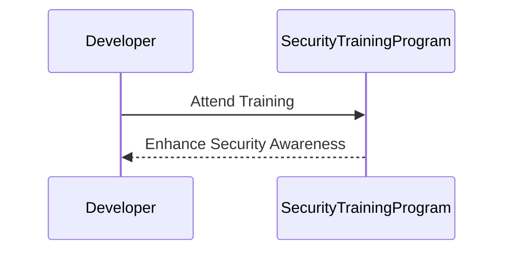
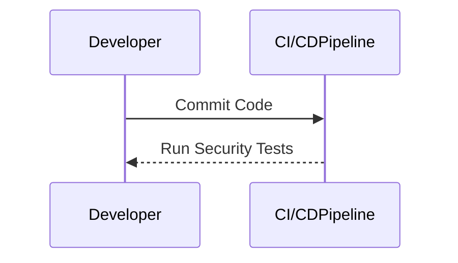

## Quantifying the Benefits of DevSecOps

### Reduction in Time Required for Rework

One of the primary benefits of DevSecOps is the reduction in the time required for rework or fixing security vulnerabilities. This is achieved through the early identification and remediation of security issues, which minimizes the need for costly and time-consuming fixes later in the development cycle.

#### Classic Bug Cost Diagram

To understand the significance of this benefit, it is helpful to examine the classic bug cost diagram. This diagram illustrates the relationship between the cost of fixing a bug and the stage at which it is identified in the development process. According to research conducted by the National Institute for Standards and Technology (NIST) and other organizations, the cost of fixing a bug increases exponentially as the development process progresses.

```mermaid
graph LR
A[Design & Requirements] --> B[Implementation]
B --> C[Test]
C --> D[Deployment]
D --> E[Maintenance]
A --|Cost|> B
B --|Cost|> C
C --|Cost|> D
D --|Cost|> E
```

In the diagram above, the stages of the development process are represented, along with the associated cost of fixing a bug at each stage. As you can see, the cost of fixing a bug is significantly lower during the design and requirements phase compared to later stages such as deployment and maintenance.

### Security Vulnerabilities as Bugs

Security vulnerabilities can be viewed as a specific type of bug that requires remediation. Just like traditional bugs, the longer a security vulnerability remains unaddressed, the more it will cost to fix. This is because the impact of a security vulnerability can be far-reaching, affecting not only the application itself but also the data it processes and the users it serves.

#### Recent Real-World Examples

Recent high-profile breaches and vulnerabilities highlight the importance of addressing security issues early in the development process. For instance:

- **CVE-2021-44228 (Log4Shell)**: This vulnerability in the Apache Log4j library affected millions of systems worldwide. The cost of remediating this vulnerability was substantial due to the widespread adoption of Log4j and the critical nature of the flaw. Had the vulnerability been identified and addressed earlier, the impact could have been minimized.
  
- **SolarWinds Supply Chain Attack**: This attack involved the compromise of SolarWinds Orion software, which was then used to infiltrate numerous organizations. The cost of remediating this attack was enormous, involving extensive forensic analysis, system hardening, and operational changes. Early identification and remediation of such vulnerabilities could have prevented this breach.

### Shifting Left in DevSecOps

Shifting left in DevSecOps means moving security testing and remediation activities earlier in the development process. This approach ensures that potential security issues are identified and addressed as early as possible, reducing the cost and complexity of fixing them later.

#### Early Identification and Remediation

By integrating security practices into the early stages of the development process, organizations can identify and remediate security vulnerabilities before they become major issues. This not only reduces the cost of fixing these issues but also enhances the overall security posture of the application.

### How to Prevent / Defend Against Security Vulnerabilities

#### Detection

Detection of security vulnerabilities can be achieved through various methods, including static code analysis, dynamic application security testing (DAST), and interactive application security testing (IAST).

##### Static Code Analysis

Static code analysis tools scan the source code for potential security vulnerabilities without executing the code. These tools can identify issues such as SQL injection, cross-site scripting (XSS), and buffer overflows.



##### Dynamic Application Security Testing (DAST)

DAST tools simulate attacks on the running application to identify security vulnerabilities. These tools can detect issues such as authentication bypass, authorization flaws, and sensitive data exposure.



##### Interactive Application Security Testing (IAST)

IAST tools instrument the application runtime to identify security vulnerabilities. These tools can detect issues such as SQL injection, XSS, and command injection.



#### Prevention

Prevention of security vulnerabilities can be achieved through various methods, including secure coding practices, security training, and continuous integration/continuous delivery (CI/CD) pipelines.

##### Secure Coding Practices

Secure coding practices involve following established guidelines and best practices to minimize the likelihood of introducing security vulnerabilities. For example, using parameterized queries to prevent SQL injection or validating user input to prevent XSS.



##### Security Training

Security training involves educating developers and other stakeholders about security best practices and the importance of addressing security issues early in the development process.

```mer


##### Continuous Integration/Continuous Delivery (CI/CD) Pipelines

CI/CD pipelines can be configured to automatically run security tests and enforce security policies. This ensures that security issues are identified and addressed early in the development process.



### Complete Example: Reducing Time Required for Rework

Let's consider a complete example to illustrate how DevSecOps can reduce the time required for rework.

#### Scenario

Suppose a development team is working on a web application that processes sensitive user data. During the design and requirements phase, the team identifies a potential security vulnerability related to the storage of user passwords.

#### Vulnerable Code

Without DevSecOps, the team might implement the following insecure code:

```python
# Vulnerable code
def store_password(username, password):
    # Store the password in plain text
    with open('passwords.txt', 'a') as f:
        f.write(f"{username}:{password}\n")
```

#### Secure Code

With DevSecOps, the team would identify and remediate the vulnerability early in the development process. The secure code might look like this:

```python
# Secure code
import hashlib

def store_password(username, password):
    # Hash the password before storing
    hashed_password = hashlib.sha256(password.encode()).hexdigest()
    with open('passwords.txt', 'a') as f:
        f.write(f"{username}:{hashed_password}\n")
```

#### Full HTTP Request and Response

To demonstrate the impact of this change, let's consider a full HTTP request and response scenario.

##### Vulnerable Scenario

**HTTP Request:**

```http
POST /store_password HTTP/1.1
Host: example.com
Content-Type: application/json

{
    "username": "alice",
    "password": "password123"
}
```

**HTTP Response:**

```http
HTTP/1.1 200 OK
Content-Type: application/json

{
    "message": "Password stored successfully"
}
```

##### Secure Scenario

**HTTP Request:**

```http
POST /store_password HTTP/1.1
Host: example.com
Content-Type: application/json

{
    "username": "alice",
    "password": "password123"
}
```

**HTTP Response:**

```http
HTTP/1.1 200 OK
Content-Type: application/json

{
    "message": "Password stored successfully"
}
```

#### Expected Result

In both scenarios, the password is stored successfully. However, in the secure scenario, the password is hashed before being stored, reducing the risk of unauthorized access.

### Hands-On Labs for DevSecOps

To gain practical experience with DevSecOps, consider the following hands-on labs:

- **PortSwigger Web Security Academy**: Offers a comprehensive set of labs covering various aspects of web security, including secure coding practices and vulnerability identification.
- **OWASP Juice Shop**: A deliberately insecure web application designed to teach web security concepts. It includes numerous security vulnerabilities that can be identified and remediated using DevSecOps principles.
- **DVWA (Damn Vulnerable Web Application)**: Another intentionally insecure web application that can be used to practice identifying and remediating security vulnerabilities.

### Conclusion

DevSecOps offers significant benefits by reducing the time required for rework and fixing security vulnerabilities. By integrating security practices throughout the development process, organizations can enhance their overall security posture and improve the efficiency of their development efforts. Through early identification and remediation of security issues, organizations can minimize the cost and complexity of fixing these issues later in the development cycle.

---
<!-- nav -->
[[DevSecOps/DevSecOps Bootcamp/01-DevSecOps Introduction/06-Identifying the Benefits of DevSecOps/03-Quantifying Benefits An Example/02-Introduction to DevSecOps|Introduction to DevSecOps]] | [[DevSecOps/DevSecOps Bootcamp/01-DevSecOps Introduction/06-Identifying the Benefits of DevSecOps/03-Quantifying Benefits An Example/00-Overview|Overview]] | [[DevSecOps/DevSecOps Bootcamp/01-DevSecOps Introduction/06-Identifying the Benefits of DevSecOps/03-Quantifying Benefits An Example/04-Practice Questions & Answers|Practice Questions & Answers]]
