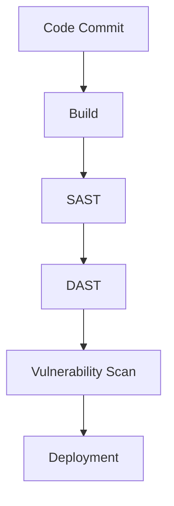
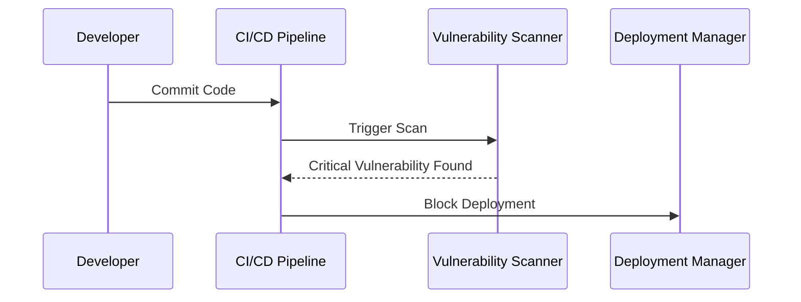

## Introduction to DevSecOps Roles and Responsibilities

DevSecOps is an approach that integrates security practices into the DevOps lifecycle, ensuring that security is considered throughout the entire software development process. This integration is crucial for maintaining the integrity and confidentiality of applications and systems. In this chapter, we will delve into the various roles and responsibilities involved in building a DevSecOps pipeline, emphasizing the importance of activities rather than full-time roles. We will also explore the significance of tooling, vulnerability management, application security, and compliance.

### Understanding DevSecOps Pipeline Activities

The primary goal of DevSecOps is to ensure that security is not an afterthought but is integrated into every stage of the software development lifecycle (SDLC). This means that developers, operations teams, and security professionals must work together seamlessly to identify and mitigate security risks early in the development process.

#### Key Activities in DevSecOps

1. **Security Testing Integration**: Extending the DevOps pipeline to include security testing ensures that security is not overlooked during the development process. This involves integrating various security tools into the continuous integration/continuous delivery (CI/CD) pipeline.

2. **Vulnerability Management**: Managing vulnerabilities is a critical activity that ensures all identified vulnerabilities are addressed and resolved before deployment. This includes blocking deployments based on the severity of vulnerabilities.

3. **Application Security**: Ensuring that the application is secure requires having individuals competent in handling application security fixes. This includes identifying and fixing security vulnerabilities within the application code.

4. **Compliance**: Maintaining proper records of testing and remediation outcomes is essential for compliance purposes. This ensures that all security measures are documented and can be audited.

### Importance of Activities Over Full-Time Roles

In many organizations, especially smaller ones, it is not feasible to have dedicated full-time roles for each aspect of DevSecOps. Instead, the focus should be on the activities that need to be performed. This approach allows teams to be flexible and adapt to the specific needs of their projects without needing to expand their workforce significantly.

### Tooling in DevSecOps

Tooling plays a crucial role in ensuring the consistency and effectiveness of DevSecOps processes. By integrating security tools into the CI/CD pipeline, organizations can automate security testing and vulnerability scanning, making the process more efficient and less error-prone.

#### Example Tools

- **Static Application Security Testing (SAST)**: Tools like SonarQube and Fortify analyze the source code to identify potential security vulnerabilities.
  
- **Dynamic Application Security Testing (DAST)**: Tools like OWASP ZAP and Burp Suite simulate attacks on the running application to identify runtime vulnerabilities.
  
- **Dependency Checkers**: Tools like OWASP Dependency-Check and Snyk scan dependencies for known vulnerabilities.



### Vulnerability Management

Vulnerability management is a critical activity that ensures all identified vulnerabilities are addressed and resolved before deployment. This involves using tools to scan for vulnerabilities and implementing policies to block deployments based on the severity of vulnerabilities.

#### Example Policy

Consider a scenario where a critical vulnerability is identified in a dependency used by the application. According to the company's risk policy, deployments with critical vulnerabilities should be blocked.



#### Real-World Example

A recent example of a critical vulnerability is the Log4j vulnerability (CVE-2021-44228). This vulnerability allowed attackers to execute arbitrary code on affected systems. Organizations that had implemented robust vulnerability management practices were able to quickly identify and patch this vulnerability, preventing potential breaches.

### Application Security

Ensuring that the application is secure requires having individuals competent in handling application security fixes. This includes identifying and fixing security vulnerabilities within the application code.

#### Secure Coding Practices

Secure coding practices are essential for preventing common security vulnerabilities such as SQL injection, cross-site scripting (XSS), and buffer overflows. Developers should follow secure coding guidelines and use tools to identify and fix these vulnerabilities.

##### Example: SQL Injection Prevention

```sql
-- Vulnerable Code
SELECT * FROM users WHERE username = '$username' AND password = '$password';

-- Secure Code
SELECT * FROM users WHERE username = ? AND password = ?;
```

In the secure code example, parameterized queries are used to prevent SQL injection attacks.

### Compliance

Maintaining proper records of testing and remediation outcomes is essential for compliance purposes. This ensures that all security measures are documented and can be audited.

#### Example: PCI DSS Compliance

For organizations handling credit card information, compliance with the Payment Card Industry Data Security Standard (PCI DSS) is mandatory. This includes maintaining logs of security tests and remediation efforts.

```json
{
  "test_id": "T1234",
  "test_type": "SAST",
  "date": "2023-10-01",
  "result": "Passed",
  "remediation": {
    "issue": "SQL Injection Vulnerability",
    "status": "Fixed",
    "date_fixed": "2023-10-05"
  }
}
```

### How to Prevent / Defend

To effectively implement DevSecOps, organizations must adopt a proactive approach to security. This involves:

1. **Automating Security Testing**: Integrating security tools into the CI/CD pipeline to automate security testing.
   
2. **Implementing Vulnerability Management Policies**: Blocking deployments based on the severity of vulnerabilities.
   
3. **Training Developers in Secure Coding Practices**: Ensuring developers are aware of common security vulnerabilities and how to prevent them.
   
4. **Maintaining Proper Records for Compliance**: Documenting all security measures and remediation efforts to meet compliance requirements.

### Conclusion

Building a DevSecOps pipeline requires a comprehensive understanding of the various roles and responsibilities involved. By focusing on the activities rather than full-time roles, organizations can ensure that security is integrated into every stage of the SDLC. Tooling, vulnerability management, application security, and compliance are critical components of a successful DevSecOps implementation.

### Practice Labs

For hands-on experience with DevSecOps concepts, consider the following practice labs:

- **PortSwigger Web Security Academy**: Offers interactive labs to learn about web application security.
- **OWASP Juice Shop**: A deliberately insecure web application for practicing security testing.
- **DVWA (Damn Vulnerable Web Application)**: Another intentionally vulnerable web application for learning security testing techniques.
- **WebGoat**: An interactive training application for learning about web application security.

These labs provide practical experience in applying DevSecOps principles and techniques to real-world scenarios.

---

This chapter provides a comprehensive overview of the roles and responsibilities involved in building a DevSecOps pipeline, emphasizing the importance of activities over full-time roles. By integrating security testing, managing vulnerabilities, ensuring application security, and maintaining compliance, organizations can build more secure and resilient applications.

---
<!-- nav -->
[[DevSecOps/DevSecOps Bootcamp/01-DevSecOps Introduction/06-Identifying the Benefits of DevSecOps/04-Roles and Responsibilities/00-Overview|Overview]] | [[02-Roles and Responsibilities in DevSecOps|Roles and Responsibilities in DevSecOps]]
