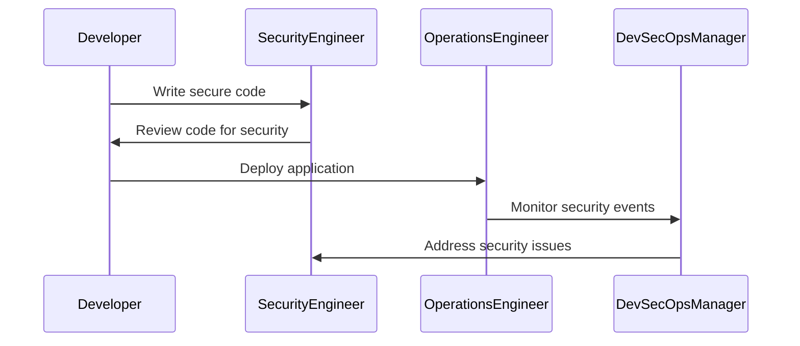

## Roles and Responsibilities in DevSecOps

### Introduction to DevSecOps

DevSecOps is an approach that integrates security practices into the DevOps lifecycle. This means that security is no longer a separate phase but is embedded throughout the development, testing, and deployment processes. The goal is to ensure that applications are secure from the very beginning, reducing the likelihood of vulnerabilities and ensuring compliance with regulatory requirements.

### Demonstrating Compliance

One of the key benefits of implementing DevSecOps is the ability to demonstrate compliance with various regulations and standards. Compliance is crucial because it ensures that your organization adheres to legal and industry-specific requirements, thereby avoiding potential fines and reputational damage.

#### What is Compliance?

Compliance refers to the adherence to laws, regulations, standards, and policies that govern the operations of an organization. In the context of DevSecOps, compliance often involves ensuring that software development and deployment processes meet specific security and privacy standards.

#### Why is Compliance Important?

Compliance is important because it helps organizations avoid legal penalties, maintain customer trust, and ensure the integrity of their systems. Non-compliance can result in significant financial and reputational losses. For example, the General Data Protection Regulation (GDPR) imposes heavy fines on companies that fail to protect personal data adequately.

#### How Does DevSecOps Help with Compliance?

DevSecOps helps with compliance by embedding security practices throughout the software development lifecycle (SDLC). This includes:

- **Automated Security Testing:** Integrating security testing tools into the CI/CD pipeline ensures that security checks are performed automatically and consistently.
- **Policy Enforcement:** Implementing security policies and controls as part of the CI/CD process ensures that all code changes adhere to predefined security standards.
- **Audit Trails:** Maintaining detailed logs and audit trails helps in demonstrating compliance during audits.

### Fulfilling Activities Within Existing Team Structure

To effectively implement DevSecOps, it is essential to understand how to integrate security responsibilities into the existing team structure. This involves defining roles and responsibilities that align with the principles of DevSecOps.

#### Roles in DevSecOps

In a DevSecOps environment, roles are typically defined based on the responsibilities required to ensure security throughout the SDLC. Some common roles include:

- **Developer:** Responsible for writing secure code and integrating security practices into the development process.
- **Security Engineer:** Specializes in security practices and works closely with developers to ensure that security is integrated into the codebase.
- **Operations Engineer:** Ensures that security measures are implemented in the deployment and maintenance phases.
- **DevSecOps Manager:** Oversees the entire DevSecOps process and ensures that all teams are aligned with security goals.

#### How to Fulfill These Activities

To fulfill these activities within your existing team structure, consider the following steps:

1. **Assess Current Capabilities:** Evaluate the current skills and capabilities of your team members to identify gaps in security knowledge and expertise.
2. **Define Clear Roles and Responsibilities:** Clearly define the roles and responsibilities of each team member in relation to security practices.
3. **Provide Training and Resources:** Ensure that team members have access to the necessary training and resources to perform their security-related tasks effectively.
4. **Integrate Security into Processes:** Embed security practices into existing processes, such as code reviews, testing, and deployment.

### Larger, More Mature Organizations

For larger, more mature organizations, it may be possible to hire specialists who are dedicated to specific security activities. This can be beneficial because it allows for a deeper focus on security and can lead to more effective implementation of DevSecOps principles.

#### Hiring Specialists

Specialists can be hired for various security-related roles, including:

- **Security Architects:** Design and implement security architectures that align with organizational goals.
- **Penetration Testers:** Conduct regular penetration tests to identify and mitigate vulnerabilities.
- **Security Analysts:** Monitor security events and respond to incidents.

#### Benefits of Hiring Specialists

Hiring specialists can provide several benefits:

- **Expertise:** Specialists bring deep expertise in specific areas of security, which can be invaluable in addressing complex security challenges.
- **Focus:** Dedicated specialists can focus solely on security, allowing other team members to concentrate on their core responsibilities.
- **Efficiency:** Specialists can streamline security processes and improve overall efficiency.

### Real-World Examples

To illustrate the importance of DevSecOps and compliance, consider the following real-world examples:

#### Example 1: Equifax Breach (CVE-2017-5638)

The Equifax breach in 2017 exposed sensitive personal information of millions of individuals. The breach was caused by a vulnerability in Apache Struts, which was not patched in a timely manner. This incident highlights the importance of maintaining up-to-date security patches and conducting regular security assessments.



#### Example 2: GDPR Fines

Since the implementation of GDPR in 2018, several organizations have been fined for non-compliance. For example, British Airways was fined £183 million for a data breach that exposed customer data. This incident underscores the importance of maintaining robust security practices and ensuring compliance with data protection regulations.

### How to Prevent / Defend

To prevent and defend against security threats and ensure compliance, consider the following strategies:

#### Detection

- **Logging and Monitoring:** Implement comprehensive logging and monitoring to detect security events and anomalies.
- **Security Information and Event Management (SIEM):** Use SIEM tools to aggregate and analyze security logs from various sources.

#### Prevention

- **Secure Coding Practices:** Follow secure coding guidelines and conduct regular code reviews to identify and mitigate security vulnerabilities.
- **Automated Security Testing:** Integrate automated security testing tools into the CI/CD pipeline to ensure that security checks are performed consistently.

#### Secure-Coding Fixes

Here is an example of a vulnerable code snippet and its secure version:

```python
# Vulnerable Code
import os
username = input("Enter username: ")
os.system(f"echo {username}")

# Secure Code
import subprocess
username = input("Enter username: ")
subprocess.run(["echo", username], check=True)
```

#### Configuration Hardening

- **Network Segmentation:** Segment the network to limit the spread of attacks.
- **Firewall Rules:** Configure firewall rules to restrict unauthorized access.

### Complete Example

Consider a scenario where you need to deploy a web application using Docker and Kubernetes. Here is a complete example of the HTTP request, response, and result:

#### HTTP Request

```http
POST /api/deploy HTTP/1.1
Host: example.com
Content-Type: application/json
Authorization: Bearer <token>

{
  "image": "myapp:v1",
  "replicas": 3,
  "port": 8080
}
```

#### HTTP Response

```http
HTTP/1.1 201 Created
Date: Mon, 20 Mar 2023 12:00:00 GMT
Content-Type: application/json

{
  "deployment": {
    "name": "myapp-deployment",
    "status": "created"
  }
}
```

#### Result

The web application is deployed successfully with three replicas running on port 8080.

### Practice Labs

To gain hands-on experience with DevSecOps, consider the following practice labs:

- **PortSwigger Web Security Academy:** Offers interactive labs to learn about web security.
- **OWASP Juice Shop:** A deliberately insecure web application for practicing security testing.
- **Kubernetes Goat:** A vulnerable Kubernetes cluster for learning about Kubernetes security.

By following these steps and utilizing the provided resources, you can effectively implement DevSecOps principles and ensure compliance with regulatory requirements.

---
<!-- nav -->
[[DevSecOps/DevSecOps Bootcamp/01-DevSecOps Introduction/06-Identifying the Benefits of DevSecOps/04-Roles and Responsibilities/01-Introduction to DevSecOps Roles and Responsibilities|Introduction to DevSecOps Roles and Responsibilities]] | [[DevSecOps/DevSecOps Bootcamp/01-DevSecOps Introduction/06-Identifying the Benefits of DevSecOps/04-Roles and Responsibilities/00-Overview|Overview]] | [[DevSecOps/DevSecOps Bootcamp/01-DevSecOps Introduction/06-Identifying the Benefits of DevSecOps/04-Roles and Responsibilities/03-Practice Questions & Answers|Practice Questions & Answers]]
