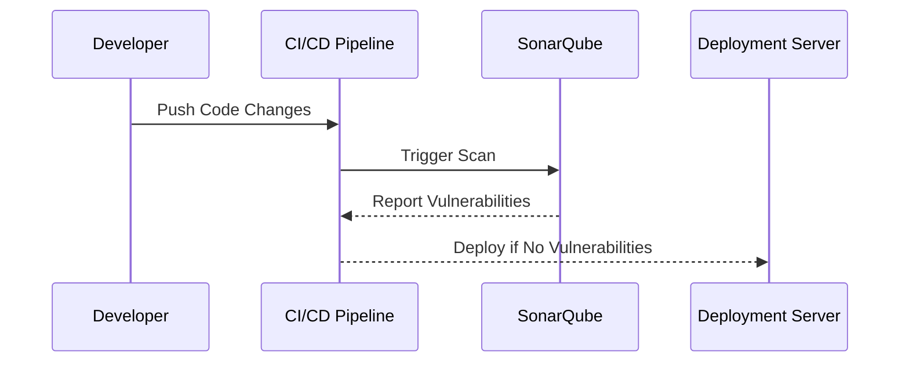
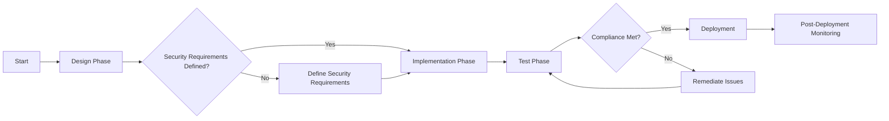
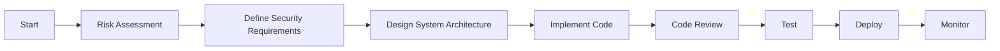

## Introduction to DevSecOps

DevSecOps is an approach that integrates security practices into the DevOps lifecycle, ensuring that security is a continuous process rather than an afterthought. This methodology aims to automate and integrate security measures at every stage of the software development lifecycle (SDLC), from planning and coding to testing and deployment. By doing so, DevSecOps ensures that security is not only consistent but also compliant with legal and regulatory requirements.

### Consistency Through Automation

One of the primary benefits of DevSecOps is the automation of security processes. Automation ensures that security checks are consistently applied across all stages of the SDLC. This consistency is crucial because manual processes can introduce human error, leading to inconsistencies and potential security vulnerabilities.

#### Example: Automated Security Testing

Consider a scenario where a company uses automated security testing tools like SonarQube or OWASP ZAP. These tools can automatically scan codebases for vulnerabilities during the build process. Here’s an example of how this might work:



In this sequence diagram, the CI/CD pipeline triggers an automatic scan using SonarQube whenever new code changes are pushed. If vulnerabilities are detected, the deployment is halted until the issues are resolved.

### Compliance with Legal Requirements

Another significant benefit of DevSecOps is its ability to help organizations comply with various legal and regulatory requirements. In many jurisdictions, secure-by-design principles are mandated by law. For instance, the General Data Protection Regulation (GDPR) in the European Union requires organizations to implement secure-by-design and privacy-by-design principles in their software development processes.

#### GDPR Compliance

The GDPR mandates that organizations must implement appropriate technical and organizational measures to ensure and demonstrate compliance with the principles of data protection. This includes implementing security measures to protect personal data against unauthorized access, loss, or destruction.

**Example: GDPR Compliance in Action**

Suppose a company is developing a web application that handles sensitive user data. To comply with GDPR, the company must ensure that the application is designed with security in mind from the outset. This includes implementing encryption, access controls, and regular security audits.

Here’s an example of how this might look in practice:



In this graph, the company starts by defining security requirements during the design phase. If these requirements are not met, the company must define them before proceeding to implementation. After implementation, the application undergoes testing to ensure compliance. If compliance is not met, the company must remediate the issues before deploying the application.

### Secure-by-Design and Privacy-by-Design

Secure-by-design and privacy-by-design are principles that mandate that security and privacy considerations should be integrated into the design and development of systems from the beginning. This approach ensures that security and privacy are not treated as afterthoughts but are integral parts of the system architecture.

#### Real-World Example: GDPR Breach

A notable example of a GDPR breach is the British Airways data breach in 2018, which resulted in a fine of £183 million. The breach occurred due to a lack of proper security measures, including inadequate encryption and insufficient monitoring of the system. This incident highlights the importance of implementing secure-by-design principles to avoid such breaches.

**Secure-by-Design Implementation**

To implement secure-by-design principles, consider the following steps:

1. **Risk Assessment**: Conduct a thorough risk assessment to identify potential security threats.
2. **Security Requirements**: Define specific security requirements based on the identified risks.
3. **Architecture Design**: Design the system architecture with security in mind, including encryption, access controls, and logging mechanisms.
4. **Code Review**: Implement regular code reviews to identify and mitigate security vulnerabilities.
5. **Testing**: Perform comprehensive security testing, including static and dynamic analysis, penetration testing, and vulnerability scanning.

Here’s an example of how to implement secure-by-design principles in a codebase:



In this graph, the process starts with a risk assessment to identify potential threats. Based on the identified risks, specific security requirements are defined. The system architecture is then designed with these requirements in mind. After implementing the code, regular code reviews are conducted to identify and mitigate vulnerabilities. Comprehensive testing is performed before deployment, and post-deployment monitoring ensures ongoing security.

### How to Prevent / Defend Against Compliance Issues

To prevent compliance issues and ensure that your organization adheres to legal and regulatory requirements, follow these steps:

1. **Understand Legal Requirements**: Familiarize yourself with the specific legal and regulatory requirements applicable to your organization. This may include GDPR, CCPA, HIPAA, and others.
2. **Implement Secure-by-Design Principles**: Ensure that security and privacy considerations are integrated into the design and development of systems from the outset.
3. **Regular Audits and Assessments**: Conduct regular security audits and assessments to identify and address potential compliance issues.
4. **Training and Awareness**: Provide regular training and awareness programs for employees to ensure they understand the importance of security and compliance.
5. **Automate Security Processes**: Use automation tools to ensure consistent application of security measures across all stages of the SDLC.

#### Example: Secure Coding Practices

To illustrate secure coding practices, consider the following example where a developer is implementing a login feature:

**Vulnerable Code**

```python
def authenticate(username, password):
    # Connect to database
    db = DatabaseConnection()
    
    # Query database for user
    user = db.query("SELECT * FROM users WHERE username = '%s'" % username)
    
    # Check password
    if user['password'] == password:
        return True
    else:
        return False
```

**Secure Code**

```python
def authenticate(username, password):
    # Connect to database
    db = DatabaseConnection()
    
    # Query database for user using parameterized queries
    user = db.query("SELECT * FROM users WHERE username = ?", [username])
    
    # Check password securely
    if user and check_password_hash(user['password'], password):
        return True
    else:
        return False
```

In the secure code example, the developer uses parameterized queries to prevent SQL injection attacks and securely compares passwords using a hashing function.

### Conclusion

DevSecOps offers numerous benefits, including consistency through automation and compliance with legal and regulatory requirements. By integrating security practices into the DevOps lifecycle, organizations can ensure that security is a continuous process, reducing the risk of vulnerabilities and ensuring compliance with legal requirements. Implementing secure-by-design and privacy-by-design principles is crucial to achieving these benefits.

### Practice Labs

For hands-on experience with DevSecOps, consider the following labs:

- **PortSwigger Web Security Academy**: Offers interactive labs to learn about web security and secure coding practices.
- **OWASP Juice Shop**: A deliberately insecure web application for practicing web security skills.
- **DVWA (Damn Vulnerable Web Application)**: A PHP/MySQL web application that is riddled with vulnerabilities for educational purposes.

These labs provide practical experience in implementing secure-by-design principles and automating security processes.

---
<!-- nav -->
[[DevSecOps/DevSecOps Bootcamp/01-DevSecOps Introduction/06-Identifying the Benefits of DevSecOps/Listing Benefits of DevSecOps/01-Introduction to DevSecOps Part 1|Introduction to DevSecOps Part 1]] | [[DevSecOps/DevSecOps Bootcamp/01-DevSecOps Introduction/06-Identifying the Benefits of DevSecOps/Listing Benefits of DevSecOps/00-Overview|Overview]] | [[DevSecOps/DevSecOps Bootcamp/01-DevSecOps Introduction/06-Identifying the Benefits of DevSecOps/Listing Benefits of DevSecOps/03-Introduction to DevSecOps|Introduction to DevSecOps]]
