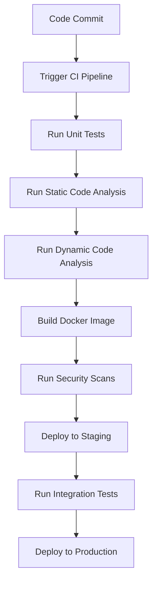

## Benefits of DevSecOps

### Enhanced Collaboration

One of the primary benefits of DevSecOps is the enhanced collaboration between different teams within an organization. Instead of having a dedicated security team that fixes every security issue, security becomes everyone's responsibility. This shift in mindset encourages developers to think about security while writing code, and operations teams to ensure that systems are secure during deployment.

#### Example: Real-World Application

Consider a scenario where a developer writes code that introduces a SQL injection vulnerability. In a traditional setup, this vulnerability might go unnoticed until a security audit is performed months later. However, in a DevSecOps environment, the developer would be responsible for identifying and fixing such vulnerabilities immediately. This immediate action reduces the window of opportunity for attackers to exploit the vulnerability.

### Continuous Security

Another major benefit of DevSecOps is the introduction of more consistency and standardization through automation. Automation ensures that security scans are run at the right time in the lifecycle, making security a continuous process rather than a discrete step. This continuous security approach ensures that vulnerabilities are identified and addressed promptly.

#### Example: Automated Security Scans

Let's consider a typical DevSecOps pipeline:



In this pipeline, whenever a developer commits code, the CI pipeline is triggered. This pipeline includes various stages such as unit tests, static code analysis, dynamic code analysis, building Docker images, and running security scans. Each of these stages is automated, ensuring that security is checked continuously throughout the development process.

### Recent Real-World Examples

Recent breaches and vulnerabilities highlight the importance of DevSecOps. For instance, the Log4j vulnerability (CVE-2021-44228) affected numerous applications and systems worldwide. This vulnerability was exploited due to delayed patching and lack of continuous security monitoring. Implementing DevSecOps practices could have helped in identifying and mitigating such vulnerabilities more quickly.

#### Example: Log4j Vulnerability

The Log4j vulnerability is a prime example of the risks associated with delayed security fixes. The vulnerability was discovered in December 2021, and it took several months for many organizations to apply the necessary patches. This delay allowed attackers to exploit the vulnerability, leading to widespread breaches.

### How to Prevent / Defend

To prevent and defend against security vulnerabilities, organizations should adopt the following practices:

#### Secure Coding Practices

Developers should follow secure coding practices to minimize the introduction of vulnerabilities. This includes using secure coding guidelines, conducting regular code reviews, and using static code analysis tools.

**Vulnerable Code Example:**

```python
# Vulnerable code
import sqlite3

def login(username, password):
    conn = sqlite3.connect('database.db')
    cursor = conn.cursor()
    cursor.execute(f"SELECT * FROM users WHERE username='{username}' AND password='{password}'")
    result = cursor.fetchone()
    conn.close()
    return result
```

**Secure Code Example:**

```python
# Secure code
import sqlite3

def login(username, password):
    conn = sqlite3.connect('database.db')
    cursor = conn.cursor()
    cursor.execute("SELECT * FROM users WHERE username=? AND password=?", (username, password))
    result = cursor.fetchone()
    conn.close()
    return result
```

In the secure code example, parameterized queries are used to prevent SQL injection attacks.

#### Automated Security Scans

Organizations should implement automated security scans as part of their CI/CD pipelines. These scans should be configured to run at key points in the development lifecycle, such as after code commits and before deployments.

**Example: Security Scan Configuration**

```yaml
# Jenkinsfile
pipeline {
    agent any
    stages {
        stage('Build') {
            steps {
                sh 'mvn clean package'
            }
        }
        stage('Security Scan') {
            steps {
                sh 'dependency-check --project MyProject --scan target/myapp.jar'
            }
        }
        stage('Deploy') {
            steps {
                sh 'kubectl apply -f kubernetes/deployment.yaml'
            }
        }
    }
}
```

In this Jenkinsfile, a security scan using Dependency-Check is configured to run after the build stage.

#### Patch Management

Operations teams should ensure that all systems are fully patched before deployment. This includes applying security updates and patches to all dependencies and libraries used in the application.

**Example: Patch Management**

```bash
# Bash script for patch management
#!/bin/bash

# Update package lists
sudo apt-get update

# Upgrade installed packages
sudo apt-get upgrade

# Apply security updates
sudo apt-get dist-upgrade

# Install additional security patches
sudo apt-get install --only-upgrade <package-name>
```

This script ensures that all system packages are updated and security patches are applied before deployment.

### Conclusion

DevSecOps is a critical methodology that integrates security into the entire development and deployment process. By fostering collaboration, ensuring continuous security through automation, and adopting secure coding practices, organizations can significantly reduce their risk exposure. Real-world examples such as the Log4j vulnerability highlight the importance of timely security fixes and continuous monitoring. By implementing DevSecOps practices, organizations can create a more secure and resilient environment.

### Practice Labs

For hands-on experience with DevSecOps, consider the following labs:

- **PortSwigger Web Security Academy**: Offers interactive labs to practice web application security.
- **OWASP Juice Shop**: A deliberately insecure web application for practicing security testing.
- **DVWA (Damn Vulnerable Web Application)**: A PHP/MySQL web application that is riddled with vulnerabilities for educational purposes.
- **WebGoat**: An interactive, gamified training application for learning about web application security.

These labs provide practical experience in identifying and fixing security vulnerabilities, which is essential for mastering DevSecOps principles.

---
<!-- nav -->
[[DevSecOps/DevSecOps Bootcamp/01-DevSecOps Introduction/06-Identifying the Benefits of DevSecOps/Listing Benefits of DevSecOps/03-Introduction to DevSecOps|Introduction to DevSecOps]] | [[DevSecOps/DevSecOps Bootcamp/01-DevSecOps Introduction/06-Identifying the Benefits of DevSecOps/Listing Benefits of DevSecOps/00-Overview|Overview]] | [[05-Reducing Time on Rework for Security Vulnerabilities|Reducing Time on Rework for Security Vulnerabilities]]
