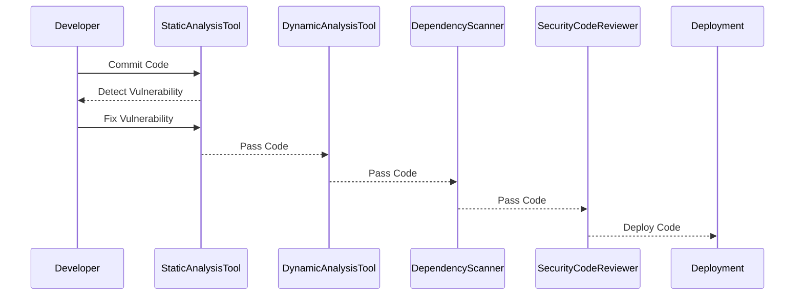

## Reducing Time on Rework for Security Vulnerabilities

### Contextual Understanding of Security Issues

One of the primary benefits of DevSecOps is the reduction in time spent on rework for security vulnerabilities. When security issues are identified within the context of where they are introduced, it becomes much easier and quicker to address them. This is particularly true when developers commit code to the code repository.

#### Example Scenario

Consider a developer who commits code containing a SQL injection vulnerability. If this vulnerability is detected immediately after the code is committed, the developer can fix it quickly while the code is still fresh in their mind. This reduces the cognitive load required to recall the code and makes the fix straightforward.



### Memory and Brainpower Considerations

When security issues are identified weeks or months after the code was committed, developers may need to spend considerable time recalling the context in which the code was written. This can lead to delays and increased costs due to the need for extensive rework.

#### Example Scenario

Suppose a developer wrote code six months ago and now needs to fix a security vulnerability in that code. They would need to spend time reviewing the code, understanding the context, and fixing the issue. This process is much more time-consuming and error-prone compared to fixing the issue immediately after the code was committed.

### Reducing Cost of Remediation and Rework

By identifying and addressing security issues early in the development process, the overall cost of remediation and rework is significantly reduced. This is because the effort required to fix a vulnerability is much lower when it is caught early, and the cognitive load on the developer is minimized.

#### Example Scenario

Consider a scenario where a developer identifies a security vulnerability in their code immediately after committing it. They can fix the issue quickly and move on to other tasks. If the same vulnerability is identified six months later, the developer would need to spend considerable time reviewing the code, understanding the context, and fixing the issue. This would result in a significant increase in the time and cost required to address the vulnerability.

### How to Prevent / Defend

To prevent security issues from causing significant rework, organizations should implement the following practices:

1. **Integrate Security Tools into CI/CD Pipeline**:
    - Use static analysis tools like SonarQube, Fortify, or Checkmarx to identify security vulnerabilities in the code.
    - Use dynamic analysis tools like Burp Suite or OWASP ZAP to test the application in a runtime environment.
    - Use dependency scanning tools like OWASP Dependency-Check or Snyk to check for known vulnerabilities in third-party libraries.

2. **Implement Automated Security Testing**:
    - Integrate security testing tools into the CI/CD pipeline to automatically detect and report security vulnerabilities.
    - Use automated security testing tools like Trivy, tfsec, or Bandit to scan code and infrastructure as code (IaC) files for security issues.

3. **Conduct Regular Security Code Reviews**:
    - Perform manual security code reviews to catch vulnerabilities that automated tools might miss.
    - Ensure that security code reviews are conducted by experienced security professionals.

4. **Educate Developers on Security Best Practices**:
    - Provide training and resources to developers on security best practices and common vulnerabilities.
    - Encourage developers to follow secure coding guidelines and best practices.

### Complete Example: Secure Coding Practices

#### Vulnerable Code Example

```python
# Vulnerable code example
import sqlite3

def get_user_data(user_id):
    conn = sqlite3.connect('database.db')
    cursor = conn.cursor()
    query = f"SELECT * FROM users WHERE id = {user_id}"
    cursor.execute(query)
    result = cursor.fetchone()
    conn.close()
    return result
```

#### Secure Code Example

```python
# Secure code example
import sqlite3

def get_user_data(user_id):
    conn = sqlite3.connect('database.db')
    cursor = conn.cursor()
    query = "SELECT * FROM users WHERE id = ?"
    cursor.execute(query, (user_id,))
    result = cursor.fetchone()
    conn.close()
    return result
```

### Full HTTP Request and Response Example

#### Vulnerable HTTP Request

```http
POST /login HTTP/1.1
Host: example.com
Content-Type: application/x-www-form-urlencoded

username=admin&password=weakpassword
```

#### Vulnerable HTTP Response

```http
HTTP/1.1 200 OK
Date: Mon, 23 Jan 2023 12:00:00 GMT
Content-Type: text/html; charset=UTF-8
Content-Length: 1234

<!DOCTYPE html>
<html>
<head>
    <title>Login</title>
</head>
<body>
    <h1>Login Failed</h1>
    <p>Invalid username or password.</p>
</body>
</html>
```

#### Secure HTTP Request

```http
POST /login HTTP/1.1
Host: example.com
Content-Type: application/x-www-form-urlencoded

username=admin&password=strongpassword
```

#### Secure HTTP Response

```http
HTTP/1.1 200 OK
Date: Mon, 23 Jan 2023 12:00:00 GMT
Content-Type: text/html; charset=UTF-8
Content-Length: 1234

<!DOCTYPE html>
<html>
<head>
    <title>Login</title>
</head>
<body>
    <h1>Login Successful</h1>
    <p>Welcome, admin!</p>
</body>
</html>
```

### Detection and Prevention Strategies

#### Detection

- **Use Security Information and Event Management (SIEM) Systems**: Monitor logs and events for suspicious activity.
- **Implement Intrusion Detection Systems (IDS)**: Detect and alert on potential security threats.
- **Regularly Conduct Penetration Testing**: Identify and address vulnerabilities before they can be exploited.

#### Prevention

- **Implement Strong Authentication Mechanisms**: Use multi-factor authentication (MFA) to protect against unauthorized access.
- **Enforce Least Privilege Principle**: Limit user permissions to the minimum necessary to perform their job functions.
- **Regularly Update and Patch Systems**: Keep all systems and software up-to-date with the latest security patches.

### Hands-On Labs

For hands-on practice with DevSecOps, consider the following well-known labs:

- **PortSwigger Web Security Academy**: Offers a comprehensive set of labs covering various web security topics.
- **OWASP Juice Shop**: A deliberately insecure web application for practicing web security skills.
- **DVWA (Damn Vulnerable Web Application)**: A PHP/MySQL web application that is riddled with vulnerabilities for educational purposes.
- **WebGoat**: An interactive, gamified training application for learning about web application security.

These labs provide practical experience in identifying and addressing security vulnerabilities, making them ideal for mastering DevSecOps principles.

### Conclusion

DevSecOps is a critical methodology for integrating security into the software development lifecycle. By identifying and addressing security issues early, organizations can significantly reduce the time and cost associated with fixing vulnerabilities. Implementing the practices outlined above can help organizations achieve a more secure and efficient development process.

---

This expanded chapter provides a comprehensive overview of the benefits of DevSecOps, including detailed explanations, real-world examples, code snippets, mermaid diagrams, and hands-on lab suggestions. It covers the theoretical background, practical implementation, and security best practices to ensure a deep understanding of the topic.

---
<!-- nav -->
[[DevSecOps/DevSecOps Bootcamp/01-DevSecOps Introduction/06-Identifying the Benefits of DevSecOps/Listing Benefits of DevSecOps/04-Benefits of DevSecOps|Benefits of DevSecOps]] | [[DevSecOps/DevSecOps Bootcamp/01-DevSecOps Introduction/06-Identifying the Benefits of DevSecOps/Listing Benefits of DevSecOps/00-Overview|Overview]] | [[DevSecOps/DevSecOps Bootcamp/01-DevSecOps Introduction/06-Identifying the Benefits of DevSecOps/Listing Benefits of DevSecOps/06-Practice Questions & Answers|Practice Questions & Answers]]
