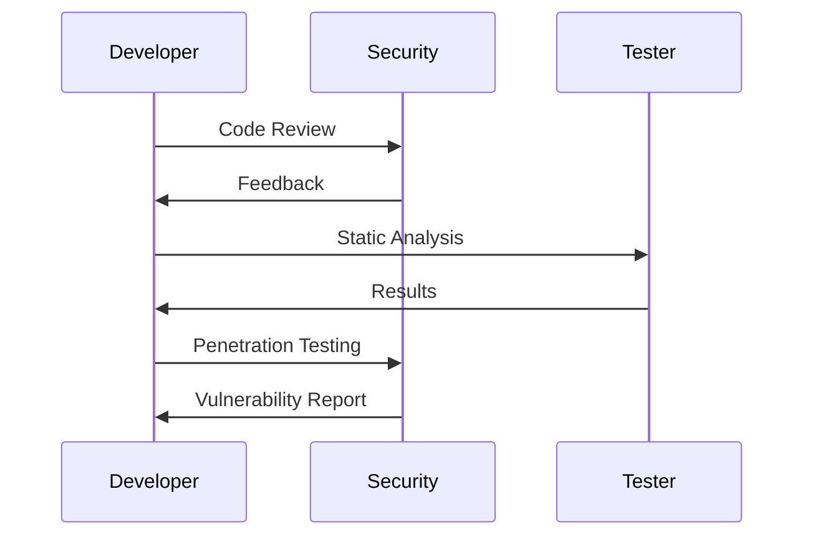
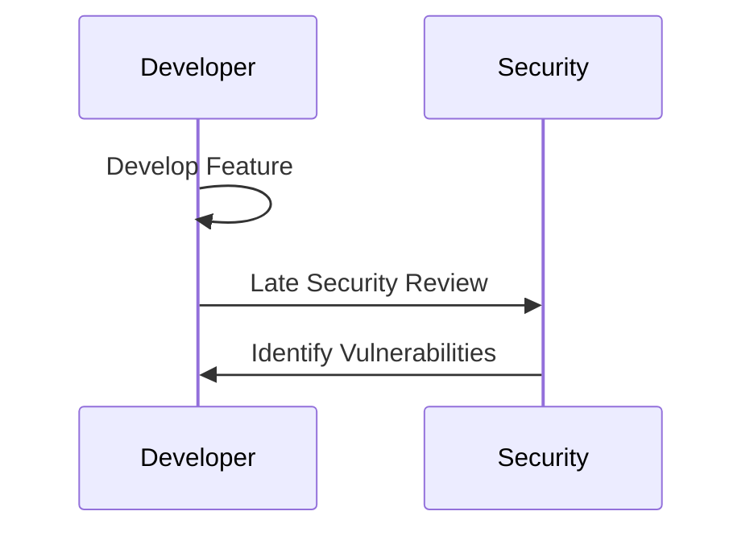

## Introduction to DevSecOps

### What is DevSecOps?

DevSecOps, short for Development, Security, and Operations, is an approach to software development that integrates security practices throughout the entire software development lifecycle (SDLC). This approach aims to ensure that security is not an afterthought but is embedded into every stage of the development process, from planning and coding to testing and deployment. By integrating security early and often, DevSecOps helps organizations identify and mitigate vulnerabilities more effectively, leading to more secure applications and systems.

### Why is DevSecOps Important?

The importance of DevSecOps lies in its ability to address the growing complexity and frequency of cyber threats. Traditional approaches to security often involve a separate security team that reviews and tests applications at the end of the development cycle. This can lead to delays, increased costs, and missed vulnerabilities. In contrast, DevSecOps promotes collaboration between developers, security professionals, and operations teams, ensuring that security is considered at every stage of the development process.

### How Does DevSecOps Work?

DevSecOps works by embedding security practices into the continuous integration and continuous delivery (CI/CD) pipeline. This involves automating security checks, using security tools and frameworks, and fostering a culture of security awareness among all team members. By integrating security into the development process, teams can catch and fix vulnerabilities earlier, reducing the overall risk and cost associated with security issues.

### General Guidelines for Implementing DevSecOps

#### Agile Methodology

Agile methodologies are highly suitable for DevSecOps deployments. Agile emphasizes iterative development, frequent feedback, and continuous improvement, which aligns well with the principles of DevSecOps. In an agile environment, security practices can be integrated into sprints, ensuring that security is considered at every stage of the development process.

**Example:**
Consider a scenario where a development team is working on a new feature for a web application. In an agile environment, the team would break down the feature into smaller tasks and iterate through them in sprints. Each sprint would include security-related tasks such as code reviews, static analysis, and penetration testing. This ensures that security is not an afterthought but is integrated into the development process.



#### Existing DevOps Practices

If an organization already has DevOps practices in place, implementing DevSecOps becomes a natural extension. Many organizations have established CI/CD pipelines for deploying their solutions. Extending these pipelines to include security practices is an incremental piece of work rather than a fundamental shift in processes.

**Example:**
Suppose an organization has a CI/CD pipeline that automatically builds, tests, and deploys code changes. To integrate DevSecOps, the organization can add security scans to the pipeline. This could include static code analysis, dynamic application security testing (DAST), and dependency checks.


#### Multiple Releases

Organizations that perform multiple releases per year, day, or even hour are well-suited for DevSecOps. Frequent releases require a robust and automated security process to ensure that each release is secure. DevSecOps enables organizations to maintain a high level of security while supporting rapid development cycles.

**Example:**
Consider a company that releases updates to its mobile app several times a week. Without DevSecOps, ensuring the security of each release would be challenging. By integrating security into the CI/CD pipeline, the company can automate security checks and quickly identify and fix vulnerabilities.

```mer
graph LR
    A[Code Commit] --> B[Build]
    B --> C[Test]
    C --> D[Security Scan]
    D --> E[Release]
```

#### Automation in Development Lifecycle

Automation plays a crucial role in DevSecOps. If an organization already has automation in place for its development lifecycle, integrating DevSecOps becomes easier. Automation can help streamline security practices, making it possible to scale security efforts as the organization grows.

**Example:**
An organization might have automated testing and deployment processes. To integrate DevSecOps, the organization can add automated security checks to the pipeline. This could include automated code reviews, vulnerability scanning, and compliance checks.


### Real-World Examples of DevSecOps

#### Recent CVEs and Breaches

Recent CVEs and breaches highlight the importance of DevSecOps. For example, the Log4j vulnerability (CVE-2021-44228) affected numerous organizations due to insecure logging practices. Implementing DevSecOps practices could have helped organizations identify and mitigate such vulnerabilities earlier.

**Example:**
In the case of the Log4j vulnerability, organizations that had implemented DevSecOps practices were better equipped to respond. They could quickly scan their codebases for the vulnerable library and apply patches. This demonstrates the value of integrating security into the development process.


### Common Pitfalls in Implementing DevSecOps

#### Lack of Collaboration

One common pitfall in implementing DevSecOps is a lack of collaboration between development, security, and operations teams. Effective DevSecOps requires close collaboration and communication among all stakeholders. Without this collaboration, security practices may be overlooked or poorly integrated into the development process.

**Example:**
Consider a scenario where the development team is working on a new feature, but the security team is not involved until the end of the development cycle. This can lead to security issues being identified too late, resulting in costly rework and potential vulnerabilities.



#### Insufficient Automation

Another pitfall is insufficient automation. While automation is a key component of DevSecOps, it must be implemented effectively to be truly beneficial. Organizations should ensure that security practices are fully integrated into the CI/CD pipeline and that automated security checks are performed regularly.

**Example:**
Suppose an organization has a CI/CD pipeline but does not include automated security checks. This can lead to vulnerabilities being missed during the development process. By integrating automated security checks, the organization can catch and fix vulnerabilities earlier.


### How to Prevent / Defend Against Pitfalls

#### Foster Collaboration

To prevent the lack of collaboration, organizations should foster a culture of collaboration and communication among all stakeholders. This can be achieved by establishing regular meetings, cross-functional teams, and shared goals.

**Secure Coding Example:**


#### Implement Automation

To prevent insufficient automation, organizations should implement automated security checks in their CI/CD pipeline. This can include static code analysis, dynamic application security testing, and dependency checks.

**Secure Configuration Example:**


### Conclusion

DevSecOps is a powerful approach to integrating security into the software development lifecycle. By following general guidelines such as leveraging agile methodologies, extending existing DevOps practices, supporting multiple releases, and utilizing automation, organizations can effectively implement DevSecOps. Real-world examples and recent CVEs demonstrate the importance of DevSecOps in addressing security challenges. By avoiding common pitfalls and fostering collaboration and automation, organizations can achieve a more secure and efficient development process.

### Practice Labs

For hands-on experience with DevSecOps, consider the following practice labs:

- **PortSwigger Web Security Academy:** Offers interactive labs to learn about web application security.
- **OWASP Juice Shop:** A deliberately insecure web application for practicing web security.
- **DVWA (Damn Vulnerable Web Application):** A PHP/MySQL web application that is riddled with vulnerabilities for educational purposes.
- **WebGoat:** An interactive, gamified training application for learning about web application security.

These labs provide practical experience in applying DevSecOps principles and techniques.

---
<!-- nav -->
[[DevSecOps/DevSecOps Bootcamp/01-DevSecOps Introduction/06-Identifying the Benefits of DevSecOps/Where Is DevSecOps Appropriate/00-Overview|Overview]] | [[DevSecOps/DevSecOps Bootcamp/01-DevSecOps Introduction/06-Identifying the Benefits of DevSecOps/Where Is DevSecOps Appropriate/02-Introduction to DevSecOps Part 2|Introduction to DevSecOps Part 2]]
