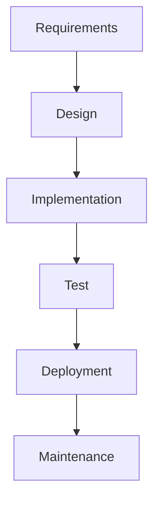
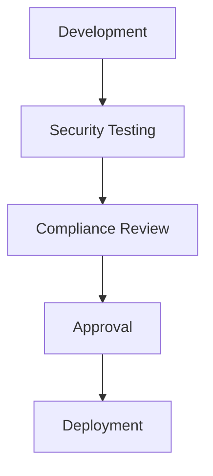
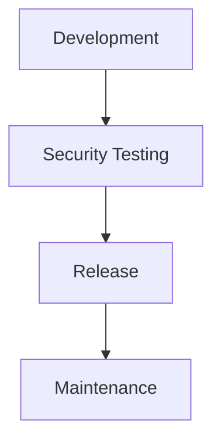
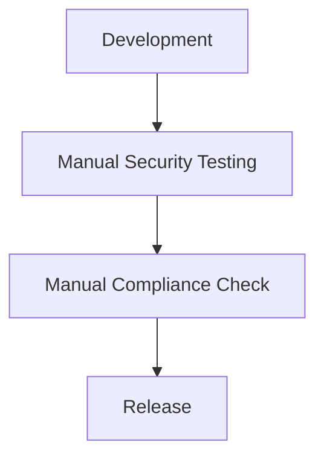

## Introduction to DevSecOps

### What is DevSecOps?

DevSecOps is an approach to software development that integrates security practices into the entire DevOps lifecycle. Traditionally, security was often treated as a separate phase, typically occurring late in the development process. However, with DevSecOps, security becomes a shared responsibility across all teams involved in the software development lifecycle (SDLC).

#### Why is DevSecOps Important?

In today’s fast-paced software development environment, organizations are increasingly adopting agile methodologies to deliver products quickly and efficiently. This shift towards continuous integration and delivery (CI/CD) has led to a need for integrating security practices seamlessly into these processes. DevSecOps aims to ensure that security is not an afterthought but is embedded throughout the development and deployment phases.

#### How Does DevSecOps Work?

DevSecOps operates on the principle of shifting left—integrating security practices earlier in the development cycle. This means incorporating security testing, threat modeling, and security compliance checks at every stage of the SDLC. By doing so, potential vulnerabilities can be identified and addressed early, reducing the overall risk and cost associated with fixing security issues later in the process.

### Challenges in Implementing DevSecOps

While DevSecOps offers numerous benefits, it also presents several challenges, especially when integrated into existing development environments. Understanding these challenges is crucial for successful implementation.

#### Waterfall Methodology

The waterfall methodology is a linear approach to project management, where each phase must be completed before moving on to the next. In such environments, integrating DevSecOps practices can be challenging due to the rigid structure of the workflow.

**Why is this a challenge?**

- **Sequential Phases:** In a waterfall model, security testing is typically performed at the end of the development cycle. Integrating DevSecOps practices requires breaking this sequential approach and embedding security checks throughout the development process.
- **Resistance to Change:** Teams accustomed to the waterfall methodology might resist the shift towards more iterative and collaborative practices required by DevSecOps.

**Example Scenario:**

Consider a financial services company that follows a strict waterfall methodology. They are looking to adopt DevSecOps to improve their security posture. However, their current process involves completing all development tasks before moving on to security testing. To integrate DevSecOps, they would need to restructure their workflow to allow for continuous security testing and feedback loops.

**How to Prevent / Defend:**

To address this challenge, organizations should:

- **Educate Teams:** Provide training and resources to help teams understand the benefits of DevSecOps and how it aligns with their existing workflows.
- **Incremental Integration:** Start by introducing small, incremental changes to the existing process. For example, incorporate automated security scans during the implementation phase.
- **Feedback Loops:** Establish mechanisms for continuous feedback between development and security teams to ensure that security concerns are addressed promptly.

#### Highly Regulated Environments

Highly regulated industries such as healthcare, finance, and government often have stringent requirements for software development. These regulations can make it difficult to implement DevSecOps practices due to the need for extensive documentation and approval processes.

**Why is this a challenge?**

- **Compliance Requirements:** Regulatory environments often require detailed documentation and approval processes for any changes made to the software development lifecycle. This can slow down the adoption of DevSecOps practices.
- **Risk Aversion:** Organizations in highly regulated industries tend to be risk-averse, making them hesitant to adopt new methodologies that could potentially introduce additional risks.

**Example Scenario:**

A healthcare provider is considering implementing DevSecOps to improve their security posture. However, they operate in a highly regulated environment where any changes to the software development process must be thoroughly documented and approved. To integrate DevSecOps, they would need to ensure that all security practices comply with regulatory requirements.

**How to Prevent / Defend:**

To address this challenge, organizations should:

- **Document Everything:** Maintain thorough documentation of all DevSecOps practices and ensure that they comply with regulatory requirements.
- **Collaborate with Compliance Teams:** Work closely with compliance teams to ensure that all security practices are aligned with regulatory standards.
- **Automate Compliance Checks:** Use tools that automate compliance checks to reduce the burden of manual documentation and review processes.

#### Infrequent Releases

Organizations that release software infrequently (e.g., once or twice a year) may not see the immediate benefits of DevSecOps. The continuous nature of DevSecOps is most effective in environments with frequent releases.

**Why is this a challenge?**

- **Limited Feedback Loops:** With infrequent releases, there are fewer opportunities for continuous feedback and improvement. This can make it difficult to identify and address security issues promptly.
- **Resource Allocation:** Implementing DevSecOps requires a significant investment in terms of time and resources. For organizations with infrequent releases, this investment may not yield immediate returns.

**Example Scenario:**

A government agency releases software updates only once a year. They are considering implementing DevSecOps to improve their security posture. However, given the infrequency of their releases, they may not see the immediate benefits of continuous security testing and feedback loops.

**How to Prevent / Defend:**

To address this challenge, organizations should:

- **Start Small:** Begin by implementing DevSecOps practices in smaller, more frequent projects to build momentum and demonstrate the benefits.
- **Focus on Critical Components:** Identify critical components of the system that require continuous security monitoring and focus DevSecOps efforts on these areas.
- **Invest in Automation:** Use automation tools to streamline security testing and compliance checks, reducing the resource burden associated with implementing DevSecOps.

#### Lack of Automation

Automation is a key component of DevSecOps. Without adequate automation, it is difficult to achieve the continuous and iterative nature of DevSecOps.

**Why is this a challenge?**

- **Manual Processes:** Manual processes are error-prone and time-consuming. Automating these processes can significantly improve efficiency and reduce the risk of human error.
- **Scalability Issues:** As the complexity of the system grows, manual processes become increasingly difficult to manage. Automation allows organizations to scale their security practices more effectively.

**Example Scenario:**

A startup is looking to implement DevSecOps to improve their security posture. However, they currently rely heavily on manual processes for security testing and compliance checks. To integrate DevSecOps, they would need to invest in automation tools to streamline these processes.

**How to Prevent / Defend:**

To address this challenge, organizations should:

- **Invest in Automation Tools:** Use tools like Jenkins, GitLab CI/CD, and SonarQube to automate security testing and compliance checks.
- **Implement Continuous Integration/Continuous Deployment (CI/CD):** Use CI/CD pipelines to automate the build, test, and deployment processes, ensuring that security checks are integrated at every stage.
- **Train Teams on Automation:** Provide training and resources to help teams understand how to use automation tools effectively.

### Real-World Examples

#### Recent Breaches and CVEs

Several recent breaches and CVEs highlight the importance of integrating security practices into the development lifecycle.

- **Equifax Data Breach (2017):** The Equifax data breach exposed sensitive information of over 143 million individuals. The breach was caused by a vulnerability in Apache Struts, which was not patched in a timely manner. This incident underscores the importance of continuous security monitoring and patch management.
- **Capital One Data Breach (2019):** The Capital One data breach exposed sensitive information of over 100 million customers. The breach was caused by a misconfigured firewall, which allowed unauthorized access to the data. This incident highlights the importance of secure coding practices and regular security audits.

#### Case Studies

- **Netflix:** Netflix is a well-known advocate of DevSecOps. They have implemented a culture of security where security is everyone’s responsibility. They use tools like Spinnaker for continuous delivery and SonarQube for static code analysis. This approach has helped them to identify and address security issues early in the development cycle.
- **Uber:** Uber faced several security incidents in recent years, including a data breach that exposed the personal information of millions of users. After these incidents, Uber shifted towards a DevSecOps approach, integrating security practices into their development process. They now use tools like Snyk for dependency scanning and Veracode for application security testing.

### Conclusion

Implementing DevSecOps requires careful consideration of the existing development environment and the challenges associated with integrating security practices. By addressing these challenges and leveraging automation tools, organizations can successfully adopt DevSecOps and improve their security posture.

### Further Reading and Practice Labs

For hands-on experience with DevSecOps, consider the following practice labs:

- **PortSwigger Web Security Academy:** Offers interactive labs to learn about web application security and DevSecOps practices.
- **OWASP Juice Shop:** A deliberately insecure web application to practice security testing and DevSecOps techniques.
- **DVWA (Damn Vulnerable Web Application):** A PHP/MySQL web application that is intentionally vulnerable for security testing and training purposes.

By combining theoretical knowledge with practical experience, you can gain a comprehensive understanding of DevSecOps and its benefits.

---
<!-- nav -->
[[DevSecOps/DevSecOps Bootcamp/01-DevSecOps Introduction/06-Identifying the Benefits of DevSecOps/Where Is DevSecOps Appropriate/01-Introduction to DevSecOps Part 1|Introduction to DevSecOps Part 1]] | [[DevSecOps/DevSecOps Bootcamp/01-DevSecOps Introduction/06-Identifying the Benefits of DevSecOps/Where Is DevSecOps Appropriate/00-Overview|Overview]] | [[DevSecOps/DevSecOps Bootcamp/01-DevSecOps Introduction/06-Identifying the Benefits of DevSecOps/Where Is DevSecOps Appropriate/03-Introduction to DevSecOps|Introduction to DevSecOps]]
