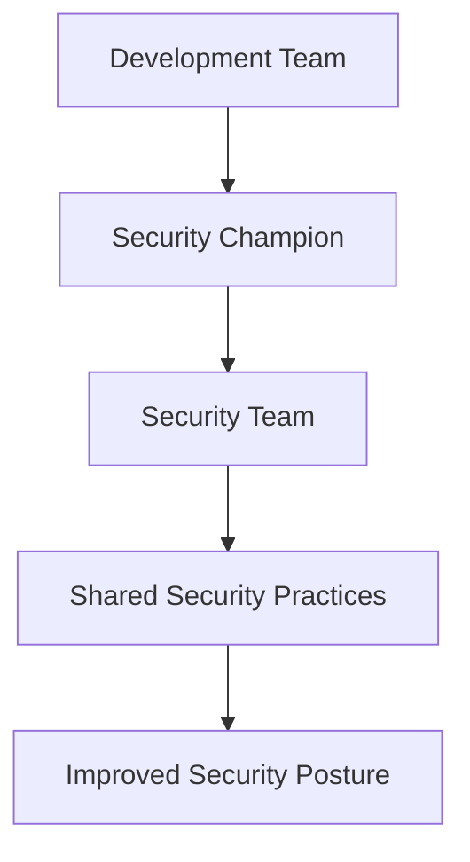
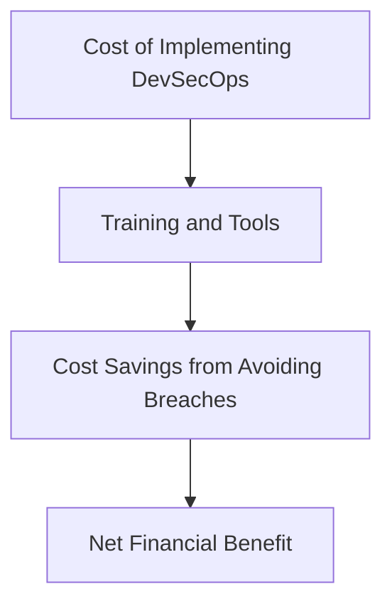

## Benefits of DevSecOps

### For Developers

#### Improved Security Posture

For developers, adopting DevSecOps can significantly improve the security posture of their code. By integrating security practices into the development workflow, developers can catch and address security issues early, reducing the likelihood of vulnerabilities making it into production.

#### Example: Static Code Analysis

One common practice in DevSecOps is static code analysis. Tools like SonarQube and Fortify can scan code for potential security vulnerabilities and coding errors. Here’s an example of how to integrate static code analysis into a CI/CD pipeline:

```yaml
# Jenkinsfile
pipeline {
    agent any
    stages {
        stage('Build') {
            steps {
                sh 'mvn clean package'
            }
        }
        stage('Static Code Analysis') {
            steps {
                sonarqube scanner: 'SonarQube', goals: 'sonar:sonar'
            }
        }
    }
}
```

#### How to Prevent / Defend

To prevent security issues, developers should regularly review and update their code based on the findings from static code analysis tools. They should also follow secure coding guidelines and best practices, such as those provided by the OWASP Top Ten.

### For Managers

#### Enhanced Collaboration

For managers, DevSecOps fosters a culture of collaboration and shared responsibility. By involving all stakeholders in the security process, managers can ensure that security is not overlooked and that everyone is aligned towards a common goal.

#### Example: Security Champions

One effective strategy is to appoint security champions within the development teams. These individuals act as liaisons between the security team and the development teams, ensuring that security practices are integrated into the development workflow.



#### How to Prevent / Defend

Managers should establish clear communication channels and regular meetings between the development and security teams. They should also provide training and resources to help developers understand and implement security best practices.

### For IT Security Professionals

#### Automated and Continuous Security Checking

IT security professionals benefit from the automated and continuous security checking that DevSecOps provides. This allows them to focus on higher-level security strategies and incident response, rather than manual security audits.

#### Example: Dynamic Application Security Testing (DAST)

Tools like OWASP ZAP and Burp Suite can perform dynamic application security testing, which involves simulating attacks on the application to identify vulnerabilities. Here’s an example of how to integrate DAST into a CI/CD pipeline:

```yaml
# Jenkinsfile
pipeline {
    agent any
    stages {
        stage('Build') {
            steps {
                sh 'mvn clean package'
            }
        }
        stage('Deploy') {
            steps {
                sh 'kubectl apply -f deployment.yaml'
            }
        }
        stage('Dynamic Security Testing') {
            steps {
                sh 'zap-baseline.py -t http://localhost:8080 -r report.html'
            }
        }
    }
}
```

#### How to Prevent / Defend

Security professionals should regularly review the results of automated security checks and work with development teams to address any identified vulnerabilities. They should also stay updated on the latest security threats and trends to ensure that their security practices remain effective.

### For IT Operations Teams

#### Reduced Security Incidents

IT operations teams benefit from reduced security incidents through the implementation of DevSecOps. By catching and addressing vulnerabilities early, operations teams can reduce the number of security incidents they need to handle.

#### Example: Infrastructure as Code (IaC)

Using Infrastructure as Code (IaC) tools like Terraform and Ansible can help ensure that infrastructure configurations are consistent and secure. Here’s an example of a Terraform configuration:

```hcl
# main.tf
provider "aws" {
  region = "us-west-2"
}

resource "aws_security_group" "web" {
  name        = "web"
  description = "Allow HTTP traffic"

  ingress {
    from_port   = 80
    to_port     = 80
    protocol    = "tcp"
    cidr_blocks = ["0.0.0.0/0"]
  }

  egress {
    from_port   = 0
    to_port     = 0
    protocol    = "-1"
    cidr_blocks = ["0.0.0.0/0"]
  }
}
```

#### How to Prevent / Defend

Operations teams should regularly review and audit their infrastructure configurations to ensure that they are secure. They should also implement monitoring and logging to detect and respond to security incidents quickly.

### For Finance and Cost Management

#### Cost Efficiency

From a financial perspective, DevSecOps can lead to significant cost savings by reducing the number of security incidents and the associated costs of remediation. By catching and addressing vulnerabilities early, organizations can avoid costly security breaches.

#### Example: Cost-Benefit Analysis

A cost-benefit analysis can help demonstrate the financial benefits of implementing DevSecOps. For example, the cost of implementing static code analysis tools and training developers can be offset by the savings from avoiding security breaches.



#### How to Prevent / Defend

Finance and cost management teams should work closely with development and security teams to ensure that security practices are implemented efficiently and cost-effectively. They should also conduct regular cost-benefit analyses to evaluate the financial impact of DevSecOps initiatives.

---
<!-- nav -->
[[DevSecOps/DevSecOps Bootcamp/01-DevSecOps Introduction/06-Identifying the Benefits of DevSecOps/Where Is DevSecOps Appropriate/03-Introduction to DevSecOps|Introduction to DevSecOps]] | [[DevSecOps/DevSecOps Bootcamp/01-DevSecOps Introduction/06-Identifying the Benefits of DevSecOps/Where Is DevSecOps Appropriate/00-Overview|Overview]] | [[DevSecOps/DevSecOps Bootcamp/01-DevSecOps Introduction/06-Identifying the Benefits of DevSecOps/Where Is DevSecOps Appropriate/05-Conclusion|Conclusion]]
