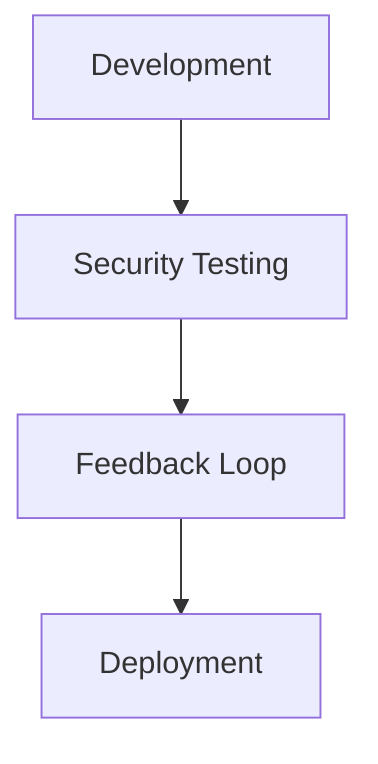

## Introduction to DevSecOps

### Issues with Traditional Approach to Security

In today’s fast-paced digital landscape, ensuring the security of applications is paramount. Whether it’s an online banking app, a social media platform, or an e-commerce site handling sensitive personal data, the potential consequences of a security breach can be catastrophic. This section delves into the challenges posed by traditional approaches to security and introduces the concept of DevSecOps as a solution.

#### The Importance of Security in Applications

Consider an online banking application. If this application were to suffer a security breach, the financial and reputational damage could be immense. Similarly, a social media platform with millions of users could face severe backlash if user data were leaked. E-commerce sites that handle credit card information and other sensitive personal data are also prime targets for cyberattacks. Therefore, it is crucial to ensure that there are no security holes in these applications before they are deployed to production.

#### Traditional Security Testing Process

Traditionally, the security testing process involves a dedicated security team that reviews the application for vulnerabilities and other security issues before deployment. This process often includes:

- **Code Analysis**: Reviewing the code changes to identify potential security flaws.
- **Library Vulnerabilities**: Checking if any new libraries used in the application have known vulnerabilities.
- **Licensing Requirements**: Ensuring that all libraries comply with their respective licensing terms.
- **Data Exposure**: Verifying that sensitive data such as passwords are properly protected.
- **Container Security**: Examining container images for any security issues.
- **Configuration Management**: Ensuring that Kubernetes components and other configurations are correctly set up.

#### Challenges with Traditional Security Approaches

Despite the thoroughness of traditional security testing, several challenges arise:

1. **Time Consumption**: Security testing can be time-consuming. For a simple application, it might take hours, but for a complex one, it could take days or even weeks. During this period, developers continue to work on new features and bug fixes, leading to a backlog of untested code.

2. **Backlog of Code Changes**: As the security team is busy testing one version, developers are already working on subsequent versions. This results in a growing queue of code changes awaiting security review.

3. **Awareness Gap**: Developers may not be fully aware of all the security implications of their code changes. This lack of awareness can lead to unintentional security vulnerabilities.

4. **Resource Constraints**: The security team may be understaffed or overwhelmed, leading to delays in testing and increased risk of vulnerabilities being missed.

#### Real-World Examples

Several high-profile breaches highlight the importance of robust security practices:

- **Equifax Breach (CVE-2017-5638)**: In 2017, Equifax suffered a massive data breach affecting over 143 million customers. The breach was caused by a vulnerability in Apache Struts, a web application framework. This incident underscores the critical nature of keeping third-party libraries up to date and thoroughly tested.

- **Capital One Breach (CVE-2019-11510)**: In 2019, Capital One experienced a data breach that exposed the personal information of over 100 million customers. The breach was due to a misconfiguration in a web application firewall, highlighting the importance of proper configuration management.

#### Traditional Security Testing Workflow

To better understand the traditional security testing workflow, consider the following scenario:

1. **Development Phase**: Developers write new code and integrate new libraries.
2. **Security Testing Phase**: The security team reviews the code and runs automated scans.
3. **Feedback Loop**: The security team identifies vulnerabilities and sends them back to the development team for fixing.
4. **Deployment Phase**: Once the vulnerabilities are fixed, the application is deployed to production.

This process can be visualized using a mermaid diagram:



#### Pitfalls of Traditional Security Approaches

The traditional approach to security testing has several inherent pitfalls:

1. **Delayed Feedback**: By the time vulnerabilities are identified, developers may have moved on to new tasks, leading to delays in fixing the issues.
2. **Fragmented Responsibility**: Security is often treated as a separate responsibility rather than an integral part of the development process.
3. **Manual Processes**: Many security checks are performed manually, increasing the likelihood of human error.
4. **Lack of Automation**: Without automation, the testing process becomes slow and inefficient.

#### How to Prevent / Defend Against Traditional Security Issues

To mitigate the risks associated with traditional security approaches, organizations can adopt several strategies:

1. **Shift Left on Security**: Integrate security practices earlier in the development lifecycle. This includes static code analysis, dependency scanning, and security training for developers.

2. **Automate Security Testing**: Use tools like SonarQube, OWASP ZAP, and Trivy to automate security testing. These tools can scan code for vulnerabilities and compliance issues.

3. **Continuous Integration/Continuous Deployment (CI/CD)**: Implement CI/CD pipelines that include security testing as part of the build process. This ensures that security checks are performed automatically and consistently.

4. **Secure Coding Practices**: Train developers in secure coding practices to reduce the likelihood of introducing vulnerabilities.

5. **Regular Security Audits**: Conduct regular security audits to identify and address any lingering issues.

#### Example of Secure Coding Practices

Consider a scenario where a developer is integrating a new library into an application. Here is an example of how to securely integrate a library:

**Vulnerable Code**:
```python
import requests

def fetch_data(url):
    response = requests.get(url)
    return response.json()
```

**Secure Code**:
```python
import requests

def fetch_data(url):
    try:
        response = requests.get(url, timeout=10)
        response.raise_for_status()  # Raise an exception for HTTP errors
        return response.json()
    except requests.exceptions.RequestException as e:
        print(f"Error fetching data: {e}")
        return None
```

In the secure version, we added a timeout to prevent hanging requests and checked for HTTP errors using `raise_for_status()`.

#### Configuration Management

Proper configuration management is crucial for maintaining the security of applications. Consider the following example of a Kubernetes deployment:

**Vulnerable Configuration**:
```yaml
apiVersion: apps/v1
kind: Deployment
metadata:
  name: my-app
spec:
  replicas: 3
  selector:
    matchLabels:
      app: my-app
  template:
    metadata:
      labels:
        app: my-app
    spec:
      containers:
      - name: my-container
        image: my-image:latest
        ports:
        - containerPort: 8080
```

**Secure Configuration**:
```yaml
apiVersion: apps/v1
kind: Deployment
metadata:
  name: my-app
spec:
  replicas: 3
  selector:
    matchLabels:
      app: my-app
  template:
    metadata:
      labels:
        app: my-app
    spec:
      containers:
      - name: my-container
        image: my-image:latest
        ports:
        - containerPort: 8080
        securityContext:
          readOnlyRootFilesystem: true
          runAsNonRoot: true
```

In the secure version, we added a `securityContext` to ensure that the container runs with non-root privileges and that the root filesystem is read-only.

#### Conclusion

Traditional security approaches often fall short in today’s fast-paced development environments. By adopting DevSecOps principles, organizations can integrate security practices throughout the development lifecycle, reducing the risk of vulnerabilities and improving overall security posture.

#### Practice Labs

For hands-on experience with DevSecOps concepts, consider the following labs:

- **PortSwigger Web Security Academy**: Offers interactive labs to practice web security techniques.
- **OWASP Juice Shop**: A deliberately insecure web application for practicing security testing.
- **DVWA (Damn Vulnerable Web Application)**: Another intentionally vulnerable web application for learning security testing.
- **WebGoat**: An interactive training application for learning about web application security.

These labs provide practical experience in identifying and mitigating security vulnerabilities, making them invaluable resources for mastering DevSecOps principles.

---
<!-- nav -->
[[DevSecOps/DevSecOps Bootcamp/01-DevSecOps Introduction/07-Introduction to DevSecOps/Issues with Traditional Approach to Security/00-Overview|Overview]] | [[DevSecOps/DevSecOps Bootcamp/01-DevSecOps Introduction/07-Introduction to DevSecOps/Issues with Traditional Approach to Security/02-Introduction to DevSecOps Part 2|Introduction to DevSecOps Part 2]]
