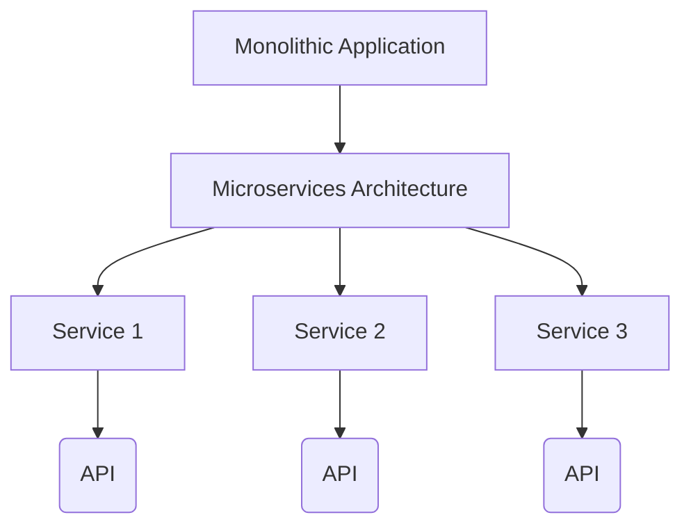
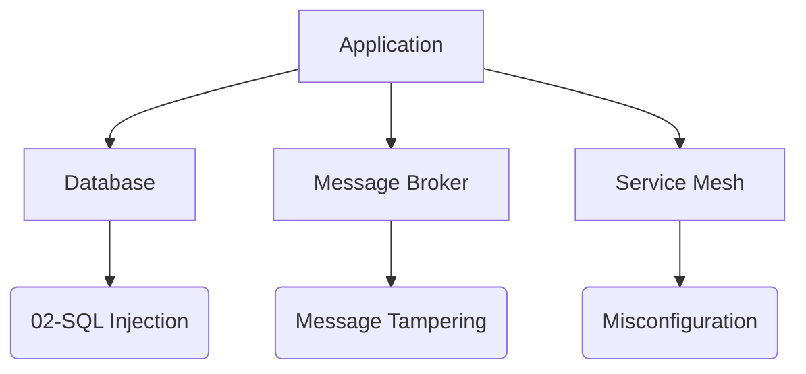
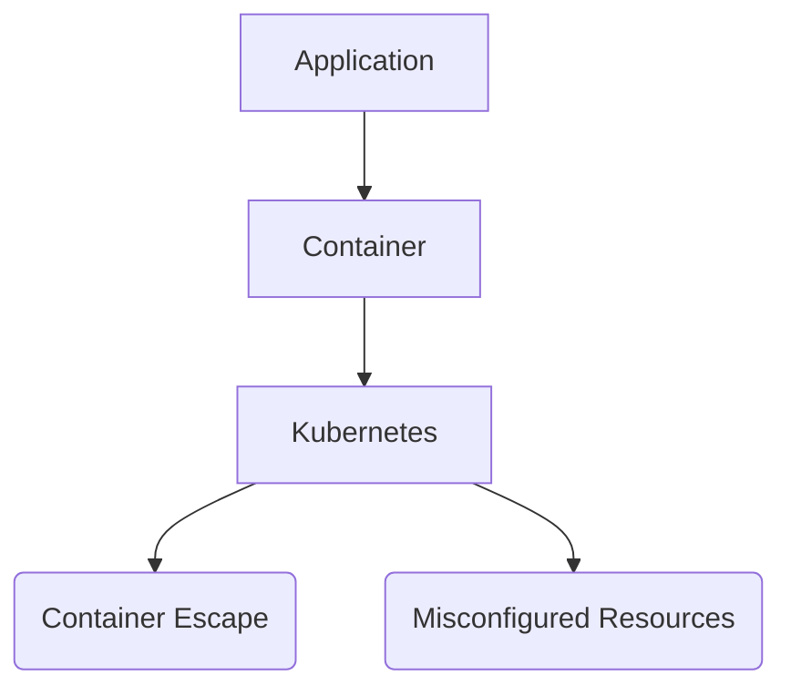
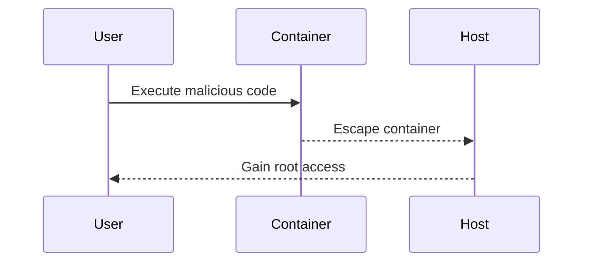
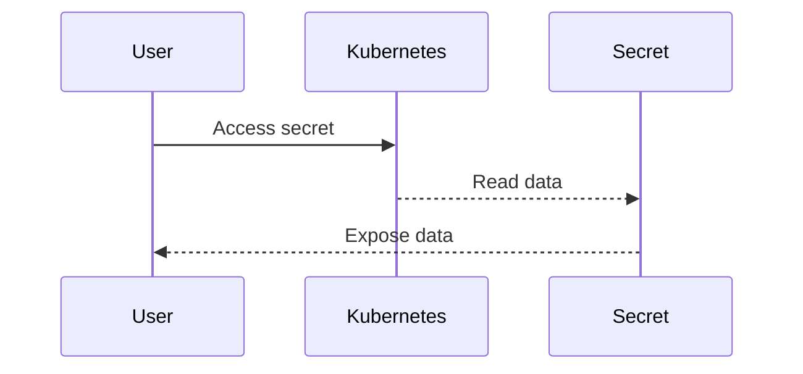

## Introduction to DevSecOps

### Issues with Traditional Approach to Security

In the traditional approach to software development and deployment, security is often treated as an afterthought. This can lead to significant delays and bottlenecks in the release process, especially when dealing with complex modern applications. Let's delve into why this happens and explore the challenges faced by security teams in today's rapidly evolving technological landscape.

#### Super Optimized DevOps Process

A super-optimized DevOps process typically involves continuous integration (CI) and continuous delivery (CD), where code changes are automatically tested and deployed to production environments. This streamlined workflow aims to reduce time-to-market and improve overall efficiency. However, when security checks and audits are integrated into this process, they can significantly delay the release cycle.

**Why Does Security Audit Take So Long?**

To understand why security audits become a bottleneck, it's essential to consider the evolution of applications over the past few years. Modern applications are no longer monolithic; they consist of numerous microservices that communicate through APIs. Each microservice adds to the attack surface, making security audits more complex and time-consuming.

**Microservices and APIs**

Microservices architecture breaks down large applications into smaller, independent services that can be developed, deployed, and scaled independently. These services communicate with each other via APIs, which can be RESTful, gRPC, or other protocols. While this architecture offers flexibility and scalability, it also increases the number of potential entry points for attackers.



**Attack Surface Expansion**

Each microservice introduces additional attack surfaces. For instance, a database service might be exposed to vulnerabilities such as SQL injection, while a message broker could be susceptible to message tampering or replay attacks. The increased complexity of modern applications means that security teams must thoroughly examine each component to ensure it is secure.

**Additional Components and Services**

Modern applications often rely on various supporting services, such as databases, message brokers, and service meshes. These components introduce additional layers of complexity and potential security risks. For example, a service mesh like Istio can help manage communication between microservices, but it also requires careful configuration to avoid misconfigurations that could lead to security issues.



**Containers and Cloud Platforms**

Many modern applications run in containers, which provide a lightweight and portable environment for deploying services. Containers can be managed using orchestration tools like Kubernetes, which further complicates the security landscape. Each container and orchestration layer introduces new security concerns, such as container escape vulnerabilities or misconfigured Kubernetes resources.



**Security Teams' Challenges**

Security teams face several challenges in this modern application landscape:

1. **Learning New Technologies**: Security professionals must continuously learn about new platforms and technologies, such as Kubernetes and microservices, to effectively identify and mitigate security risks.
2. **Tooling Limitations**: Many security tools were designed for traditional monolithic applications and may not be effective in a microservices environment. Security teams often need to find or create new tools to address the unique challenges of modern applications.

### Real-World Examples

Let's look at some recent real-world examples that highlight the challenges of traditional security approaches in modern applications.

#### Example 1: Docker Container Escape Vulnerability (CVE-2019-5736)

In 2019, a critical vulnerability was discovered in Docker, allowing attackers to escape from a container and gain root access to the host system. This vulnerability affected Docker versions 18.09.0 through 18.09.6 and was classified as a high-severity issue.

**Impact**: This vulnerability could allow an attacker to bypass container isolation and execute arbitrary code on the host system, leading to a complete compromise of the environment.

**Detection**: Organizations can detect this vulnerability by checking their Docker version and ensuring it is up-to-date. Regularly scanning container images for known vulnerabilities using tools like Trivy or Clair can help identify and mitigate such issues.

**Prevention**: To prevent this type of vulnerability, organizations should:

- Keep Docker and all related components up-to-date.
- Use container security tools to scan images for known vulnerabilities.
- Implement strict access controls and least privilege principles.



#### Example 2: Kubernetes Misconfiguration Leading to Data Exposure (CVE-2020-8558)

In 2020, a vulnerability was discovered in Kubernetes that allowed unauthorized access to sensitive data due to misconfigured RBAC (Role-Based Access Control) policies. This vulnerability affected Kubernetes versions 1.18.0 through 1.18.2 and was classified as a medium-severity issue.

**Impact**: This vulnerability could allow an attacker to read sensitive data stored in Kubernetes secrets or config maps, leading to data exposure and potential misuse.

**Detection**: Organizations can detect this vulnerability by reviewing their RBAC policies and ensuring they are correctly configured. Tools like kube-bench can help audit Kubernetes clusters for common misconfigurations.

**Prevention**: To prevent this type of vulnerability, organizations should:

- Regularly review and audit RBAC policies to ensure they are correctly configured.
- Use tools like kube-bench to perform security audits on Kubernetes clusters.
- Implement strict access controls and least privilege principles.



### How to Prevent / Defend

To effectively integrate security into the DevOps process, organizations should adopt a DevSecOps approach. This involves embedding security practices throughout the software development lifecycle, from design to deployment.

#### Secure Coding Practices

Secure coding practices are essential to prevent common vulnerabilities. For example, to prevent SQL injection attacks, developers should use parameterized queries or prepared statements.

**Vulnerable Code**:
```sql
SELECT * FROM users WHERE username = '$username';
```

**Secure Code**:
```sql
PreparedStatement stmt = connection.prepareStatement("SELECT * FROM users WHERE username = ?");
stmt.setString(1, username);
ResultSet rs = stmt.executeQuery();
```

#### Infrastructure as Code (IaC)

Using IaC tools like Terraform or Ansible allows organizations to define and manage infrastructure configurations in code. This makes it easier to enforce security policies consistently across all environments.

**Example Terraform Configuration**:
```hcl
resource "aws_security_group" "web" {
  name        = "web"
  description = "Allow HTTP traffic"

  ingress {
    from_port   = 80
    to_port     = 80
    protocol    = "tcp"
    cidr_blocks = ["0.0.0.0/0"]
  }

  egress {
    from_port   = 0
    to_port     = 0
    protocol    = "-1"
    cidr_blocks = ["0.0.0.0/0"]
  }
}
```

#### Continuous Security Testing

Continuous security testing involves integrating security checks into the CI/CD pipeline. This ensures that security issues are identified and addressed early in the development process.

**Example Jenkins Pipeline**:
```groovy
pipeline {
    agent any
    stages {
        stage('Build') {
            steps {
                sh 'mvn clean package'
            }
        }
        stage('Test') {
            steps {
                sh 'mvn test'
            }
        }
        stage('Security Scan') {
            steps {
                sh 'trivy image myapp:latest'
            }
        }
        stage('Deploy') {
            steps {
                sh 'kubectl apply -f k8s-deployment.yaml'
            }
        }
    }
}
```

#### Hands-On Labs

To practice and reinforce the concepts learned, consider the following hands-on labs:

- **PortSwigger Web Security Academy**: Offers interactive labs to practice web application security techniques.
- **OWASP Juice Shop**: A deliberately insecure web application for practicing web security skills.
- **DVWA (Damn Vulnerable Web Application)**: A PHP/MySQL web application that is riddled with vulnerabilities for educational purposes.
- **WebGoat**: An interactive training application designed to teach web application security lessons.

By adopting a DevSecOps approach and integrating security practices throughout the development lifecycle, organizations can reduce the likelihood of security bottlenecks and ensure that their applications are secure and reliable.

### Conclusion

The traditional approach to security often leads to significant delays and bottlenecks in the release process, especially in modern applications with complex architectures. By understanding the challenges faced by security teams and adopting a DevSecOps approach, organizations can integrate security seamlessly into their DevOps processes. This includes secure coding practices, infrastructure as code, continuous security testing, and hands-on labs to reinforce learning. By doing so, organizations can ensure that their applications are secure and reliable, reducing the risk of security vulnerabilities and delays in the release process.

---
<!-- nav -->
[[DevSecOps/DevSecOps Bootcamp/01-DevSecOps Introduction/07-Introduction to DevSecOps/Issues with Traditional Approach to Security/01-Introduction to DevSecOps Part 1|Introduction to DevSecOps Part 1]] | [[DevSecOps/DevSecOps Bootcamp/01-DevSecOps Introduction/07-Introduction to DevSecOps/Issues with Traditional Approach to Security/00-Overview|Overview]] | [[DevSecOps/DevSecOps Bootcamp/01-DevSecOps Introduction/07-Introduction to DevSecOps/Issues with Traditional Approach to Security/03-Introduction to DevSecOps Part 3|Introduction to DevSecOps Part 3]]
