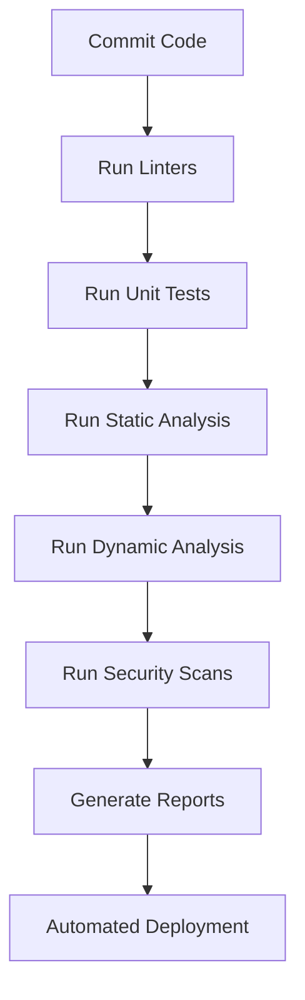
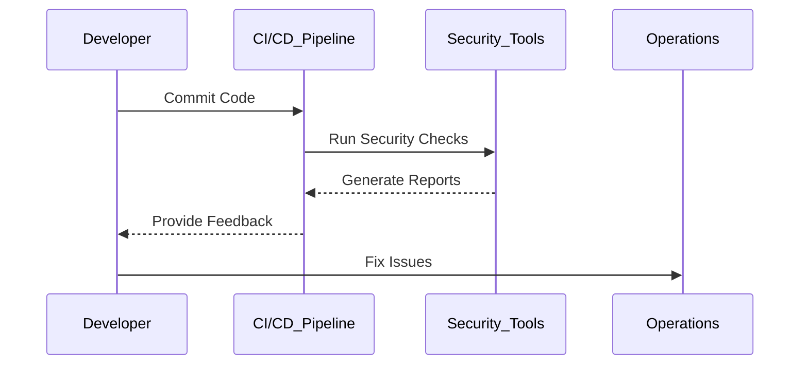

## Introduction to DevSecOps

### Issues with Traditional Approach to Security

In traditional software development processes, security was often treated as an afterthought. This approach, commonly referred to as the "waterfall model," involved a linear progression through various phases of development, testing, and deployment. Security was typically addressed late in the development lifecycle, often just before the final release. This method had several significant drawbacks:

1. **Delayed Feedback**: Security issues were identified late in the process, leading to costly rework and delays.
2. **Manual Processes**: Security assessments were often performed manually, which was time-consuming and prone to human error.
3. **Fragmented Teams**: Developers, operations teams, and security professionals worked in silos, leading to communication gaps and inefficiencies.

### DevSecOps: A Holistic Approach

DevSecOps aims to integrate security practices into the entire software development lifecycle, ensuring that security is a shared responsibility among all stakeholders. This approach leverages automation, continuous integration/continuous deployment (CI/CD) pipelines, and collaboration between development, operations, and security teams.

#### Integration of Security Tools in CI/CD Pipelines

One of the key aspects of DevSecOps is the integration of security tools and platforms into the CI/CD pipeline. These tools automate the process of identifying and addressing security vulnerabilities, allowing developers to receive immediate feedback on their code.



**Example Tools**:
- **Static Application Security Testing (SAST)**: Tools like SonarQube, Fortify, and Checkmarx analyze the source code for potential security vulnerabilities.
- **Dynamic Application Security Testing (DAST)**: Tools like Burp Suite, ZAP, and Acunetix simulate attacks to test the application's runtime behavior.
- **Dependency Scanning**: Tools like OWASP Dependency-Check and Snyk scan for known vulnerabilities in third-party libraries.

#### Automated Output and Feedback

When developers commit and push their code to a feature branch or the master branch, these security tools automatically run and generate reports. The reports provide detailed information about the security status of the application, including any issues and vulnerabilities that need to be fixed.

```http
POST /api/v1/pipelines/run HTTP/1.1
Host: ci-cd.example.com
Content-Type: application/json

{
  "branch": "feature/new-feature",
  "commit_id": "abc123def456",
  "actions": ["lint", "test", "static_analysis", "dynamic_analysis", "security_scan"]
}
```

```http
HTTP/1.1 200 OK
Content-Type: application/json

{
  "pipeline_id": "12345",
  "status": "success",
  "results": {
    "lint": { "issues": 0 },
    "test": { "passed": 100, "failed": 0 },
    "static_analysis": { "vulnerabilities": 2 },
    "dynamic_analysis": { "vulnerabilities": 1 },
    "security_scan": { "dependencies": 3 }
  }
}
```

#### Immediate Feedback Cycle

The immediate feedback cycle provided by DevSecOps ensures that developers are aware of security issues right after committing and pushing their code. This allows them to address the issues promptly, reducing the likelihood of security vulnerabilities making it to production.



### Benefits of DevSecOps

#### Faster Release Process

By automating security checks and integrating them into the CI/CD pipeline, the manual work of security professionals is reduced. This leads to a faster release process, as security issues are identified and resolved earlier in the development cycle.

#### Reduced Risk of Security Issues in Production

Having security checks earlier in the process significantly reduces the risk of security issues slipping into production. Fixing security issues in production is much more expensive due to the potential impact on users and the complexity of rolling out patches.

#### Efficient Issue Resolution

Identifying and fixing security issues in the feature branch is much more efficient. The short feedback cycle allows developers to address issues immediately, without the need for context switching. This results in faster resolution times and improved overall security posture.

### Real-World Examples

#### Recent CVEs and Breaches

Several recent CVEs and breaches highlight the importance of integrating security into the development process:

- **CVE-2021-44228 (Log4Shell)**: This critical vulnerability in the Apache Log4j library affected millions of applications worldwide. Integrating dependency scanning tools would have helped identify and mitigate this vulnerability earlier.
- **SolarWinds Supply Chain Attack (CVE-2020-1014)**: This sophisticated supply chain attack compromised numerous organizations. Implementing robust security checks and automated testing would have helped detect and prevent such attacks.

### How to Prevent / Defend

#### Detection

To effectively detect security issues, organizations should implement a comprehensive set of security tools and practices:

- **Continuous Monitoring**: Use tools like Splunk, ELK Stack, and Graylog to monitor application logs and network traffic for suspicious activity.
- **Vulnerability Scanning**: Regularly scan for known vulnerabilities using tools like Nessus, OpenVAS, and Qualys.
- **Penetration Testing**: Conduct regular penetration tests to identify and address security weaknesses.

#### Prevention

Preventing security issues requires a combination of secure coding practices, configuration hardening, and continuous improvement:

- **Secure Coding Practices**: Follow secure coding guidelines and best practices, such as those outlined in the OWASP Top Ten and the CERT Secure Coding Standards.
- **Configuration Hardening**: Harden system configurations to minimize attack surfaces. Use tools like Ansible, Puppet, and Chef to manage and enforce secure configurations.
- **Continuous Improvement**: Regularly review and update security policies and procedures to stay ahead of emerging threats.

#### Secure-Coding Fixes

Here is an example of a vulnerable code snippet and its secure counterpart:

**Vulnerable Code**:
```python
import os

def read_file(filename):
    with open(filename, 'r') as f:
        return f.read()
```

**Secure Code**:
```python
import os

def read_file(filename):
    if not os.path.isfile(filename):
        raise ValueError("File does not exist")
    with open(filename, 'r') as f:
        return f.read()
```

### Complete Example: CI/CD Pipeline Configuration

Here is a complete example of a CI/CD pipeline configuration using Jenkins:

**Jenkinsfile**:
```groovy
pipeline {
    agent any

    stages {
        stage('Checkout') {
            steps {
                git 'https://github.com/example/repo.git'
            }
        }

        stage('Lint') {
            steps {
                sh 'npm run lint'
            }
        }

        stage('Test') {
            steps {
                sh 'npm run test'
            }
        }

        stage('Static Analysis') {
            steps {
                sh 'sonar-scanner'
            }
        }

        stage('Dynamic Analysis') {
            steps {
                sh 'zap-baseline.py -t http://localhost:3000'
            }
        }

        stage('Security Scan') {
            steps {
                sh 'dependency-check --project "My Project" --scan .'
            }
        }

        stage('Deploy') {
            steps {
                sh 'kubectl apply -f k8s/deployment.yaml'
            }
        }
    }

    post {
        success {
            echo 'Pipeline completed successfully!'
        }
        failure {
            echo 'Pipeline failed!'
        }
    }
}
```

### Hands-On Labs

For hands-on practice with DevSecOps concepts, consider the following labs:

- **PortSwigger Web Security Academy**: Offers interactive labs to learn about web application security.
- **OWASP Juice Shop**: A deliberately insecure web application for practicing security testing.
- **DVWA (Damn Vulnerable Web Application)**: A PHP/MySQL web application that is riddled with vulnerabilities for educational purposes.
- **WebGoat**: An interactive training application designed to teach web application security lessons.

### Conclusion

DevSecOps represents a significant shift in how security is integrated into the software development lifecycle. By automating security checks and providing immediate feedback, DevSecOps helps reduce the risk of security issues reaching production, leading to faster and more secure releases. Understanding and implementing DevSecOps principles is crucial for modern software development teams.

---
<!-- nav -->
[[DevSecOps/DevSecOps Bootcamp/01-DevSecOps Introduction/07-Introduction to DevSecOps/Issues with Traditional Approach to Security/02-Introduction to DevSecOps Part 2|Introduction to DevSecOps Part 2]] | [[DevSecOps/DevSecOps Bootcamp/01-DevSecOps Introduction/07-Introduction to DevSecOps/Issues with Traditional Approach to Security/00-Overview|Overview]] | [[DevSecOps/DevSecOps Bootcamp/01-DevSecOps Introduction/07-Introduction to DevSecOps/Issues with Traditional Approach to Security/04-Introduction to DevSecOps Part 4|Introduction to DevSecOps Part 4]]
