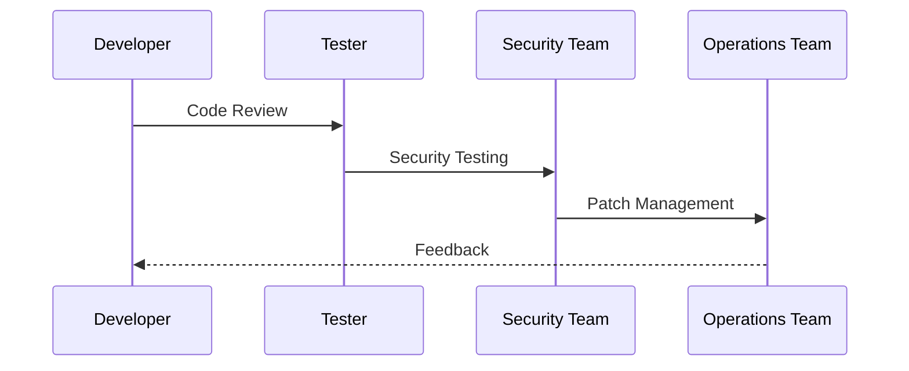
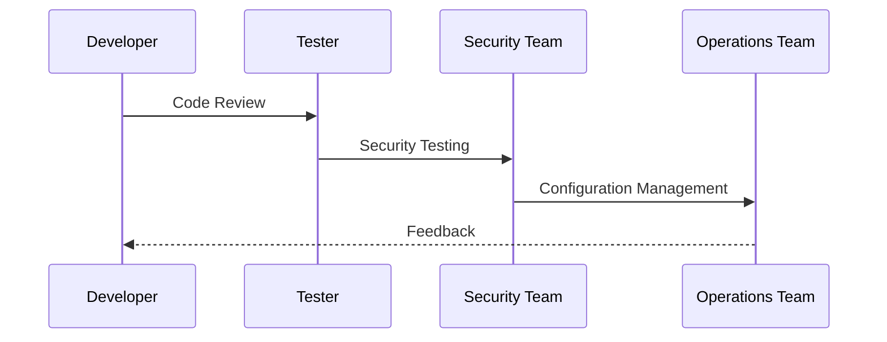

## Introduction to DevSecOps

### Issues with Traditional Approach to Security

In traditional software development processes, security is often treated as an afterthought. This means that security validation and testing occur after the application has been developed and deployed. This approach has several significant drawbacks:

1. **Increased Cost**: Identifying and fixing security issues late in the development cycle is more expensive. Changes made at this stage often require extensive rework, which can delay the project and increase costs.
2. **Reduced Quality**: Security vulnerabilities that are discovered late may not be thoroughly addressed due to time constraints, leading to lower overall quality of the product.
3. **Delayed Deployment**: Security issues found during post-deployment testing can cause delays in releasing the product to the market, potentially losing competitive advantage.
4. **Risk Exposure**: Deploying insecure applications exposes organizations to potential attacks, data breaches, and other security incidents, which can result in financial losses, reputational damage, and legal consequences.

### Shifting Security Left

To address these issues, the concept of "shifting security left" has emerged. This approach emphasizes integrating security practices throughout the entire software development lifecycle (SDLC), starting from the initial stages of planning and design.

#### What is Shifting Security Left?

Shifting security left means incorporating security considerations into every phase of the SDLC, including requirements gathering, design, coding, testing, and deployment. By doing so, security becomes an integral part of the development process rather than an afterthought.

#### Why Shift Security Left?

1. **Cost Efficiency**: Addressing security issues early in the development process is less costly than fixing them later. Early detection and mitigation reduce the overall cost of security.
2. **Improved Quality**: Integrating security practices throughout the development process leads to higher-quality products with fewer vulnerabilities.
3. **Faster Time-to-Market**: By identifying and addressing security issues early, the development process can proceed more smoothly, reducing delays caused by security concerns.
4. **Reduced Risk**: Proactively addressing security risks reduces the likelihood of deploying insecure applications, thereby minimizing exposure to security incidents.

### Threat Modeling and Secure Design

One of the key aspects of shifting security left is threat modeling and secure design. These practices involve identifying potential security threats and designing systems to mitigate those threats from the outset.

#### What is Threat Modeling?

Threat modeling is the process of identifying and analyzing potential security threats to a system. It involves understanding the assets that need protection, the potential threats to those assets, and the vulnerabilities that could be exploited.

#### Why Perform Threat Modeling?

1. **Proactive Security**: Threat modeling helps identify potential security issues before they become problems, allowing developers to proactively address them.
2. **Risk Management**: By understanding the potential threats and vulnerabilities, organizations can prioritize their security efforts and allocate resources effectively.
3. **Secure Architecture**: Threat modeling informs the design of secure architectures, ensuring that security is built into the system from the beginning.

#### How to Perform Threat Modeling

1. **Identify Assets**: Determine the critical assets that need protection, such as sensitive data, intellectual property, and critical infrastructure.
2. **Identify Threat Agents**: Identify potential threat agents, such as malicious insiders, external attackers, and natural disasters.
3. **Identify Vulnerabilities**: Identify potential vulnerabilities in the system that could be exploited by threat agents.
4. **Analyze Threats**: Analyze the potential threats and their impact on the system.
5. **Mitigate Risks**: Develop strategies to mitigate identified risks, such as implementing security controls, conducting regular security assessments, and training personnel.

### Real-World Examples

#### Example 1: Equifax Data Breach (CVE-2017-5638)

The Equifax data breach in 2017 exposed the personal information of approximately 147 million individuals. The breach was caused by a vulnerability in the Apache Struts framework, which was not patched in a timely manner.

**What Went Wrong:**
- Lack of proactive security measures.
- Failure to patch known vulnerabilities.
- Inadequate threat modeling and secure design practices.

**How to Prevent:**
- Implement a robust patch management process.
- Conduct regular security assessments and threat modeling.
- Ensure that security is integrated into the development process from the beginning.

#### Example 2: Capital One Data Breach (CVE-2019-11510)

The Capital One data breach in 2019 exposed the personal information of approximately 100 million customers. The breach was caused by a misconfiguration in a web application firewall (WAF).

**What Went Wrong:**
- Misconfiguration of security controls.
- Lack of proper threat modeling and secure design practices.
- Inadequate security testing and validation.

**How to Prevent:**
- Implement strict configuration management practices.
- Conduct regular security assessments and threat modeling.
- Ensure that security is integrated into the development process from the beginning.

### Secure Coding Practices

Secure coding practices are essential for building secure applications. These practices involve writing code that is free from common security vulnerabilities and follows best practices for security.

#### Common Security Vulnerabilities

1. **Injection Attacks**: Injection attacks occur when untrusted data is sent as part of a command or query. Common types of injection attacks include SQL injection, command injection, and cross-site scripting (XSS).
2. **Broken Authentication**: Broken authentication occurs when an application fails to properly authenticate users, allowing unauthorized access to sensitive data.
3. **Sensitive Data Exposure**: Sensitive data exposure occurs when sensitive data is not properly protected, allowing unauthorized access to the data.
4. **Cross-Site Request Forgery (CSRF)**: CSRF occurs when an attacker tricks a user into performing an unintended action on a website where they are authenticated.
5. **Security Misconfiguration**: Security misconfiguration occurs when an application is not properly configured, allowing unauthorized access to sensitive data or functionality.

#### How to Prevent Common Security Vulnerabilities

1. **Input Validation**: Validate all input data to ensure that it meets the expected format and length.
2. **Use Parameterized Queries**: Use parameterized queries to prevent SQL injection attacks.
3. **Implement Strong Authentication Mechanisms**: Implement strong authentication mechanisms, such as multi-factor authentication (MFA), to prevent unauthorized access.
4. **Encrypt Sensitive Data**: Encrypt sensitive data both in transit and at rest to protect it from unauthorized access.
5. **Use Secure Session Management**: Use secure session management techniques, such as setting the `HttpOnly` and `Secure` flags on cookies, to prevent session hijacking.

### Real-World Example: Heartbleed Bug (CVE-2014-0160)

The Heartbleed bug was a serious vulnerability in the OpenSSL cryptographic software library. The vulnerability allowed attackers to read sensitive data from the memory of servers and clients using OpenSSL.

**What Went Wrong:**
- Buffer overflow vulnerability in the OpenSSL library.
- Lack of proper input validation and boundary checks.

**How to Prevent:**
- Implement proper input validation and boundary checks.
- Conduct regular security assessments and code reviews.
- Ensure that security is integrated into the development process from the beginning.

### Hands-On Labs

To gain practical experience with DevSecOps principles, consider the following hands-on labs:

1. **PortSwigger Web Security Academy**: Offers a comprehensive set of labs covering various web security topics, including secure coding practices and threat modeling.
2. **OWASP Juice Shop**: A deliberately insecure web application designed to teach web security concepts through interactive challenges.
3. **DVWA (Damn Vulnerable Web Application)**: A PHP/MySQL web application that demonstrates common web application vulnerabilities.
4. **WebGoat**: An interactive training application designed to teach web security concepts through a series of lessons and challenges.

By integrating security practices throughout the development process, organizations can build more secure applications and reduce the risk of security incidents. Shifting security left is a fundamental principle of DevSecOps, and by following this approach, organizations can achieve better security outcomes.

### Conclusion

Shifting security left is a critical aspect of DevSecOps that emphasizes integrating security practices throughout the entire software development lifecycle. By incorporating security considerations from the beginning, organizations can build more secure applications, reduce costs, improve quality, and minimize risk exposure. Threat modeling and secure design are essential components of this approach, helping to identify and mitigate potential security threats from the outset. By following secure coding practices and conducting regular security assessments, organizations can ensure that their applications are secure and resilient against potential attacks.

---
<!-- nav -->
[[DevSecOps/DevSecOps Bootcamp/01-DevSecOps Introduction/07-Introduction to DevSecOps/Issues with Traditional Approach to Security/03-Introduction to DevSecOps Part 3|Introduction to DevSecOps Part 3]] | [[DevSecOps/DevSecOps Bootcamp/01-DevSecOps Introduction/07-Introduction to DevSecOps/Issues with Traditional Approach to Security/00-Overview|Overview]] | [[05-Introduction to DevSecOps|Introduction to DevSecOps]]
