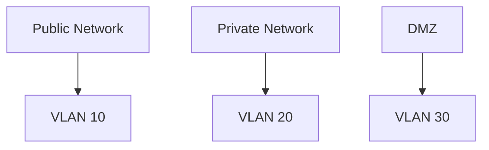

## Introduction to DevSecOps

### Understanding Security in the Software Development Lifecycle

In the traditional approach to software development, security was often treated as an afterthought. Developers would build applications and then hand them off to a separate security team for testing and validation. This siloed approach led to numerous issues, including delays, increased costs, and, most critically, vulnerabilities that could be exploited by attackers. In contrast, DevSecOps integrates security practices throughout the entire software development lifecycle (SDLC), ensuring that security is a shared responsibility among all stakeholders.

#### What is Security Posture?

Security posture refers to the overall state of an organization’s security measures and their effectiveness in protecting against threats. It encompasses various aspects of security, including:

- **Application Security**: Ensuring that the application itself is secure.
- **Runtime Security**: Protecting the environment in which the application runs.
- **Release Pipeline Security**: Securing the processes used to deploy and update the application.
- **Infrastructure Security**: Protecting the underlying hardware and software infrastructure.

In DevSecOps, the goal is to continuously monitor and improve the security posture of the system. This involves automating checks and validations at every stage of the SDLC to ensure that security measures are in place and effective.

### How Does DevSecOps Automate Security Validation?

One of the key advantages of DevSecOps is its ability to automate the validation of security posture across all layers of the system. This automation is achieved through a combination of tools, processes, and practices designed to identify and mitigate security risks.

#### Tools and Technologies

Several tools and technologies are commonly used in DevSecOps to automate security validation:

- **Static Application Security Testing (SAST)**: Analyzes the source code to identify potential security vulnerabilities.
- **Dynamic Application Security Testing (DAST)**: Tests the application in a live environment to identify runtime vulnerabilities.
- **Dependency Scanning**: Checks for known vulnerabilities in third-party libraries and dependencies.
- **Configuration Management**: Ensures that infrastructure configurations adhere to security best practices.
- **Continuous Integration/Continuous Deployment (CI/CD) Pipelines**: Integrates security checks into the deployment process to catch issues early.

#### Example: SAST Tool Integration

Consider the following example where a SAST tool is integrated into a CI/CD pipeline:

```yaml
# Jenkinsfile
pipeline {
    agent any
    stages {
        stage('Build') {
            steps {
                sh 'mvn clean package'
            }
        }
        stage('Test') {
            steps {
                sh 'mvn test'
            }
        }
        stage('Security Scan') {
            steps {
                sh 'sonar-scanner'
            }
        }
    }
}
```

In this example, the `SonarScanner` is used to perform static analysis on the source code. The results are then analyzed to identify potential security vulnerabilities.

### Who is Responsible for Fixing Security Issues?

In a traditional security model, the responsibility for fixing security issues often falls on a dedicated security team. However, in DevSecOps, security is a shared responsibility among all stakeholders, including developers, operations teams, and security professionals.

#### Roles and Responsibilities

To effectively manage security in a DevSecOps environment, it is essential to define clear roles and responsibilities:

- **Developers**: Responsible for writing secure code and addressing security issues identified during the development process.
- **Operations Teams**: Ensure that the runtime environment and infrastructure are secure.
- **Security Professionals**: Provide guidance on security best practices and help validate the security posture of the system.

#### Example: Role-Based Access Control (RBAC)

Role-based access control (RBAC) can be used to define and enforce roles and responsibilities within a DevSecOps environment. Consider the following example using Kubernetes RBAC:

```yaml
# kubernetes-rbac.yaml
apiVersion: rbac.authorization.k8s.io/v1
kind: ClusterRole
metadata:
  name: developer
rules:
- apiGroups: ["*"]
  resources: ["pods", "deployments"]
  verbs: ["get", "list", "watch", "create", "update", "patch", "delete"]

---
apiVersion: rbac.authorization.k8s.io/v1
kind: ClusterRoleBinding
metadata:
  name: developer-binding
subjects:
- kind: User
  name: developer-user
roleRef:
  kind: ClusterRole
  name: developer
  apiGroup: rbac.authorization.k8s.io
```

In this example, a `ClusterRole` named `developer` is defined with specific permissions to manage pods and deployments. A `ClusterRoleBinding` is then created to bind this role to a specific user.

### Real-World Examples and Case Studies

To better understand the importance of DevSecOps, let's examine some real-world examples and case studies.

#### Example: Equifax Data Breach (CVE-2017-5638)

The Equifax data breach in 2017 exposed sensitive information of over 143 million people. The breach was caused by a vulnerability in the Apache Struts framework, which was not patched in a timely manner. This incident highlights the importance of continuous monitoring and patch management in a DevSecOps environment.

#### Example: Capital One Data Breach (CVE-2019-11510)

The Capital One data breach in 2019 exposed the personal information of over 100 million customers. The breach was caused by a misconfiguration in the web application firewall, which allowed unauthorized access to sensitive data. This incident underscores the importance of securing the runtime environment and infrastructure in a DevSecOps environment.

### How to Prevent and Defend Against Security Risks

To effectively prevent and defend against security risks in a DevSecOps environment, it is essential to implement a comprehensive set of security measures.

#### Secure Coding Practices

Secure coding practices involve writing code that is free from vulnerabilities and adheres to security best practices. This includes:

- **Input Validation**: Ensuring that all input is validated to prevent injection attacks.
- **Error Handling**: Properly handling errors to prevent information leakage.
- **Authentication and Authorization**: Implementing strong authentication and authorization mechanisms.

#### Example: Input Validation in Python

Consider the following example of input validation in Python:

```python
def safe_input(user_input):
    if not isinstance(user_input, str):
        raise ValueError("Input must be a string")
    if len(user_input) > 100:
        raise ValueError("Input too long")
    return user_input

try:
    user_input = safe_input(input("Enter your input: "))
    print(f"Valid input: {user_input}")
except ValueError as e:
    print(f"Invalid input: {e}")
```

In this example, the `safe_input` function validates the user input to ensure it is a string and does not exceed a certain length.

#### Infrastructure Hardening

Infrastructure hardening involves securing the underlying hardware and software infrastructure to prevent unauthorized access. This includes:

- **Network Segmentation**: Dividing the network into segments to limit the spread of attacks.
- **Firewall Configuration**: Configuring firewalls to restrict access to critical systems.
- **Patch Management**: Regularly applying security patches to address known vulnerabilities.

#### Example: Network Segmentation Using VLANs

Consider the following example of network segmentation using VLANs:



In this example, the network is divided into three segments: public, private, and DMZ. Each segment is isolated using VLANs to prevent unauthorized access.

### Conclusion

DevSecOps represents a significant shift in the way security is managed in the software development lifecycle. By integrating security practices throughout the SDLC, organizations can improve their security posture and reduce the risk of vulnerabilities. This requires a collaborative effort among all stakeholders, including developers, operations teams, and security professionals. By implementing a comprehensive set of security measures, organizations can effectively prevent and defend against security risks in a DevSecOps environment.

### Practice Labs

For hands-on experience with DevSecOps concepts, consider the following practice labs:

- **PortSwigger Web Security Academy**: Offers interactive labs to learn about web application security.
- **OWASP Juice Shop**: A deliberately insecure web application for practicing security skills.
- **DVWA (Damn Vulnerable Web Application)**: A PHP/MySQL web application that contains a large number of security vulnerabilities.
- **WebGoat**: An interactive, gamified training application for learning about web application security.

These labs provide practical experience in identifying and mitigating security risks in a DevSecOps environment.

---
<!-- nav -->
[[DevSecOps/DevSecOps Bootcamp/01-DevSecOps Introduction/07-Introduction to DevSecOps/Issues with Traditional Approach to Security/04-Introduction to DevSecOps Part 4|Introduction to DevSecOps Part 4]] | [[DevSecOps/DevSecOps Bootcamp/01-DevSecOps Introduction/07-Introduction to DevSecOps/Issues with Traditional Approach to Security/00-Overview|Overview]] | [[06-Balancing Non-Functional Requirements in Traditional Development|Balancing Non-Functional Requirements in Traditional Development]]
