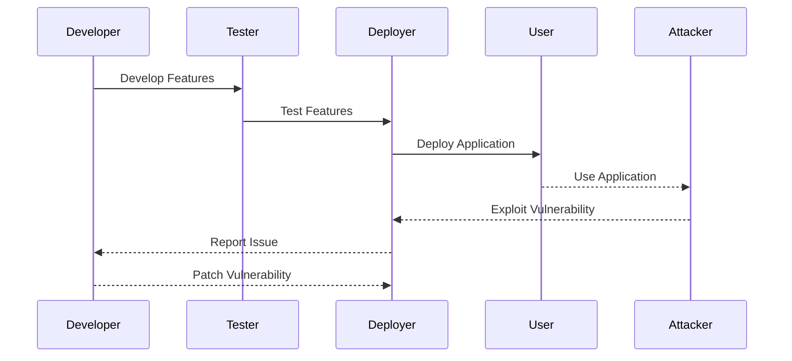
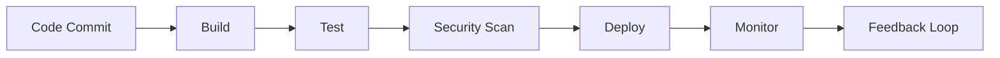

## Balancing Non-Functional Requirements in Traditional Development

In traditional software development, the primary focus is often on delivering functional requirements—features that directly contribute to the core functionality of the application or service. However, non-functional requirements such as reliability, dependability, and security are equally critical. These non-functional aspects ensure that the system operates correctly under various conditions and remains robust against potential threats.

### Reliability

Reliability refers to the ability of a system to perform consistently and predictably over time. This includes handling errors gracefully and maintaining availability even under stress. In the context of web applications, reliability can be measured by uptime, error rates, and the system’s ability to recover from failures.

### Dependability

Dependability encompasses several qualities including availability, reliability, maintainability, and safety. A dependable system is one that can be trusted to operate correctly and safely under all anticipated conditions. This is particularly important in systems where failure could have significant consequences, such as financial transactions or medical devices.

### Security

Security ensures that the system is protected against unauthorized access, data breaches, and other malicious activities. It involves implementing measures to safeguard sensitive information and prevent unauthorized actions.

### Traditional Approach to Security

Traditionally, security was treated as an afterthought. Developers focused on delivering features quickly, often prioritizing speed over thorough security considerations. Once the application was deployed, security vulnerabilities were addressed through patch management cycles. This approach has several drawbacks:

1. **Delayed Detection**: Security issues are identified only after the application is in production, leading to potential exploitation.
2. **Technical Debt**: Quick deployment can result in technical debt, where security vulnerabilities accumulate over time.
3. **Reactive Fixes**: Patching vulnerabilities after they are discovered is reactive rather than proactive, leaving the system exposed during the interim period.

### Real-World Example: Equifax Data Breach

The Equifax data breach in 2017 is a prime example of the risks associated with treating security as an afterthought. The breach exposed sensitive personal information of approximately 147 million consumers. The vulnerability exploited was a flaw in the Apache Struts framework, which had been patched months earlier. However, Equifax failed to apply the necessary updates, leading to a catastrophic breach.



### Shift Left Approach in DevSecOps

DevSecOps aims to integrate security practices throughout the entire software development lifecycle, shifting the focus to the left—earlier in the process. This means identifying and addressing security issues as early as possible, ideally before the application reaches production.

#### Early Identification

By incorporating security testing and analysis tools into the development pipeline, teams can catch vulnerabilities early. This includes static code analysis, dynamic application security testing (DAST), and interactive application security testing (IAST).

#### Continuous Integration/Continuous Deployment (CI/CD)

In a CI/CD pipeline, security checks are automated and integrated into the build process. This ensures that security is continuously monitored and maintained throughout the development cycle.



### Real-World Example: Capital One Data Breach

The Capital One data breach in 2019 involved the theft of sensitive customer data due to a misconfigured web application firewall. The attacker exploited a vulnerability in the firewall, which was not properly configured to restrict access. This breach highlights the importance of comprehensive security practices and continuous monitoring.

### How to Prevent / Defend

To effectively prevent security issues in traditional development approaches, several strategies can be employed:

#### Secure Coding Practices

Implementing secure coding practices is crucial. This includes using secure libraries, avoiding common vulnerabilities like SQL injection and cross-site scripting (XSS), and following best practices for input validation and output encoding.

**Vulnerable Code Example:**
```python
# Vulnerable Code
import sqlite3
def get_user_data(username):
    conn = sqlite3.connect('database.db')
    cursor = conn.cursor()
    query = f"SELECT * FROM users WHERE username = '{username}'"
    cursor.execute(query)
    return cursor.fetchall()
```

**Secure Code Example:**
```python
# Secure Code
import sqlite3
def get_user_data(username):
    conn = sqlite3.connect('database.db')
    cursor = conn.cursor()
    query = "SELECT * FROM users WHERE username = ?"
    cursor.execute(query, (username,))
    return cursor.fetchall()
```

#### Regular Security Audits

Regular security audits and penetration testing help identify vulnerabilities before they can be exploited. Automated tools can be used to scan for known vulnerabilities and provide recommendations for remediation.

#### Configuration Management

Proper configuration management ensures that security settings are correctly applied and maintained. This includes securing network configurations, database settings, and application configurations.

#### Monitoring and Logging

Continuous monitoring and logging are essential for detecting and responding to security incidents. Tools like SIEM (Security Information and Event Management) systems can help in aggregating and analyzing logs from various sources.

### Conclusion

Traditional approaches to security often treat it as an afterthought, leading to delayed detection and reactive fixes. By adopting a DevSecOps mindset, teams can shift the focus to the left, integrating security practices throughout the development lifecycle. This proactive approach helps in identifying and addressing vulnerabilities early, reducing the risk of security breaches.

### Practice Labs

For hands-on experience with DevSecOps principles, consider the following labs:

- **PortSwigger Web Security Academy**: Offers a variety of challenges and labs to practice web security concepts.
- **OWASP Juice Shop**: An intentionally insecure web application for learning web security.
- **DVWA (Damn Vulnerable Web Application)**: A PHP/MySQL web application that demonstrates insecure coding practices.

These labs provide practical experience in identifying and fixing security vulnerabilities, reinforcing the principles of DevSecOps.

---
<!-- nav -->
[[05-Introduction to DevSecOps|Introduction to DevSecOps]] | [[DevSecOps/DevSecOps Bootcamp/01-DevSecOps Introduction/07-Introduction to DevSecOps/Issues with Traditional Approach to Security/00-Overview|Overview]] | [[07-Issues with Traditional Approach to Security|Issues with Traditional Approach to Security]]
