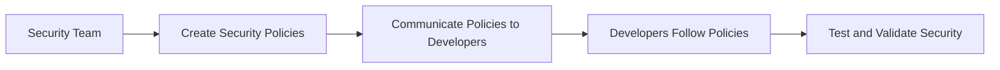
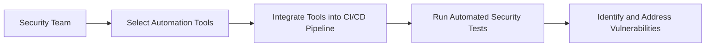
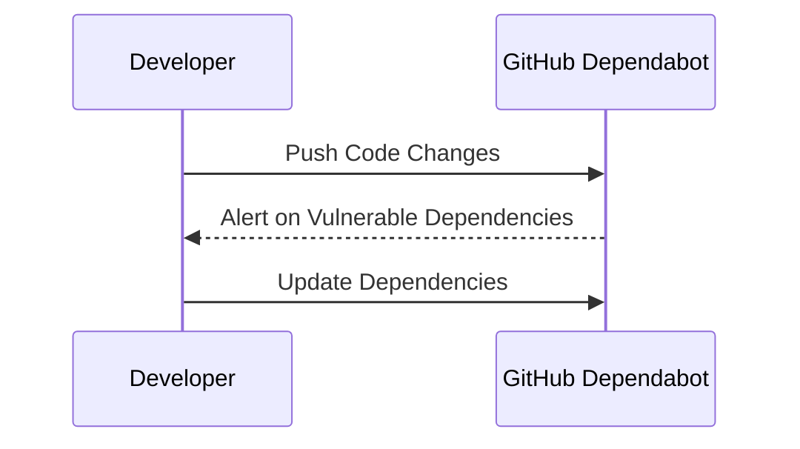

## Issues with Traditional Approach to Security

### Background Theory

In traditional software development processes, security was often treated as an afterthought. This approach, commonly referred to as "shift-right," meant that security considerations were typically addressed late in the development lifecycle, usually during the testing phase or even post-deployment. This method had several significant drawbacks:

1. **Increased Costs**: Fixing security issues later in the development process is significantly more expensive. According to a study by the National Institute of Standards and Technology (NIST), fixing a security issue in production can cost up to 100 times more than fixing it during the design phase.

2. **Delayed Releases**: Security bottlenecks often caused delays in product releases. This delay can be particularly problematic in fast-paced environments where rapid deployment is crucial.

3. **Reduced Quality**: Security issues that are not caught early can lead to lower overall product quality. This can result in vulnerabilities that may be exploited by malicious actors, leading to data breaches and other security incidents.

4. **Fragmented Responsibility**: In traditional approaches, security was often the sole responsibility of a dedicated security team. This fragmentation led to a lack of ownership among developers, who might not fully understand the importance of security practices.

### Real-World Examples

One notable example of the consequences of a shift-right approach is the Equifax breach in 2017. The breach exposed sensitive personal information of approximately 147 million consumers. The vulnerability exploited was a flaw in Apache Struts, which had been patched months earlier. However, due to the delayed security testing and patching process, the vulnerability remained unaddressed until it was exploited. This incident highlights the critical importance of integrating security throughout the development lifecycle.

### Shift-Left Security

To address these issues, the concept of "shift-left" security has emerged. Shift-left security emphasizes integrating security practices early in the development process, ideally from the very beginning. This approach aims to make security a shared responsibility among all stakeholders, including developers, operations teams, and security professionals.

#### Key Principles of Shift-Left Security

1. **Security as a Shared Responsibility**: Developers are encouraged to take ownership of security, ensuring that security practices are integrated into their daily workflows. This includes writing secure code, conducting regular security reviews, and using automated security tools.

2. **Continuous Integration and Continuous Deployment (CI/CD)**: Security practices are integrated into the CI/CD pipeline, allowing for continuous monitoring and testing of security vulnerabilities. This ensures that security issues are identified and addressed as early as possible.

3. **Automated Security Testing**: Automated tools are used to scan code for vulnerabilities, perform static and dynamic analysis, and conduct penetration testing. These tools help identify potential security issues before they become critical.

4. **Security Policies and Guidelines**: Clear security policies and guidelines are established and communicated to all stakeholders. These policies provide a framework for secure development practices and ensure consistency across the organization.

### Implementation of Shift-Left Security

#### Role of the Security Team

In a shift-left approach, the role of the security team changes from being a gatekeeper to becoming a facilitator and advisor. The security team is responsible for creating and maintaining security policies, selecting appropriate automation tools, and providing guidance to developers and operations teams.

##### Creating Security Policies

Security policies define the rules and guidelines that developers must follow to ensure the security of the application. These policies cover various aspects such as coding standards, authentication and authorization mechanisms, data protection, and incident response procedures.



##### Selecting Automation Tools

Automation tools play a crucial role in shift-left security. These tools help automate the process of identifying and addressing security vulnerabilities. Some popular automation tools include:

- **Static Application Security Testing (SAST)**: Tools like SonarQube and Fortify analyze the source code to identify potential security vulnerabilities.
- **Dynamic Application Security Testing (DAST)**: Tools like Burp Suite and OWASP ZAP simulate attacks on the running application to identify vulnerabilities.
- **Dependency Scanning**: Tools like Snyk and WhiteSource scan dependencies for known vulnerabilities.
- **Code Quality Checks**: Tools like ESLint and Pylint enforce coding standards and identify potential security issues.



#### Developer Responsibilities

In a shift-left approach, developers are responsible for writing secure code and following security best practices. This includes:

- **Writing Secure Code**: Developers should follow secure coding guidelines and best practices. This includes using secure libraries, implementing proper input validation, and avoiding common security pitfalls such as SQL injection and cross-site scripting (XSS).

- **Conducting Regular Security Reviews**: Developers should regularly review their code for security vulnerabilities. This can be done through peer code reviews, static analysis tools, and manual testing.

- **Using Automated Security Tools**: Developers should integrate automated security tools into their development workflow. This includes running static and dynamic analysis tools, dependency scanners, and code quality checks.

### Real-World Example: GitHub Dependabot

GitHub Dependabot is a tool that automatically identifies and alerts users about vulnerable dependencies in their repositories. This tool helps developers stay informed about potential security risks and take action to mitigate them.



### Pitfalls and Common Mistakes

Despite the benefits of shift-left security, there are several pitfalls and common mistakes that organizations should be aware of:

1. **Over-reliance on Automation**: While automation tools are essential, they should not be the sole reliance for security. Manual testing and code reviews are still necessary to catch issues that automated tools might miss.

2. **Lack of Training and Awareness**: Developers may not have the necessary training and awareness to write secure code. Organizations should invest in security training programs to ensure that developers understand security best practices.

3. **Resistance to Change**: Transitioning to a shift-left approach requires a cultural change within the organization. Resistance from developers and other stakeholders can hinder the adoption of shift-left security practices.

### How to Prevent / Defend

#### Detection

To effectively detect security vulnerabilities, organizations should implement a comprehensive security testing strategy that includes both automated and manual testing methods. This strategy should cover the entire development lifecycle, from initial code commits to production deployments.


#### Prevention

Preventing security vulnerabilities requires a combination of secure coding practices, robust security policies, and effective use of automation tools. Here are some key steps to prevent security issues:

1. **Secure Coding Practices**: Developers should follow secure coding guidelines and best practices. This includes using secure libraries, implementing proper input validation, and avoiding common security pitfalls such as SQL injection and XSS.

2. **Robust Security Policies**: Clear security policies should be established and communicated to all stakeholders. These policies provide a framework for secure development practices and ensure consistency across the organization.

3. **Effective Use of Automation Tools**: Automation tools should be integrated into the development workflow to identify and address security vulnerabilities early in the development process.

#### Secure-Coding Fixes

Here is an example of a vulnerable code snippet and its secure counterpart:

**Vulnerable Code:**
```python
import sqlite3

def get_user_data(username):
    conn = sqlite3.connect('database.db')
    cursor = conn.cursor()
    cursor.execute(f"SELECT * FROM users WHERE username = '{username}'")
    user_data = cursor.fetchone()
    conn.close()
    return user_data
```

**Secure Code:**
```python
import sqlite3

def get_user_data(username):
    conn = sqlite3.connect('database.db')
    cursor = conn.cursor()
    cursor.execute("SELECT * FROM users WHERE username = ?", (username,))
    user_data = cursor.fetchone()
    conn.close()
    return user_data
```

In the secure code, parameterized queries are used to prevent SQL injection attacks.

#### Configuration Hardening

Configuration hardening is another important aspect of preventing security vulnerabilities. This involves securing the environment in which the application runs. Here is an example of securing an Nginx server configuration:

**Insecure Configuration:**
```nginx
server {
    listen 80;
    server_name example.com;

    location / {
        root /var/www/html;
        index index.html index.htm;
    }
}
```

**Secure Configuration:**
```nginx
server {
    listen 80 default_server;
    server_name example.com;

    location / {
        root /var/www/html;
        index index.html index.htm;
        try_files $uri $uri/ =404;
    }

    location ~* \.(js|css|png|jpg|jpeg|gif)$ {
        expires max;
        log_not_found off;
    }

    location ~ /\.ht {
        deny all;
    }
}
```

In the secure configuration, additional security measures such as `try_files`, `expires`, and `deny` directives are added to enhance security.

### Practice Labs

For hands-on experience with DevSecOps principles, consider the following well-known labs:

- **PortSwigger Web Security Academy**: Offers interactive labs to learn web security concepts and techniques.
- **OWASP Juice Shop**: A deliberately insecure web application for practicing web security skills.
- **DVWA (Damn Vulnerable Web Application)**: A PHP/MySQL web application that is riddled with vulnerabilities for educational purposes.
- **WebGoat**: An interactive, gamified training application for learning about web application security.

These labs provide practical experience in applying DevSecOps principles and techniques.

### Conclusion

Shift-left security is a critical approach to integrating security practices early in the development lifecycle. By making security a shared responsibility among all stakeholders, organizations can reduce costs, improve quality, and enhance overall security. Implementing a comprehensive security testing strategy, following secure coding practices, and using automation tools are key steps to achieving a successful shift-left approach.

---
<!-- nav -->
[[06-Balancing Non-Functional Requirements in Traditional Development|Balancing Non-Functional Requirements in Traditional Development]] | [[DevSecOps/DevSecOps Bootcamp/01-DevSecOps Introduction/07-Introduction to DevSecOps/Issues with Traditional Approach to Security/00-Overview|Overview]] | [[08-Roles and Responsibilities in Traditional Security Approaches|Roles and Responsibilities in Traditional Security Approaches]]
