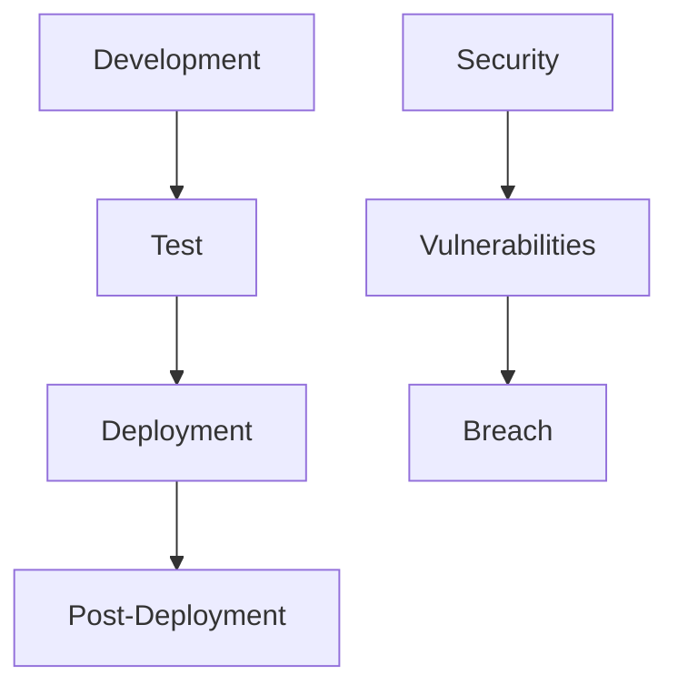
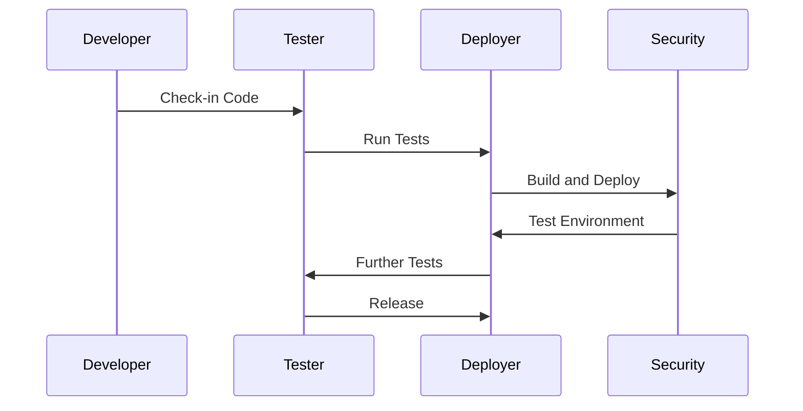
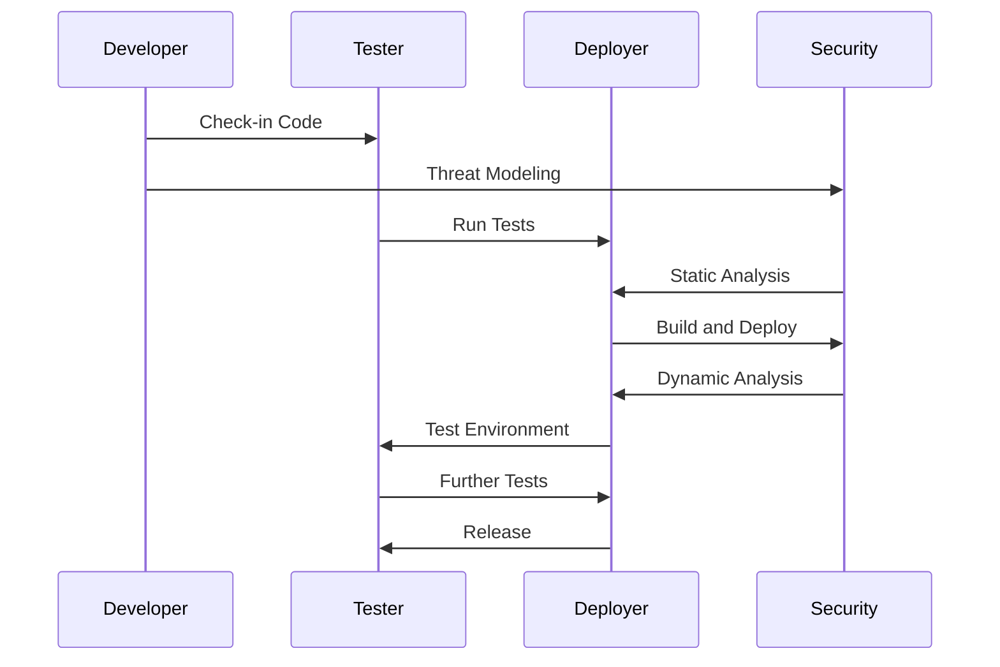

## Roles and Responsibilities in Traditional Security Approaches

### Understanding the Old Way of Doing Security

In traditional software development processes, security was often treated as an afterthought. This means that security considerations were typically addressed late in the development cycle, often during the testing phase or even post-deployment. This approach can be summarized as "Security as an Afterthought."

#### What is "Security as an Afterthought"?

"Security as an Afterthought" refers to a development methodology where security is not integrated into the design and development process from the beginning. Instead, security measures are added later, often as a reactive measure to address vulnerabilities discovered during testing or post-deployment.

#### Why is "Security as an Afterthought" Problematic?

The primary issue with treating security as an afterthought is that it can lead to significant vulnerabilities being overlooked until late in the development cycle. At this stage, fixing these vulnerabilities can be costly and time-consuming, potentially requiring major rework of the codebase. Additionally, security issues discovered post-deployment can result in severe consequences, such as data breaches, loss of customer trust, and legal repercussions.

### Real-World Example: Equifax Data Breach

One of the most notable examples of the consequences of treating security as an afterthought is the Equifax data breach in 2017. In this case, Equifax failed to patch a known vulnerability in their Apache Struts framework, leading to the exposure of sensitive personal information of approximately 147 million consumers. This breach resulted in significant financial losses and damage to Equifax's reputation.



### The Traditional Development Flow

To better understand the traditional approach, let's examine a typical development flow:

1. **Development**: Developers write code and check it into the version control system.
2. **Testing**: Automated tests are run to ensure the code functions correctly.
3. **Build and Deployment**: The code is built and deployed to a test environment.
4. **Further Testing**: More automated tests are run in the test environment.
5. **Release**: If all tests pass, the new version is released to production.

This streamlined and automated flow makes application delivery fast and efficient. However, it often overlooks security considerations, leading to potential vulnerabilities.

### Shifting Security Left

To address the shortcomings of the traditional approach, the concept of "Shifting Security Left" was introduced. This approach emphasizes integrating security practices into the early stages of the development lifecycle.

#### What is "Shifting Security Left"?

"Shifting Security Left" means incorporating security practices into the earliest stages of the development process, starting from requirements gathering and design. This includes activities such as threat modeling, security code reviews, and static application security testing (SAST).

#### Why Shift Security Left?

By shifting security left, organizations can identify and mitigate security risks earlier in the development cycle, reducing the cost and complexity of addressing these issues. This proactive approach helps ensure that security is an integral part of the development process rather than an afterthought.

### Modern DevSecOps Flow

Let's compare the traditional flow with a modern DevSecOps flow:

#### Traditional Flow



#### DevSecOps Flow



### How to Prevent / Defend Against Security as an Afterthought

#### Detection

To detect security issues early, organizations should implement continuous integration and continuous deployment (CI/CD) pipelines that include automated security testing tools. These tools can help identify vulnerabilities in the codebase before it reaches production.

#### Prevention

Preventing security as an afterthought requires a cultural shift within the organization. This includes:

1. **Training and Awareness**: Educate developers and other stakeholders about the importance of security and provide them with the necessary training to integrate security practices into their workflows.
2. **Threat Modeling**: Conduct regular threat modeling sessions to identify potential security risks and design mitigations.
3. **Static Application Security Testing (SAST)**: Use SAST tools to analyze the codebase for security vulnerabilities.
4. **Dynamic Application Security Testing (DAST)**: Use DAST tools to test the application in a runtime environment for security vulnerabilities.
5. **Code Reviews**: Implement regular code reviews to ensure that security best practices are followed.

#### Secure Coding Practices

Here is an example of how to implement secure coding practices in a real-world scenario:

**Vulnerable Code**

```python
def login(username, password):
    if username == "admin" and password == "password":
        return True
    else:
        return False
```

**Secure Code**

```python
import hashlib

def hash_password(password):
    return hashlib.sha256(password.encode()).hexdigest()

def login(username, password):
    stored_password_hash = "5e884898da28047151d0e56f8dc6292773603d0d6aabbdd62a11ef721d1542d8"  # Hashed "password"
    if username == "admin" and hash_password(password) == stored_password_hash:
        return True
    else:
        return False
```

### Conclusion

In conclusion, the traditional approach to security, where security is treated as an afterthought, can lead to significant vulnerabilities and security breaches. By shifting security left and integrating security practices into the early stages of the development lifecycle, organizations can proactively address security risks and ensure that security is an integral part of the development process. This approach not only reduces the cost and complexity of addressing security issues but also helps build more secure and resilient applications.

### Practice Labs

For hands-on experience with DevSecOps principles, consider the following labs:

- **PortSwigger Web Security Academy**: Offers interactive labs to learn about web application security.
- **OWASP Juice Shop**: A deliberately insecure web application for practicing web security skills.
- **DVWA (Damn Vulnerable Web Application)**: Another intentionally vulnerable web application for learning web security.
- **WebGoat**: A deliberately insecure Java application designed to teach web application security lessons.

These labs provide practical experience in identifying and mitigating security vulnerabilities, helping to reinforce the concepts learned in this chapter.

---
<!-- nav -->
[[07-Issues with Traditional Approach to Security|Issues with Traditional Approach to Security]] | [[DevSecOps/DevSecOps Bootcamp/01-DevSecOps Introduction/07-Introduction to DevSecOps/Issues with Traditional Approach to Security/00-Overview|Overview]] | [[DevSecOps/DevSecOps Bootcamp/01-DevSecOps Introduction/07-Introduction to DevSecOps/Issues with Traditional Approach to Security/09-Practice Questions & Answers|Practice Questions & Answers]]
