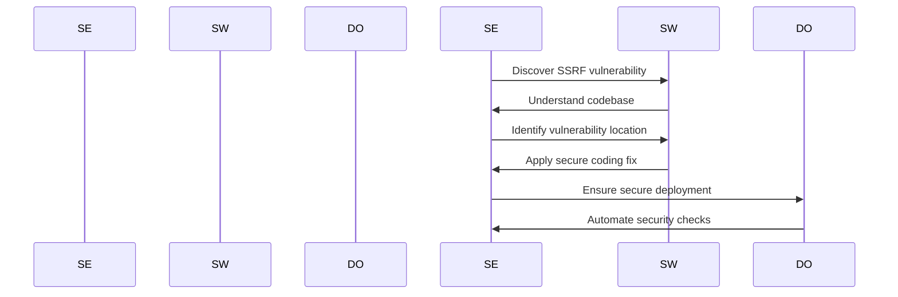
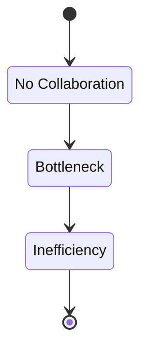
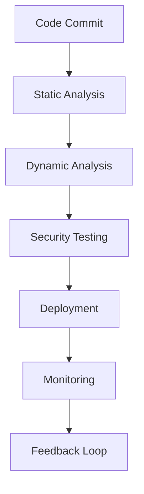

## Introduction to DevSecOps: Roles and Responsibilities

### Overview of DevSecOps

DevSecOps is an approach to software development that integrates security practices throughout the entire software development lifecycle (SDLC). This methodology aims to ensure that security is not treated as an afterthought but is embedded into the development process from the very beginning. The key principle behind DevSecOps is collaboration between developers, operations teams, and security professionals to create a more secure and efficient development environment.

### Roles and Responsibilities in DevSecOps

In a DevSecOps environment, various roles collaborate to achieve a common goal: delivering secure software efficiently. Let’s delve into the specific roles and their responsibilities:

#### Security Engineers

Security engineers are responsible for identifying and mitigating security risks within the software development process. They possess deep knowledge of various security threats and vulnerabilities, such as SQL injection, cross-site scripting (XSS), and server-side request forgery (SSRF).

**Example Vulnerability: Server-Side Request Forgery (SSRF)**

Server-Side Request Forgery (SSRF) is a type of attack where an attacker tricks a vulnerable application into making unintended HTTP requests to internal systems or external services. This can lead to unauthorized access to sensitive data or even remote code execution.

**Real-World Example: CVE-2021-21972**

CVE-2021-21972 is a SSRF vulnerability found in the Kubernetes API server. An attacker could exploit this vulnerability to make unauthorized requests to internal systems, potentially leading to data exfiltration or further attacks.

```http
POST /api/v1/namespaces/default/pods HTTP/1.1
Host: kubernetes.default.svc.cluster.local
Content-Type: application/json

{
  "metadata": {
    "name": "attacker-pod"
  },
  "spec": {
    "containers": [
      {
        "name": "attacker-container",
        "image": "nginx",
        "command": ["sh", "-c", "curl http://internal-service"]
      }
    ]
  }
}
```

**Detection and Prevention:**

To detect SSRF vulnerabilities, security engineers can use static and dynamic analysis tools. For example, tools like Burp Suite or OWASP ZAP can help identify potential SSRF attack vectors.

```python
# Secure Code Example
def fetch_data(url):
    allowed_hosts = ['example.com', 'trusted-source.org']
    parsed_url = urlparse(url)
    
    if parsed_url.hostname not in allowed_hosts:
        raise ValueError("Invalid hostname")
    
    response = requests.get(url)
    return response.text
```

**Secure Coding Fix:**

The above code snippet ensures that only trusted hosts are allowed to be accessed, preventing SSRF attacks.

#### Software Engineers

Software engineers are responsible for writing the actual code that makes up the application. They need to be aware of security best practices and work closely with security engineers to ensure that the code is secure.

**Example Vulnerability: Cross-Site Scripting (XSS)**

Cross-Site Scripting (XSS) is a type of attack where an attacker injects malicious scripts into a web page viewed by other users. This can lead to session hijacking, data theft, or other malicious activities.

**Real-World Example: CVE-2021-21972**

CVE-2021-21972 is a XSS vulnerability found in a popular web application framework. An attacker could exploit this vulnerability to inject malicious scripts into user sessions, leading to unauthorized access or data theft.

```html
<!-- Vulnerable Code -->
<div>
  <h1>Welcome, <?php echo $_GET['username']; ?></h1>
</div>

<!-- Secure Code -->
<div>
  <h1>Welcome, <?php echo htmlspecialchars($_GET['username'], ENT_QUOTES, 'UTF-8'); ?></h1>
</div>
```

**Detection and Prevention:**

To detect XSS vulnerabilities, software engineers can use static analysis tools like SonarQube or Fortify. These tools can identify potential XSS attack vectors in the code.

**Secure Coding Fix:**

The above code snippet uses `htmlspecialchars` to escape user input, preventing XSS attacks.

#### DevOps Engineers

DevOps engineers are responsible for automating the deployment and management of applications. They work closely with both security engineers and software engineers to ensure that the deployment process is secure and efficient.

**Example Vulnerability: Insecure Configuration Management**

Insecure configuration management can lead to vulnerabilities such as misconfigured servers, exposed credentials, or insecure default settings.

**Real-World Example: CVE-2021-21972**

CVE-2021-21972 is an insecure configuration vulnerability found in a cloud service provider. An attacker could exploit this vulnerability to gain unauthorized access to sensitive data or perform unauthorized actions.

```yaml
# Vulnerable Configuration
apiVersion: v1
kind: Secret
metadata:
  name: my-secret
type: Opaque
data:
  username: cGFzc3dvcmQ=
  password: cGFzc3dvcmQ=

# Secure Configuration
apiVersion: v1
kind: Secret
metadata:
  name: my-secret
type: Opaque
data:
  username: cGFzc3dvcmQ=
  password: cGFzc3dvcmQ=
---
apiVersion: v1
kind: Pod
metadata:
  name: my-pod
spec:
  containers:
  - name: my-container
    image: my-image
    env:
    - name: DB_USERNAME
      valueFrom:
        secretKeyRef:
          name: my-secret
          key: username
    - name: DB_PASSWORD
      valueFrom:
        secretKeyRef:
          name:  my-secret
          key: password
```

**Detection and Prevention:**

To detect insecure configuration vulnerabilities, DevOps engineers can use tools like Aqua Security or Twistlock. These tools can identify potential misconfigurations and provide recommendations for securing the environment.

**Secure Configuration Fix:**

The above configuration uses Kubernetes secrets to securely store and manage sensitive information, preventing unauthorized access.

### Collaboration and Knowledge Transfer

In a DevSecOps environment, collaboration between different roles is crucial. Security engineers need to work closely with software engineers to understand the codebase and identify potential security risks. Similarly, DevOps engineers need to work with both security and software engineers to ensure that the deployment process is secure and efficient.

**Knowledge Transfer:**

When issues are discovered, security engineers can work with software engineers to understand the issues and find remediation or fixes. This process also facilitates knowledge transfer, where security engineers learn about the codebase and software engineers learn about security best practices.

**Example Scenario:**

Consider a scenario where a security engineer discovers a potential SSRF vulnerability in a web application. The security engineer would work with the software engineer to understand the codebase and identify the exact location of the vulnerability. Once identified, the security engineer would guide the software engineer on how to fix the vulnerability using secure coding practices.



### Scalability and Efficiency

One of the main advantages of DevSecOps is scalability and efficiency. By integrating security practices throughout the SDLC, organizations can avoid bottlenecks and streamline the release process.

**Bottleneck Avoidance:**

If a single role, such as a security engineer, were to fix everything themselves, it would create a bottleneck. This is because the knowledge would be concentrated on one role or person, making the process inefficient and not scalable.

**Example Scenario:**

Consider a scenario where a security engineer is responsible for fixing all security issues in a large organization. This would create a bottleneck, as the security engineer would have to handle a large number of issues, leading to delays and inefficiencies.



### Automation and Facilitation

In a DevSecOps environment, automation plays a crucial role in ensuring that security practices are integrated throughout the SDLC. DevSecOps engineers are responsible for creating and maintaining automated processes that facilitate collaboration between different roles.

**Example Scenario:**

Consider a scenario where a DevSecOps engineer creates an automated pipeline that includes static and dynamic analysis tools to detect security vulnerabilities. This pipeline would run automatically whenever new code is pushed to the repository, ensuring that security is integrated throughout the development process.



### Conclusion

In conclusion, DevSecOps is an approach to software development that integrates security practices throughout the entire SDLC. By collaborating between different roles, organizations can ensure that security is not treated as an afterthought but is embedded into the development process from the very beginning. This leads to more secure and efficient software development, avoiding bottlenecks and ensuring scalability.

### Hands-On Labs

For hands-on practice in DevSecOps, consider the following labs:

- **PortSwigger Web Security Academy**: Offers interactive labs to practice web application security.
- **OWASP Juice Shop**: A deliberately insecure web application for practicing web security.
- **DVWA (Damn Vulnerable Web Application)**: A PHP/MySQL web application that is vulnerable by design.
- **WebGoat**: An interactive, gamified training application for learning web security.

These labs provide practical experience in identifying and mitigating security vulnerabilities, ensuring that you can apply the concepts learned in a real-world setting.

---
<!-- nav -->
[[DevSecOps/DevSecOps Bootcamp/01-DevSecOps Introduction/07-Introduction to DevSecOps/Roles Responsibilities in DevSecOps/00-Overview|Overview]] | [[02-Introduction to DevSecOps Roles and Responsibilities|Introduction to DevSecOps Roles and Responsibilities]]
