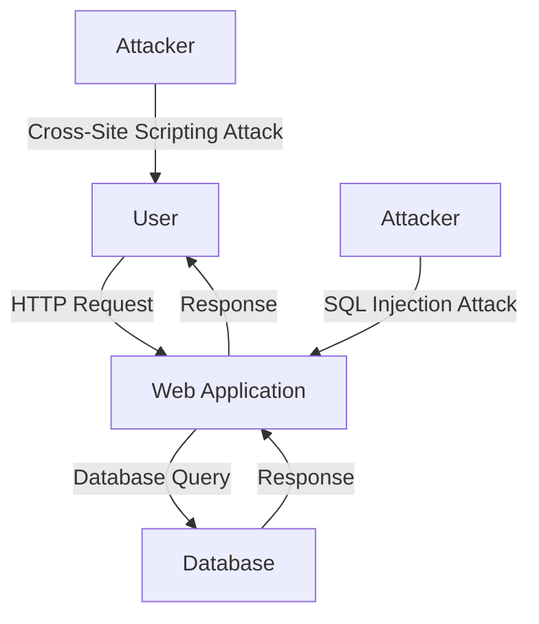

## Introduction to DevSecOps: Roles and Responsibilities

### Overview of DevSecOps

DevSecOps is an approach that integrates security practices into the DevOps lifecycle, ensuring that security is considered throughout the entire development process. This methodology aims to create a culture where developers, operations teams, and security professionals collaborate closely to build secure applications and infrastructure. The goal is to shift security left—meaning security considerations are integrated early in the development process rather than being an afterthought.

### Roles and Responsibilities in DevSecOps

In a DevSecOps environment, various roles play crucial parts in ensuring the security of the application and infrastructure. These roles include:

- **Developers**
- **Operations Engineers**
- **Security Engineers**
- **DevSecOps Engineers**

#### Developers

Developers are responsible for writing the code that makes up the application. In a DevSecOps context, developers must be aware of potential security vulnerabilities and how to mitigate them. They should be educated on common security issues such as SQL injection, cross-site scripting (XSS), and insecure direct object references (IDOR).

**Example: SQL Injection**

SQL injection is a common vulnerability where an attacker can inject malicious SQL queries into an application’s database. This can lead to unauthorized access to sensitive data or even complete control of the database.

**Vulnerable Code Example:**
```python
# Vulnerable code example
username = request.form['username']
password = request.form['password']

query = f"SELECT * FROM users WHERE username='{username}' AND password='{password}'"
cursor.execute(query)
```

**Secure Code Example:**
```python
# Secure code example using parameterized queries
username = request.form['username']
password = request.form['password']

query = "SELECT * FROM users WHERE username=%s AND password=%s"
cursor.execute(query, (username, password))
```

**Explanation:**
In the vulnerable code, the `username` and `password` variables are directly concatenated into the SQL query string, which allows an attacker to inject malicious SQL code. In the secure code, parameterized queries are used, which ensures that the inputs are treated as data and not executable code.

#### Operations Engineers

Operations engineers are responsible for maintaining the infrastructure and ensuring that it is secure. This includes setting up and managing servers, networks, and other infrastructure components. They must ensure that security best practices are followed, such as using strong encryption, implementing firewalls, and regularly updating systems.

**Example: Network Security**

Network security involves protecting the network infrastructure from unauthorized access and attacks. This includes configuring firewalls, implementing intrusion detection systems (IDS), and using strong encryption protocols.

**Firewall Configuration Example:**
```nginx
# Firewall configuration example using iptables
iptables -A INPUT -p tcp --dport 22 -j ACCEPT
iptables -A INPUT -p tcp --dport 80 -j ACCEPT
iptables -A INPUT -p tcp --dport 443 -j ACCEPT
iptables -A INPUT -j DROP
```

**Explanation:**
This firewall configuration allows incoming traffic on ports 22 (SSH), 80 (HTTP), and 443 (HTTPS) and drops all other incoming traffic. This helps to protect the server from unauthorized access.

#### Security Engineers

Security engineers are responsible for identifying and mitigating security risks. They work closely with developers and operations engineers to ensure that security is integrated into the development process. They are experts in various security domains, including cryptography, threat modeling, and penetration testing.

**Example: Threat Modeling**

Threat modeling is a process used to identify potential security threats and vulnerabilities in an application. This involves creating a model of the system and analyzing it to identify potential attack vectors.

**Threat Model Diagram:**


**Explanation:**
In this threat model, the user sends an HTTP request to the web application, which then queries the database. The response is sent back to the user. An attacker can attempt to inject malicious SQL code or perform a cross-site scripting attack.

#### DevSecOps Engineers

DevSecOps engineers are responsible for integrating security into the DevOps pipeline. They work closely with developers, operations engineers, and security engineers to ensure that security is considered at every stage of the development process. They are responsible for setting up and maintaining automated security checks and ensuring that security best practices are followed.

**Example: Automated Security Checks**

Automated security checks can be set up to scan code for vulnerabilities and ensure that security best practices are followed. This includes static code analysis, dynamic analysis, and dependency scanning.

**Static Code Analysis Example:**
```bash
# Static code analysis using SonarQube
sonar-scanner -Dsonar.projectKey=myproject -Dsonar.sources=src -Dsonar.host.url=http://localhost:9000
```

**Explanation:**
SonarQube is a tool that performs static code analysis to identify potential security vulnerabilities and coding issues. The above command runs a static code analysis on the project located in the `src` directory.

### Real-World Examples and Recent Breaches

#### SQL Injection: CVE-2021-21972

CVE-2021-21972 is a SQL injection vulnerability found in the WordPress REST API. This vulnerability allowed attackers to inject malicious SQL code and potentially gain unauthorized access to the database.

**Vulnerable Code Example:**
```php
// Vulnerable code example in WordPress REST API
$param = $_GET['param'];
$query = "SELECT * FROM posts WHERE id=$param";
```

**Secure Code Example:**
```php
// Secure code example using prepared statements
$param = $_GET['param'];
$stmt = $pdo->prepare("SELECT * FROM posts WHERE id=:id");
$stmt->execute(['id' => $param]);
```

**Explanation:**
In the vulnerable code, the `$param` variable is directly concatenated into the SQL query string, which allows an attacker to inject malicious SQL code. In the secure code, prepared statements are used, which ensures that the inputs are treated as data and not executable code.

#### Cross-Site Scripting (XSS): CVE-2021-21973

CVE-2021-21973 is a cross-site scripting vulnerability found in the WordPress comment system. This vulnerability allowed attackers to inject malicious JavaScript code into comments, which could then be executed by other users.

**Vulnerable Code Example:**
```php
// Vulnerable code example in WordPress comment system
$comment = $_POST['comment'];
echo "<div>$comment</div>";
```

**Secure Code Example:**
```php
// Secure code example using htmlspecialchars
$comment = $_POST['comment'];
echo "<div>" . htmlspecialchars($comment, ENT_QUOTES, 'UTF-8') . "</div>";
```

**Explanation:**
In the vulnerable code, the `$comment` variable is directly echoed into the HTML, which allows an attacker to inject malicious JavaScript code. In the secure code, `htmlspecialchars` is used to escape special characters, which prevents the execution of malicious code.

### How to Prevent / Defend

#### Detection

Detection involves identifying potential security vulnerabilities and threats. This can be done through various methods, including static code analysis, dynamic analysis, and penetration testing.

**Static Code Analysis:**
Static code analysis tools, such as SonarQube, can be used to scan code for potential security vulnerabilities and coding issues.

**Dynamic Analysis:**
Dynamic analysis tools, such as Burp Suite, can be used to test the application for vulnerabilities by simulating attacks.

**Penetration Testing:**
Penetration testing involves simulating real-world attacks to identify potential security vulnerabilities. This can be done internally or by hiring external security consultants.

#### Prevention

Prevention involves implementing security best practices to mitigate potential vulnerabilities. This includes using secure coding practices, implementing security controls, and following security guidelines.

**Secure Coding Practices:**
Secure coding practices involve writing code that is free from common security vulnerabilities. This includes using parameterized queries, escaping special characters, and validating user input.

**Security Controls:**
Security controls involve implementing measures to protect the application and infrastructure from unauthorized access and attacks. This includes using strong encryption, implementing firewalls, and regularly updating systems.

**Security Guidelines:**
Security guidelines provide best practices for securing applications and infrastructure. These guidelines can be provided by organizations such as the Open Web Application Security Project (OWASP) and the Center for Internet Security (CIS).

#### Secure-Coding Fixes

**Vulnerable Pattern vs. Secure Pattern:**

**SQL Injection:**
- **Vulnerable Pattern:**
  ```python
  query = f"SELECT * FROM users WHERE username='{username}' AND password='{password}'"
  cursor.execute(query)
  ```
- **Secure Pattern:**
  ```python
  query = "SELECT * FROM users WHERE username=%s AND password=%s"
  cursor.execute(query, (username, password))
  ```

**Cross-Site Scripting (XSS):**
- **Vulnerable Pattern:**
  ```php
  echo "<div>$comment</div>";
  ```
- **Secure Pattern:**
  ```php
  echo "<div>" . htmlspecialchars($comment, ENT_QUOTES, 'UTF-8') . "</div>";
  ```

### Conclusion

In conclusion, DevSecOps is an approach that integrates security practices into the DevOps lifecycle. This methodology aims to create a culture where developers, operations teams, and security professionals collaborate closely to build secure applications and infrastructure. By understanding the roles and responsibilities of each team member and implementing security best practices, organizations can significantly reduce the risk of security vulnerabilities and threats.

### Practice Labs

For hands-on practice in DevSecOps, consider the following well-known labs:

- **PortSwigger Web Security Academy**: Offers interactive labs to learn about web application security.
- **OWASP Juice Shop**: A deliberately insecure web application for practicing web security skills.
- **DVWA (Damn Vulnerable Web Application)**: A PHP/MySQL web application that is riddled with vulnerabilities for educational purposes.
- **WebGoat**: An interactive, gamified training application for learning about web application security.

These labs provide practical experience in identifying and mitigating security vulnerabilities, making them invaluable resources for anyone looking to master DevSec-ops principles.

---
<!-- nav -->
[[01-Introduction to DevSecOps Roles and Responsibilities Part 1|Introduction to DevSecOps Roles and Responsibilities Part 1]] | [[DevSecOps/DevSecOps Bootcamp/01-DevSecOps Introduction/07-Introduction to DevSecOps/Roles Responsibilities in DevSecOps/00-Overview|Overview]] | [[03-Introduction to DevSecOps Part 1|Introduction to DevSecOps Part 1]]
