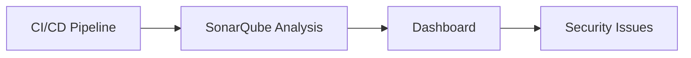

## Introduction to DevSecOps

### Overview of DevSecOps

DevSecOps is an approach that integrates security practices into the DevOps lifecycle. This means that security is not treated as a separate phase but is embedded throughout the entire process, from development to deployment and beyond. The goal is to ensure that security is considered at every stage, thereby reducing the likelihood of vulnerabilities making it into production.

### Roles and Responsibilities in DevSecOps

#### DevSecOps Engineer

The DevSecOps engineer is a critical role that bridges the gap between development, operations, and security. This individual is responsible for ensuring that security is integrated into the DevOps pipeline. Here’s a detailed breakdown of the responsibilities:

- **Automation of Security Checks**: The DevSecOps engineer automates security checks to ensure that security is not overlooked during the development and deployment phases. This includes static code analysis, dynamic analysis, and compliance checks.
  
- **Integration of Security Tools**: Integrating various security tools into the CI/CD pipeline is essential. These tools can range from vulnerability scanners to security testing frameworks. The DevSecOps engineer ensures that these tools are seamlessly integrated and provide actionable insights.

- **Facilitating Knowledge Sharing**: One of the key responsibilities is to facilitate knowledge sharing among different teams. This includes training developers and operations staff on security best practices and ensuring that everyone understands the importance of security in their respective roles.

- **Visualizing Security Issues**: Making security issues visible is crucial. The DevSecOps engineer creates dashboards and reports that highlight security risks and help teams prioritize their efforts.

- **Assisting in Fixing Security Issues**: While the primary responsibility is not to fix security issues, the DevSecOps engineer should have a good understanding of how to address common security problems. This helps in providing guidance and support to other team members.

### Skills Required for a DevSecOps Engineer

A DevSecOps engineer needs a diverse set of skills that span development, operations, and security. Here are the key skills:

- **Development Skills**: Understanding of programming languages, frameworks, and development methodologies. This includes knowledge of secure coding practices and the ability to integrate security features into applications.

- **Operations Skills**: Familiarity with system administration, network management, and infrastructure setup. This includes knowledge of cloud services, containerization, and orchestration tools.

- **Security Skills**: Strong understanding of security principles, threat modeling, and security testing techniques. This includes knowledge of common vulnerabilities (such as those listed in the OWASP Top Ten) and how to mitigate them.

- **Automation and Scripting**: Proficiency in automation tools and scripting languages such as Python, Bash, and PowerShell. This is essential for creating automated security checks and integrating security tools into the CI/CD pipeline.

- **Communication and Collaboration**: Effective communication skills are crucial for facilitating knowledge sharing and collaboration among different teams.

### Real-World Examples and Case Studies

To illustrate the importance of DevSecOps, let’s look at some recent real-world examples:

- **CVE-2021-44228 (Log4Shell)**: This vulnerability in the Apache Log4j library affected millions of devices and applications. A DevSecOps approach could have helped identify and mitigate this vulnerability earlier by integrating security checks and vulnerability scanning into the CI/CD pipeline.

- **SolarWinds Supply Chain Attack (CVE-2020-1014)**: This attack compromised the SolarWinds Orion software, leading to widespread breaches. A DevSecOps approach would have included regular security audits and supply chain security checks to detect such vulnerabilities.

### Detailed Example: Automating Security Checks

Let’s walk through a detailed example of how a DevSecOps engineer might automate security checks using a tool like SonarQube.

#### Step 1: Setting Up SonarQube

SonarQube is a popular tool for static code analysis. Here’s how to set it up:

```bash
# Install Docker
sudo apt-get update
sudo apt-get install docker.io

# Pull SonarQube image
docker pull sonarqube:latest

# Run SonarQube container
docker run -d --name sonarqube -p 9000:9000 sonarqube:latest
```

#### Step 2: Configuring SonarQube in CI/CD Pipeline

Integrate SonarQube into the CI/CD pipeline using a tool like Jenkins:

```yaml
# Jenkinsfile
pipeline {
    agent any
    stages {
        stage('Build') {
            steps {
                sh 'mvn clean package'
            }
        }
        stage('SonarQube Analysis') {
            steps {
                withSonarQubeEnv('SonarQube') {
                    sh 'mvn sonar:sonar'
                }
            }
        }
    }
}
```

#### Step 3: Visualizing Security Issues

Create a dashboard in SonarQube to visualize security issues:



### Common Pitfalls and How to Avoid Them

#### Pitfall 1: Overlooking Security in Development

**Why it happens**: Developers may not have a strong background in security, leading to oversight of security best practices.

**How to avoid**: Provide regular training and resources on secure coding practices. Integrate security tools into the development environment to catch issues early.

#### Pitfall 2: Lack of Automation

**Why it happens**: Manual security checks are time-consuming and prone to errors.

**How to avoid**: Automate security checks using tools like SonarQube, OWASP ZAP, and others. Ensure these tools are integrated into the CI/CD pipeline.

#### Pitfall 3: Insufficient Communication

**Why it happens**: Poor communication between development, operations, and security teams can lead to misunderstandings and missed opportunities.

**How to avoid**: Establish regular meetings and knowledge-sharing sessions. Use collaborative tools to ensure everyone is on the same page.

### How to Prevent / Defend

#### Detection

Regularly scan codebases and infrastructure for vulnerabilities using tools like SonarQube, OWASP ZAP, and Trivy. Set up alerts for critical findings.

#### Prevention

Implement secure coding practices and follow established security guidelines. Use tools like Snyk to manage dependencies and ensure they are free from known vulnerabilities.

#### Secure Coding Fixes

Here’s an example of a vulnerable code and its secure version:

**Vulnerable Code**:
```python
import os
import subprocess

def execute_command(command):
    subprocess.call(command, shell=True)
```

**Secure Code**:
```python
import subprocess

def execute_command(command):
    subprocess.run(command.split(), check=True)
```

**Explanation**: The original code uses `shell=True`, which can lead to command injection vulnerabilities. The secure version splits the command into arguments and avoids using the shell.

### Conclusion

DevSecOps is a holistic approach that integrates security into the DevOps lifecycle. By understanding the roles and responsibilities of a DevSecOps engineer, the required skills, and the importance of automation and collaboration, organizations can significantly improve their security posture. Real-world examples and detailed walkthroughs provide practical insights into implementing DevSecOps effectively.

### Practice Labs

For hands-on experience with DevSecOps concepts, consider the following labs:

- **PortSwigger Web Security Academy**: Offers interactive labs to practice web security techniques.
- **OWASP Juice Shop**: A deliberately insecure web application for practicing security testing.
- **DVWA (Damn Vulnerable Web Application)**: Another web application with intentional vulnerabilities for security testing.

These labs provide a practical way to apply the theoretical knowledge gained from studying DevSecOps.

---
<!-- nav -->
[[02-Introduction to DevSecOps Roles and Responsibilities|Introduction to DevSecOps Roles and Responsibilities]] | [[DevSecOps/DevSecOps Bootcamp/01-DevSecOps Introduction/07-Introduction to DevSecOps/Roles Responsibilities in DevSecOps/00-Overview|Overview]] | [[04-Introduction to DevSecOps Part 2|Introduction to DevSecOps Part 2]]
