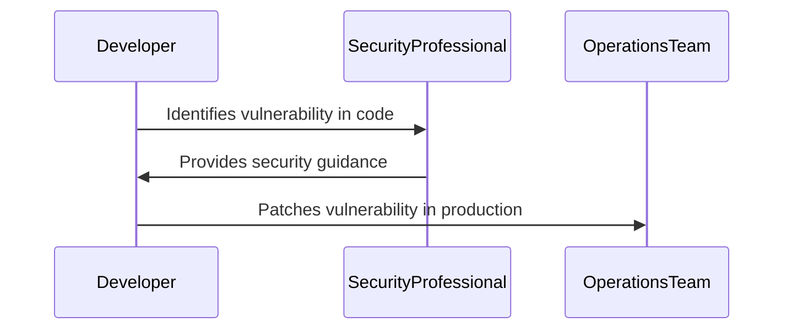
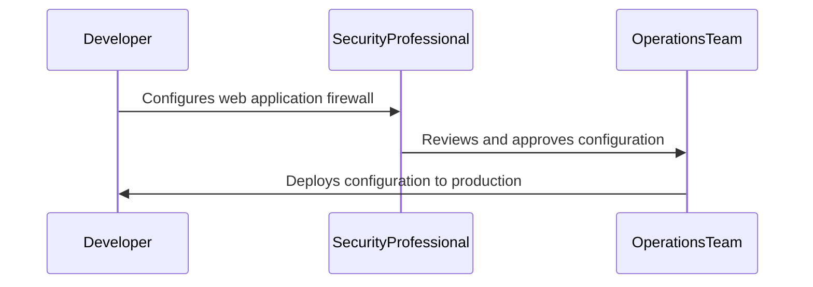
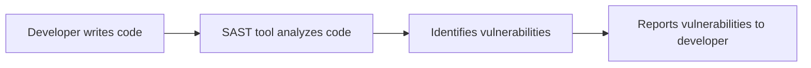
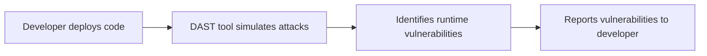
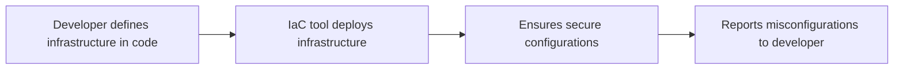
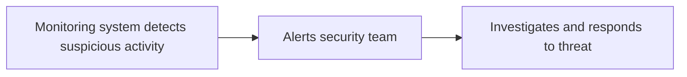
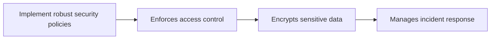
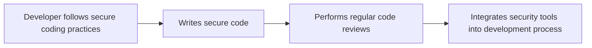
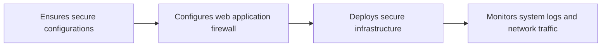

## Introduction to DevSecOps

### What is DevSecOps?

DevSecOps is a modern approach to integrating security practices into the software development lifecycle (SDLC). It aims to embed security considerations throughout the entire development process, rather than treating it as an afterthought. This methodology emphasizes collaboration among developers, security professionals, and operations teams to ensure that security is a shared responsibility across the organization.

### Why is DevSecOps Important?

Traditionally, security was often treated as a separate function, managed by a dedicated security team. However, this approach can lead to delays and inefficiencies, as security checks are performed late in the development cycle. DevSecOps addresses these issues by promoting a culture where everyone is responsible for security. This ensures that security is considered at every stage of the development process, leading to more secure applications and faster time-to-market.

### How Does DevSecOps Work?

DevSecOps integrates security into the continuous integration and continuous delivery (CI/CD) pipeline. This means that security checks are automated and integrated into the build and deployment processes. By doing so, security becomes a natural part of the development workflow, rather than an additional step.

#### Key Components of DevSecOps

1. **Automation**: Automating security checks allows for quick feedback and reduces the likelihood of human error.
2. **Collaboration**: Encouraging collaboration among developers, security professionals, and operations teams ensures that security is a shared responsibility.
3. **Continuous Integration and Continuous Delivery (CI/CD)**: Integrating security into the CI/CD pipeline ensures that security checks are performed automatically and consistently.

### Roles and Responsibilities in DevSecOps

In a DevSecOps environment, the roles and responsibilities are distributed among various teams. Here are some key roles and their responsibilities:

1. **Developers**:
   - Write secure code.
   - Perform static code analysis.
   - Conduct regular code reviews.
   - Integrate security tools into the development process.

2. **Security Professionals**:
   - Provide security guidance and best practices.
   - Conduct security assessments and penetration testing.
   - Monitor security incidents and respond to threats.
   - Develop security policies and procedures.

3. **Operations Teams**:
   - Ensure secure infrastructure and configurations.
   - Monitor system logs and network traffic.
   - Implement security controls and compliance measures.
   - Manage incident response and recovery processes.

### Real-World Examples

#### Example 1: Equifax Data Breach (CVE-2017-5638)

The Equifax data breach in 2017 exposed sensitive information of millions of customers due to a vulnerability in Apache Struts. This breach could have been prevented if DevSecOps principles were followed. By integrating security into the development process, vulnerabilities could have been identified and patched earlier.



#### Example 2: Capital One Data Breach (CVE-2019-11510)

The Capital One data breach in 2019 exposed sensitive customer data due to misconfigured web application firewall rules. This breach highlights the importance of secure infrastructure and configurations. By implementing DevSecOps practices, such misconfigurations could have been detected and corrected earlier.



### Tools and Technologies in DevSecOps

#### Static Application Security Testing (SAST)

SAST tools analyze the source code to identify potential security vulnerabilities. These tools can be integrated into the CI/CD pipeline to provide immediate feedback on code quality.



#### Dynamic Application Security Testing (DAST)

DAST tools simulate attacks on the running application to identify runtime vulnerabilities. These tools can be used to test the application in a production-like environment.



#### Infrastructure as Code (IaC)

IaC tools allow infrastructure to be defined in code, making it easier to manage and audit. These tools can be used to ensure that infrastructure is configured securely.



### Common Pitfalls in DevSecOps

#### Lack of Collaboration

One of the most common pitfalls in DevSecOps is a lack of collaboration among teams. Without effective communication and collaboration, security issues may be overlooked or ignored.

#### Inadequate Automation

Another common pitfall is inadequate automation. Without proper automation, security checks may be performed manually, leading to delays and inefficiencies.

#### Insufficient Training

Insufficient training is another common issue. Developers and other team members may not have the necessary skills and knowledge to implement security practices effectively.

### How to Prevent / Defend

#### Detection

To detect security issues, organizations should implement comprehensive monitoring and logging systems. These systems should be able to detect and alert on suspicious activity in real-time.



#### Prevention

To prevent security issues, organizations should implement robust security policies and procedures. These policies should cover areas such as access control, encryption, and incident response.



#### Secure Coding Practices

Secure coding practices are essential to prevent security issues. Developers should follow best practices such as input validation, error handling, and secure coding guidelines.



#### Configuration Hardening

Configuration hardening is another important aspect of preventing security issues. Organizations should ensure that all systems and applications are configured securely.



### Complete Example: Vulnerable vs. Secure Code

#### Vulnerable Code

Consider a simple web application that accepts user input and displays it on the screen. If the application does not properly validate user input, it may be vulnerable to cross-site scripting (XSS) attacks.

```python
# Vulnerable code
def display_user_input(user_input):
    print(f"User input: {user_input}")
```

#### Secure Code

To prevent XSS attacks, the application should properly validate and sanitize user input.

```python
# Secure code
import html

def display_user_input(user_input):
    sanitized_input = html.escape(user_input)
    print(f"User input: {sanitized_input}")
```

### Complete Example: Full HTTP Request and Response

#### Vulnerable HTTP Request

Consider a web application that accepts user input through an HTTP POST request. If the application does not properly validate the input, it may be vulnerable to SQL injection attacks.

```http
POST /submit HTTP/1.1
Host: example.com
Content-Type: application/x-www-form-urlencoded
Content-Length: 23

username=admin'--&password=
```

#### Vulnerable HTTP Response

If the application is vulnerable to SQL injection, the response may indicate a successful login.

```http
HTTP/1.1 200 OK
Date: Mon, 23 Jan 2023 12:00:00 GMT
Content-Type: text/html; charset=UTF-8
Content-Length: 12

Login successful!
```

#### Secure HTTP Request

To prevent SQL injection attacks, the application should properly validate and sanitize user input.

```http
POST /submit HTTP/1.1
Host: example.com
Content-Type: application/x-www-form-urlencoded
Content-Length: 23

username=admin%27--&password=
```

#### Secure HTTP Response

If the application is secure, the response may indicate an invalid login.

```http
HTTP/1.1 200 OK
Date: Mon, 23 Jan 2023 12:00:00 GMT
Content-Type: text/html; charset=UTF-8
Content-Length: 16

Invalid username or password!
```

### Practice Labs

For hands-on experience with DevSecOps, consider the following practice labs:

- **PortSwigger Web Security Academy**: Offers interactive labs to learn about web application security.
- **OWASP Juice Shop**: A deliberately insecure web application to practice security testing.
- **DVWA (Damn Vulnerable Web Application)**: A PHP/MySQL web application that demonstrates common web application vulnerabilities.
- **WebGoat**: An interactive training application designed to teach web application security lessons.

By following these resources and practicing DevSecOps principles, you can gain a deeper understanding of how to integrate security into the software development lifecycle.

### Conclusion

DevSecOps is a critical approach to ensuring that security is a shared responsibility across the organization. By integrating security into the development process, organizations can develop more secure applications and reduce the risk of security breaches. Through collaboration, automation, and continuous integration, DevSecOps can help organizations achieve their security goals.

---
<!-- nav -->
[[03-Introduction to DevSecOps Part 1|Introduction to DevSecOps Part 1]] | [[DevSecOps/DevSecOps Bootcamp/01-DevSecOps Introduction/07-Introduction to DevSecOps/Roles Responsibilities in DevSecOps/00-Overview|Overview]] | [[05-Introduction to DevSecOps Part 3|Introduction to DevSecOps Part 3]]
