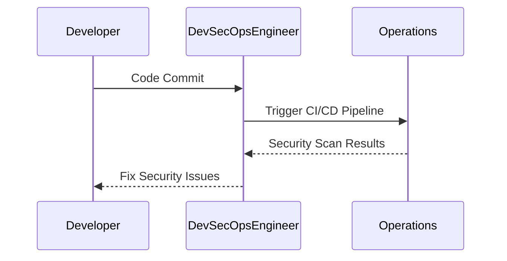
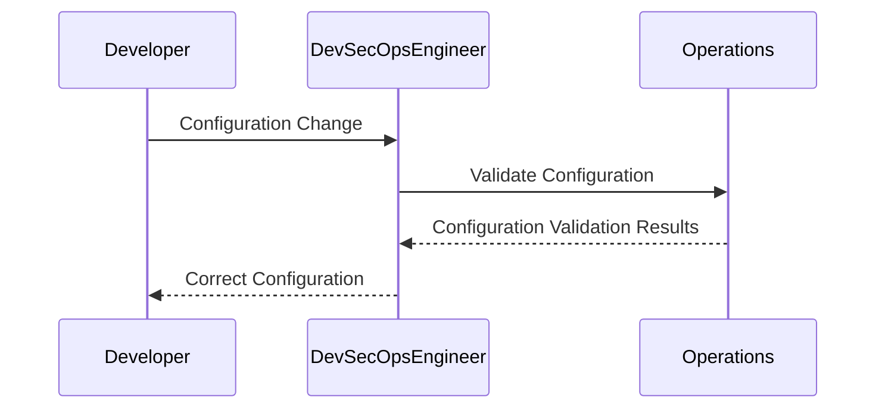

## Introduction to DevSecOps

### Overview of DevSecOps

DevSecOps is an approach to software development that integrates security practices throughout the entire software development lifecycle (SDLC). This methodology aims to ensure that security is not an afterthought but is embedded into the development process from the beginning. The goal is to create a culture where developers, operations teams, and security professionals collaborate closely to deliver secure software more efficiently.

### Roles and Responsibilities in DevSecOps

In a DevSecOps environment, various roles are essential to ensure that security is integrated seamlessly into the development and deployment processes. One of the key roles is the **DevSecOps Engineer**. This individual is responsible for setting up and maintaining the necessary processes and tools to ensure that security is a core component of the development workflow.

#### The Role of the DevSecOps Engineer

The DevSecOps Engineer plays a crucial role in ensuring that security is integrated into the development process. Their primary responsibilities include:

- **Setting Up Processes**: Creating and implementing automated processes that integrate security checks into the continuous integration/continuous deployment (CI/CD) pipeline.
- **Facilitating Collaboration**: Ensuring that different teams (developers, operations, security) work together effectively and share knowledge and responsibilities.
- **Implementing Automated Security Checks**: Setting up automated tools to detect security vulnerabilities during the development and testing phases.
- **Ensuring Pipeline Integrity**: Making sure that the CI/CD pipelines are functioning correctly and that security issues are identified and addressed promptly.

### Importance of Dedicated Roles

In many organizations, the concepts of DevOps and DevSecOps are not yet ingrained into every engineer's daily tasks. Therefore, having a dedicated DevSecOps Engineer ensures that these processes are established and maintained effectively. Without a dedicated role, the responsibility for integrating security might fall through the cracks, leading to potential security vulnerabilities in the final product.

#### Self-Driven Teams vs. Dedicated Roles

In some highly efficient and self-directed teams, the need for a dedicated DevSecOps Engineer might be minimal. However, in most cases, especially in larger organizations, having a dedicated role is crucial. This is because:

- **Complexity of Integration**: Integrating security into the development process requires specialized knowledge and tools.
- **Consistency**: A dedicated role ensures that security practices are consistently applied across all projects.
- **Resource Allocation**: Ensures that sufficient resources are allocated to security-related tasks.

### Real-World Examples

To illustrate the importance of dedicated roles in DevSecOps, consider the following real-world examples:

#### Example 1: Equifax Data Breach (CVE-2017-5638)

In 2017, Equifax suffered a massive data breach that exposed sensitive information of millions of customers. The breach was caused by a vulnerability in Apache Struts, which was not patched in a timely manner. This incident highlights the importance of having a dedicated role to ensure that security patches are applied promptly and that security checks are integrated into the development process.



#### Example 2: Capital One Data Breach (CVE-2019-11510)

In 2019, Capital One experienced a data breach that exposed the personal information of over 100 million customers. The breach was due to a misconfiguration in a web application firewall (WAF). This incident underscores the importance of having a dedicated role to ensure that configurations are correct and that security checks are performed regularly.



### Implementation of DevSecOps Processes

To implement DevSecOps processes effectively, several steps need to be taken:

#### Step 1: Define Security Policies and Practices

The first step is to define clear security policies and practices that all team members must follow. This includes defining the types of security checks that should be performed at different stages of the SDLC.

#### Step 2: Set Up Automated Tools

Automated tools are essential for integrating security into the development process. These tools can perform static code analysis, dynamic analysis, and other security checks automatically.


#### Step 3: Configure CI/CD Pipeline

The CI/CD pipeline should be configured to include security checks at various stages. This ensures that security issues are detected and addressed early in the development process.


#### Step  4: Run Security Checks

Security checks should be run automatically as part of the CI/CD pipeline. This includes static code analysis, dynamic analysis, and other security tests.


#### Step 5: Fix Security Issues

Once security issues are identified, they should be fixed promptly. This may involve modifying code, updating configurations, or applying security patches.


### Common Pitfalls and How to Avoid Them

#### Pitfall 1: Lack of Dedicated Roles

Without a dedicated DevSecOps Engineer, security practices may not be consistently applied. To avoid this, ensure that a dedicated role is established and that the responsibilities are clearly defined.

#### Pitfall 2: Inadequate Automation

Relying solely on manual security checks can lead to missed vulnerabilities. To avoid this, set up automated tools to perform security checks as part of the CI/CD pipeline.

#### Pitfall 3: Insufficient Training

Team members may lack the necessary skills to identify and address security issues. To avoid this, provide regular training and resources to help team members stay up-to-date with the latest security practices.

### How to Prevent / Defend

#### Detection

Regularly run security scans and audits to detect vulnerabilities. Use automated tools to perform these scans as part of the CI/CD pipeline.

#### Prevention

Ensure that security policies and practices are clearly defined and followed. Use automated tools to enforce these policies and practices.

#### Secure Coding Fixes

Show the vulnerable pattern and the corrected secure version side by side.

**Vulnerable Code:**

```python
def login(username, password):
    if username == "admin" and password == "password":
        return True
    else:
        return False
```

**Secure Code:**

```python
import hashlib

def hash_password(password):
    return hashlib.sha256(password.encode()).hexdigest()

def login(username, hashed_password):
    stored_hashed_password = get_stored_password(username)
    if hashed_password == stored_hashed_password:
        return True
    else:
        return False
```

#### Configuration Hardening

Ensure that configurations are hardened to prevent misconfigurations. Use automated tools to validate configurations.

**Example Configuration:**

```yaml
server:
  port: 8080
security:
  enabled: true
  authentication:
    type: basic
    users:
      - username: admin
        password: $2y$10$92IXJXG.rDh8/dtzx8.xb6
```

### Hands-On Labs

To gain practical experience with DevSecOps, consider the following hands-on labs:

- **PortSwigger Web Security Academy**: Offers interactive labs to learn about web application security.
- **OWASP Juice Shop**: A deliberately insecure web application for practicing web security.
- **DVWA (Damn Vulnerable Web Application)**: A PHP/MySQL web application that is riddled with vulnerabilities for educational purposes.
- **WebGoat**: An interactive, gamified training application for learning about web application security.

These labs provide a safe environment to practice and learn about DevSecOps principles and techniques.

### Conclusion

In conclusion, DevSecOps is a critical approach to ensuring that security is integrated into the software development process from the beginning. By establishing dedicated roles, setting up automated tools, and following best practices, organizations can significantly reduce the risk of security vulnerabilities in their software products. The journey to implementing DevSecOps is an ongoing one, but with the right tools and practices, it can lead to more secure and efficient software development.

---
<!-- nav -->
[[04-Introduction to DevSecOps Part 2|Introduction to DevSecOps Part 2]] | [[DevSecOps/DevSecOps Bootcamp/01-DevSecOps Introduction/07-Introduction to DevSecOps/Roles Responsibilities in DevSecOps/00-Overview|Overview]] | [[DevSecOps/DevSecOps Bootcamp/01-DevSecOps Introduction/07-Introduction to DevSecOps/Roles Responsibilities in DevSecOps/06-Introduction to DevSecOps|Introduction to DevSecOps]]
