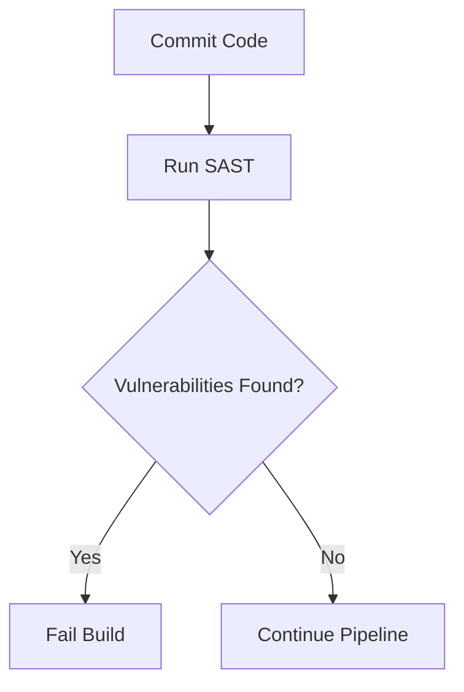
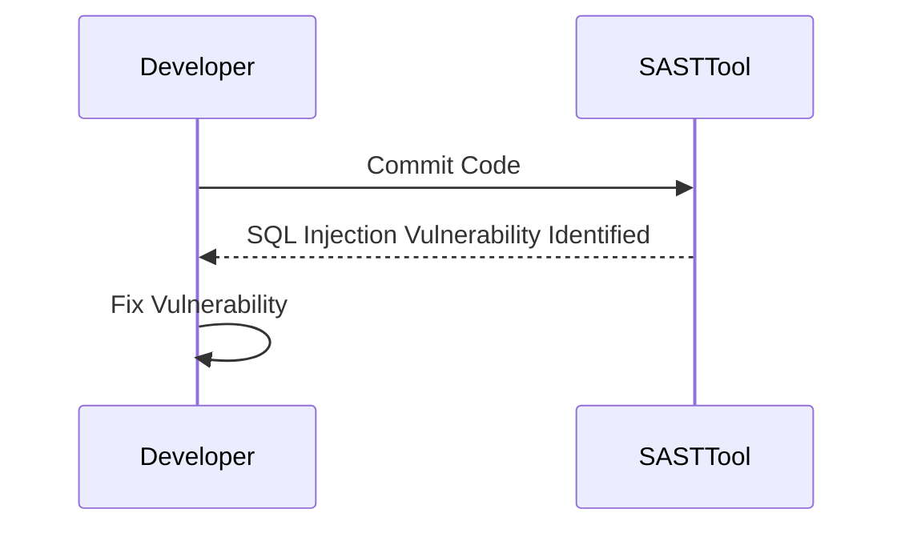
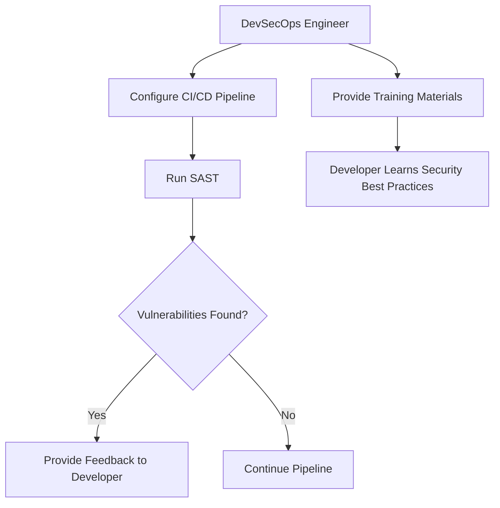
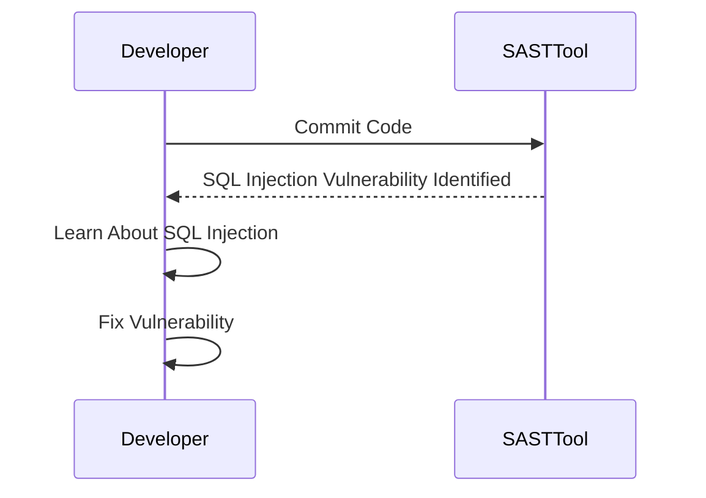

## Introduction to DevSecOps

### Overview of DevSecOps

DevSecOps is an approach that integrates security practices into the DevOps lifecycle, ensuring that security is a shared responsibility among all members of the development and operations teams. This approach aims to embed security throughout the entire software development process, from planning and coding to testing and deployment. By doing so, DevSecOps seeks to reduce the likelihood of security vulnerabilities and ensure that applications are secure by design.

### Roles and Responsibilities in DevSecOps

In a DevSecOps environment, roles and responsibilities are distributed across various team members. Each member plays a crucial part in maintaining the security of the application. Here, we will delve into the specific roles and responsibilities within a DevSecOps framework.

#### The DevSecOps Engineer

The DevSecOps engineer is a key figure in the integration of security into the DevOps pipeline. Their primary responsibility is to set up and maintain the automated security checks that are integrated into the continuous integration and continuous delivery (CI/CD) pipeline. These checks help identify potential security issues early in the development cycle, allowing for timely remediation.

**What Does a DevSecOps Engineer Do?**

- **Set Up Automated Security Checks:** The DevSecOps engineer sets up automated security checks using tools like static application security testing (SAST), dynamic application security testing (DAST), and dependency scanning tools. These tools help identify security vulnerabilities in the codebase and dependencies.
  
- **Integrate Security into the Pipeline:** They integrate these security checks into the CI/CD pipeline, ensuring that security is a part of every stage of the development process. This includes setting up policies and workflows that enforce security best practices.

- **Monitor and Respond to Issues:** The DevSecOps engineer monitors the results of these automated checks and ensures that any identified issues are addressed promptly. They work closely with the development team to provide guidance on how to fix security vulnerabilities.

**Why Is This Important?**

By integrating security into the pipeline, the DevSecOps engineer ensures that security is not an afterthought but a core component of the development process. This proactive approach helps catch and address security issues early, reducing the risk of vulnerabilities making it into production.

**How Does It Work Under the Hood?**

Automated security checks are typically configured as part of the CI/CD pipeline. For example, a SAST tool might be run during the build phase to scan the codebase for vulnerabilities. If vulnerabilities are found, the pipeline can be configured to fail, preventing the deployment of insecure code.



**Common Pitfalls Without DevSecOps Engineers**

Without DevSecOps engineers, security checks may be overlooked or delayed, leading to vulnerabilities being deployed to production. This can result in security breaches, data leaks, and other serious consequences.

**Real-World Example:**

Consider the case of the Equifax breach in 2017, where a vulnerability in Apache Struts was exploited. If Equifax had implemented a robust DevSecOps process, including regular dependency scanning and automated security checks, the vulnerability might have been detected and patched earlier, potentially preventing the breach.

### The Development Team

While the DevSecOps engineer sets up and maintains the security checks, the actual responsibility for fixing security issues lies with the development team. Developers are expected to understand and address the security vulnerabilities identified by the automated checks.

**What Does the Development Team Do?**

- **Fix Security Vulnerabilities:** Developers are responsible for fixing the security vulnerabilities identified by the automated checks. This includes addressing issues like SQL injection, cross-site scripting (XSS), and insecure dependencies.

- **Update Libraries and Dependencies:** Developers should keep their codebase up-to-date with the latest versions of libraries and dependencies, which often contain security patches.

- **Learn and Improve Security Knowledge:** Developers should continuously improve their security knowledge. This includes understanding common security threats and how to mitigate them.

**Why Is This Important?**

By distributing the responsibility for security across the development team, DevSecOps ensures that security is everyone’s concern. This approach helps create a culture of security awareness and responsibility.

**How Does It Work Under the Hood?**

Developers receive feedback from the automated security checks and use this information to fix vulnerabilities. For example, if a SAST tool identifies a SQL injection vulnerability, the developer would need to modify the code to properly sanitize user inputs.



**Common Pitfalls Without Developer Responsibility**

If developers are not responsible for fixing security vulnerabilities, these issues may remain unaddressed, leading to insecure code being deployed. This can result in security breaches and other serious consequences.

**Real-World Example:**

Consider the case of the Capital One breach in 2019, where a misconfigured web application firewall allowed unauthorized access to sensitive customer data. If the development team had been more vigilant about security, this breach might have been prevented.

### Setting Up Processes for Security Awareness

To ensure that the development team is aware of security issues and understands how to address them, the DevSecOps engineer must set up processes that provide clear feedback and guidance.

**What Are These Processes?**

- **Automated Security Checks:** As mentioned earlier, automated security checks are integrated into the CI/CD pipeline to identify vulnerabilities.

- **Security Training and Resources:** The DevSecOps engineer should provide training and resources to help developers understand common security threats and how to mitigate them.

- **Feedback Loops:** Feedback loops are established to ensure that developers receive timely and actionable feedback on security issues.

**Why Is This Important?**

By setting up these processes, the DevSecOps engineer ensures that the development team is equipped with the knowledge and tools needed to address security issues effectively.

**How Does It Work Under the Hood?**

The DevSecOps engineer configures the CI/CD pipeline to run automated security checks and provides training materials and resources to the development team. Feedback loops are established to ensure that developers receive timely feedback on security issues.



**Common Pitfalls Without Clear Processes**

Without clear processes, developers may not be aware of security issues or may not know how to address them. This can lead to insecure code being deployed, increasing the risk of security breaches.

**Real-World Example:**

Consider the case of the Yahoo breach in 2013, where a vulnerability in the authentication system was exploited. If Yahoo had implemented a robust DevSecOps process, including regular security training and feedback loops, the vulnerability might have been detected and patched earlier, potentially preventing the breach.

### Building Security Knowledge Step by Step

For junior developers who may not have extensive security knowledge, the DevSecOps process helps build their security knowledge step by step through the feedback provided by automated tools.

**How Does This Work?**

- **Automated Tools Provide Feedback:** Automated tools like SAST and DAST provide feedback on security issues, helping developers understand what the issues are and how to fix them.

- **Continuous Learning:** Developers can use this feedback to continuously improve their security knowledge, learning about common security threats and how to mitigate them.

**Why Is This Important?**

By building security knowledge step by step, developers can become more proficient in identifying and addressing security issues, leading to more secure code.

**How Does It Work Under the Hood?**

Automated tools provide feedback on security issues, and developers use this feedback to learn and improve their security knowledge. For example, if a SAST tool identifies a SQL injection vulnerability, the developer can learn about SQL injection and how to prevent it.



**Common Pitfalls Without Continuous Learning**

Without continuous learning, developers may not be able to identify and address security issues effectively, leading to insecure code being deployed.

**Real-World Example:**

Consider the case of the Target breach in 2013, where a vulnerability in the payment system was exploited. If Target had implemented a robust DevSecOps process, including continuous learning and feedback, the vulnerability might have been detected and patched earlier, potentially preventing the breach.

### How to Prevent / Defend

To prevent and defend against security issues in a DevSecOps environment, several steps can be taken:

#### Detection

- **Automated Security Checks:** Regularly run automated security checks using tools like SAST, DAST, and dependency scanning tools.
  
- **Logging and Monitoring:** Implement logging and monitoring to detect and respond to security incidents in real-time.

#### Prevention

- **Secure Coding Practices:** Follow secure coding practices, such as input validation, output encoding, and least privilege principles.
  
- **Dependency Management:** Keep dependencies up-to-date and regularly review them for known vulnerabilities.

#### Secure-Coding Fixes

Here is an example of a vulnerable code snippet and its secure counterpart:

**Vulnerable Code:**
```python
import sqlite3

def search_user(username):
    conn = sqlite3.connect('database.db')
    cursor = conn.cursor()
    cursor.execute(f"SELECT * FROM users WHERE username = '{username}'")
    return cursor.fetchall()
```

**Secure Code:**
```python
import sqlite3

def search_user(username):
    conn = sqlite3.connect('database.db')
    cursor = conn.cursor()
    cursor.execute("SELECT * FROM users WHERE username = ?", (username,))
    return cursor.fetchall()
```

**Explanation:**
In the vulnerable code, the `username` variable is directly inserted into the SQL query, which can lead to SQL injection attacks. In the secure code, parameterized queries are used to prevent SQL injection.

#### Configuration Hardening

- **Secure Configurations:** Ensure that all configurations are hardened and follow best practices. For example, configure web servers to disable unnecessary modules and services.

- **Least Privilege Principle:** Apply the least privilege principle to ensure that applications and services run with the minimum necessary permissions.

#### Mitigations

- **Regular Security Audits:** Conduct regular security audits to identify and address potential vulnerabilities.
  
- **Incident Response Plan:** Develop and maintain an incident response plan to quickly respond to security incidents.

### Real-World Examples

#### Recent CVEs and Breaches

- **Equifax Breach (2017):** A vulnerability in Apache Struts was exploited, leading to the exposure of sensitive personal data.
  
- **Capital One Breach (2019):** A misconfigured web application firewall allowed unauthorized access to sensitive customer data.

- **Yahoo Breach (2013):** A vulnerability in the authentication system was exploited, leading to the exposure of sensitive user data.

- **Target Breach (2013):** A vulnerability in the payment system was exploited, leading to the theft of sensitive credit card information.

### Practice Labs

To gain hands-on experience with DevSecOps, consider the following practice labs:

- **PortSwigger Web Security Academy:** Offers interactive labs to learn about web application security.
  
- **OWASP Juice Shop:** A deliberately insecure web application to practice security testing and penetration testing.

- **DVWA (Damn Vulnerable Web Application):** A PHP/MySQL web application that contains a large number of security vulnerabilities.

- **WebGoat:** An interactive, gamified training application designed to teach web application security.

These labs provide practical experience in implementing DevSecOps principles and techniques.

### Conclusion

In conclusion, DevSecOps is an essential approach for integrating security into the DevOps lifecycle. By distributing the responsibility for security across the development and operations teams, DevSecOps ensures that security is a shared concern. The DevSecOps engineer sets up and maintains automated security checks, while the development team is responsible for fixing security vulnerabilities. By setting up clear processes and providing continuous learning opportunities, DevSecOps helps build a culture of security awareness and responsibility. Through regular security audits and incident response plans, organizations can effectively prevent and defend against security issues.

---
<!-- nav -->
[[05-Introduction to DevSecOps Part 3|Introduction to DevSecOps Part 3]] | [[DevSecOps/DevSecOps Bootcamp/01-DevSecOps Introduction/07-Introduction to DevSecOps/Roles Responsibilities in DevSecOps/00-Overview|Overview]] | [[DevSecOps/DevSecOps Bootcamp/01-DevSecOps Introduction/07-Introduction to DevSecOps/Roles Responsibilities in DevSecOps/07-Practice Questions & Answers|Practice Questions & Answers]]
