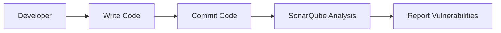
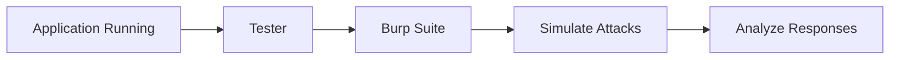
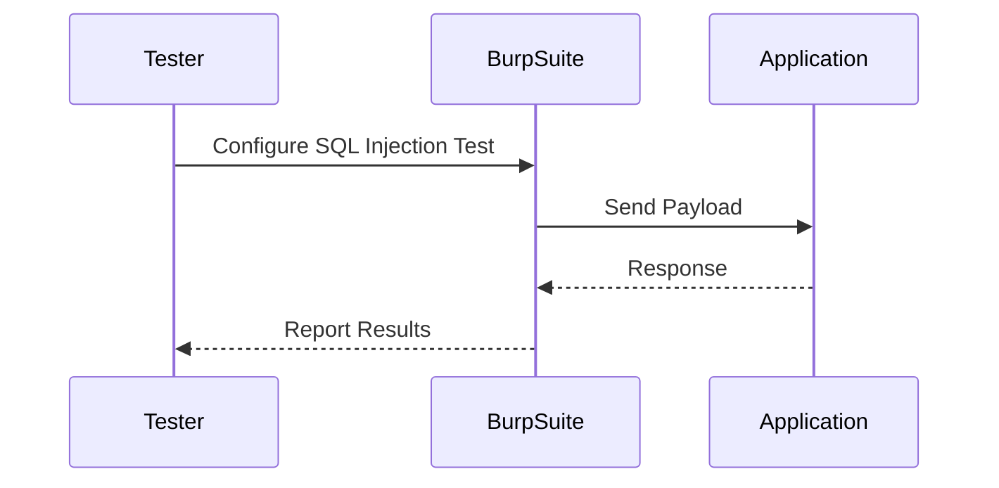

## Introduction to DevSecOps

### Layered Security in DevSecOps

In the realm of DevSecOps, the concept of layered security is fundamental. Layered security means implementing security measures at every level where it is applicable. This includes the code, the application, the infrastructure, and the network. Each layer has its unique vulnerabilities and requires specific security controls to mitigate risks effectively.

#### Importance of Layered Security

Layered security is crucial because it ensures that even if one layer fails, others can still provide protection. For instance, an application might have robust security measures in place, but if the underlying infrastructure is vulnerable, the entire system could still be compromised. Therefore, it is essential to consider security at every stage of the development lifecycle.

### Static vs. Dynamic Security Testing

Security testing can be broadly categorized into two types: static and dynamic.

#### Static Security Testing

Static security testing involves analyzing the code without executing it. This type of testing is useful for identifying potential vulnerabilities such as SQL injection, cross-site scripting (XSS), and other coding errors. However, static testing has limitations. It can only identify issues present in the code itself and cannot account for vulnerabilities that arise due to the runtime environment or external factors.

**Example of Static Analysis Tool:**

One popular tool for static analysis is SonarQube. It provides comprehensive code analysis and helps identify security vulnerabilities, coding standards violations, and other issues.



#### Dynamic Security Testing

Dynamic security testing, on the other hand, involves testing the application while it is running. This type of testing is particularly effective in identifying vulnerabilities that arise during runtime, such as SQL injection, XSS, and other attacks. Dynamic testing does not require access to the source code, making it suitable for black-box testing scenarios.

**Example of Dynamic Analysis Tool:**

One widely used tool for dynamic security testing is Burp Suite. It allows testers to simulate various attacks and assess the application's resilience against them.



### Dynamic Checks and Black Box Testing

Dynamic checks involve simulating attacks on a live application to determine its susceptibility to various threats. These checks are performed without access to the source code, which makes them a form of black box testing.

#### Types of Dynamic Checks

Dynamic checks can include:

- **SQL Injection:** An attacker attempts to inject malicious SQL statements into the application to manipulate the database.
- **Cross-Site Scripting (XSS):** An attacker injects malicious scripts into web pages viewed by other users.
- **Client-Side Request Forgery (CSRF):** An attacker tricks a user into performing unintended actions on a web application in which they are authenticated.
- **Server-Side Request Forgery (SSRF):** An attacker exploits a vulnerable application to make unintended requests to internal services.

**Example of Dynamic Check:**

Consider a scenario where an attacker tries to perform a SQL injection attack on a login page. The following is an example of a SQL injection payload and the corresponding HTTP request:

```http
POST /login HTTP/1.1
Host: example.com
Content-Type: application/x-www-form-urlencoded

username=admin' OR '1'='1&password=anything
```

The response from the server would indicate whether the attack was successful or not.

```http
HTTP/1.1 200 OK
Date: Mon, 23 Jan 2023 12:00:00 GMT
Content-Type: text/html; charset=UTF-8

<!DOCTYPE html>
<html>
<head>
    <title>Login</title>
</head>
<body>
    <h1>Welcome, admin!</h1>
</body>
</html>
```

#### How to Prevent / Defend Against Dynamic Checks

To defend against dynamic checks, it is essential to implement proper security measures at both the code and runtime levels.

**Secure Coding Practices:**

- **Input Validation:** Ensure that all inputs are validated and sanitized before being processed.
- **Parameterized Queries:** Use parameterized queries to prevent SQL injection.
- **Content Security Policy (CSP):** Implement CSP to mitigate XSS attacks.
- **Anti-CSRF Tokens:** Use anti-CSRF tokens to protect against CSRF attacks.
- **Whitelist External Services:** Restrict SSRF attacks by whitelisting allowed external services.

**Example of Secure Code:**

Here is an example of a secure login function using parameterized queries:

```python
import sqlite3

def login(username, password):
    conn = sqlite3.connect('database.db')
    cursor = conn.cursor()
    
    # Parameterized query to prevent SQL injection
    cursor.execute("SELECT * FROM users WHERE username=? AND password=?", (username, password))
    user = cursor.fetchone()
    
    if user:
        return True
    else:
        return False
```

### Automation of Security Testing

Automation plays a critical role in DevSecOps by enabling continuous security testing throughout the development lifecycle. Automated tools can simulate various attacks and provide real-time feedback on the application's security posture.

#### Tools for Automation

Several tools are available for automating security testing:

- **Burp Suite:** A comprehensive toolkit for web application security testing.
- **OWASP ZAP:** An open-source web application security scanner.
- **Arachni:** A modular and extendable web application security scanner.

**Example of Automated Tool Usage:**

Consider using Burp Suite to automate SQL injection testing. The following is an example of a Burp Suite configuration for automated testing:



### Real-World Examples and Breaches

Recent real-world examples highlight the importance of layered security and dynamic checks. One notable breach is the Capital One data breach in 2019, where an attacker exploited a misconfigured web application firewall to gain unauthorized access to sensitive customer data.

**CVE Example:**

Another example is CVE-2021-21972, a vulnerability in Apache Log4j that allowed remote code execution through specially crafted log messages. This vulnerability underscores the importance of dynamic security testing and the need to continuously monitor and patch applications.

### Conclusion

In conclusion, DevSecOps emphasizes the importance of layered security and dynamic checks to ensure the overall security of an application. By implementing robust security measures at every stage of the development lifecycle, organizations can significantly reduce the risk of security breaches. Automated tools play a crucial role in this process by enabling continuous security testing and providing real-time feedback on the application's security posture.

### Practice Labs

For hands-on experience with DevSecOps concepts, consider the following practice labs:

- **PortSwigger Web Security Academy:** Offers interactive labs to learn and practice web application security techniques.
- **OWASP Juice Shop:** A deliberately insecure web application for practicing security testing.
- **DVWA (Damn Vulnerable Web Application):** A PHP/MySQL web application that is riddled with vulnerabilities for educational purposes.

These labs provide practical experience in applying the concepts discussed in this chapter.

---
<!-- nav -->
[[DevSecOps/DevSecOps Bootcamp/01-DevSecOps Introduction/07-Introduction to DevSecOps/Understand DevSecOps/01-Introduction to DevSecOps Part 1|Introduction to DevSecOps Part 1]] | [[DevSecOps/DevSecOps Bootcamp/01-DevSecOps Introduction/07-Introduction to DevSecOps/Understand DevSecOps/00-Overview|Overview]] | [[DevSecOps/DevSecOps Bootcamp/01-DevSecOps Introduction/07-Introduction to DevSecOps/Understand DevSecOps/03-Introduction to DevSecOps Part 3|Introduction to DevSecOps Part 3]]
