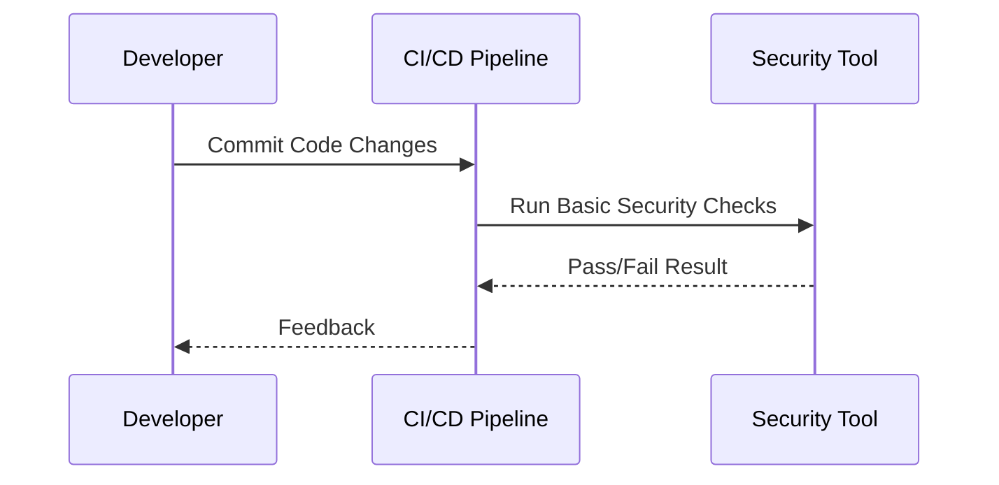
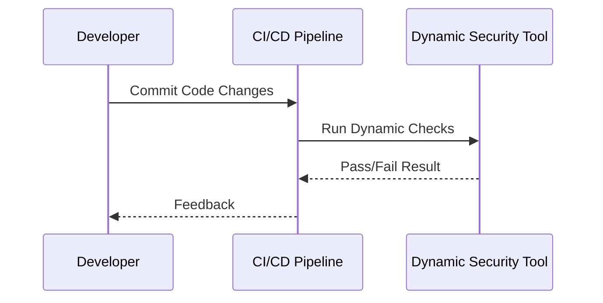
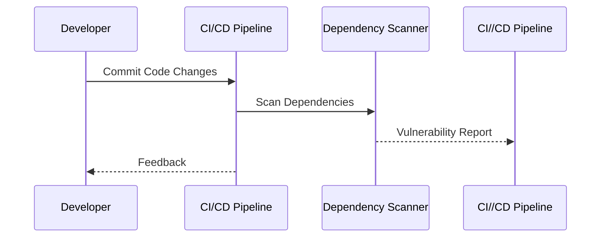
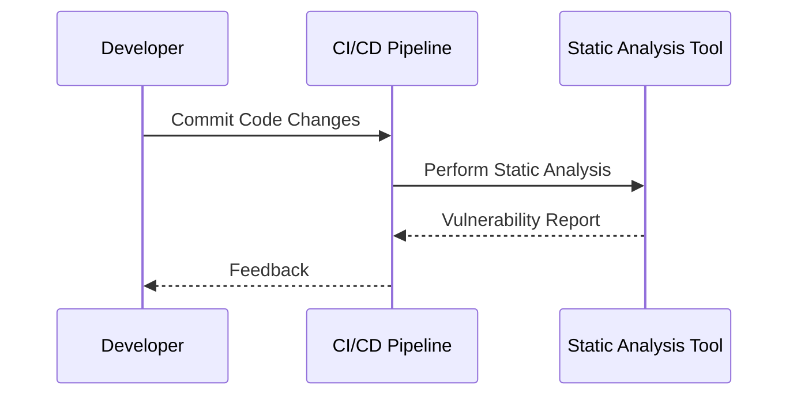
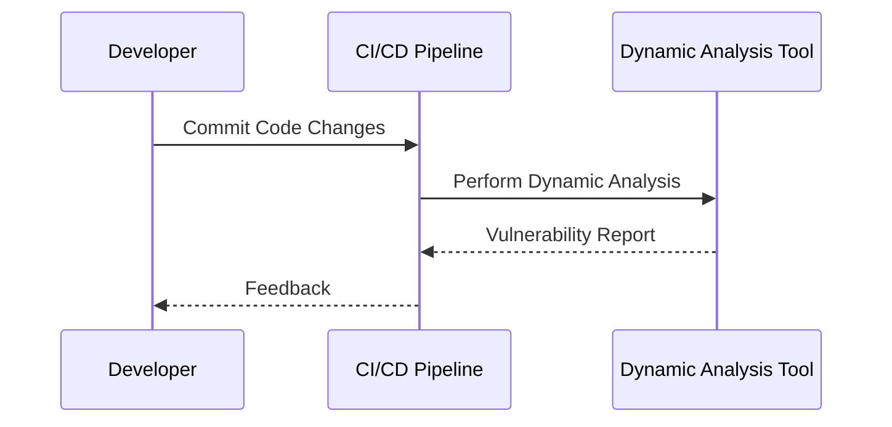
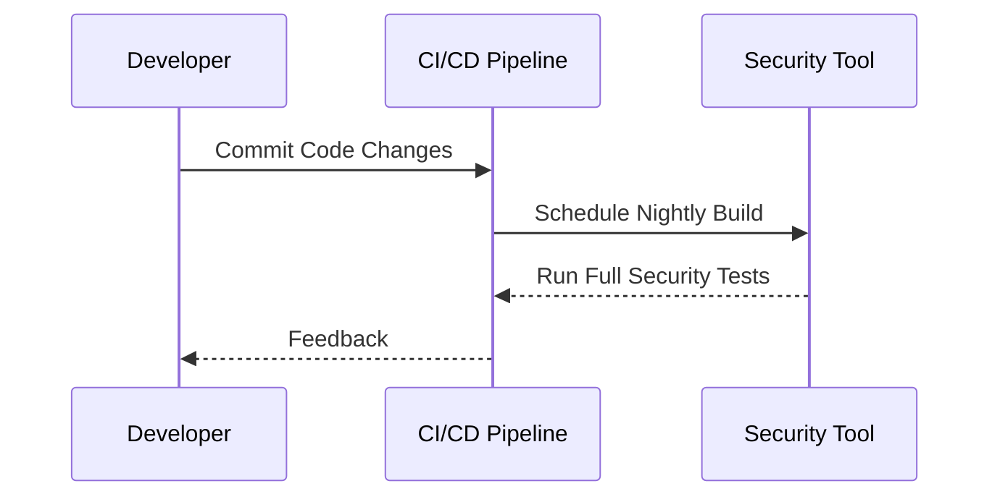
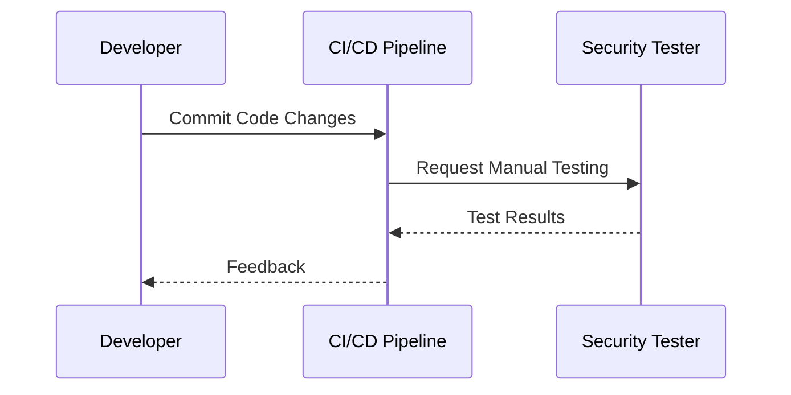
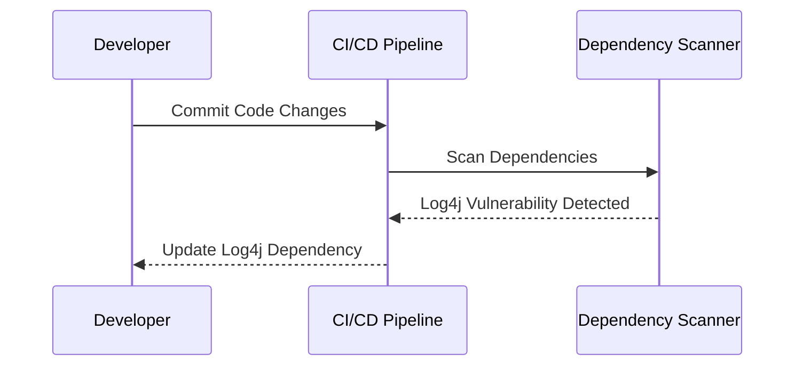
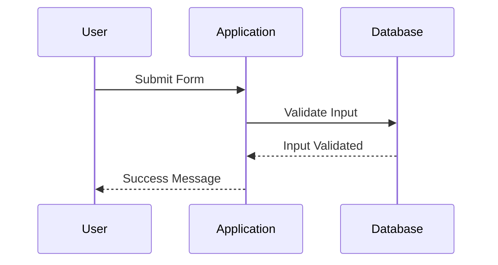

## Introduction to DevSecOps

### What is DevSecOps?

DevSecOps is a methodology that integrates security practices into the DevOps lifecycle. Traditionally, security was often treated as an afterthought, with security teams reviewing applications post-deployment. However, in the fast-paced world of continuous integration and delivery (CI/CD), this approach is no longer viable. DevSecOps aims to embed security throughout the entire development process, ensuring that security is not just a phase but a continuous practice.

### Why is DevSecOps Important?

In today’s digital landscape, security vulnerabilities can have severe consequences, including data breaches, financial losses, and damage to brand reputation. According to the 2021 Verizon Data Breach Investigations Report, nearly 80% of breaches involved weak, default, or stolen passwords. Integrating security into the DevOps pipeline helps catch these vulnerabilities earlier, reducing the risk of such incidents.

### How Does DevSecOps Work?

DevSecOps operates on the principle of shifting left—incorporating security practices as early as possible in the development cycle. This means integrating security checks into the CI/CD pipeline, automating security testing, and involving security professionals in the development process.

#### Basic Security Checks in the Pipeline

One of the key aspects of DevSecOps is performing basic security checks during the development process. These checks are designed to be quick and efficient, ensuring that they do not significantly slow down the development workflow.

##### Example: Code Changes Validation

Instead of running comprehensive security checks on the entire application, which can be time-consuming, DevSecOps focuses on validating security for the specific code changes made in each commit. This approach ensures that immediate issues are caught without disrupting the developer's workflow.



**Explanation:**
- **Developer**: Commits code changes to the repository.
- **CI/CD Pipeline**: Triggers the CI/CD pipeline to perform basic security checks.
- **Security Tool**: Runs quick security checks on the committed code changes.
- **Feedback**: Provides immediate feedback to the developer about the security status of the changes.

#### Dynamic Checks

Dynamic checks involve testing the application in a runtime environment to identify vulnerabilities. These checks can be performed using tools like OWASP ZAP or Burp Suite.



**Explanation:**
- **Developer**: Commits code changes to the repository.
- **CI/CD Pipeline**: Triggers the CI/CD pipeline to perform dynamic security checks.
- **Dynamic Security Tool**: Tests the application in a runtime environment to identify vulnerabilities.
- **Feedback**: Provides immediate feedback to the developer about the security status of the changes.

#### Third-Party Library Checks

Third-party libraries are a common source of vulnerabilities. DevSecOps includes checks to ensure that these libraries are secure. Tools like Snyk or WhiteSource can be used to scan dependencies for known vulnerabilities.



**Explanation:**
- **Developer**: Commits code changes to the repository.
- **CI/CD Pipeline**: Triggers the CI/CD pipeline to scan dependencies.
- **Dependency Scanner**: Scans the project dependencies for known vulnerabilities.
- **Feedback**: Provides immediate feedback to the developer about the security status of the dependencies.

### Full Application Security Tests

While basic checks are essential, they are not sufficient to ensure the overall security of the application. Full application security tests, including static and dynamic analysis, should be conducted regularly.

#### Static Analysis

Static analysis involves examining the source code without executing it. Tools like SonarQube or Fortify can be used to perform static analysis.



**Explanation:**
- **Developer**: Commits code changes to the repository.
- **CI/CD Pipeline**: Triggers the CI/CD pipeline to perform static analysis.
- **Static Analysis Tool**: Examines the source code for potential vulnerabilities.
- **Feedback**: Provides immediate feedback to the developer about the security status of the code.

#### Dynamic Analysis

Dynamic analysis involves testing the application in a runtime environment. Tools like OWASP ZAP or Burp Suite can be used to perform dynamic analysis.



**Explanation:**
- **Developer**: Commits code changes to the repository.
- **CI/CD Pipeline**: Triggers the CI/CD pipeline to perform dynamic analysis.
- **Dynamic Analysis Tool**: Tests the application in a runtime environment for potential vulnerabilities.
- **Feedback**: Provides immediate feedback to the developer about the security status of the application.

### Nightly Builds

To balance the need for thorough security testing with the requirement for a smooth development workflow, full application security tests can be scheduled to run during off-peak hours, such as at night.



**Explanation:**
- **Developer**: Commits code changes to the repository.
- **CI/CD Pipeline**: Triggers the CI/CD pipeline to schedule a nightly build.
- **Security Tool**: Runs full security tests during the nightly build.
- **Feedback**: Provides feedback to the developer about the security status of the application.

### Manual Testing

While automation is crucial in DevSecOps, there are still scenarios where manual testing is necessary. Manual testing allows for more nuanced and context-specific assessments that automated tools might miss.



**Explanation:**
- **Developer**: Commits code changes to the repository.
- **CI/CD Pipeline**: Triggers the CI/CD pipeline to request manual testing.
- **Security Tester**: Performs manual testing to assess the security of the application.
- **Feedback**: Provides feedback to the developer about the security status of the application.

### Real-World Examples

#### Recent CVEs and Breaches

One notable example is the Log4j vulnerability (CVE-2021-44228), which affected millions of systems worldwide. This vulnerability highlights the importance of keeping third-party libraries up-to-date and scanning for known vulnerabilities.



**Explanation:**
- **Developer**: Commits code changes to the repository.
- **CI/CD Pipeline**: Triggers the CI/CD pipeline to scan dependencies.
- **Dependency Scanner**: Detects the Log4j vulnerability.
- **Feedback**: Instructs the developer to update the Log4j dependency.

### How to Prevent / Defend

#### Detection

Detection involves identifying security vulnerabilities in the codebase. This can be achieved through automated tools and regular code reviews.

**Automated Tools:**
- **SonarQube**: Static code analysis tool that identifies security vulnerabilities.
- **OWASP ZAP**: Dynamic analysis tool that tests the application in a runtime environment.

**Code Reviews:**
Regular code reviews by security experts can help identify vulnerabilities that automated tools might miss.

#### Prevention

Prevention involves implementing security best practices and ensuring that security is integrated into the development process.

**Secure Coding Practices:**
- **Input Validation**: Ensure that all user inputs are validated to prevent injection attacks.
- **Authentication and Authorization**: Implement strong authentication mechanisms and enforce proper authorization controls.
- **Error Handling**: Proper error handling can prevent sensitive information from being exposed.

**Example: Secure Input Validation**



**Explanation:**
- **User**: Submits a form with user input.
- **Application**: Validates the input to ensure it meets the required criteria.
- **Database**: Stores the validated input.
- **Success Message**: Provides feedback to the user that the input was successfully validated.

**Vulnerable Code:**
```python
def submit_form(username, password):
    # Vulnerable code
    query = f"SELECT * FROM users WHERE username='{username}' AND password='{password}'"
    execute_query(query)
```

**Secure Code:**
```python
import sqlite3

def submit_form(username, password):
    # Secure code
    conn = sqlite3.connect('database.db')
    cursor = conn.cursor()
    cursor.execute("SELECT * FROM users WHERE username=? AND password=?", (username, password))
    result = cursor.fetchone()
    conn.close()
    return result
```

**Explanation:**
- **Vulnerable Code**: Uses string interpolation to construct SQL queries, making it susceptible to SQL injection attacks.
- **Secure Code**: Uses parameterized queries to prevent SQL injection attacks.

#### Hardening

Hardening involves configuring the environment to minimize the attack surface. This includes securing the operating system, network, and application configurations.

**Operating System Hardening:**
- Disable unnecessary services and ports.
- Apply security patches and updates regularly.

**Network Hardening:**
- Configure firewalls to restrict access to the application.
- Use encryption protocols like TLS to secure data in transit.

**Application Hardening:**
- Implement least privilege principles to limit access to sensitive resources.
- Use security headers like Content Security Policy (CSP) to mitigate cross-site scripting (XSS) attacks.

**Example: Security Headers**

```http
HTTP/1.1 200 OK
Content-Type: text/html; charset=UTF-8
Content-Security-Policy: default-src 'self'; script-src 'self' https://trusted.cdn.com; style-src 'self' 'unsafe-inline'
Strict-Transport-Security: max-age=31536000; includeSubDomains
X-Content-Type-Options: nosniff
X-Frame-Options: DENY
X-XSS-Protection: 1; mode=block
```

**Explanation:**
- **Content-Security-Policy**: Restricts the sources from which scripts and styles can be loaded.
- **Strict-Transport-Security**: Ensures that the connection is always encrypted.
- **X-Content-Type-Options**: Prevents MIME type sniffing.
- **X-Frame-Options**: Prevents clickjacking attacks.
- **X-XSS-Protection**: Enables browser-based XSS protection.

### Practice Labs

For hands-on experience with DevSecOps, consider the following labs:

- **PortSwigger Web Security Academy**: Offers interactive labs to learn about web application security.
- **OWASP Juice Shop**: A deliberately insecure web application for practicing web security skills.
- **DVWA (Damn Vulnerable Web Application)**: A PHP/MySQL web application that contains numerous security vulnerabilities.
- **WebGoat**: An interactive training application that teaches web application security lessons.

These labs provide practical experience in applying DevSecOps principles and techniques.

### Conclusion

DevSecOps is a critical methodology for integrating security into the DevOps lifecycle. By performing basic security checks in the pipeline, conducting full application security tests, and scheduling nightly builds, organizations can ensure that security is not an afterthought but a continuous practice. Through the use of automated tools, manual testing, and secure coding practices, organizations can effectively prevent and defend against security vulnerabilities.

---
<!-- nav -->
[[DevSecOps/DevSecOps Bootcamp/01-DevSecOps Introduction/07-Introduction to DevSecOps/Understand DevSecOps/02-Introduction to DevSecOps Part 2|Introduction to DevSecOps Part 2]] | [[DevSecOps/DevSecOps Bootcamp/01-DevSecOps Introduction/07-Introduction to DevSecOps/Understand DevSecOps/00-Overview|Overview]] | [[DevSecOps/DevSecOps Bootcamp/01-DevSecOps Introduction/07-Introduction to DevSecOps/Understand DevSecOps/04-Introduction to DevSecOps Part 4|Introduction to DevSecOps Part 4]]
