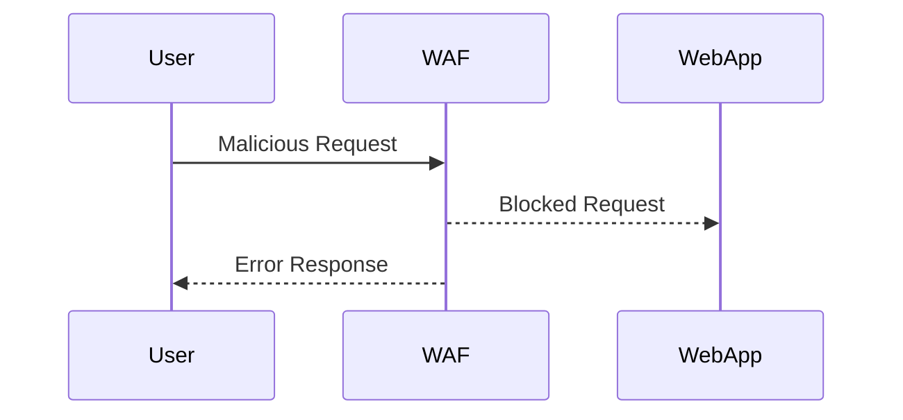
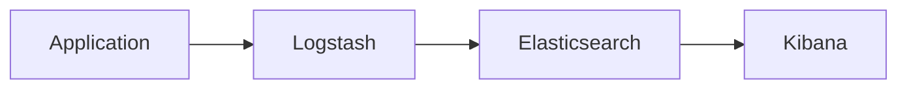

## Introduction to DevSecOps

### What is DevSecOps?

DevSecOps is an approach to software development that integrates security practices throughout the entire software development lifecycle (SDLC). This means that security is not treated as an afterthought but is embedded into every stage of the development process, from planning and coding to testing and deployment. The goal is to ensure that security is a shared responsibility among developers, operations teams, and security professionals.

### Why is DevSecOps Important?

In today’s fast-paced digital landscape, organizations face numerous cybersecurity threats. Traditional approaches to security often involve a separate security team that reviews and tests applications after they are developed. This can lead to delays, increased costs, and potentially missed vulnerabilities. By integrating security into the DevOps pipeline, organizations can identify and mitigate risks earlier in the development cycle, leading to more secure and reliable software.

### Continuous Security Concept

One of the core principles of DevSecOps is the concept of continuous security. This means that security measures are not just implemented once but are continuously monitored and updated to adapt to new threats and vulnerabilities. This includes:

- **Continuous Monitoring**: Regularly checking for unusual activity or potential security threats.
- **Automated Alerts**: Setting up systems to automatically notify the team when suspicious behavior is detected.
- **Real-Time Threat Detection**: Using tools and technologies to detect and respond to threats in real-time.

#### Example: Real-Time Threat Detection

Consider a scenario where an organization uses a web application firewall (WAF) to protect against SQL injection attacks. A WAF can monitor incoming traffic and block malicious requests in real-time. Here’s an example of how this might look in practice:



In this diagram, the WAF intercepts the malicious request and blocks it before it reaches the web application, preventing a potential SQL injection attack.

### Logging and Monitoring

Logging and monitoring are crucial components of DevSecOps. They help in detecting and responding to security incidents promptly. Here’s how they work:

- **Logging**: Capturing detailed records of system activities, including user actions, system events, and security-related events.
- **Monitoring**: Continuously observing these logs to identify patterns or anomalies that could indicate a security threat.

#### Example: Logging and Monitoring Setup

Let’s consider a simple setup using a centralized logging solution like ELK Stack (Elasticsearch, Logstash, Kibana):



In this setup, the application sends logs to Logstash, which processes them and stores them in Elasticsearch. Kibana provides a user interface to visualize and analyze these logs.

Here’s an example of a log entry:

```plaintext
2023-10-01T12:00:00Z | ERROR | User 'admin' failed login attempt from IP 192.168.1.100
```

This log entry captures a failed login attempt, which can be monitored for suspicious activity.

### Automating Compliance Checks

Another key aspect of DevSecOps is automating compliance checks. This ensures that the software adheres to regulatory requirements and internal policies. Compliance checks can be integrated into the CI/CD pipeline to run automatically whenever changes are made.

#### Example: Compliance Check Integration

Consider a scenario where an organization needs to ensure that their Docker images comply with certain security policies. This can be achieved using tools like `Trivy` for vulnerability scanning and `Opa` for policy enforcement.

Here’s an example of a Docker image scan using Trivy:

```bash
trivy image my-docker-image:latest
```

The output might look like this:

```plaintext
2023-10-01T12:00:00Z | INFO | Vulnerability found in package 'openssl': CVE-2023-1234
```

If a vulnerability is found, the build can be halted, and the issue can be addressed before proceeding.

### Policy as Code

Policy as Code is the practice of defining security policies and compliance rules in code. This allows for consistent enforcement and easy integration into the CI/CD pipeline.

#### Example: Policy as Code Implementation

Using `Opa`, you can define policies in Rego, a declarative policy language. Here’s an example of a policy that ensures that all Docker images are scanned before deployment:

```rego
package docker

default allow = false

allow {
    input.image = "my-docker-image"
    input.scanned = true
}
```

This policy ensures that only images that have been scanned are allowed to be deployed.

### Scanning for Vulnerabilities

Scanning for vulnerabilities is a critical part of DevSecOps. Tools like `Trivy`, `Clair`, and `Snyk` can be used to scan for known vulnerabilities in dependencies and libraries.

#### Example: Vulnerability Scan

Here’s an example of a vulnerability scan using `Trivy`:

```bash
trivy image my-docker-image:latest
```

The output might look like this:

```plaintext
2023-10-01T12:00:00Z | INFO | Vulnerability found in package 'openssl': CVE-2-2023-1234
```

If a vulnerability is found, the build can be halted, and the issue can be addressed before proceeding.

### Scanning for Misconfigurations

Misconfigurations can also pose significant security risks. Tools like `kube-bench` and `cis-benchmark` can be used to scan for misconfigurations in Kubernetes clusters and other services.

#### Example: Misconfiguration Scan

Here’s an example of a misconfiguration scan using `kube-bench`:

```bash
kube-bench run --version=1.26 --controls=1.2.1,1.2.2
```

The output might look like this:

```plaintext
2023-10-01T12:00:00Z | WARN | Control 1.2.1: Ensure that the API server pod specification does not allow privilege escalation
```

If a misconfiguration is found, it can be addressed immediately.

### Integrating Security into Developer Workflow

Integrating security into the developer workflow can seem daunting, but it is essential for creating a secure and reliable product. Here are some strategies to make this integration smoother:

- **Educate Developers**: Provide training and resources to help developers understand security best practices.
- **Automate Security Tasks**: Use tools and scripts to automate repetitive security tasks.
- **Incorporate Security into Code Reviews**: Include security checks as part of the code review process.
- **Use Secure Coding Practices**: Follow secure coding guidelines to prevent common vulnerabilities.

#### Example: Secure Coding Practices

Consider a scenario where a developer is writing code to handle user input. To prevent SQL injection, the developer should use parameterized queries. Here’s an example of insecure code:

```sql
SELECT * FROM users WHERE username = '$username';
```

And here’s the secure version:

```sql
PreparedStatement stmt = conn.prepareStatement("SELECT * FROM users WHERE username = ?");
stmt.setString(1, username);
ResultSet rs = stmt.executeQuery();
```

By using parameterized queries, the developer can prevent SQL injection attacks.

### Shifting Security Left

Shifting security left means moving security practices earlier in the development cycle. This can significantly reduce the cost and complexity of addressing security issues later in the process.

#### Example: Shifting Security Left

Consider a scenario where a developer is writing code for a new feature. Instead of waiting until the end of the development cycle to perform security testing, the developer can use static analysis tools like `SonarQube` to identify potential security issues during the coding phase.

Here’s an example of a SonarQube rule that detects potential SQL injection vulnerabilities:

```json
{
  "key": "S100",
  "name": "SQL Injection",
  "description": "Detects SQL injection vulnerabilities in SQL statements.",
  "severity": "MAJOR",
  "type": "BUG"
}
```

By identifying and fixing these issues early, the developer can ensure that the code is more secure from the start.

### Hands-On Labs

To gain practical experience with DevSecOps concepts, consider the following hands-on labs:

- **PortSwigger Web Security Academy**: Offers interactive labs to practice web application security.
- **OWASP Juice Shop**: A deliberately insecure web application for practicing security testing.
- **DVWA (Damn Vulnerable Web Application)**: Another intentionally vulnerable web application for learning security testing.
- **WebGoat**: An interactive, gamified training application for learning about web application security.

These labs provide a safe environment to practice and apply the concepts learned in this chapter.

### Conclusion

DevSecOps is a comprehensive approach to integrating security into the software development lifecycle. By adopting continuous security practices, automating compliance checks, and shifting security left, organizations can create more secure and reliable software. Through hands-on practice and continuous learning, developers can become proficient in applying these principles effectively.

---

This expanded explanation covers the core concepts of DevSecOps, provides detailed examples, and includes practical advice on how to implement these practices. The inclusion of real-world examples, code snippets, and diagrams helps to illustrate the concepts and provide a deeper understanding of DevSecOps.

---
<!-- nav -->
[[DevSecOps/DevSecOps Bootcamp/01-DevSecOps Introduction/07-Introduction to DevSecOps/Understand DevSecOps/04-Introduction to DevSecOps Part 4|Introduction to DevSecOps Part 4]] | [[DevSecOps/DevSecOps Bootcamp/01-DevSecOps Introduction/07-Introduction to DevSecOps/Understand DevSecOps/00-Overview|Overview]] | [[06-Introduction to DevSecOps Part 6|Introduction to DevSecOps Part 6]]
