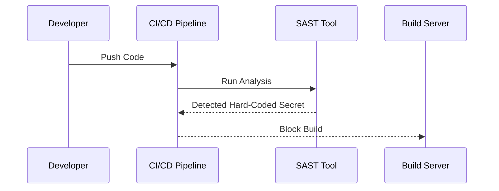

## Introduction to DevSecOps

### What is DevSecOps?

DevSecOps is a set of practices that integrates security into the DevOps lifecycle. Traditionally, security was considered a separate phase that occurred late in the development process. However, with DevSecOps, security is embedded throughout the entire lifecycle, from planning and coding to testing and deployment. This approach aims to reduce the cost and complexity of fixing security vulnerabilities by catching them earlier in the development process.

### Why is Early Detection Important?

Security issues are significantly more expensive to fix the later they are discovered in the software development lifecycle. According to a study by the Ponemon Institute, the average cost of a data breach increased from $3.86 million in 2020 to $4.24 million in 2021. The cost escalates dramatically if the issue is found during production or after an attack has already occurred.

#### Real-World Example: Equifax Data Breach

In 2017, Equifax suffered a massive data breach that exposed sensitive personal information of approximately 147 million consumers. The breach was caused by a vulnerability in Apache Struts, which was not patched in a timely manner. The total cost of the breach was estimated at around $4 billion, including legal settlements, credit monitoring services, and other expenses. This example underscores the financial and reputational damage that can result from security issues discovered too late.

### How DevSecOps Works

With DevSecOps, teams perform frequent and early testing using automated scans. This continuous integration and continuous delivery (CI/CD) approach ensures that security issues are identified and addressed as soon as possible. By integrating security checks into the CI/CD pipeline, developers can catch and fix vulnerabilities before they become major problems.

#### Static Application Security Testing (SAST)

One of the primary tools used in DevSecOps is Static Application Security Testing (SAST). SAST analyzes the source code to identify potential security vulnerabilities without executing the code. This type of analysis is particularly useful for identifying issues like hard-coded secrets, SQL injection vulnerabilities, and other common coding errors.

##### Example: Hard-Coded Secrets

Consider a scenario where a developer hard-codes an API key for a payment service into the application code. If this key is discovered by an attacker, they could potentially access sensitive customer information. This situation can be prevented by implementing a SAST tool in the CI/CD pipeline.



### Real-World Example: Capital One Data Breach

In 2019, Capital One experienced a data breach that exposed the personal information of over 100 million customers. The breach was caused by a misconfigured web application firewall, which allowed an attacker to access sensitive data. The total cost of the breach was estimated at around $150 million, including regulatory fines and remediation efforts. This example highlights the importance of early detection and the significant financial impact of security issues discovered in production.

### How to Prevent / Defend

To prevent such issues, organizations should implement a robust DevSecOps strategy that includes:

1. **Automated Scans**: Integrate SAST and other security tools into the CI/CD pipeline to detect vulnerabilities early.
2. **Secure Coding Practices**: Educate developers on secure coding practices to avoid common mistakes like hard-coding secrets.
3. **Configuration Management**: Ensure that configurations are properly managed and reviewed to prevent misconfigurations.
4. **Regular Audits**: Conduct regular security audits to identify and address any lingering vulnerabilities.

#### Secure Coding Fix Example

Let's consider the example of a hard-coded API key. Here is how the vulnerable code might look:

```python
# Vulnerable Code
import requests

API_KEY = 'your_secret_api_key'
url = f'https://api.payment-service.com/v1/transactions?api_key={API_KEY}'
response = requests.get(url)
print(response.json())
```

The secure version would involve storing the API key securely and retrieving it at runtime:

```python
# Secure Code
import os
import requests

API_KEY = os.getenv('PAYMENT_SERVICE_API_KEY')
url = f'https://api.payment-service.com/v1/transactions?api_key={API_KEY}'
response = requests.get(url)
print(response.json())
```

In this secure version, the API key is stored as an environment variable, which is a more secure practice.

### Configuration Management

Another critical aspect of DevSecOps is configuration management. Misconfigurations can lead to serious security vulnerabilities, as demonstrated in the Capital One breach. To mitigate this risk, organizations should:

1. **Use Infrastructure as Code (IaC)**: Tools like Terraform and Ansible can help manage infrastructure configurations in a version-controlled manner.
2. **Implement Configuration Validation**: Use tools like Checkov and tfsec to validate IaC configurations for security compliance.

#### Example: Terraform Configuration

Here is an example of a Terraform configuration for an AWS S3 bucket:

```hcl
# Vulnerable Configuration
resource "aws_s3_bucket" "example" {
  bucket = "my-vulnerable-bucket"
  acl    = "public-read"
}

# Secure Configuration
resource "aws_s3_bucket" "example" {
  bucket = "my-secure-bucket"
  acl    = "private"
}
```

In the secure configuration, the bucket ACL is set to `private`, preventing public access.

### Regular Audits

Regular security audits are essential to ensure that all security measures are functioning correctly. These audits should cover:

1. **Code Reviews**: Regularly review code changes for security vulnerabilities.
2. **Penetration Testing**: Conduct penetration tests to identify and address potential attack vectors.
3. **Compliance Checks**: Ensure that all configurations and practices comply with relevant regulations and standards.

### Hands-On Labs

To gain practical experience with DevSecOps, consider the following hands-on labs:

- **PortSwigger Web Security Academy**: Offers interactive labs to learn about web application security.
- **OWASP Juice Shop**: A deliberately insecure web application for practicing security testing.
- **DVWA (Damn Vulnerable Web Application)**: Another intentionally vulnerable web application for learning security concepts.
- **WebGoat**: An interactive training application for learning about web application security.

These labs provide a safe environment to practice and understand the principles of DevSec.

---
<!-- nav -->
[[05-Introduction to DevSecOps Part 5|Introduction to DevSecOps Part 5]] | [[DevSecOps/DevSecOps Bootcamp/01-DevSecOps Introduction/07-Introduction to DevSecOps/Understand DevSecOps/00-Overview|Overview]] | [[07-Introduction to DevSecOps|Introduction to DevSecOps]]
