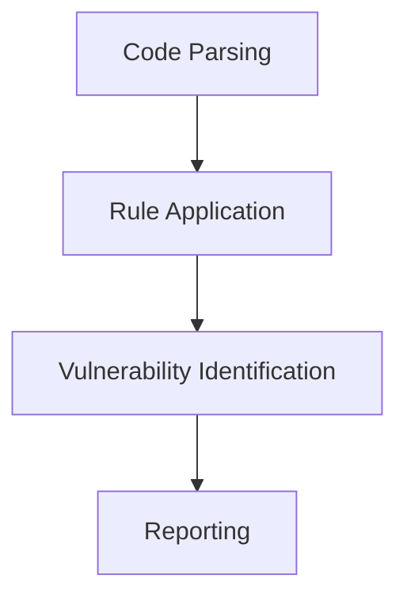

## Introduction to DevSecOps

### What is DevSecOps?

DevSecOps is an approach to software development that integrates security practices into the entire DevOps lifecycle. This means that security is no longer an afterthought but is embedded throughout the development, testing, and deployment processes. The goal of DevSecOps is to ensure that applications are secure from the very beginning and remain secure as they evolve.

### Why is DevSecOps Important?

Traditionally, security was often treated as a separate phase in the software development lifecycle (SDLC). This led to several issues:

1. **Delayed Security Testing**: Security vulnerabilities were often discovered late in the development process, making them more expensive and time-consuming to fix.
2. **Fragmented Responsibility**: Developers were responsible for writing code, while security teams were responsible for ensuring that the code was secure. This division of responsibility often led to miscommunication and oversight.
3. **Inefficient Processes**: Manual security testing could slow down the release cycle, leading to delays and reduced agility.

By integrating security into the DevOps pipeline, DevSecOps aims to address these issues and create a more efficient and secure development process.

### How Does DevSecOps Work?

DevSecOps achieves its goal of evaluating the current security posture and identifying issues through automation. Just as automated unit tests and integration tests are used to test new features and application functionality, DevSecOps uses automated security tests to evaluate the security of the application.

### Types of Security Tests in DevSecOps

There are several types of security tests used in DevSecOps, each serving a specific purpose. Let's explore these types in detail:

#### Static Application Security Testing (SAST)

Static Application Security Testing (SAST) is a type of security testing that analyzes the source code of an application without executing it. SAST tools scan the codebase to identify potential security vulnerabilities such as SQL injection, cross-site scripting (XSS), and buffer overflows.

**How SAST Works**

SAST tools work by analyzing the code statically, meaning they do not execute the code during the analysis. Instead, they parse the code and apply various rules and heuristics to identify patterns that may indicate security vulnerabilities. Here’s a step-by-step breakdown of the process:

1. **Code Parsing**: The SAST tool reads the source code and parses it into an abstract syntax tree (AST).
2. **Rule Application**: The tool applies predefined rules and heuristics to the parsed code to identify potential security issues.
3. **Vulnerability Identification**: Based on the rules applied, the tool identifies code snippets that may be vulnerable to security attacks.
4. **Reporting**: The tool generates a report detailing the identified vulnerabilities along with their severity and potential impact.

**Real-World Example**

Consider the following Python code snippet that is vulnerable to SQL injection:

```python
# Vulnerable code
def get_user_details(user_id):
    conn = sqlite3.connect('database.db')
    cursor = conn.cursor()
    query = f"SELECT * FROM users WHERE id = {user_id}"
    cursor.execute(query)
    result = cursor.fetchone()
    return result
```

A SAST tool would flag this code as potentially vulnerable to SQL injection because it constructs the SQL query using user input without proper sanitization.

**Secure Code Fix**

To fix this vulnerability, you should use parameterized queries:

```python
# Secure code
def get_user_details(user_id):
    conn = sqlite3.connect('database.db')
    cursor = conn.cursor()
    query = "SELECT * FROM users WHERE id = ?"
    cursor.execute(query, (user_id,))
    result = cursor.fetchone()
    return result
```

**How to Prevent / Defend**

1. **Detection**: Use SAST tools to automatically detect potential security vulnerabilities in the codebase.
2. **Prevention**: Implement secure coding practices such as using parameterized queries, input validation, and output encoding.
3. **Secure Coding Fixes**: Ensure that all identified vulnerabilities are fixed before the code is merged into the main branch.
4. **Configuration Hardening**: Configure SAST tools to run as part of the continuous integration (CI) pipeline to ensure that security issues are caught early.

### Mermaid Diagrams

Let's visualize the SAST process using a mermaid diagram:



This diagram shows the steps involved in the SAST process, from parsing the code to generating a report.

### Conclusion

DevSecOps is a critical approach to ensuring that applications are secure from the very beginning. By integrating security testing into the DevOps pipeline, organizations can catch and fix security vulnerabilities early, reducing the risk of security breaches and improving overall application security.

### Practice Labs

For hands-on experience with DevSecOps, consider the following practice labs:

- **PortSwigger Web Security Academy**: Offers interactive labs to practice web application security testing.
- **OWASP Juice Shop**: A deliberately insecure web application for practicing security testing.
- **DVWA (Damn Vulnerable Web Application)**: Another intentionally vulnerable web application for security testing.

These labs provide practical experience in applying DevSecOps principles and techniques to real-world scenarios.

### Further Reading

For deeper understanding, refer to the following resources:

- **OWASP Top Ten Project**: Provides a list of the most critical web application security risks.
- **NIST Cybersecurity Framework**: Offers guidelines for managing cybersecurity risk.
- **SANS Institute**: Provides comprehensive training and resources on cybersecurity.

By mastering DevSecOps, you can ensure that your applications are secure and resilient against modern cyber threats.

---
<!-- nav -->
[[06-Introduction to DevSecOps Part 6|Introduction to DevSecOps Part 6]] | [[DevSecOps/DevSecOps Bootcamp/01-DevSecOps Introduction/07-Introduction to DevSecOps/Understand DevSecOps/00-Overview|Overview]] | [[08-Understanding DevSecOps Part 1|Understanding DevSecOps Part 1]]
