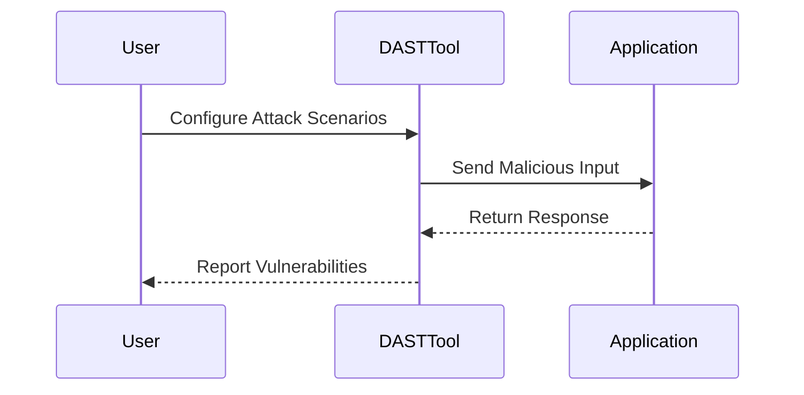
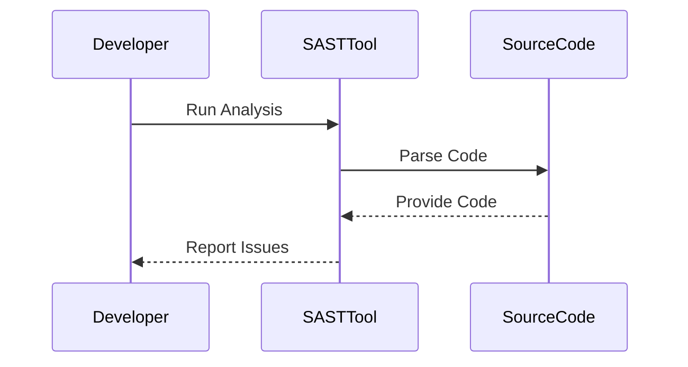
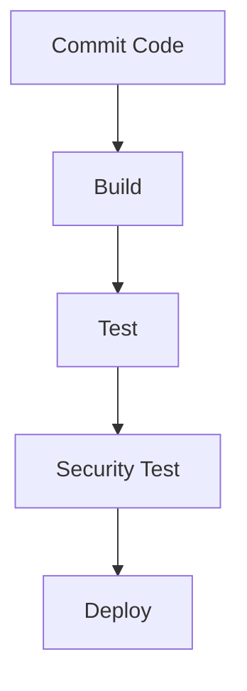
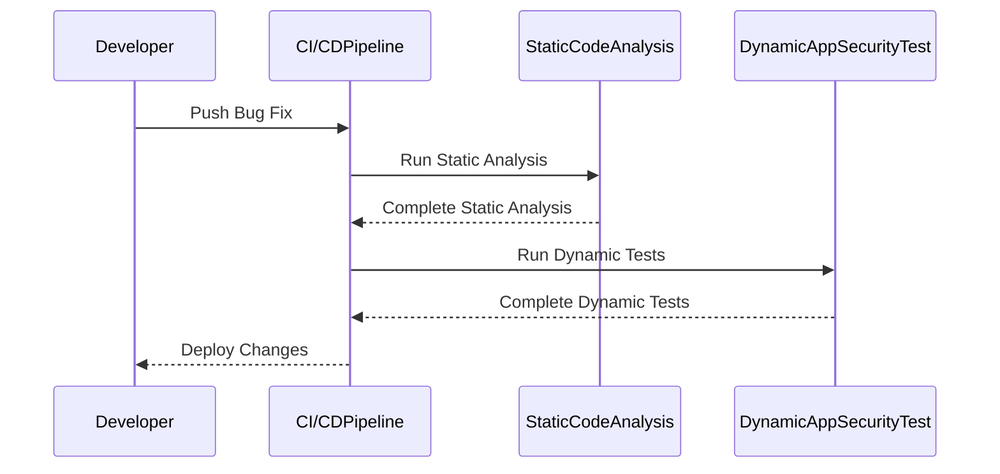
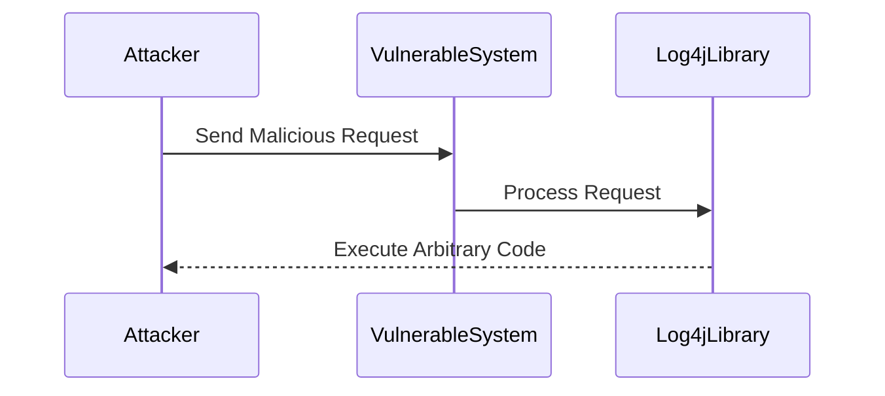

## Understanding DevSecOps

### Introduction to DevSecOps

DevSecOps is an approach that integrates security practices into the DevOps lifecycle, ensuring that security is not an afterthought but an integral part of the development process. This methodology aims to reduce the risk of security vulnerabilities by incorporating security testing and compliance checks throughout the software development life cycle (SDLC).

### Dynamic Application Security Testing (DAST)

Dynamic Application Security Testing (DAST) is a type of security testing performed on a running application. The goal of DAST is to identify security vulnerabilities by simulating attacks against the application. This type of testing is crucial because it helps ensure that the application is secure from external threats.

#### What is DAST?

DAST tools simulate various types of attacks, such as SQL injection, cross-site scripting (XSS), and buffer overflows, to check if the application is vulnerable to these types of attacks. These tools interact with the application through its user interface, APIs, or network interfaces, making them highly effective at identifying runtime vulnerabilities.

#### Why is DAST Important?

DAST is important because it provides a real-time assessment of the application's security posture. By simulating attacks, DAST helps identify vulnerabilities that might be missed during static code analysis. This is particularly useful for applications that rely heavily on external inputs, such as web applications.

#### How Does DAST Work?

DAST tools work by sending malicious input to the application and observing the response. For example, a DAST tool might send a SQL injection payload to a login form and check if the application returns unexpected data or errors. If the application is vulnerable, the tool will report the issue.



### Static Application Security Testing (SAST)

Static Application Security Testing (SAST) is another type of security testing that analyzes the source code of an application without executing it. SAST tools scan the code for potential security vulnerabilities and coding errors.

#### What is SAST?

SAST tools analyze the source code to identify security weaknesses, such as buffer overflows, format string vulnerabilities, and insecure cryptographic practices. These tools can also detect coding errors that might lead to security issues.

#### Why is SAST Important?

SAST is important because it allows developers to identify and fix security vulnerabilities early in the development process. By catching issues during the coding phase, developers can avoid introducing vulnerabilities into the application.

#### How Does SAST Work?

SAST tools work by parsing the source code and applying a set of rules to identify potential security issues. For example, a SAST tool might flag a function that uses `strcpy` without checking the length of the input string, which could lead to a buffer overflow.



### Continuous Integration and Continuous Deployment (CI/CD)

Continuous Integration and Continuous Deployment (CI/CD) is a practice that automates the integration and deployment of code changes. In the context of DevSecOps, CI/CD pipelines integrate security testing into the automated build and deployment processes.

#### What is CI/CD?

CI/CD is a set of practices that enables teams to deliver code changes more frequently and reliably. CI involves automatically building and testing code changes as they are committed, while CD involves automatically deploying those changes to production.

#### Why is CI/CD Important?

CI/CD is important because it helps teams deliver software faster and with fewer errors. By integrating security testing into the CI/CD pipeline, teams can catch and fix security vulnerabilities early in the development process.

#### How Does CI/CD Work?

In a CI/CD pipeline, code changes are automatically built, tested, and deployed. Security testing is integrated into this process, ensuring that the application is secure before it is deployed to production.



### Challenges of Security Scans in CI/CD Pipelines

One of the challenges of integrating security scans into CI/CD pipelines is the time it takes to perform these scans. Security scans can be resource-intensive and time-consuming, especially for large applications.

#### Time-Consuming Scans

Security scans can take hours to complete, depending on the size and complexity of the application. This can cause delays in the CI/CD pipeline, especially if multiple developers are pushing changes simultaneously.

#### Example Scenario

Imagine a scenario where a developer pushes a small bug fix to the code repository, triggering the CI/CD pipeline. The pipeline includes a series of security scans, including static code analysis and dynamic application security testing. If these scans take two hours to complete, the developer will have to wait for the results before the changes can be deployed.



### How to Prevent / Defend Against Time-Consuming Scans

To mitigate the impact of time-consuming security scans, teams can implement several strategies:

1. **Optimize Scan Configurations**: Configure security scans to focus on critical areas of the application, reducing the overall scan time.
2. **Parallelize Scans**: Run multiple scans in parallel to reduce the total time required.
3. **Incremental Scans**: Perform incremental scans that only analyze the changed parts of the code, rather than the entire application.
4. **Use Caching**: Cache the results of previous scans to avoid redundant scans.

#### Example Configuration

Here is an example of how to configure a CI/CD pipeline to optimize security scans:

```yaml
# .github/workflows/ci-cd.yml
name: CI/CD Pipeline

on:
  push:
    branches:
      - main

jobs:
  build-and-test:
    runs-on: ubuntu-latest
    steps:
      - name: Checkout Code
        uses: actions/checkout@v2
      
      - name: Install Dependencies
        run: |
          npm install
      
      - name: Run Static Code Analysis
        run: |
          eslint .
      
      - name: Run Dynamic Application Security Tests
        run: |
          zap-baseline.py -t http://localhost:3000/
      
      - name: Deploy to Production
        run: |
          npm run deploy
```

### Real-World Examples

#### Recent CVEs and Breaches

Recent CVEs and breaches highlight the importance of integrating security testing into the CI/CD pipeline. For example, the Log4j vulnerability (CVE-2021-44228) affected numerous applications and systems, emphasizing the need for continuous security assessments.

#### Example: Log4j Vulnerability

The Log4j vulnerability was a critical security flaw that allowed attackers to execute arbitrary code on affected systems. This vulnerability affected many popular applications and services, including Apache Struts, Jenkins, and Docker.



### How to Prevent / Defend Against Log4j Vulnerability

To defend against the Log4j vulnerability, organizations can take several steps:

1. **Update Dependencies**: Ensure that all dependencies, including Log4j, are up-to-date with the latest security patches.
2. **Configure Security Policies**: Implement security policies that restrict access to sensitive resources.
3. **Monitor Logs**: Monitor logs for suspicious activity and alert on potential security incidents.

#### Example Secure Configuration

Here is an example of how to configure a system to defend against the Log4j vulnerability:

```yaml
# application.properties
logging.level.org.apache.logging.log4j.core.lookup.JndiLookup=ERROR
```

### Conclusion

DevSecOps is a critical approach that integrates security practices into the DevOps lifecycle. By incorporating dynamic and static application security testing into the CI/CD pipeline, teams can ensure that their applications are secure from external threats. While security scans can be time-consuming, teams can implement strategies to optimize these scans and mitigate their impact. Real-world examples, such as the Log4j vulnerability, highlight the importance of continuous security assessments and the need for robust defense mechanisms.

### Practice Labs

For hands-on experience with DevSecOps, consider the following labs:

- **PortSwigger Web Security Academy**: Offers interactive labs for learning web security concepts and techniques.
- **OWASP Juice Shop**: A deliberately insecure web application for practicing web security skills.
- **DVWA (Damn Vulnerable Web Application)**: A PHP/MySQL web application that is vulnerable to many types of web application attacks.

These labs provide practical experience with integrating security testing into the CI/CD pipeline and defending against real-world vulnerabilities.

---
<!-- nav -->
[[07-Introduction to DevSecOps|Introduction to DevSecOps]] | [[DevSecOps/DevSecOps Bootcamp/01-DevSecOps Introduction/07-Introduction to DevSecOps/Understand DevSecOps/00-Overview|Overview]] | [[09-Understanding DevSecOps|Understanding DevSecOps]]
