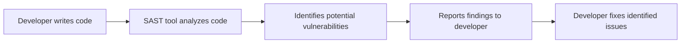
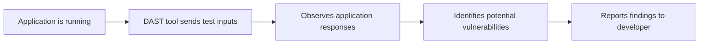
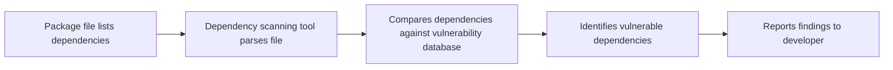

## Understanding DevSecOps

### Introduction to DevSecOps

DevSecOps is a methodology that integrates security practices into the DevOps lifecycle, ensuring that security is a continuous and integral part of the development process. This approach aims to reduce the risk of security vulnerabilities by incorporating security testing and compliance checks throughout the software development life cycle (SDLC).

### Static Application Security Testing (SAST)

Static Application Security Testing (SAST), also known as Static Analysis Security Testing (SAST), is a type of security analysis that examines the source code of an application without executing it. The primary goal of SAST is to identify potential security vulnerabilities and coding errors that could lead to security breaches.

#### What is SAST?

SAST tools analyze the source code to find patterns that indicate potential security weaknesses. These tools can detect issues such as SQL injection, cross-site scripting (XSS), buffer overflows, and insecure cryptographic practices. By identifying these issues early in the development process, teams can address them before the application is deployed, reducing the risk of security incidents.

#### Why is SSAST Important?

Without SAST, developers might unknowingly introduce security vulnerabilities into their code. These vulnerabilities can be exploited by attackers to gain unauthorized access, steal sensitive data, or disrupt services. By integrating SAST into the development pipeline, organizations can catch and fix these issues before they become critical problems.

#### How Does SAST Work?

SAST tools work by analyzing the source code statically, meaning they do not execute the code during the analysis. Instead, they use various techniques such as data flow analysis, control flow analysis, and pattern matching to identify potential security issues.



#### Real-World Example: CVE-2021-44228 (Log4Shell)

One of the most significant recent security vulnerabilities was the Log4Shell (CVE-2021-44228) vulnerability in the Apache Log4j logging framework. This vulnerability allowed attackers to execute arbitrary code on affected systems. Had SAST been integrated into the development process, the vulnerability might have been detected earlier, preventing widespread exploitation.

#### Common Pitfalls and How to Avoid Them

1. **False Positives**: SAST tools can sometimes generate false positives, which can be time-consuming to investigate. To mitigate this, configure the tool to focus on high-risk areas and use a combination of static and dynamic analysis.
   
2. **Ignoring Findings**: Developers might ignore findings from SAST tools, especially if they are not familiar with the security implications. Regular training and awareness programs can help ensure that developers take security findings seriously.

#### How to Prevent / Defend

**Detection**:
- Integrate SAST tools into your CI/CD pipeline to automatically scan code changes.
- Use tools like SonarQube, Fortify, and Checkmarx to perform comprehensive static analysis.

**Prevention**:
- Implement secure coding practices and guidelines.
- Conduct regular code reviews and pair programming sessions.

**Secure Code Fix**:
Compare the vulnerable code with the fixed version:

```python
# Vulnerable code
import subprocess
subprocess.call(["ls", "-l", userInput])

# Fixed code
import subprocess
subprocess.call(["ls", "-l", "/path/to/safe/directory"])
```

### Dynamic Application Security Testing (DAST)

Dynamic Application Security Testing (DAST) involves testing the application while it is running. Unlike SAST, DAST tools interact with the application's runtime environment to identify security vulnerabilities.

#### What is DAST?

DAST tools simulate attacks on the running application to identify vulnerabilities such as SQL injection, XSS, and CSRF. These tools can also detect misconfigurations and other runtime issues that might not be apparent from the source code alone.

#### Why is DAST Important?

DAST complements SAST by providing a more comprehensive view of the application's security posture. While SAST focuses on the source code, DAST examines the application's behavior in a live environment, helping to identify issues that might arise due to runtime conditions.

#### How Does DAST Work?

DAST tools send various types of inputs to the application and observe the responses. They look for signs of vulnerabilities such as unexpected error messages, unusual behavior, or unauthorized access.



#### Real-World Example: Heartbleed (CVE-2014-0160)

The Heartbleed vulnerability (CVE-2014-0160) in OpenSSL is a classic example of a vulnerability that could have been detected with DAST. This vulnerability allowed attackers to read sensitive information from the memory of servers and clients. DAST tools could have helped identify this issue by simulating attacks and observing the server's response.

#### Common Pitfalls and How to Avoid Them

1. **False Negatives**: DAST tools might miss certain vulnerabilities if the test inputs do not cover all possible scenarios. To mitigate this, use a combination of automated and manual testing.
   
2. **Resource Intensive**: DAST can be resource-intensive, especially for large applications. To manage this, schedule DAST runs during off-peak hours and use load balancing techniques.

#### How to Prevent / Defend

**Detection**:
- Integrate DAST tools into your CI/CD pipeline to automatically test the application.
- Use tools like OWASP ZAP, Burp Suite, and Acunetix to perform comprehensive dynamic analysis.

**Prevention**:
- Implement secure coding practices and guidelines.
- Conduct regular security audits and penetration testing.

**Secure Code Fix**:
Compare the vulnerable code with the fixed version:

```python
# Vulnerable code
@app.route('/login', methods=['POST'])
def login():
    username = request.form['username']
    password = request.form['password']
    if authenticate(username, password):
        return "Login successful"
    else:
        return "Invalid credentials"

# Fixed code
@app.route('/login', methods=['POST'])
def login():
    username = request.form['username']
    password = request.form['password']
    if authenticate(username, password):
        return "Login successful"
    else:
        return "Invalid credentials", 401
```

### Dependency Scanning

Dependency scanning is a crucial aspect of DevSecOps that focuses on analyzing the third-party libraries and frameworks used in an application. These dependencies can introduce security vulnerabilities if they are not properly managed.

#### What is Dependency Scanning?

Dependency scanning involves examining the dependencies listed in the application's package files (such as `package.json` for Node.js applications) to identify known security vulnerabilities. Tools can compare the dependencies and their versions against a database of known vulnerabilities to provide alerts and recommendations.

#### Why is Dependency Scanning Important?

Third-party libraries and frameworks are often used to speed up development and reduce the amount of custom code needed. However, these dependencies can introduce security risks if they contain known vulnerabilities. By performing dependency scanning, organizations can ensure that their applications are not using outdated or vulnerable libraries.

#### How Does Dependency Scanning Work?

Dependency scanning tools parse the package files to identify the dependencies and their versions. They then compare this information against a database of known vulnerabilities to determine if any of the dependencies are affected.



#### Real-World Example: npm Audit (CVE-2021-21366)

In 2021, a vulnerability (CVE-2021-21366) was discovered in the `lodash` library, which is widely used in Node.js applications. This vulnerability allowed attackers to execute arbitrary code. Dependency scanning tools like `npm audit` could have helped identify this issue by comparing the `lodash` version used in the application against the known vulnerabilities.

#### Common Pitfalls and How to Avoid Them

1. **Outdated Database**: Dependency scanning tools rely on databases of known vulnerabilities. If the database is not up-to-date, the tool might miss new vulnerabilities. Ensure that the tool's database is regularly updated.
   
2. **Ignoring Findings**: Developers might ignore findings from dependency scanning tools, especially if they are not familiar with the security implications. Regular training and awareness programs can help ensure that developers take security findings seriously.

#### How to Prevent / Defend

**Detection**:
- Integrate dependency scanning tools into your CI/CD pipeline to automatically scan dependencies.
- Use tools like `npm audit`, `pip-audit`, and `Dependabot` to perform comprehensive dependency analysis.

**Prevention**:
- Keep dependencies up-to-date and regularly review the list of dependencies.
- Implement a process for reviewing and approving new dependencies.

**Secure Code Fix**:
Compare the vulnerable code with the fixed version:

```json
// Vulnerable package.json
{
  "dependencies": {
    "lodash": "^4.17.10"
  }
}

// Fixed package.json
{
  "dependencies": {
    "lodash": "^4.17.21"
  }
}
```

### Hands-On Labs

To gain practical experience with DevSecOps concepts, consider the following hands-on labs:

- **PortSwigger Web Security Academy**: Offers interactive labs to learn about web application security.
- **OWASP Juice Shop**: A deliberately insecure web application for practicing web security skills.
- **DVWA (Damn Vulnerable Web Application)**: A PHP/MySQL web application that is riddled with vulnerabilities for educational purposes.
- **WebGoat**: An interactive, gamified training application for learning about web application security.

By integrating these tools and practices into your development process, you can significantly enhance the security of your applications and reduce the risk of security incidents.

---
<!-- nav -->
[[08-Understanding DevSecOps Part 1|Understanding DevSecOps Part 1]] | [[DevSecOps/DevSecOps Bootcamp/01-DevSecOps Introduction/07-Introduction to DevSecOps/Understand DevSecOps/00-Overview|Overview]] | [[DevSecOps/DevSecOps Bootcamp/01-DevSecOps Introduction/07-Introduction to DevSecOps/Understand DevSecOps/10-Practice Questions & Answers|Practice Questions & Answers]]
