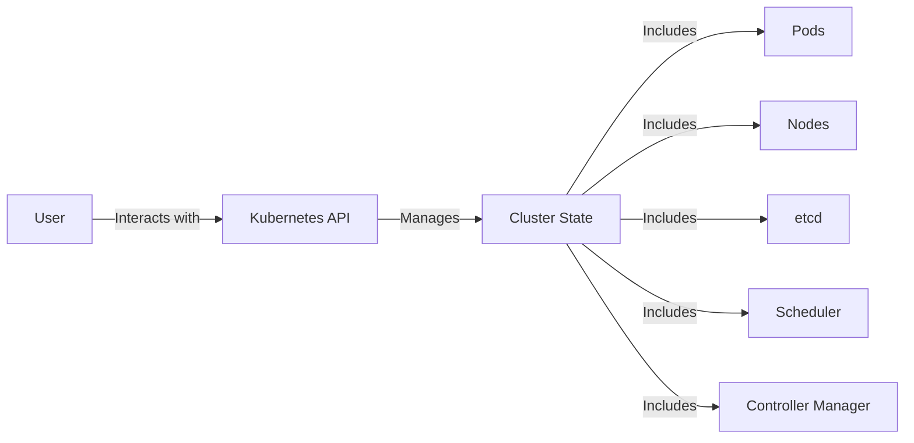
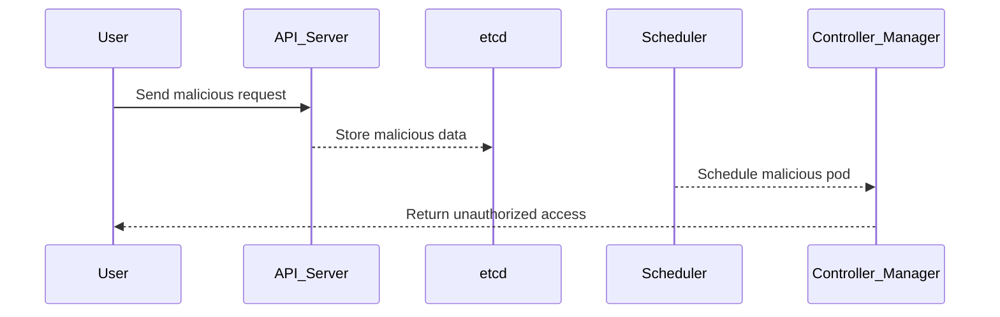

## Introduction to Kubernetes Security

Kubernetes, often referred to as K8s, is an open-source system for automating deployment, scaling, and management of containerized applications. In the context of DevSecOps, Kubernetes plays a crucial role in ensuring that applications deployed in a containerized environment are secure. This chapter will delve into the various aspects of Kubernetes security, including its architecture, common vulnerabilities, and best practices for securing your Kubernetes clusters.

### Background Theory

Before diving into the specifics of Kubernetes security, it's essential to understand the basics of Kubernetes itself. Kubernetes is designed to manage containerized applications across multiple hosts. It provides mechanisms for deployment, maintenance, and scaling of applications.

#### Key Components of Kubernetes

- **Pods**: The smallest deployable units in Kubernetes. A pod can contain one or more containers.
- **Nodes**: Physical or virtual machines that run the pods.
- **Control Plane**: Manages the cluster and ensures the desired state of the cluster is maintained.
- **API Server**: Exposes the Kubernetes API and serves as the front end for the control plane.
- **etcd**: A distributed key-value store used to store the configuration data of the cluster.
- **Scheduler**: Assigns pods to nodes based on resource requirements and availability.
- **Controller Manager**: Runs controllers that regulate the state of the cluster.



### Kubernetes Security Concepts

Kubernetes introduces a new layer of complexity to the DevSecOps pipeline. With the introduction of Kubernetes, several new security concepts and potential threats arise. These include:

- **Network Security**: Ensuring that communication between pods and services is secure.
- **Identity and Access Management (IAM)**: Managing access to the Kubernetes API and resources within the cluster.
- **Configuration Management**: Ensuring that configurations are secure and not exposed to unauthorized users.
- **Runtime Security**: Monitoring and protecting the runtime environment of the pods.

### Common Vulnerabilities in Kubernetes

Several vulnerabilities can affect Kubernetes clusters. Understanding these vulnerabilities is crucial for implementing effective security measures.

#### Example Vulnerability: CVE-2021-25741

CVE-2021-25741 is a critical vulnerability in Kubernetes that allows an attacker to escalate privileges and gain full control of the cluster. This vulnerability arises due to a flaw in the `kube-apiserver` component, which can be exploited to bypass authentication and authorization checks.

**Impact**: An attacker can execute arbitrary commands and gain full administrative access to the Kubernetes cluster.

**Detection**: Monitor the Kubernetes API server logs for unusual activity, such as unauthorized access attempts or unexpected API calls.

**Prevention**:
- Ensure that all Kubernetes components are up to date with the latest security patches.
- Implement strict RBAC (Role-Based Access Control) policies to limit access to sensitive resources.
- Regularly audit and review access controls and configurations.



### Network Security in Kubernetes

Network security is a critical aspect of Kubernetes security. Ensuring that communication between pods and services is secure helps prevent unauthorized access and data breaches.

#### Example: Network Policies

Network policies in Kubernetes allow you to define rules for inbound and outbound traffic to pods. By default, all traffic is allowed unless explicitly restricted.

**Example Configuration**:

```yaml
apiVersion: networking.k8s.io/v1
kind: NetworkPolicy
metadata:
  name: deny-all-ingress
spec:
  podSelector: {}
  policyTypes:
  - Ingress
```

This configuration denies all ingress traffic to all pods in the namespace.

**Detection**: Monitor network traffic using tools like `kubectl` and `iptables`.

**Prevention**:
- Implement strict network policies to restrict traffic to only necessary services.
- Use network segmentation to isolate sensitive services.
- Regularly review and update network policies to ensure they remain effective.

### Identity and Access Management (IAM)

IAM is a critical component of Kubernetes security. Proper management of identities and access controls helps prevent unauthorized access to the cluster.

#### Example: Role-Based Access Control (RBAC)

RBAC is a method of regulating access to Kubernetes resources based on roles. Roles define a set of permissions, and role bindings associate roles with users or groups.

**Example Configuration**:

```yaml
apiVersion: rbac.authorization.k8s.io/v1
kind: Role
metadata:
  namespace: default
  name: pod-reader
rules:
- apiGroups: [""]
  resources: ["pods"]
  verbs: ["get", "watch", "list"]
---
apiVersion: rbac.authorization.k8s.io/v1
kind: RoleBinding
metadata:
  name: read-pods
  namespace: default
subjects:
- kind: Group
  name: manager-group
  apiGroup: rbac.authorization.k8s.io
roleRef:
  kind: Role
  name: pod-reader
  apiGroup: rbac.authorization.k8s.io
```

This configuration defines a role `pod-reader` that allows reading pods and binds it to a group `manager-group`.

**Detection**: Monitor access logs and audit logs for unauthorized access attempts.

**Prevention**:
- Implement strict RBAC policies to limit access to sensitive resources.
- Regularly review and update RBAC policies to ensure they remain effective.
- Use multi-factor authentication (MFA) for accessing the Kubernetes API.

### Configuration Management

Configuration management is another critical aspect of Kubernetes security. Ensuring that configurations are secure and not exposed to unauthorized users helps prevent security breaches.

#### Example: Secret Management

Secrets in Kubernetes are used to store sensitive information such as passwords, tokens, and keys. Proper management of secrets is crucial to prevent unauthorized access.

**Example Configuration**:

```yaml
apiVersion: v1
kind: Secret
metadata:
  name: mysecret
type: Opaque
data:
  password: cGFzc3dvcmQ=  # Base64 encoded value
```

This configuration defines a secret `mysecret` with a base64-encoded password.

**Detection**: Monitor secret usage and access logs for unauthorized access attempts.

**Prevention**:
- Use encryption at rest for secrets.
- Limit access to secrets using RBAC policies.
- Regularly rotate secrets to minimize exposure.

### Runtime Security

Runtime security is the process of monitoring and protecting the runtime environment of the pods. Ensuring that the runtime environment is secure helps prevent attacks and data breaches.

#### Example: Pod Security Policies (PSP)

Pod Security Policies (PSP) are used to enforce security constraints on pods. PSPs can be used to restrict the types of pods that can be created and the actions they can perform.

**Example Configuration**:

```yaml
apiVersion: policy/v1beta1
kind: PodSecurityPolicy
metadata:
  name: example-policy
spec:
  privileged: false
  readOnlyRootFilesystem: true
  runAsUser:
    rule: MustRunAsNonRoot
  seLinux:
    rule: RunAsAny
  supplementalGroups:
    rule: MustRunAs
    ranges:
    - min: 1
      max: 65535
  fsGroup:
    rule: MustRunAs
    ranges:
    - min: 1
      max: 65535
```

This configuration defines a PSP `example-policy` that enforces non-root execution and read-only root filesystem.

**Detection**: Monitor pod creation and execution logs for unauthorized activities.

**Prevention**:
- Implement strict PSPs to enforce security constraints on pods.
- Regularly review and update PSPs to ensure they remain effective.
- Use runtime security tools like Falco to monitor and detect suspicious activities.

### Hands-On Labs

To gain practical experience with Kubernetes security, consider the following hands-on labs:

- **Kubernetes Goat**: A hands-on lab for learning Kubernetes security.
- **OWASP WrongSecrets**: A project for learning about secrets management in Kubernetes.
- **kube-hunter**: A tool for hunting down security issues in Kubernetes clusters.

These labs provide real-world scenarios and challenges to help you master Kubernetes security.

### Conclusion

Kubernetes security is a critical aspect of the DevSecOps pipeline. Understanding the various security concepts, common vulnerabilities, and best practices for securing Kubernetes clusters is essential for ensuring the security of your applications. By implementing strict network policies, IAM, configuration management, and runtime security measures, you can protect your Kubernetes clusters from potential threats. Regularly reviewing and updating security configurations is crucial to maintaining the security of your Kubernetes environment.

---
<!-- nav -->
[[DevSecOps/DevSecOps Bootcamp/01-DevSecOps Introduction/08-Introduction to Kubernetes Security/01-Kubernetes Security Overview/00-Overview|Overview]] | [[DevSecOps/DevSecOps Bootcamp/01-DevSecOps Introduction/08-Introduction to Kubernetes Security/01-Kubernetes Security Overview/02-Practice Questions & Answers|Practice Questions & Answers]]
