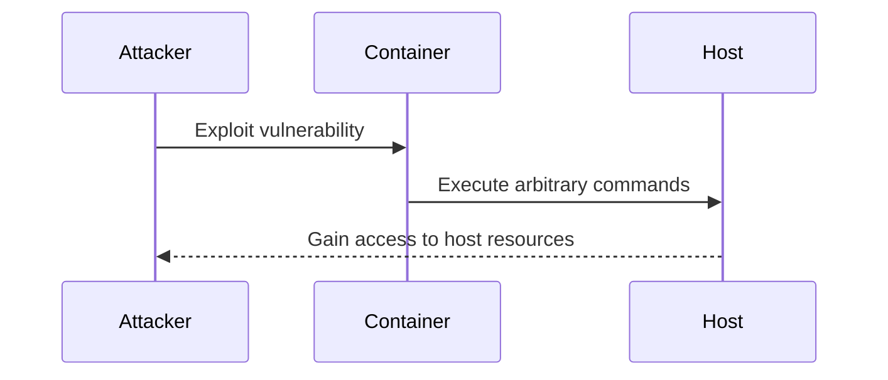
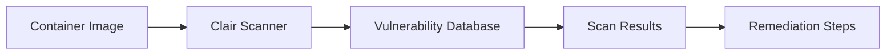

## Introduction to Kubernetes Security Best Practices

Kubernetes, often referred to as K8s, is an open-source platform designed to automate deploying, scaling, and operating application containers. While Kubernetes offers numerous benefits, it also introduces significant security challenges. One critical aspect of Kubernetes security is ensuring that the container images used within the cluster are secure. This chapter delves into the importance of securing container images through image scanning and provides detailed guidance on how to implement this best practice effectively.

### Understanding Container Escape Vulnerabilities

Container escape vulnerabilities occur when an attacker gains unauthorized access to the underlying host from within a container. This scenario is particularly dangerous because once an attacker escapes the container, they can:

- Access sensitive data stored in host volumes.
- Read and modify the host's filesystem.
- Gain access to the configuration of the `kubelet` (the primary "node agent" that runs on each node), including its authentication tokens and certificates used to communicate with the Kubernetes API server.

#### Real-World Example: CVE-2019-11246

CVE-2019-11246 is a notable example of a container escape vulnerability. This vulnerability affected Docker versions prior to 19.03.1 and allowed attackers to execute arbitrary commands on the host machine. The vulnerability was due to a flaw in the `docker run` command, which could be exploited to bypass certain security restrictions.



### Importance of Secure Images

To mitigate the risks associated with container escape vulnerabilities, it is crucial to ensure that the container images used within the Kubernetes cluster are secure. This involves:

- Regularly scanning images for known vulnerabilities.
- Implementing secure coding practices during image creation.
- Using trusted sources for base images.

### Image Scanning: A Key Security Practice

Image scanning is the process of analyzing container images to identify known vulnerabilities and security issues. This practice helps ensure that the images used in the Kubernetes cluster are free from exploitable weaknesses.

#### Tools for Image Scanning

Several tools are available for image scanning, including:

- **Clair**: An open-source project that continuously checks for vulnerabilities in container images.
- **Snyk**: A commercial tool that integrates with CI/CD pipelines to scan for vulnerabilities.
- **Trivy**: Another open-source tool that scans container images for vulnerabilities.

##### Clair Example

Clair is a popular choice for image scanning. To use Clair, you first need to set up a Clair instance and then configure it to scan your container images.



Here’s a step-by-step guide to setting up and using Clair:

1. **Install Clair**:
   ```sh
   docker run -d --name clair -p 6060:6060 quay.io/coreos/clair:latest
   ```

2. **Configure Clair**:
   - Set up Clair to connect to a PostgreSQL database.
   - Configure Clair to scan specific registries.

3. **Scan an Image**:
   ```sh
   curl -X POST http://localhost:6060/v1/projects/your-project/images/your-image:tag
   ```

4. **Review Scan Results**:
   - Check the results via the Clair API or web interface.
   - Identify and address any vulnerabilities found.

### How to Prevent / Defend Against Vulnerable Images

#### Detection

Regularly scanning images for vulnerabilities is essential. Tools like Clair, Snyk, and Trivy provide comprehensive scanning capabilities. Additionally, integrating these tools into your CI/CD pipeline ensures that images are scanned automatically whenever changes are made.

#### Prevention

To prevent vulnerabilities from slipping into your images, follow these best practices:

- **Use Trusted Base Images**: Always start with trusted base images from reputable sources.
- **Keep Dependencies Updated**: Regularly update dependencies to the latest versions.
- **Implement Secure Coding Practices**: Follow secure coding guidelines to minimize vulnerabilities.

#### Secure-Coding Fixes

Here’s an example of a vulnerable Dockerfile and its secure counterpart:

**Vulnerable Dockerfile**:
```Dockerfile
FROM python:3.8-slim
RUN apt-get update && apt-get install -y wget
COPY . /app
WORKDIR /app
RUN pip install -r requirements.txt
CMD ["python", "app.py"]
```

**Secure Dockerfile**:
```Dockerfile
FROM python:3.8-slim
RUN apt-get update && apt-get install -y wget && apt-get clean
COPY . /app
WORKDIR /app
RUN pip install --upgrade pip && pip install -r requirements.txt
CMD ["python", "app.py"]
```

In the secure version, the `apt-get clean` command is added to remove unnecessary files, and `pip` is upgraded to the latest version to ensure security patches are applied.

### Full Example: Scanning a Container Image

Let’s walk through a complete example of scanning a container image using Clair.

1. **Create a Dockerfile**:
   ```Dockerfile
   FROM python:3.8-slim
   RUN apt-get update && apt-get install -y wget
   COPY . /app
   WORKDIR /app
   RUN pip install -r requirements.txt
   CMD ["python", "app.py"]
   ```

2. **Build the Docker Image**:
   ```sh
   docker build -t my-python-app .
   ```

3. **Tag the Image for Clair**:
   ```sh
   docker tag my-python-app localhost:5000/my-python-app
   ```

4. **Push the Image to a Registry**:
   ```sh
   docker push localhost:5000/my-python-app
   ```

5. **Scan the Image with Clair**:
   ```sh
   curl -X POST http://localhost:6060/v1/projects/my-project/images/localhost:5000/my-python-app:latest
   ```

6. **Review the Scan Results**:
   - Check the results via the Clair API or web interface.
   - Address any vulnerabilities found.

### Conclusion

Ensuring the security of container images is a critical aspect of Kubernetes security. By implementing image scanning and following best practices, you can significantly reduce the risk of vulnerabilities and protect your Kubernetes cluster from potential attacks.

### Hands-On Labs

For practical experience with Kubernetes security, consider the following labs:

- **Kubernetes Goat**: A hands-on lab designed to teach Kubernetes security concepts.
- **OWASP WrongSecrets**: A series of challenges focused on various aspects of Kubernetes security.
- **Pacu**: A penetration testing framework that includes modules for Kubernetes security testing.

These labs provide real-world scenarios and challenges to help you master Kubernetes security best practices.

---
<!-- nav -->
[[DevSecOps/DevSecOps Bootcamp/01-DevSecOps Introduction/08-Introduction to Kubernetes Security/Kubernetes Security Best Practices/00-Overview|Overview]] | [[02-Introduction to Kubernetes Security Best Practices Part 2|Introduction to Kubernetes Security Best Practices Part 2]]
