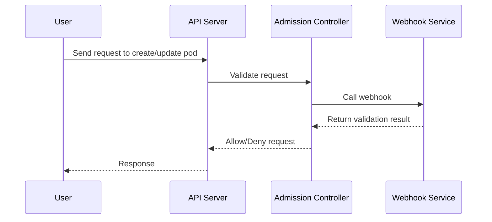

## Introduction to Kubernetes Security Best Practices

Kubernetes is an open-source container orchestration platform designed to automate the deployment, scaling, and management of containerized applications. As Kubernetes becomes increasingly popular, ensuring its security is paramount. One of the key mechanisms for securing Kubernetes is through the use of security policies that integrate with the Kubernetes admission controllers. This chapter will delve into the details of how to create and enforce security policies within Kubernetes, providing a comprehensive guide to implementing these best practices.

### What Are Kubernetes Admission Controllers?

Admission controllers are a set of hooks that intercept requests to the Kubernetes API server before persisting the object. They allow you to validate and modify requests according to your organization’s policies. There are several built-in admission controllers provided by Kubernetes, such as `NamespaceLifecycle`, `LimitRanger`, `ResourceQuota`, and `SecurityContextDeny`.

#### Purpose of Admission Controllers

The primary purpose of admission controllers is to ensure that resources created or modified in the cluster adhere to predefined policies. This includes:

- **Validation**: Ensuring that objects meet certain criteria before being admitted into the cluster.
- **Mutation**: Modifying objects to conform to organizational standards.
- **Authorization**: Checking if the user has the necessary permissions to perform the requested action.

### Creating Security Policies

To enforce security policies in Kubernetes, you can define custom policies using the `ValidatingAdmissionWebhook` and `MutatingAdmissionWebhook`. These webhooks allow you to extend the functionality of the admission controllers by integrating with external services.

#### Example: Validating Admission Webhook

A validating admission webhook can be used to ensure that pods meet specific security requirements before they are deployed. Here’s an example of how to set up a validating admission webhook:

```yaml
apiVersion: admissionregistration.k8s.io/v1
kind: ValidatingWebhookConfiguration
metadata:
  name: pod-security-policy-webhook
webhooks:
  - name: pod-security-policy.example.com
    rules:
      - apiGroups: [""]
        apiVersions: ["v1"]
        operations: ["CREATE", "UPDATE"]
        resources: ["pods"]
        scope: "Namespaced"
    clientConfig:
      service:
        namespace: kube-system
        name: pod-security-policy-webhook-service
      caBundle: <base64-encoded-ca-bundle>
    admissionReviewVersions: ["v1"]
```

This configuration defines a validating webhook that intercepts `CREATE` and `UPDATE` requests for pods. The webhook service should be deployed in the `kube-system` namespace and should handle the validation logic.

#### Example: Mutating Admission Webhook

A mutating admission webhook can be used to automatically apply security configurations to pods. Here’s an example of how to set up a mutating admission webhook:

```yaml
apiVersion: admissionregistration.k8s.io/v1
kind: MutatingWebhookConfiguration
metadata:
  name: pod-security-policy-webhook
webhooks:
  - name: pod-security-policy.example.com
    rules:
      - apiGroups: [""]
        apiVersions: ["v1"]
        operations: ["CREATE", "UPDATE"]
        resources: ["pods"]
        scope: "Namespaced"
    clientConfig:
      service:
        namespace: kube-system
        name: pod-security-policy-webhook-service
      caBundle: <base64-encoded-ca-bundle>
    admissionReviewVersions: ["v1"]
```

This configuration defines a mutating webhook that intercepts `CREATE` and ` `UPDATE` requests for pods and applies the necessary security configurations.

### Implementing Security Policies

To implement security policies effectively, you need to define the rules and ensure that they are enforced consistently across the cluster. Here are some common security policies you might want to enforce:

#### Pod Security Policies

Pod Security Policies (PSPs) are a set of rules that govern the creation and modification of pods. They can be used to restrict the capabilities of pods, such as preventing them from running privileged containers or accessing host paths.

##### Example: Pod Security Policy Definition

Here’s an example of a Pod Security Policy definition:

```yaml
apiVersion: policy/v1beta1
kind: PodSecurityPolicy
metadata:
  name: restricted-psp
spec:
  privileged: false
  seLinux:
    rule: RunAsAny
  supplementalGroups:
    rule: RunAsAny
  runAsUser:
    rule: MustRunAs
    ranges:
      - min: 1000
        max: 65535
  fsGroup:
    rule: RunAsAny
  volumes:
    - configMap
    - secret
    - emptyDir
    - persistentVolumeClaim
```

This policy restricts pods from running in privileged mode and limits the range of user IDs that can be used.

#### Network Policies

Network Policies are used to control the traffic flow between pods and other network endpoints. They can be used to isolate workloads and prevent unauthorized access.

##### Example: Network Policy Definition

Here’s an example of a Network Policy definition:

```yaml
apiVersion: networking.k8s.io/v1
kind: NetworkPolicy
metadata:
  name: default-deny
spec:
  podSelector: {}
  ingress:
  - from:
    - podSelector: {}
  egress:
  - to:
    - podSelector: {}
```

This policy denies all ingress and egress traffic by default, allowing you to explicitly permit traffic as needed.

### Automating Validation with Security Policies

Automating validation with security policies ensures that your Kubernetes cluster remains secure and compliant with your organization’s policies. By leveraging admission controllers and webhooks, you can enforce these policies consistently across the cluster.

#### Example: Full Workflow

Here’s a full workflow example of creating and enforcing a security policy:

1. **Define the Policy**:
   - Create a Pod Security Policy or Network Policy as shown above.
   - Define the rules and constraints that the policy enforces.

2. **Deploy the Webhook Service**:
   - Deploy a webhook service that handles the validation or mutation logic.
   - Ensure the service is reachable from the Kubernetes API server.

3. **Configure the Admission Controller**:
   - Configure the `ValidatingAdmissionWebhook` or `MutatingAdmissionWebhook` to reference the webhook service.
   - Apply the configuration to the cluster.

4. **Test the Policy**:
   - Test the policy by attempting to deploy a pod that violates the policy.
   - Verify that the admission controller prevents the deployment.

### Real-World Examples and Recent Breaches

Recent breaches and vulnerabilities have highlighted the importance of securing Kubernetes clusters. For example, the `CVE-2021-25741` vulnerability in Kubernetes allowed attackers to bypass RBAC (Role-Based Access Control) and gain elevated privileges. By implementing robust security policies and admission controllers, you can mitigate such risks.

#### Example: CVE-2021-25741

In this case, the vulnerability allowed attackers to bypass RBAC and execute arbitrary commands within the cluster. By enforcing strict Pod Security Policies and Network Policies, you can prevent such attacks.

### How to Prevent / Defend

To defend against security threats in Kubernetes, you should:

1. **Implement Strict Pod Security Policies**:
   - Restrict the capabilities of pods to prevent privilege escalation.
   - Limit the range of user IDs and group IDs that can be used.

2. **Enforce Network Policies**:
   - Isolate workloads and prevent unauthorized access.
   - Explicitly permit traffic as needed.

3. **Use Admission Controllers and Webhooks**:
   - Automate validation and mutation of resources.
   - Ensure consistent enforcement of security policies.

4. **Regularly Audit and Monitor the Cluster**:
   - Use tools like `kube-bench` to audit the cluster for compliance.
   - Monitor the cluster for suspicious activity using tools like `Falco`.

### Secure Coding Fixes

Here’s an example of how to correct a vulnerable Pod Security Policy:

#### Vulnerable Code

```yaml
apiVersion: policy/v1beta1
kind: PodSecurityPolicy
metadata:
  name: insecure-psp
spec:
  privileged: true
  seLinux:
    rule: RunAsAny
  supplementalGroups:
    rule: RunAsAny
  runAsUser:
    rule: RunAsAny
  fsGroup:
    rule: RunAsAny
  volumes:
    - "*"
```

#### Corrected Code

```yaml
apiVersion: policy/v1beta1
kind: PodSecurityPolicy
metadata:
  name: secure-psp
spec:
  privileged: false
  seLinux:
    rule: RunAsAny
  supplementalGroups:
    rule: RunAsAny
  runAsUser:
    rule: MustRunAs
    ranges:
      - min: 1000
        max: 65535
  fsGroup:
    rule: RunAsAny
  volumes:
    - configMap
    - secret
    - emptyDir
    - persistentVolumeClaim
```

### Complete Example: Full HTTP Request and Response

Here’s a complete example of a full HTTP request and response for deploying a pod with a security policy:

#### HTTP Request

```http
POST /apis/admissionregistration.k8s.io/v1/validatingwebhookconfigurations HTTP/1.1
Host: localhost:8080
Content-Type: application/json
Authorization: Bearer <token>

{
  "apiVersion": "admissionregistration.k8s.io/v1",
  "kind": "ValidatingWebhookConfiguration",
  "metadata": {
    "name": "pod-security-policy-webhook"
  },
  "webhooks": [
    {
      "name": "pod-security-policy.example.com",
      "rules": [
        {
          "apiGroups": [""],
          "apiVersions": ["v1"],
          "operations": ["CREATE", "UPDATE"],
          "resources": ["pods"],
          "scope": "Namespaced"
        }
      ],
      "clientConfig": {
        "service": {
          "namespace": "kube-system",
          "name": "pod-security-policy-webhook-service"
        },
        "caBundle": "<base64-encoded-ca-bundle>"
      },
      "admissionReviewVersions": ["v1"]
    }
  ]
}
```

#### HTTP Response

```http
HTTP/1.1 201 Created
Content-Type: application/json
Date: Mon, 01 Jan 2024 00:00:00 GMT
Content-Length: 1024

{
  "apiVersion": "admissionregistration.k8s.io/v1",
  "kind": "ValidatingWebhookConfiguration",
  "metadata": {
    "name": "pod-security-policy-webhook",
    "uid": "abcd1234-abcd-1234-abcd-1234abcd1234",
    "resourceVersion": "123456789",
    "creationTimestamp": "2024-01-01T00:00:00Z"
  },
  "webhooks": [
    {
      "name": "pod-security-policy.example.com",
      "rules": [
        {
          "apiGroups": [""],
          "apiVersions": ["v1"],
          "operations": ["CREATE", "UPDATE"],
          "resources": ["pods"],
          "scope": "Namespaced"
        }
      ],
      "clientConfig": {
        "service": {
          "namespace": "kube-system",
          "name": "pod-security-policy-webhook-service"
        },
        "caBundle": "<base64-encoded-ca-bundle>"
      },
      "admissionReviewVersions": ["v1"]
    }
  ]
}
```

### Mermaid Diagrams

#### Admission Controller Flow



### Hands-On Labs

To practice implementing Kubernetes security best practices, you can use the following hands-on labs:

- **PortSwigger Web Security Academy**: Offers a variety of labs focused on web application security, including Kubernetes-specific challenges.
- **OWASP Juice Shop**: A deliberately insecure web application that can be used to practice security testing and mitigation techniques.
- **Kubernetes Goat**: A vulnerable Kubernetes cluster designed for penetration testing and learning about Kubernetes security.

By following these best practices and using the provided examples and labs, you can ensure that your Kubernetes cluster remains secure and compliant with your organization’s policies.

---
<!-- nav -->
[[07-Introduction to Kubernetes Security Best Practices Part 7|Introduction to Kubernetes Security Best Practices Part 7]] | [[DevSecOps/DevSecOps Bootcamp/01-DevSecOps Introduction/08-Introduction to Kubernetes Security/Kubernetes Security Best Practices/00-Overview|Overview]] | [[09-Introduction to Kubernetes Security Best Practices|Introduction to Kubernetes Security Best Practices]]
