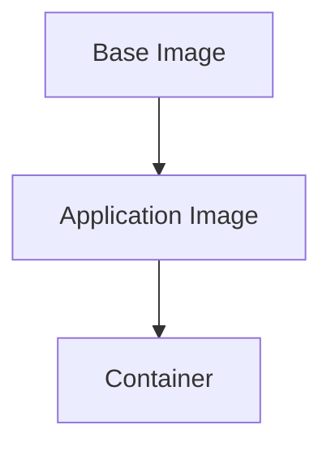

## Introduction to Kubernetes Security Best Practices

Kubernetes is a powerful orchestration platform designed to manage containerized applications at scale. However, with great power comes great responsibility, especially when it comes to security. One of the critical aspects of securing Kubernetes environments is ensuring the integrity and security of the container images used within the cluster. This chapter will delve into the best practices for securing container images, including the risks associated with untrusted sources, vulnerabilities in dependencies, and the importance of choosing lean base images.

### Understanding Container Images and Their Components

A container image is a lightweight, standalone, executable package that includes everything needed to run a piece of software, including the code, runtime, system tools, system libraries, and settings. These images are built using a Dockerfile, which specifies the steps required to create the image.

#### Base Image

The base image is the starting point for building a custom application image. It typically contains the operating system and essential tools required to run the application. Common base images include `alpine`, `ubuntu`, and `debian`.



#### Dependencies and Libraries

Dependencies and libraries are additional components that the application requires to function correctly. These can include language-specific libraries, system utilities, and other third-party packages.

### Risks Associated with Untrusted Sources

One of the primary security concerns with container images is the potential inclusion of untrusted code or libraries. This can happen through several avenues:

1. **Untrusted Registries**: Using images from untrusted or unknown registries can introduce malicious code into the environment.
2. **Vulnerable Packages**: Including outdated or vulnerable packages in the image can provide attackers with a foothold into the system.
3. **Base Image Vulnerabilities**: Using a base image that contains known vulnerabilities can compromise the entire application stack.

#### Real-World Example: CVE-2021-25741

CVE-2021-25741 is a vulnerability found in the `glibc` library, which is commonly used in Linux-based systems. This vulnerability allows attackers to execute arbitrary code with root privileges. If a container image uses a base image containing this vulnerable version of `glibc`, it can be exploited to gain unauthorized access to the system.

### Best Practices for Securing Container Images

To mitigate the risks associated with untrusted sources and vulnerabilities, the following best practices should be followed:

1. **Use Trusted Registries**: Only pull images from trusted and verified registries. Popular registries like Docker Hub and Google Container Registry are generally considered safe.
2. **Audit Dependencies**: Regularly audit the dependencies and libraries included in the image to ensure they are up-to-date and free from known vulnerabilities.
3. **Choose Lean Base Images**: Opt for base images that contain only the necessary components to reduce the attack surface. For example, using `alpine` instead of `ubuntu` can significantly reduce the number of potential vulnerabilities.

#### Example Dockerfile

Here is an example Dockerfile that demonstrates best practices for building a secure container image:

```Dockerfile
# Use a lean base image
FROM alpine:latest

# Install only necessary packages
RUN apk add --no-cache python3

# Copy application code
COPY . /app
WORKDIR /app

# Run the application
CMD ["python3", "app.py"]
```

### Eliminating Unnecessary Packages

Developers should eliminate any unnecessary packages, libraries, and dependencies that the application does not require during runtime. This practice helps to minimize the attack surface and reduces the risk of vulnerabilities being exploited.

#### Example: Removing Unnecessary Packages

Consider the following Dockerfile that initially installs several unnecessary packages:

```Dockerfile
# Vulnerable Dockerfile
FROM ubuntu:latest

# Install unnecessary packages
RUN apt-get update && apt-get install -y python3 curl wget

# Copy application code
COPY . /app
WORKDIR /app

# Run the application
CMD ["python3", "app.py"]
```

To secure this image, unnecessary packages should be removed:

```Dockerfile
# Secure Dockerfile
FROM alpine:latest

# Install only necessary packages
RUN apk add --no-cache python3

# Copy application code
COPY . /app
WORKDIR /app

# Run the application
CMD ["python3", "app.py"]
```

### Choosing Lean Base Images

Choosing a lean base image is crucial for reducing the attack surface. Base images like `alpine` are minimalistic and contain fewer components, making them less likely to contain vulnerabilities.

#### Example: Comparing Base Images

Consider the following comparison between `ubuntu` and `alpine` base images:

```Dockerfile
# Using Ubuntu base image
FROM ubuntu:latest

# Install necessary packages
RUN apt-get update && apt-get install -y python3

# Copy application code
COPY . /app
WORKDIR /app

# Run the application
CMD ["python3", "app.py"]
```

```Dockerfile
# Using Alpine base image
FROM alpine:latest

# Install necessary packages
RUN apk add --no-cache python3

# Copy application code
COPY . /app
WORKDIR /app

# Run the application
CMD ["python3", "app.py"]
```

### Deploying Vulnerable Images

Deploying an application image with vulnerabilities can introduce serious security issues. An attacker may exploit a vulnerability in the image to break out of the container and gain access to the host or Kubernetes worker node.

#### Real-World Example: CVE-2019-14287

CVE-2019-14287 is a vulnerability found in the `containerd` container runtime, which is used by Kubernetes. This vulnerability allows attackers to escalate their privileges and potentially gain control of the host system. If a container image is deployed with this vulnerability, it can be exploited to compromise the entire Kubernetes cluster.

### How to Prevent / Defend

To prevent and defend against the risks associated with untrusted sources and vulnerabilities, the following measures should be taken:

1. **Image Scanning**: Use tools like Trivy, Clair, or Aqua Security to scan container images for known vulnerabilities before deployment.
2. **Policy Enforcement**: Implement policies to restrict the use of untrusted registries and enforce the use of trusted and verified images.
3. **Regular Audits**: Conduct regular audits of dependencies and libraries to ensure they are up-to-date and free from known vulnerabilities.
4. **Secure Configuration**: Ensure that the Kubernetes cluster is configured securely, with proper RBAC (Role-Based Access Control) and network policies in place.

#### Example: Image Scanning with Trivy

Trivy is an open-source tool that can be used to scan container images for vulnerabilities. Here is an example of how to use Trivy to scan a Docker image:

```sh
# Scan a local Docker image
trivy image my-image:latest

# Scan a remote Docker image
trivy image docker.io/library/my-image:latest
```

### Conclusion

Securing container images is a critical aspect of Kubernetes security. By following best practices such as using trusted registries, auditing dependencies, choosing lean base images, and eliminating unnecessary packages, developers can significantly reduce the risk of vulnerabilities being exploited. Additionally, implementing image scanning, policy enforcement, and regular audits can further enhance the security of the Kubernetes environment.

### Practice Labs

For hands-on experience with Kubernetes security, consider the following labs:

- **Kubernetes Goat**: A hands-on lab designed to teach Kubernetes security concepts and best practices.
- **OWASP WrongSecrets**: A series of challenges that focus on various security aspects of containerized applications, including Kubernetes.
- **kube-hunter**: A tool that can be used to identify and exploit vulnerabilities in Kubernetes clusters, providing a practical way to learn about security issues.

By engaging with these labs, you can gain a deeper understanding of Kubernetes security and apply the best practices discussed in this chapter.

---
<!-- nav -->
[[08-Introduction to Kubernetes Security Best Practices Part 8|Introduction to Kubernetes Security Best Practices Part 8]] | [[DevSecOps/DevSecOps Bootcamp/01-DevSecOps Introduction/08-Introduction to Kubernetes Security/Kubernetes Security Best Practices/00-Overview|Overview]] | [[10-Introduction to Kubernetes Security Part 1|Introduction to Kubernetes Security Part 1]]
