## Introduction to Kubernetes Security

Kubernetes, often referred to as K8s, is an open-source system for automating deployment, scaling, and management of containerized applications. While Kubernetes provides powerful capabilities for managing containerized workloads, it also introduces significant security challenges. This chapter aims to provide a comprehensive overview of Kubernetes security best practices, covering both theoretical foundations and practical implementations.

### Understanding Kubernetes Security Challenges

One of the primary challenges in securing Kubernetes clusters is the complexity involved in setting up and configuring the cluster itself. Many organizations find it difficult to balance the operational demands of deploying applications with the need to ensure robust security measures. As a result, security often becomes an afterthought, leading to potential vulnerabilities.

#### Complexity of Kubernetes Configuration

Setting up a Kubernetes cluster involves numerous components, including nodes, pods, services, and controllers. Each component requires careful configuration to ensure optimal performance and security. Misconfigurations can lead to security breaches, such as unauthorized access to sensitive data or denial-of-service attacks.

#### Importance of Security in Complex Systems

Given the complexity of Kubernetes clusters, it is crucial to prioritize security from the outset. Security should not be treated as an afterthought but rather integrated into the design and implementation process. This proactive approach helps mitigate risks and ensures that the cluster remains secure throughout its lifecycle.

### General Cloud Security Considerations

Before diving into specific Kubernetes security best practices, it is essential to understand the broader context of cloud security. With the increasing adoption of cloud computing, more and more workloads are being moved to the cloud. However, there is a common misconception that cloud environments are inherently secure.

#### Misconception: Cloud is Secure by Default

Many organizations believe that simply moving their applications to the cloud automatically makes them secure. This belief is misguided and can lead to significant security vulnerabilities. In reality, the responsibility for securing cloud environments lies with the organization, just as it would with on-premise systems.

#### Responsibility for Security

In cloud environments, the principle of shared responsibility applies. The cloud provider is responsible for securing the underlying infrastructure, while the organization is responsible for securing the applications and data running on that infrastructure. This means that organizations must actively manage and secure their cloud resources to protect against threats.

#### Tools and Technologies for Cloud Security

Cloud providers offer various tools and technologies to help organizations secure their cloud environments. These tools include identity and access management (IAM) services, network security features, and compliance monitoring tools. However, many organizations are either unaware of these tools or fail to utilize them effectively.

### Real-World Examples of Cloud Security Breaches

Recent high-profile breaches highlight the importance of proper cloud security practices. For instance, the Capital One breach in 2019 exposed sensitive customer data due to misconfigured cloud storage buckets. Similarly, the Twitter hack in 2020 demonstrated how inadequate security measures can lead to widespread damage.

#### Capital One Data Breach (CVE-2019-14549)

In July 2019, Capital One announced that a hacker had accessed sensitive information of approximately 100 million customers. The breach occurred due to a misconfigured web application firewall (WAF) that allowed unauthorized access to the cloud storage bucket containing the data. This incident underscores the critical importance of properly configuring cloud resources and implementing robust security controls.

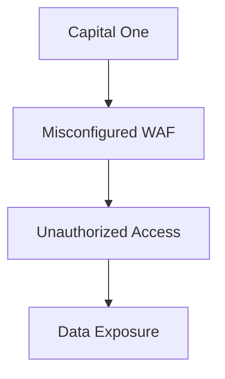

#### Twitter Hack (CVE-2020-1147)

In July 2020, a group of hackers gained access to the Twitter accounts of several high-profile individuals and companies, including Barack Obama, Joe Biden, and Elon Musk. The hackers used stolen credentials to take control of the accounts and posted fraudulent tweets soliciting Bitcoin donations. This incident highlights the importance of strong authentication mechanisms and the need to regularly review and update access controls.

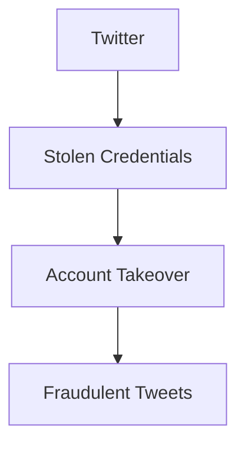

### Kubernetes Security Best Practices

To address the security challenges associated with Kubernetes, it is essential to adopt a set of best practices that cover various aspects of the cluster's configuration and operation.

#### 1. Secure Cluster Setup

The foundation of a secure Kubernetes cluster starts with a secure setup. This includes proper configuration of the master nodes, worker nodes, and other components.

##### Master Node Security

Master nodes are the control plane of the Kubernetes cluster and contain sensitive information such as API server credentials and etcd data. Securing the master nodes is crucial to preventing unauthorized access.

- **Network Isolation**: Ensure that master nodes are isolated from the rest of the network to prevent unauthorized access. Use network segmentation techniques such as firewalls and virtual private clouds (VPCs).
  
- **Encryption**: Enable encryption for communication between the master nodes and the worker nodes. This can be achieved using Transport Layer Security (TLS) certificates.

- **Access Control**: Implement strict access control policies for the master nodes. Use role-based access control (RBAC) to restrict access to sensitive operations.

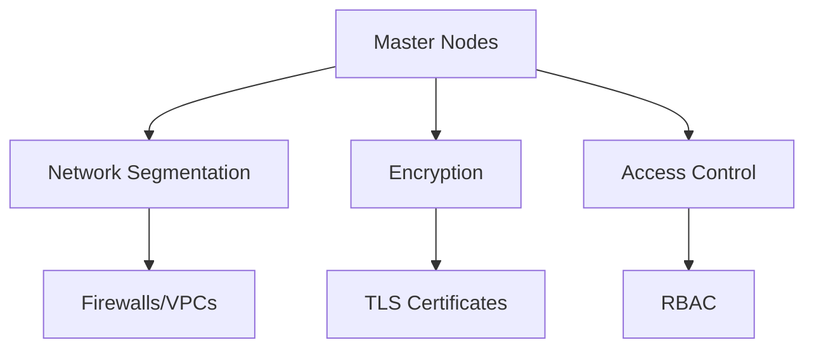

##### Worker Node Security

Worker nodes are responsible for running the actual workloads in the form of pods. Securing the worker nodes is essential to prevent unauthorized access and ensure the integrity of the workloads.

- **Node Security Policies**: Implement node security policies to restrict the types of workloads that can run on the nodes. Use pod security policies (PSPs) to enforce security constraints on pods.

- **Container Runtime Security**: Ensure that the container runtime is configured securely. Use trusted images and avoid running containers with elevated privileges.

- **Runtime Monitoring**: Monitor the runtime environment of the worker nodes to detect any suspicious activity. Use tools such as Falco to monitor and alert on security events.

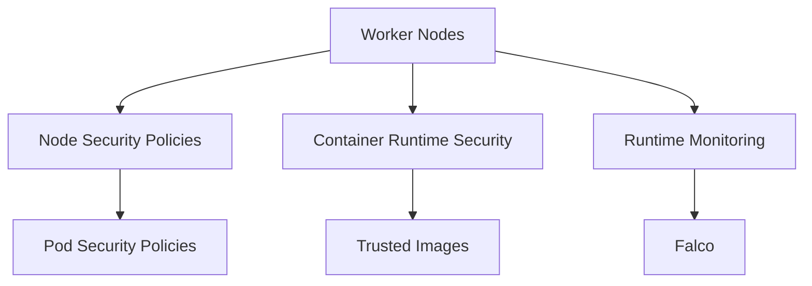

#### 2. Network Security

Network security is a critical aspect of Kubernetes security. Properly configuring network policies and securing communication channels can significantly reduce the risk of attacks.

##### Network Policies

Network policies define how pods can communicate with each other and with external networks. Implementing network policies helps to isolate workloads and prevent unauthorized access.

- **Isolation**: Use network policies to isolate workloads based on their roles and responsibilities. For example, separate workloads that handle sensitive data from those that do not.

- **Egress Control**: Control outbound traffic from the cluster to prevent data exfiltration. Use egress policies to restrict access to specific IP addresses or domains.

- **Ingress Control**: Control inbound traffic to the cluster to prevent unauthorized access. Use ingress controllers to manage traffic and enforce security policies.

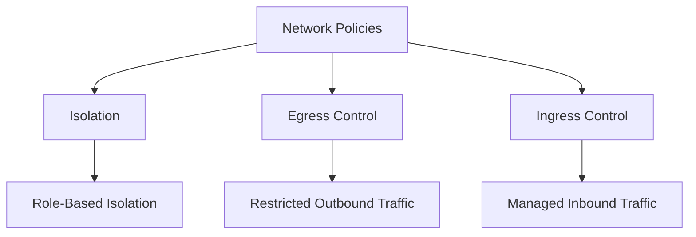

##### Encryption

Encrypting communication channels within the cluster and with external networks is essential to prevent eavesdropping and man-in-the-middle attacks.

- **TLS Certificates**: Use TLS certificates to encrypt communication between the API server and the worker nodes. Ensure that the certificates are properly managed and rotated.

- **Mutual TLS**: Implement mutual TLS to ensure that both parties in a communication channel are authenticated and authorized.

- **DNSSEC**: Use DNSSEC to ensure the integrity of DNS queries and prevent DNS spoofing attacks.

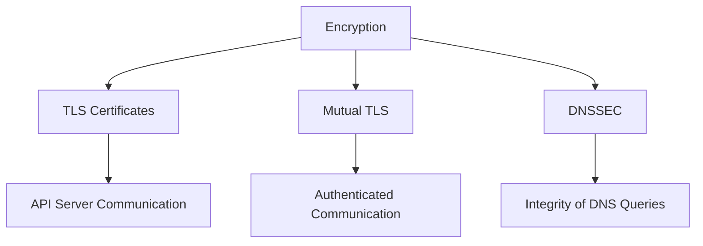

#### 3. Identity and Access Management

Identity and access management (IAM) is a critical component of Kubernetes security. Properly managing identities and access controls helps to prevent unauthorized access and ensure the integrity of the cluster.

##### Role-Based Access Control (RBAC)

RBAC is a fundamental security feature in Kubernetes that allows you to define and enforce access control policies based on roles and permissions.

- **Roles and RoleBindings**: Define roles and role bindings to grant specific permissions to users and groups. Use role bindings to associate roles with subjects such as users and groups.

- **Cluster Roles and ClusterRoleBindings**: Define cluster roles and cluster role bindings to grant permissions across the entire cluster. Use cluster role bindings to associate cluster roles with subjects.

- **Service Accounts**: Use service accounts to authenticate and authorize workloads running in the cluster. Ensure that service accounts are properly configured and managed.

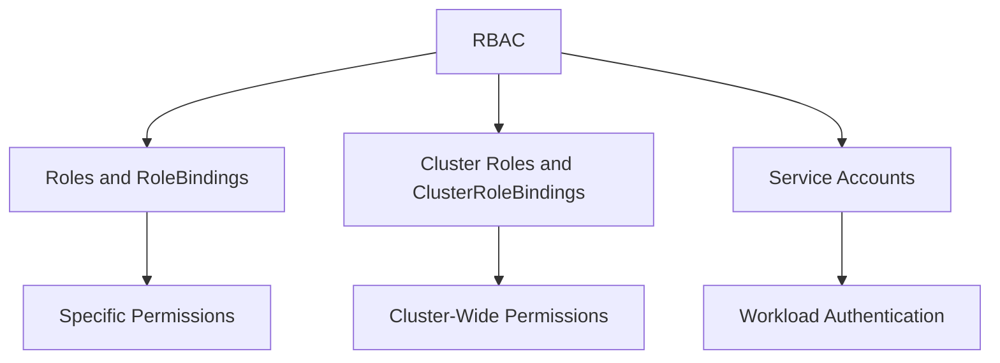

##### Authentication Mechanisms

Implementing strong authentication mechanisms is essential to prevent unauthorized access to the cluster.

- **X.509 Certificates**: Use X.509 certificates to authenticate users and workloads. Ensure that the certificates are properly managed and rotated.

- **OAuth2 Tokens**: Use OAuth2 tokens to authenticate users and workloads. Ensure that the tokens are properly managed and secured.

- **Multi-Factor Authentication (MFA)**: Implement multi-factor authentication to provide an additional layer of security. Use MFA to require users to provide multiple forms of authentication.

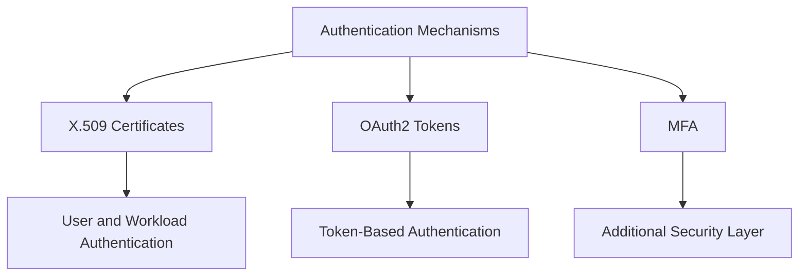

####  4. Logging and Monitoring

Logging and monitoring are essential for detecting and responding to security incidents in a Kubernetes cluster.

##### Logging

Proper logging helps to track and analyze security events in the cluster.

- **Centralized Logging**: Use centralized logging to collect and store logs from all components of the cluster. Ensure that logs are properly managed and retained.

- **Audit Logs**: Enable audit logs to track security-relevant events in the cluster. Use audit logs to detect and respond to security incidents.

- **Log Analysis**: Analyze logs to identify patterns and anomalies that may indicate security incidents. Use log analysis tools such as ELK stack to analyze and visualize logs.

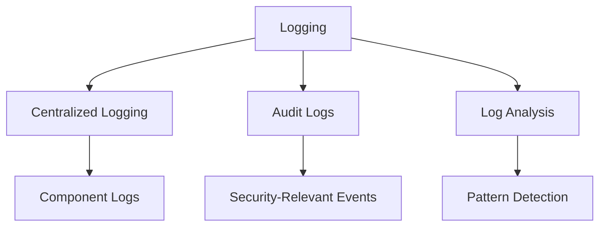

##### Monitoring

Proper monitoring helps to detect and respond to security incidents in real-time.

- **Real-Time Monitoring**: Use real-time monitoring to detect security incidents as they occur. Use tools such as Prometheus and Grafana to monitor and visualize metrics.

- **Alerting**: Configure alerts to notify administrators of security incidents. Use alerting tools such as Alertmanager to send notifications.

- **Incident Response**: Develop an incident response plan to respond to security incidents. Ensure that the plan is tested and updated regularly.

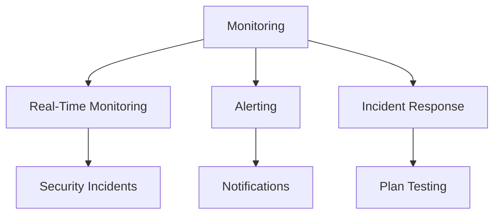

### How to Prevent / Defend

To prevent and defend against security threats in a Kubernetes cluster, it is essential to implement a comprehensive set of security measures.

#### Prevention

Prevention involves implementing security measures to prevent security incidents from occurring.

- **Secure Configuration**: Ensure that the cluster is properly configured and secured. Use security best practices to configure the cluster.

- **Regular Audits**: Perform regular audits to identify and remediate security vulnerabilities. Use tools such as kube-bench to perform security audits.

- **Patch Management**: Keep the cluster up-to-date with the latest security patches. Use patch management tools to manage and apply patches.

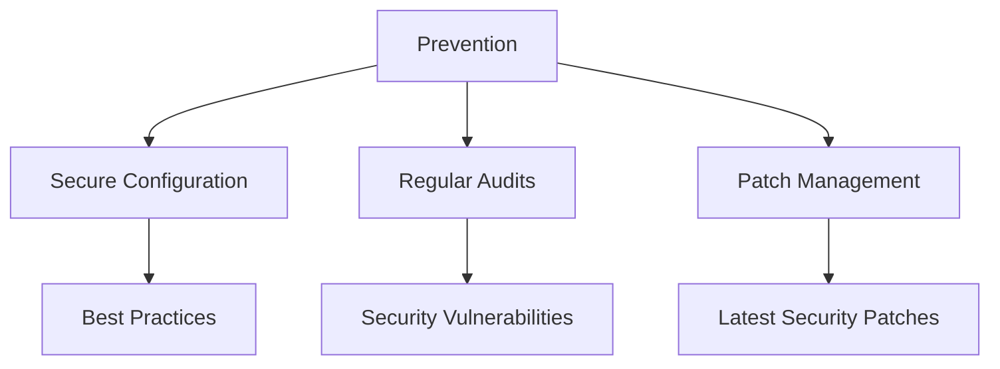

#### Detection

Detection involves identifying security incidents as they occur.

- **Real-Time Monitoring**: Use real-time monitoring to detect security incidents as they occur. Use tools such as Prometheus and Grafana to monitor and visualize metrics.

- **Alerting**: Configure alerts to notify administrators of security incidents. Use alerting tools such as Alertmanager to send notifications.

- **Log Analysis**: Analyze logs to identify patterns and anomalies that may indicate security incidents. Use log analysis tools such as ELK stack to analyze and visualize logs.

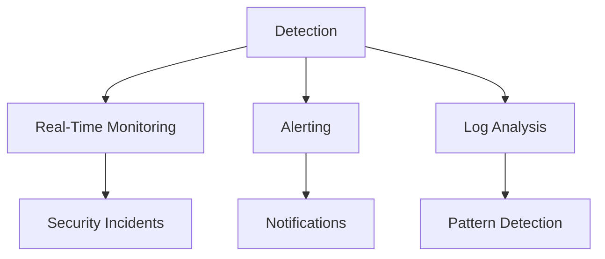

#### Response

Response involves responding to security incidents once they have been detected.

- **Incident Response Plan**: Develop an incident response plan to respond to security incidents. Ensure that the plan is tested and updated regularly.

- **Containment**: Contain the incident to prevent further damage. Use containment techniques such as isolating affected components.

- **Remediation**: Remediate the incident to restore the cluster to a secure state. Use remediation techniques such as applying security patches and updating configurations.

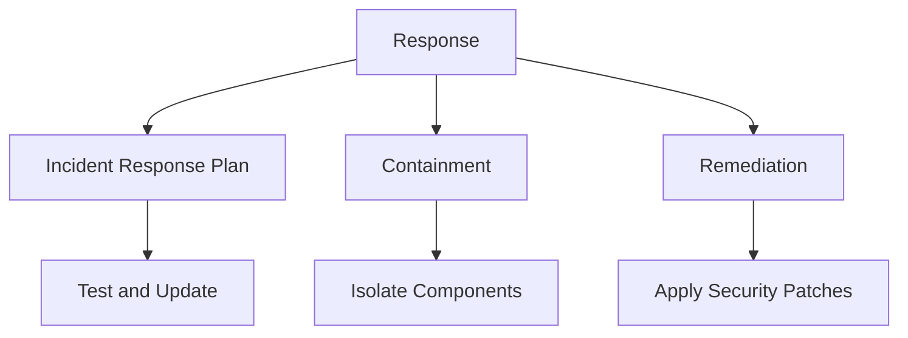

### Conclusion

Securing a Kubernetes cluster requires a comprehensive approach that covers various aspects of the cluster's configuration and operation. By implementing the best practices outlined in this chapter, organizations can significantly reduce the risk of security incidents and ensure the integrity of their Kubernetes clusters.

### Practice Labs

For hands-on experience with Kubernetes security, consider the following practice labs:

- **Kubernetes Goat**: A hands-on lab for learning Kubernetes security concepts and best practices.
- **OWASP WrongSecrets**: A series of challenges designed to test and improve your Kubernetes security skills.
- **kube-hunter**: A tool for hunting security issues in Kubernetes clusters, providing a practical way to learn and test security configurations.

These labs provide a practical way to apply the concepts learned in this chapter and gain hands-on experience with Kubernetes security.

---
<!-- nav -->
[[11-Introduction to Kubernetes Security Part 2|Introduction to Kubernetes Security Part 2]] | [[DevSecOps/DevSecOps Bootcamp/01-DevSecOps Introduction/08-Introduction to Kubernetes Security/Kubernetes Security Best Practices/00-Overview|Overview]] | [[13-Automated Backup and Restore System in Kubernetes|Automated Backup and Restore System in Kubernetes]]
